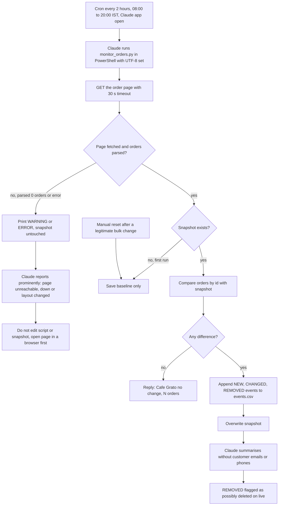

# Cafe Grato Live Order Monitor

> A read-only scheduled task that checks the live Cafe Grato order page every two hours and reports new, changed and removed orders, so a migrated coffee-shop system does not silently lose or alter orders.

| | |
|---|---|
| **Category** | Scheduled tasks and daily reporting |
| **Status** | Live, as of 9 Oct 2026 (enabled, one recorded run) |
| **Type** | Claude desktop local scheduled task plus a Python stdlib script |
| **Runner and schedule** | Local task `cafe-grato-order-monitor`, cron `0 8-20/2 * * *` in machine time (IST): 08:00, 10:00, 12:00, 14:00, 16:00, 18:00, 20:00 daily. Runs only while the Claude app is open; missed runs fire on next launch. |
| **Client / owner** | Cafe Grato (client ordering app), operated by Hari |
| **Stack** | Python 3 stdlib (no env vars), PowerShell, Claude scheduled task, CSV and JSON files |
| **Source** | Main KB Part 1 "Cafe Grato live order monitor" (lines 556-596), opening-chapter sections 1-6 (open items, runbook), Part 6 Cafe Grato entry; Portfolio KB section 15 (generic cron monitoring) |

## 1. Description

### What it does
Cafe Grato is a PHP ordering, subscription and wholesale app that was migrated from an older system (Part 6 describes the app itself). The monitor fetches the app's back-office order page, splits it per order id, and compares the result with the last saved snapshot. It reports orders that are NEW (id not in the snapshot), CHANGED (total, items, name or contact differ) or REMOVED (id vanished, meaning "deleted or hidden on live"). It is reporting only: it never edits the page, contacts customers, or sends anything to Slack or GHL.

### Inputs and outputs
- **Inputs:** a `GET` of the client's back-office order page and the previous `monitor_data/snapshot.json`.
- **Outputs:** one line in the scheduled session when nothing changed ("Cafe Grato: no change (N orders)."), or a short event summary; appended rows in `monitor_data/events.csv` (columns detected_at, event, order_id, type, name, contact, total, order_date, items, detail); the overwritten snapshot. The summary leaves out customer emails and phones.

### Key components
| Component | Role |
|---|---|
| Scheduled task `SKILL.md` | The prompt: run the script, read the output, reply as specified, change nothing |
| `monitor_orders.py` | Fetch (User-Agent `cafe-grato-monitor/1.0`, 30 s timeout), parse by regex `[RSW]-\d+`, diff, write events and snapshot |
| `monitor_data/snapshot.json` | Per order: order_id, db_id, type, name, contact, items, total, date, receipt reference. Treat as sensitive |
| `monitor_data/events.csv` | History of detected events; does not exist yet because no event has been detected (not found) |
| `.claude/settings.local.json` | Allow-lists the exact PowerShell command so unattended runs do not prompt |
| CLI options | `python monitor_orders.py` (one check), `--watch 300` (loop, minimum 30 s), `--reset` (delete snapshot and re-baseline) |

### Where it lives
- Script and data: `D:\Project\Client & Agency (Pivot)\cafe_grato\` (`monitor_orders.py`, `monitor_data\`, `.gitignore`; `monitor_data/` and `__pycache__/` are git-ignored because they hold customer details).
- Task file: `C:\Users\<user>\.claude\scheduled-tasks\cafe-grato-order-monitor\SKILL.md` (cron is set in the Claude app).
- Sessions: `C:\Users\<user>\.claude\projects\D--Project-Client---Agency--Pivot--cafe-grato\`.
- The PHP app files and the migration SQL sit in the same folder.

## 2. Flow chart

**Reading the chart**
1. The cron fires every two hours between 08:00 and 20:00 IST (only while the Claude app is open) and Claude runs the script with the exact allow-listed command.
2. The script fetches the order page. If it parses zero orders or errors, it prints a warning and leaves the snapshot alone; Claude reports that prominently and does not touch the regexes or the snapshot before someone has looked at the page in a browser.
3. On the first run it only saves a baseline. After that it compares each order id against the snapshot.
4. No difference gives the one-line "no change" reply. A difference appends events to `events.csv`, overwrites the snapshot and produces a short summary (REMOVED means possibly deleted on live).
5. `--reset` re-baselines after a legitimate bulk change.

## 3. Case study

### The challenge
After the Cafe Grato orders were migrated from a previous system, the owner wanted to be sure the migrated orders appeared on the live site and to notice any deletion. The live back-office pages have no API and no alerting, and the check needed to run unattended through the day without anyone watching. Constraints: reporting only (no changes, no customer contact), no secrets handled, and no Slack channel exists for Cafe Grato.

### The solution
A single stdlib Python script that scrapes the order page with a regex per order id and diffs it against a stored snapshot, run by a Claude scheduled task every two hours. Claude's role is to read the script output and phrase a short report. Two hours was chosen as a balance because each run starts a Claude session; hourly or 30-minute checks are a one-line cron change. The monitor was built and baselined on 8 Oct 2026, the task was created on 9 Oct, and a manual Run now on 9 Oct 12:39 IST gave "no change (35 orders)".

### Design decisions and rules learned
- **Read-only.** Only GET requests; no edits, no customer contact, no Slack or GHL output. Alerts to Slack or email are listed as a later add-on (not implemented).
- **Depends on the page staying reachable and keeping its layout.** If either changes, it prints "parsed 0 orders" and leaves the snapshot untouched.
- **Customer data stays local.** The summary omits emails and phones, and `monitor_data/` is git-ignored because the snapshot holds customer details and receipt references.
- **Order-number prefixes** R-, S- and W- (retail, subscription, wholesale) drive the parser (inferred from Part 6).
- **Migration check.** The two newest migrated order ids were already live on 8 Oct.
- **Tested on build.** A new, a changed and a removed order were faked in the snapshot and all three were detected, then the snapshot was reset to a clean baseline.
- **Cron window is in machine time.** 08:00 to 20:00 IST is 12:30 to 00:30 AEST for an Australian site, which is possibly unintended (inferred).

### Outcome
- Task enabled on 9 Oct 2026; one recorded run (manual, 9 Oct 12:39 IST): "no change (35 orders)".
- Baseline of 35 orders: 24 retail (R-), 8 subscription (S-), 3 wholesale-sample (W-).
- No NEW, CHANGED or REMOVED event has been detected (`events.csv` does not exist yet).
- No other measured outcome is recorded.

### Lessons learned
- Scraping a rendered page couples the monitor to its layout; prefer a purpose-built feed when one exists.
- Do not edit regexes or the snapshot blindly when parsing returns zero; check the page first.
- "Succeeded" in the scheduler only means the session ended; a monitor needs its own sign of life (see the portfolio KB comparison below).

## 4. Operating notes
- **Run / pause / debug:** Run now from the Scheduled sidebar (click once to pre-approve) or run the PowerShell command (`$env:PYTHONIOENCODING='utf-8'; python "D:\Project\Client & Agency (Pivot)\cafe_grato\monitor_orders.py"`). Pause by toggling the task off. Faster or slower: edit the cron. Re-baseline with `python monitor_orders.py --reset`. On WARNING or ERROR, open the order page in a browser before touching the regexes at the top of the script.
- **Weekly check (runbook):** the monitor shows no unexplained REMOVED order; a "parsed 0 orders" warning means the page is unreachable, down or its layout changed.
- **Known issues and open items:** no Slack or email alerting; cron window may be unintended; `events.csv` absent until the first event.
- **Risks:** the monitor stops when the Claude app is closed; if the page layout or access changes the monitor reports zero orders until it is updated; the snapshot file contains customer details and receipt references.
- Security and credential-hygiene findings for this project are tracked privately and are not published here.

- **General cron-monitoring pattern (portfolio KB section 15):** The portfolio KB records a user-confirmed cron-based website and application monitoring job and a generic process: schedule a cron, check the target or health endpoint, evaluate status or response time, record timestamp and result, compare with thresholds or previous status, notify or log on failure, track repeated failures and recovery. It does not name Cafe Grato or give the targets, intervals, thresholds or destinations, so the two cannot be tied together from the sources. The monitor here is an order-diff check, not an uptime check. Mapping its recommended reliability improvements to this monitor:

| Portfolio KB recommendation | This monitor (main KB) |
|---|---|
| Set connection and response timeouts | Yes: 30 s fetch timeout |
| Distinguish transient from sustained failure | Not documented in the source; each failed parse just prints WARNING or ERROR |
| Prevent alert storms with dedupe and cooldowns | No alerts are sent; events are recorded once because the snapshot is overwritten after each run (inferred) |
| Monitor the monitoring process itself | Not documented in the source; only the runbook's weekly check |
| Keep credentials outside scripts | No credentials used; stdlib only, no env vars |
| Document timezone and cron schedule | Cron documented; IST window versus an Australian site flagged |
| Recovery notifications | Not implemented |

## 5. Related
- No registry file exists for the Cafe Grato PHP app itself; see Part 6, "Cafe Grato: coffee e-commerce, subscriptions and wholesale".
- Other local scheduled tasks and their runner rules: `client-project-updates.md`
- **Sources:** Main KB Part 1 (overview, Cafe Grato section, Gaps), opening chapters (sections 1, 2, 5, 6), Part 6 Cafe Grato entry, Part 8 note on scheduled tasks without skills; Portfolio KB section 15.
