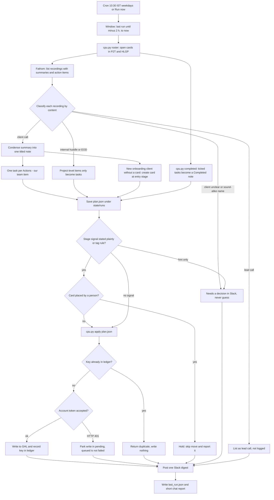
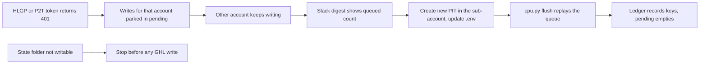

# Client Project Updates (Fathom to GHL notes, tasks and stages, then Slack)

> A weekday scheduled task that turns recorded client calls and internal huddles into neat GHL notes, assigned team tasks, rule-based pipeline moves and a Slack digest, exactly once, for the P2T and HLGP sub-accounts.

| | |
|---|---|
| **Category** | Scheduled tasks and daily reporting |
| **Status** | Live, as of 9 Oct 2026 (a cloud twin is prepared but not cut over) |
| **Type** | Claude desktop local scheduled task that runs a skill (Python scripts, no packages) |
| **Runner and schedule** | Local task `client-project-updates`, cron `30 10 * * 1-5` (10:30 IST, Mon-Fri; the UI shows about 10:42 because of scheduler jitter). Runs only while the Claude desktop app is open; a missed run fires on next launch. About 2-5 minutes per run. |
| **Client / owner** | P2T (Pivot 2 Thrive) and HLGP (HL Growth Partner) sub-accounts; owner Hari |
| **Stack** | Fathom connector, Slack connector, GoHighLevel REST API (private integration tokens, one per sub-account), Python 3, JSON ledger |
| **Source** | Main KB Part 1 "Client Project Updates" (lines 317-433), Part 3 section 9, Part 8 skill entry `client-project-updates`; Portfolio KB sections 16 and 19 |

## 1. Description

### What it does
Every weekday it reads the newest Fathom recordings. Each client onboarding, strategy, support or project-update call becomes one titled note on the client's GHL contact (a 12-20 line condensed scope note). Each "Actions - our team" item becomes a GHL task assigned to the named person. The daily Team Huddle and EOD Tasks recordings become tasks only, and only for bigger project-level items. Tasks the automation created that have since been ticked produce one "Completed" note. New onboarding clients get a pipeline card, cards move stage only by explicit rules, and one run summary is posted to a private Slack channel.

The owner judges it on two things: notes must be neat and understandable, and there must be no duplicates.

### Inputs and outputs
- **Inputs:** Fathom recordings (`list_meetings` with summary and action items, transcript only when a summary is too thin); the live GHL roster of open cards in both accounts; `config.json` (pipelines, stage rules, team-name to GHL-user map, aliases for mis-heard names, internal meeting titles and email domains, Slack channel); the time window (since `last_run.json` minus 2 hours).
- **Outputs:** GHL contact notes (HTML, titled), GHL tasks (assigned, due dates, Fathom link appended), opportunities and stage moves; one Slack post per run; local state (`ledger.json`, `pending/`, `runs/<date>-<label>/plan.json` plus `note-*.html`, `last_run.json`, `roster.json`); a short chat report.

### Key components
| Component | Role |
|---|---|
| Scheduled task `SKILL.md` | The prompt: invoke the skill, else read the skill file and follow it exactly. Cron is set in the app, not in this file |
| `SKILL.md` in the skill folder | Authoritative process and rules |
| `scripts/cpu.py` | Command line for roster, note, task, opp, stage, stage-sync, completed, apply, flush, ledger, calendar |
| `scripts/ghl.py` | GHL REST wrapper; reads tokens from env first, then the `.env` file; strips CRLF |
| `config.json` | Pipelines, entry and terminal stages, purchase tags, call signals, team map, aliases, Slack channel |
| `references/note-templates.md` | Note format: Purpose, Key outcomes, Decisions and blockers, Actions - our team, Actions - client; no-show template |
| `references/slack-post.md` | Slack digest format, under 3,000 characters |
| `state/ledger.json` | The de-duplication memory (89 KB per Part 3 section 9); keyed by recording id, account and contact |
| `state/pending/` | Retry queue for writes that failed on a dead token |
| Fathom and Slack connectors | Read recordings; post the digest (Fathom tools are deferred and must be loaded with ToolSearch first) |

### Where it lives
- Task prompt: `C:\Users\<user>\.claude\scheduled-tasks\client-project-updates\SKILL.md` (its front-matter description still says "8am IST", which is stale).
- Live skill copy: `C:\Users\<user>\.claude\skills\client-project-updates\` (SKILL.md, `scripts\cpu.py`, `scripts\ghl.py`, `config.json`, `references\`).
- State and ledger: `D:\Project\Client & Agency (Pivot)\Pivot2Thrive & Content\Hlgp and pipeline setup\client-project-updates\state\` (override with env var `CPU_STATE_DIR`). Same folder tree holds `.env` (env var names `p2t_pit`, `p2t_location`, `hlgp_pit`, `hlgp_location`), `dist\client-project-updates.skill` and the early `client-call-notes\` prototypes.
- Cloud variant: repo `D:\Project\Client & Agency (Pivot)\Blogs\p2t-hlgp-automation` (private remote), skill copy under `.claude\skills\client-project-updates\`, prompt `routines\client-project-updates.md`, guide `docs\SETUP.md`, git branch `state-client-updates`.
- Other copies to know: a Cowork plugin copy (`anthropic-skills:client-project-updates`, found stale on 27 Sep, still said "never move stages") and a synced copy dated 4 Oct with older content. Follow the `C:\Users\<user>\.claude\skills\` copy.
- Slack channel: `#client-project-updates`, private and team-only.

## 2. Flow chart

Failure and recovery path (token dead, ledger unwritable):

**Reading the chart**
1. The cron fires at 10:30 IST on weekdays (or someone presses Run now). The window runs from the last run's `until` minus 2 hours to now; the overlap is harmless because of the ledger.
2. `cpu.py roster` refreshes open cards in both accounts, falling back to a cached copy (with a warning) if a token fails.
3. Recordings are listed with summaries and action items, then classified by content, not title. An "Impromptu" meeting has been both a client call and an internal sync.
4. A client call becomes one condensed note plus one task per "our team" action. A client onboarding with no card gets one at the entry stage. Client actions stay in the note only.
5. Internal huddle or EOD recordings produce tasks only, and only for project-level items, created in every account where that client exists. Leads are listed as "not logged". Anything ambiguous goes to "Needs a decision".
6. The completed sweep turns tasks ticked in GHL (that the automation created) into one "Completed" note per client.
7. Stage moves need a plain statement on a call (a hint is a flag) or a purchase-tag rule from the entry stage. A card placed by a person is never moved and is reported as held.
8. Everything is written through one `plan.json` and `cpu.py apply`. A key already in the ledger returns "duplicate". A 401 parks the write in `pending/`.
9. One Slack digest is posted (or a one-line "nothing new" message), then `last_run.json` is written.

## 3. Case study

### The challenge
Client calls were recorded in Fathom but the knowledge from them did not reach the CRM. An audit found only 4 notes across 17 clients (Part 8 skill entry), and existing notes were messy: Lara AI call logs, pasted Fathom links and raw HTML scope text (Part 3 section 9). The work spans two GHL sub-accounts with separate tokens, clients that exist in both, Fathom mis-hearing client names, internal huddles that mix project work with small chores, and a team that rarely ticks tasks in GHL. The hard requirements were neat notes and no duplicates.

### The solution
A Claude skill with a small Python tool (`cpu.py` and `ghl.py`) and a keyed ledger. Claude does the reading and summarising (classify calls, condense summaries, attribute action items). Every GHL write is then expressed as an entry in one `plan.json` and executed by `cpu.py apply`, which checks the ledger first, so a re-run, a resumed run or a double apply produces no second copy. Results are reported in one Slack digest so humans can see and undo anything. It was built 11-14 Sep 2026 (audit, design, first manual run for 7-13 Sep), scheduled on 21 Sep, and tuned afterwards.

Schedule history (the "why" after step 3 is partly inferred):
1. 21 Sep: cron `0 7,19 * * *` (7am and 7pm).
2. 23 Sep: the owner asked for 8am IST only, no pm run; cron `0 8 * * *`.
3. 29 Sep: changed to `30 10 * * 1-5`. The reason is not recorded in any transcript (not found). Evidence (inferred): at 8am IST the run only saw the previous day's huddle, while the 10:42 IST run that day was the first to catch the same-day Team Huddle, and weekends have no huddle.

### Design decisions and rules learned
- **One keyed ledger, no other write path.** Key shapes cover note, task, opportunity, stage, stage position, done and a one-off migration marker. Never delete the ledger. If the ledger folder is unwritable, stop before any write ("that is exactly how duplicates happen").
- **One runner only.** The local task and its cloud twin each keep their own ledger copy, so both live means duplicates.
- **Humans own the record.** Never edit or delete existing notes. A wrong task cannot be removed by the script and must be fixed by hand in GHL.
- **Materiality rule (21 Sep).** Only project-level changes (scope agreed or revised, paused, blocked or resumed, build or integration started or delivered, payment blocker, a client issue that changes the plan) become notes, tasks or stage moves. Small operational items get at most one line in Slack.
- **Stage moves were first manual, then rule-based.** On 11 Sep stages stayed manual; on 21 Sep the owner asked for everything to work automatically, so rule-based moves were added with every move reported. Tag rules only move a card still at the entry stage or at a stage the automation set itself. Call signals (onboarded, scoped, phase2, retainer, support, blocked, completed, and sprint for HLGP) need a plain statement, and the sentence relied on is stored as the reason. Nothing leaves "Project Completed" except a fresh onboarding.
- **Never create or rename pipeline stages.** GHL's pipeline update replaces the whole stage list, so one bad call scrambles the columns. An unknown product goes to the fallback stage (P2T "Misc") with an "add a stage" note; HLGP has no fallback.
- **Never guess a client.** Sound-alike names stay flags until the owner confirms and the alias is added to `config.aliases`. An owner with no GHL user gets an unassigned task with "(owner: Name)" in the title and a line in "Needs a decision".
- **Clients cannot be assigned tasks**, so client actions live in the note only. Task titles start with the client name because the team's list mixes all clients. Backfill due dates use the next business day after the run, not the meeting.
- **Ambiguity goes to Slack and waits** (25 Sep instruction). The Slack channel is post-only: never invite clients, never @-mention clients.
- **(portfolio KB)** The generic Fathom to GHL to Slack pattern lists the same controls: an idempotency key (meeting id), preserve the source link, validate the contact match, stage moves only when the business rule is satisfied, and human confirmation for ambiguous matches. The main KB implements these as the recording-id ledger, the single "Watch recording" link, the alias and flag mechanism, and the "Needs a decision" list. It differs on one point: consequential stage moves here are automatic by rule and reported afterwards, not pre-approved. The portfolio KB also suggests protecting transcript data; the main KB does not document a retention policy for it.

### Outcome
Documented facts only:
- 20 recorded scheduled runs, all ended "succeeded" (which only means the session ended); last run 9 Oct. 18 run folders exist from 14 Sep to 9 Oct.
- Live ledger on 9 Oct: 256 keys (158 task, 24 note, 22 opp, 17 done, 10 stage, 5 stagepos, 20 migrate). The repo seed taken 1 Oct held 219.
- Roster seed counts: P2T 34 clients, HLGP 8 (dashboard shows about 44 in total).
- 25 Sep: 17 active P2T clients moved from the old pipeline to the new "Client Project Status New" one (recorded as `migrate` keys). Same day, one `flush` replayed the parked queue and wrote 55 tasks, 6 notes, 1 opportunity (it already existed) and 2 stage moves.
- Last recorded run (9 Oct, Part 3 section 9): 2 new recordings, 0 notes, 2 tasks (HLGP), 0 stage moves (2 human-placed cards skipped), 0 queued.
- By 2 Oct about 101 of 125 created tasks had never been ticked, so "Completed" notes are sparse. Two HLGP cards are skipped every day as human-placed.
- No time-saved or business-impact figure is recorded.

### Lessons learned
- Queued is not failed. When one sub-account's token stopped being accepted for a stretch, the ledger and `pending/` meant nothing was lost or doubled once it was replaced and the queue flushed.
- "Succeeded" in the runs list means the session ended. Read the Slack post and transcript for the real result.
- Queue file names originally omitted the contact id, so the same task for one client in two accounts overwrote itself (fixed 14 Sep).
- Emoji in titles crash a cp1252 console; set `PYTHONIOENCODING=utf-8`. PowerShell-written JSON can carry a BOM (`json.load` needs `utf-8-sig`; `plan.json` must stay BOM-free).
- A stale copy of the skill gave old rules on 27 Sep. Keep copies in sync or follow one named copy.
- The Slack post once overstated queued items (10 instead of 7) and was corrected by a thread reply on 24 Sep.
- In interactive sessions the auto-mode classifier blocked some shell writes (combined delete and re-apply, a pipeline-move script); splitting the command worked for one, others were left for the user. Unattended runs are allowed to write because the task file asks for it.

## 4. Operating notes
- **Run / pause / debug:**
  - Run now: Claude desktop, Scheduled sidebar, `client-project-updates`, Run now (or tell Claude "run client-project-updates", "run last week", "run today's calls", "flush the HLGP queue"). Click Run now once to pre-approve Fathom, Slack and Python/Bash permissions.
  - Commands, from `C:/Users/<user>/.claude/skills/client-project-updates/scripts` with `PYTHONIOENCODING=utf-8`: `python cpu.py roster`, `ledger --grep <text>`, `apply <plan.json>`, `completed` (dry) or `completed --write`, `stage-sync --dry-run`, `stage ...`, `flush`, `calendar ...`.
  - Re-run a window: just run again; repeats return "duplicate". To replay a recording after a bad plan, change the key and clean up the bad GHL item by hand.
  - Pause: toggle the task off in the sidebar. Change the time: edit the cron there and fix the stale description line in the task file.
  - Debug: `list_task_runs` for status; open the run transcript under `C:\Users\<user>\.claude\projects\D--Project-Client---Agency--Pivot--Pivot2Thrive---Content-Hlgp-and-pipeline-setup\`; check `state/pending/` (non-empty means a token is failing), `last_run.json`, `runs/<date>/plan.json`; watch for "using cached copy" warnings from `roster`. HTTP 401 means a dead token: new PIT in that sub-account (Settings, Private Integrations), update `.env`, run `cpu.py flush`.
  - Fallback if Fathom is down: `cpu.py calendar --account p2t|hlgp --since ... --until ...` (appointments with showed, no-show, cancelled); the report must say "logged from calendar only".
  - **Cloud twin (prepared, not live):** private repo, routine prompt, environment `client-updates` (the four token and location variables; network allowlist must include `services.leadconnectorhq.com` or runs fail with `403 host_not_allowed`), connectors Fathom and Slack only, schedule weekdays 10:37, state on branch `state-client-updates` (a 1 Oct snapshot, now stale). The prompt stops before any GHL write if the state fetch or `p2t_pit` fails. Cut over only like this: pause the local task, re-sync the state branch from the local ledger, Run now once, then switch the routine on. Rollback: switch it off and re-enable the local task. Cloud routines cannot be edited while the claude.ai login is "too old"; log out and in first. Why it exists: from 6 Oct new Cowork tasks default to cloud and custom stdio MCP servers (the GHL MCP) are unreachable there (read from support articles, unverified for this account), hence plain REST plus env-var tokens. See `../02-content-seo-newsletters/cloud-migration-oct-2026.md`.
- **Known issues and open items:**
  - Two small bugs: a second "Completed" sweep on the same day for the same client returns "duplicate" and then marks newly ticked tasks done without writing their note (note key is `done-<today>`); and "(owner: Name)" can be appended again to flushed tasks (seen repeated three times on 23 Sep).
  - HLGP "Sprint - Completed" stage (added 24 Sep) is not mapped in `config.stage_rules`; cards there are human-placed.
  - Two owner mappings (the generic "HL Growth Partner" owner name, and one first-name-only owner) are unconfirmed (`team_unconfirmed`).
  - Roster matching is by contact id only, so a duplicate contact (many clients have a bare duplicate tagged `techcall_client`) could get a second card. An email or phone duplicate check was proposed, the edit was blocked and reverted, and it is not in the current scripts.
  - `completed` makes one GET per un-noted ledger task each run (158 plus), so runtime grows with the ledger (inferred).
  - Stale "8am" description line; stale Cowork plugin copy; Slack template and live format have drifted slightly (keep the sections, not exact headings).
  - Decision pending: whether to cut over to the cloud.
  - Discrepancies between KB parts: Part 3 section 9 says the current definition is "once daily 8am IST", while Part 1 says the cron is `30 10 * * 1-5` and the 8am text is stale. Part 1 is preferred (it was read from the scheduler). Part 2 section 8 says cloud migration was "done for blogs and client-project-updates" and lists pausing this local task in the cutover; Part 1 and the register say the local task is the only live runner. Part 1 is preferred.
- **Risks:**
  - Local only: no run when the Claude desktop app is closed (missed runs fire on launch).
  - Security and credential-hygiene findings for this project are tracked privately and are not published here.
  - Posts to Slack under the owner's identity and writes to client CRM records; a wrong alias or owner map writes to the wrong client.
  - Duplicates if both runners are ever live, or if the state folder is unreadable and the run is not stopped.

## 5. Related
- Sales call report (shares the Slack channel, the `ghl.py` helper and the client ledger for its Projects tab): `sales-call-report-dashboard.md`
- Cloud migration decision record: `../02-content-seo-newsletters/cloud-migration-oct-2026.md`
- Pipeline copy between sub-accounts (11 Sep): `../03-ghl-crm-migrations/hlgp-to-p2t-pipeline-copy.md`
- GHL API quirks (Cloudflare 1010, pipeline update replaces stages): `../03-ghl-crm-migrations/ghl-api-contracts-and-quirks.md`
- Also in Part 8: `project-scope-tracker` (synced-only skill) hands notes into these pipelines.
- **Sources:** Main KB Part 1 (overview, "Client Project Updates" section), Part 3 section 9, Part 8 skill entry `client-project-updates`, Part 2 section 8, sections 3 and 6 of the opening chapters (golden rules, runbook); Portfolio KB sections 16 and 19 (generic controls).
