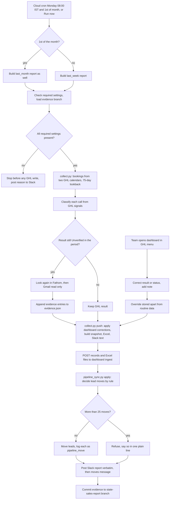
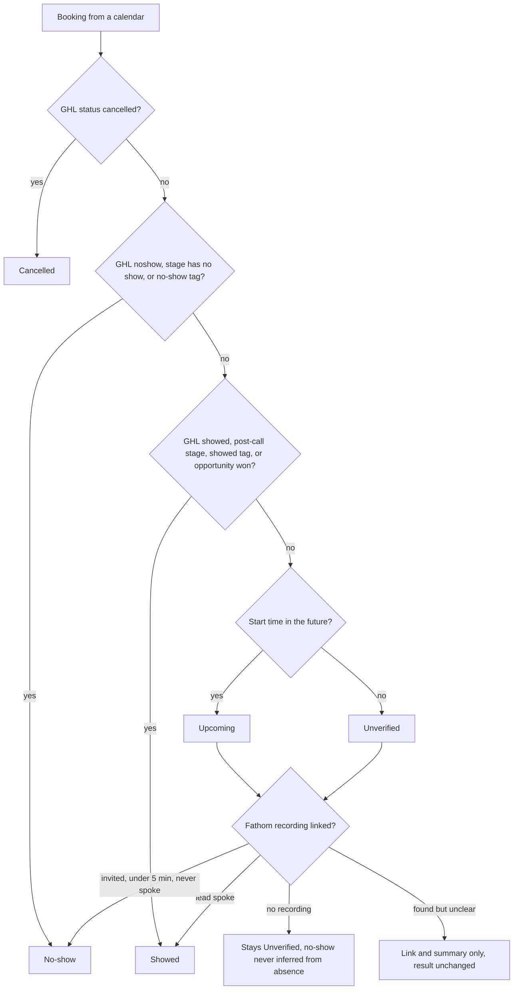

# Sales Call Report, Dashboard and Lead-Pipeline Sync

> A weekly and monthly cloud routine that works out which P2T and HLGP sales calls were booked, showed, no-showed or closed, reports in plain language to Slack and Excel, serves a correctable live dashboard, and moves GHL leads to match what happened.

| | |
|---|---|
| **Category** | Scheduled tasks and daily reporting |
| **Status** | Live, as of 9 Oct 2026 (routine seen Active on 6 Oct; results of runs after 6 Oct not found) |
| **Type** | claude.ai cloud routine (Python, stdlib only) plus a hosted Flask and MariaDB dashboard |
| **Runner and schedule** | Cloud routine `sales-call-report`, environment `sales-report`, designed cron `CRON_TZ=Asia/Calcutta 0 8 1 * 1` (08:00 IST on Mondays and the 1st of the month). On 6 Oct the routine page showed "every Monday 4:30 AM IST" with the 1st-of-month trigger not yet set; whether this was corrected is not found. Manual Run now is treated as a weekly run. |
| **Client / owner** | P2T and HLGP (Hari requested it on 2 Oct 2026) |
| **Stack** | GHL REST API (calendars, opportunities, contacts), Fathom connector and Fathom API, Gmail connector (read only), Slack connector, Python stdlib, Flask, gunicorn, MariaDB, nginx on a HestiaCP VPS, git state branches |
| **Source** | Main KB Part 1 "Sales call report + dashboard + lead-pipeline sync" (lines 434-502); Portfolio KB sections 16 and 19 |

## 1. Description

### What it does
GHL's own show and no-show status is unreliable (appointment status stays "confirmed" because nobody clicks the confirmation email), so this routine traces only two named calendars, decides the result of each call from GHL signals plus Fathom and Gmail evidence, and reports per account: calls, showed, closed, one line per call with result and lead status. It also keeps the GHL lead pipelines in step with the outcomes. A dashboard on its own domain lets the team open any call, see "how we know", and correct the result, status or add a note. A "Client projects" tab is built from the client-project-updates ledger.

### Inputs and outputs
- **Inputs:** two GHL calendars (P2T "AI & Automation Strategy Call", HLGP "HL Growth Partner - Strategy Call Global Timezone") with each booking's contact, tags, appointment status and latest opportunity in the lead pipelines; Fathom recordings from three accounts; Gmail arrival emails, follow-ups and replies (read only); `evidence.json` memory from earlier runs; team corrections from the dashboard; the client-project ledger (read only).
- **Outputs:** a plain-language Slack report (and a short second message listing pipeline moves); `weekly-<monday>.xlsx` and `monthly-<yyyy-mm>.xlsx`; records in the dashboard database (`sales_call`, `project`, `task`, `update`, `pipeline_move`); updated `evidence.json`; GHL lead stage moves.

### Key components
| Component | Role |
|---|---|
| Routine prompt `routines/sales-call-report.md` | Repo prompt (newest wording of steps 7-9 is in `sales-dashboard\ROUTINE.md`; the repo copy is slightly older) |
| `collect.py` | Reads calendars, 75-day lookback, skips tests, classifies calls, builds snapshot, Excel and Slack text, pushes to the dashboard |
| `fathom.py` | Matches recordings to bookings; speaker check via the Fathom transcript endpoint; retries on HTTP 429 |
| `pipeline_sync.py` | Moves leads between pipeline stages by rule; dry run by default |
| `xlsx_lite.py` | Stdlib Excel writer (replaced `openpyxl` after the first run failed) |
| `generate_keys.py` | Generates the dashboard access and ingest keys and a DB password (printed once, never pasted in chat or repo) |
| `server/` | Flask app: `/api/snapshot`, `/api/records`, overrides, notes, `/api/ingest`, `/api/stream` (live updates), `/files/<name>` |
| `evidence.json` | Earlier Showed, No-show and Lost confirmations, kept on branch `state-sales-report` |
| GHL Custom Menu Link "Sales & Projects" | One agency-level iFrame menu entry that embeds the dashboard and signs corrections with the GHL user's name |

### Where it lives
- Code: repo `p2t-hlgp-automation/sales-dashboard/` and the working copy `D:\Project\Client & Agency (Pivot)\Pivot2Thrive & Content\Hlgp and pipeline setup\sales-dashboard\` (`collect.py`, `fathom.py`, `pipeline_sync.py`, `xlsx_lite.py`, `generate_keys.py`, `ROUTINE.md`, `README.md`, `DEPLOY.md`, `UI-TABLES.md`, `server\`, `env\*.example`). The scripts import `ghl.py` from the client-project-updates skill, so token and state rules are shared.
- Routine environment `sales-report` variable names: `p2t_pit`, `p2t_location`, `hlgp_pit`, `hlgp_location`, `FATHOM_API_KEY_HLGP`, `FATHOM_API_KEY_P2T`, `FATHOM_API_KEY_VA`, `DASHBOARD_URL`, `INGEST_KEY`. No setup script. Network allowlist: the GHL API host, the Fathom API host, the dashboard host, and the two public brand domains. Connectors kept: Fathom, Gmail, Slack.
- Web app: hosted on its own dashboard host (not recorded here); configured through a server-side env file with variables such as `INGEST_KEY`, `DATABASE_URL`, `FRAME_ANCESTORS` and `MAX_LIVE`; run by a systemd unit behind an nginx proxy template with `proxy_buffering off`; MariaDB for storage. The server address and the key values are deliberately not recorded here.
- DB tables: `records(id, kind, account, rdate, data JSON, override JSON)`, `notes`, `files`, `meta`. The routine writes `data`; people write `override` and `notes`; they never overwrite each other.
- Slack channel `#client-project-updates` (shared with the client updates task).
- Memory note: `...\memory\sales-call-report-findings.md`; earlier prototype `...\Hlgp and pipeline setup\sales-call-report\sales_report.py`.

## 2. Flow chart

Result classification for each call (the decision order in `collect.py trace`, then Fathom evidence):

**Reading the chart**
1. The routine runs Mondays 08:00 IST (and, when the trigger exists, on the 1st of the month for the monthly report). A manual run counts as weekly.
2. It checks that the required settings exist and loads the evidence branch. A missing setting stops the run before any GHL write and says so in Slack.
3. `collect.py` lists bookings from the two named calendars over a 75-day lookback, skips tests, and classifies each call from GHL data. Rows in the period still "Unverified" are looked at again in Fathom (and Gmail, read only), matching the lead by name or email within one day because call times are Brisbane and Fathom dates are US.
4. Findings are written to `evidence.json` (skipping duplicates of account, lead and date). Closed is never taken from what was said, only from the pipeline stage.
5. The push step applies the team's dashboard corrections, builds the snapshot, the Excel files and the Slack text, and POSTs everything to the dashboard.
6. `pipeline_sync.py --apply` moves leads by rule, logs every move, and refuses if more than 25 moves are needed.
7. The Slack report is posted exactly as generated, then the short moves message; the memory commit follows. People can correct any record at any time in the dashboard, and those overrides are applied on the next run.

## 3. Case study

### The challenge
The owner needed a trustworthy weekly and monthly view of sales (strategy) calls for two businesses: who booked, who showed, who no-showed, how many closed. GHL's show and no-show status could not be trusted, P2T strategy bookings sit in a pipeline whose Call stages were never moved, opportunity values are all $0 (invoices are in Xero), and P2T calls are recorded in a different Fathom account from the one the Claude connector sees. The team also wanted to correct the machine's answers and to see the results in real time, not only in Slack.

### The solution
A cloud routine plus a small hosted app. The routine collects bookings from the two calendars, classifies each call from GHL signals, and upgrades "Unverified" or "Upcoming" rows with Fathom matching (a speaker check via the transcript endpoint) and Gmail evidence. Results go to Slack in plain language, to Excel, and to a Flask and MariaDB dashboard that is embedded in GHL as a menu link. The same run moves leads in the lead pipelines to match what happened. Timeline: 2 Oct design and code (PR #1); 5 Oct server deployed and live, first routine run failed because a setup-script `pip install openpyxl` was blocked by the environment allowlist, fixed in PR #2 (stdlib Excel writer, no setup script); first working run posted about 19:57 IST on 5 Oct with a jargon-filled Slack message; 6 Oct PR #3 (plain-language Slack, simple UI, three-account Fathom matching, common GHL link). PR #4 was a leftover and was closed.

### Design decisions and rules learned
- **Scope fixed by the owner:** trace only the two named calendars; weekly plus monthly; closed means a lead at "Onboarding Email sent" or later; closing moves the lead to "Onboarding Email sent" (or "On-boarding call Scheduled" if that call is already booked); "Proposal signed" and "Invoicing" count as "Closing", not closed (whether Invoicing counts is an open question, default no); pipeline updates from the records are authorised.
- **Never infer a result.** No recording means nothing changes; an unclear recording gives a link and summary only. Unconfirmed calls stay "Unverified" ("Couldn't confirm").
- **Closed is decided by pipeline stage**, counted once on the lead's latest showed call. Rule added 6 Oct: a client card created after the call means closed; a card older than the call means "Existing client" (an earlier "1 closed" claim was wrong for that reason).
- **Pipeline move limits.** HLGP Lead Pipeline: showed to "Strategy Call: SHOWED", no-show or cancelled to "Strategy Call: No Show/Cancelled", an upcoming booking from New Lead to "Strategy Call: Scheduled", a record marked Lost to "Not Interested". P2T onboarding-call calendar pipeline: "Call - Showed", "Call - No Show", "Call - Cancelled". Closed leads with a won opportunity move to "Onboarding Email sent". It never moves a lead out of a stage that is not a listed source, never touches lost or abandoned opportunities (except the Lost rule), never creates opportunities, and refuses more than 25 moves.
- **Human corrections are kept.** People write `override` and `notes`; the routine writes `data`; corrections persist across runs and are applied before each push.
- **Slack text is generated, plain and posted verbatim.** No file, branch or environment names, HTTP codes or URLs; at most one extra warning line; a "did not run" message if the run cannot start.
- **Gmail connector can send mail**, so the prompt forbids it (read only).
- **Simple UI preferred.** Period buttons, an account switch, four numbers (Calls, Showed, No-show, Closed), one table, a click-through sheet to fix result and status, a Clients tab and an Excel download. Alternative table layouts in `UI-TABLES.md` were left undecided.
- **(portfolio KB)** The portfolio KB lists the sales-call report routine, dashboard, Fathom collector and pipeline sync as reported components of the automation hub, and gives a generic Fathom to GHL to Slack to dashboard process with controls (idempotency key, source link, validated contact match, stage change only when the business rule is met, human confirmation for ambiguous matches or consequential moves). In the main KB the pipeline moves are rule-driven and authorised in advance, with a cap of 25 per run and a dashboard to correct afterwards, rather than per-move human approval. The portfolio KB's caution not to claim "fully autonomous" where a human step remains applies: people correct results in the dashboard.

### Outcome
Documented facts only:
- Dashboard deployed and live on 5 Oct on its own dashboard host; the health endpoint returns ok with the database; requests without a key return 401; the TLS certificate (Let's Encrypt via Hestia) auto-renews.
- First working routine run posted on 5 Oct; improved wording merged on 6 Oct (PR #3). Routine seen Active on 6 Oct.
- Local `evidence.json` holds 8 entries; it had not yet been pushed to the `state-sales-report` branch.
- No call counts, closed counts or time-saved figures are recorded. Results of runs after 6 Oct are not found.

### Lessons learned
- Packages cannot be installed in the cloud environment (allowlist), so use stdlib only.
- GHL dropped the query-string parameter from custom menu links, so the dashboard link format had to change. Embedding was blocked for white-label domains until they were added to `FRAME_ANCESTORS`.
- A move-log id containing `+` caused HTTP 400 on ingest (fixed, with retries).
- PR #2 was merged before the last commits were pushed, so `main` lacked fixes. The routine reads `main`, so always confirm `main` has the commits.
- The first Slack message was jargon-filled and contained a literal `{DASHBOARD_URL}`; generated plain text posted verbatim fixed it.
- Saving a routine edit can fail with "Your session is too old for this routine operation"; log out and in to claude.ai first.
- The auto-mode classifier blocked `pipeline_sync --apply` and a database admin change on 2 and 5 Oct; the owner ran them or allowed the routine to apply. A local DNS cache caused false 404s while testing.

## 4. Operating notes
- **Run / pause / debug:**
  - Cloud: claude.ai/code/routines, `sales-call-report`, Run now. It is a real run: it posts to Slack and moves GHL leads (the `DRY RUN` switch exists only in the blog routine prompts). Pause with the on/off switch; editing the prompt needs a fresh login.
  - Preview moves without writing: run `python pipeline_sync.py` (no `--apply`) locally. Local test: from `sales-dashboard/` with a `.env`, `python collect.py` (no push); `python server/dev_run.py` or `server/dev_mock.py` for a local UI; `server/smoke_test.py` for the server.
  - Deploy or update the app: copy `server/` to the app directory on the host, restart the service, check `/healthz`; back up the database with `mysqldump` (Hestia backups also include the database).
  - Wrong number on Slack or dashboard: open the call record, read "how we know", check `out/snapshot.json`, and override in the UI (kept across runs).
- **Known issues and open items (as of 6 Oct):**
  - Add the 1st-of-month trigger; check runs after 6 Oct; sync the repo prompt with the newer plain-language wording; push `evidence.json` to the state branch; decide whether Invoicing counts as closed; decide the undecided table layouts.
  - Facts that shape the data: HLGP records show and no-show in Lead Pipeline stages; P2T Call stages were never moved; Fathom key labels were swapped once (harmless because all `FATHOM_API_KEY*` keys are pooled).
- **Risks:**
  - Security and credential-hygiene findings for this project are tracked privately and are not published here.
  - Run now moves real leads and posts to the shared Slack channel.
  - Dashboard stores lead names and call evidence; treat the database and Excel files as sensitive.

## 5. Related
- Shares the Slack channel, `ghl.py` and the client ledger: `client-project-updates.md`
- Cloud routine context: `../02-content-seo-newsletters/cloud-migration-oct-2026.md`
- GHL API quirks: `../03-ghl-crm-migrations/ghl-api-contracts-and-quirks.md`
- Sibling cloud routine in the same repo: `../02-content-seo-newsletters/client-blog-engine-summit-air-solar-flex.md`
- **Sources:** Main KB Part 1 overview and "Sales call report + dashboard + lead-pipeline sync" section, Part 1 "Gaps", opening-chapter sections 1, 2 and 5; Portfolio KB sections 16 and 19.
