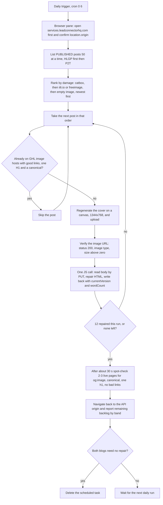

# Blog Post Backlog Repair (legacy, self-cancelling)

> A daily Cowork task that repaired up to 12 broken P2T and HLGP blog posts per run (dead covers, wrong links, double H1s, missing canonicals) and deleted itself when both blogs were clean.

| | |
|---|---|
| **Category** | Content, SEO and newsletters |
| **Status** | Legacy or retired, as of 9 Oct 2026 (task disabled in the task store; last-run field 9 Oct 05:01Z; not ported to the cloud; whether the backlog reached zero is not found) |
| **Type** | Local Cowork scheduled task driving the Claude browser pane with JavaScript |
| **Runner and schedule** | Local Claude desktop scheduler, cron `0 6 * * *`; ran through the browser pane because the Linux sandbox on that machine was dead (Plan9 mount error) |
| **Client / owner** | P2T and HLGP blogs (internal) |
| **Stack** | Claude browser pane tools, GHL REST API through same-origin `fetch`, a canvas-based cover generator (`window.MAKECOVER`, Poppins from gstatic) |
| **Source** | Main KB Part 2 section 6 (lines 899-942); Part 2 sections 2 and 7 for related rules; Portfolio KB section 16 |

## 1. Description

### What it does
The task burned down damage found on 9 Sep 2026. Each run took up to 12 published posts, worst first, regenerated a cover, uploaded it to GHL, repaired the post HTML (internal links, duplicate H1, schema URLs) and wrote it back, then spot-checked live pages and reported the remaining backlog by band. When both blogs needed no repair it deleted itself, which the task file explicitly authorised.

### Inputs and outputs
- **Inputs:** `GET /blogs/posts/all?...&limit=50&offset=N&status=PUBLISHED`; priority order catbox covers, then `iili.io`/freeimage covers, then empty image, most recent first; posts already on `assets.cdn.filesafe.space` or `images.leadconnectorhq.com` are skipped unless links, H1 or canonical need repair. HLGP first (bigger backlog), then P2T. Tokens are referenced by name (`$p2t_pit`, `$hlgp_pit`; the repo copy has tokens removed).
- **Outputs:** repaired posts and a per-blog report of the remaining backlog.

The damage being repaired (found 9 Sep 2026):

| Problem | Scale |
|---|---|
| Dead `files.catbox.moe` covers (top priority) | about 158 HLGP, about 36 P2T |
| `iili.io`/freeimage covers loading in 21-23 seconds | about 144 HLGP |
| Missing `imageUrl` | 21 HLGP, 3 P2T |
| Internal links using the wrong pattern | about 12 per HLGP post |
| Duplicate H1 | HLGP posts |
| Missing canonical | both sites |

### Key components
| Component | Role |
|---|---|
| Cowork task `blog-post-backlog-repair` | Prompt and schedule; copy in `cowork-tasks/blog-post-backlog-repair.md` |
| Browser pane (`javascript_tool`) | Runs same-origin `fetch` calls that Cloudflare does not block |
| `window.MAKECOVER` canvas generator | 1344x768 cover, title up to 34 characters with one accent word, three-phrase subtitle, brand logo |
| GHL Blogs and Medias endpoints | List, read, update (PUT) and upload |

### Where it lives
- `...\Blogs\p2t-hlgp-automation\cowork-tasks\blog-post-backlog-repair.md` (tokens removed).
- Brand logos at `https://assets.cdn.filesafe.space/<locationId>/media/...png` (the two paths are in the task file).
- Site access to request in the browser: `services.leadconnectorhq.com`, `assets.cdn.filesafe.space`, `hlgrowthpartner.com`, `pivot2thrive.com.au`.

## 2. Flow chart

**Reading the chart**
1. The task starts daily at 06:00 and navigates the browser to `https://services.leadconnectorhq.com/` first, confirming `location.origin`. From there every `fetch("/blogs/...")` and `fetch("/medias/upload-file")` is same-origin, so no CORS preflight happens and Cloudflare does not 403 a real browser.
2. Published posts are listed and ranked by damage: catbox first, then iili.io or freeimage, then empty image; most recent first; HLGP before P2T.
3. Posts already fine (GHL-hosted image, links, H1, canonical) are skipped.
4. For a damaged post, a new cover is drawn on a canvas (unique filename and a different seed per post) and uploaded. The URL is `https://images.leadconnectorhq.com/image/f_webp/q_80/r_1200/u_{RAW}` and must verify as 200, image type, size above zero.
5. In one `javascript_tool` call per post: read the body by PUT-ing a minimal body without `currentVersion` (it acts as a read, returning `rawHTML` and `currentVersion`); repair the HTML (strip NULs, rewrite internal links to `/post/{slug}`, remove any `<h1>`, replace `/claude-expert-australia` links with `/blogs` for P2T, fix JSON-LD `mainEntityOfPage` and BreadcrumbList URLs and the Article image, re-parse the JSON and revert if broken); write the full body including `canonicalLink`, `currentVersion`, `wordCount`, `readTimeInMinutes` (round of words divided by 230) and unchanged `categories`.
6. After about 30 seconds, 2-3 live pages are spot-checked, then the browser returns to the API origin.
7. The remaining backlog is reported by band. If both blogs are clean, the task deletes itself.

## 3. Case study

### The challenge
A 9 Sep audit found that hundreds of older posts on both blogs had broken or slow cover images hosted off GHL, internal links that redirect to `/home`, double H1s and no canonical link. The fix needed edits to live posts through an API that silently ignores some updates, behind a Cloudflare layer that blocks scripted clients, and on a machine whose Linux sandbox was not working.

### The solution
A burn-down task that works in the browser pane, where same-origin calls pass Cloudflare, and that repairs a bounded batch (up to 12 posts) per day in priority order. Each post is read, repaired and written back inside a single JavaScript call so the version number cannot go stale, and the task cancels itself once nothing is left to repair.

### Design decisions and rules learned (apply to ANY post edit)
- The MCP tool `blogs_update-blog-post` is broken (its schema has no postId). Use `PUT /blogs/posts/{postId}`.
- To change `rawHTML` the body MUST include BOTH `currentVersion` AND `wordCount`; otherwise the endpoint returns 200, echoes the OLD body and updates only metadata.
- `currentVersion` goes stale on EVERY PUT, so read and write inside the same program or call.
- Always carry `categories` through unchanged or they can be blanked.
- Cloudflare in front of `services.leadconnectorhq.com` returns 403 "Error 1010" to Python's default urllib/requests signature (and, on the Cowork machine, to curl). The Cowork task therefore said never to call it from a non-browser client and used same-origin browser fetch. The cloud tools instead send a custom User-Agent for API calls and shell out to curl for uploads, which worked in the 1 Oct and 6 Oct cloud runs.
- Never cross one brand's `locationId`, token or logo with the other's.
- The same lesson appears in the PoolSafe AU scripts: a PUT without `currentVersion` silently did not update the body, so the workaround was creating a new post and archiving the old one.
- Portfolio KB (section 16) lists "Backlog repair" only as a hub component and adds no process facts.

### Outcome
- The task is in the task store with `enabled:false`, cron `0 6 * * *` and a last-run field of 2026-10-09T05:01Z.
- Up to 12 posts per run. Whether the backlog reached zero, and how many posts were repaired in total, is not found in the source.
- The 24 re-dated posts on 6 Oct and the 1 Oct drafting were done with ad-hoc scripts, not with this task.
- No measured outcome recorded.

### Lessons learned
- Treat a 200 from an update as unproven: confirm that the body actually changed.
- Do read-modify-write inside one call when a version token expires on every write.
- Bounded daily batches plus a self-cancelling condition make a one-off repair safe to leave on a schedule.
- The guards in the shared tooling (GHL-hosted images, `/post/` links, no h1, canonical set) target these same defects, so new posts should not add to the backlog (inferred).

## 4. Operating notes
- **Run / pause / debug:** Run from the Cowork Scheduled sidebar (needs the PC). A cloud port would use `ghl_blog.py` plus curl and needs a new `update` command, which does not exist: `ghl_blog.py` has no update or PUT command.
- **Known issues and open items:** the task's disabled flag and the 9 Oct last-run field sit together in the task store, and the state of the backlog is not documented. 20 old HLGP posts without a publish date and the 29/30 Sep imbalance (from the 1 Oct check) are also unrepaired.
- **Risks:** a PUT with a stale or missing `currentVersion` can leave a post unchanged while the API reports success. Leaving `categories` out of a write can blank them. Mixing brand ids or logos would publish the wrong brand's assets.

## 5. Related
- [P2T daily blog engine](p2t-daily-blog-engine.md)
- [HLGP daily SEO blog engine](hlgp-daily-seo-blog-engine.md)
- [Blog engine watchdog](blog-engine-watchdog.md)
- [GHL Blog API and shared blog tooling](ghl-blog-api-and-shared-blog-tooling.md)
- [PoolSafe AU blog publish scripts](poolsafe-au-blog-publish-scripts.md)
- **Sources:** Main KB Part 2 section 6 (lines 899-942), with context from sections 2, 3 and 7. Portfolio KB section 16.
