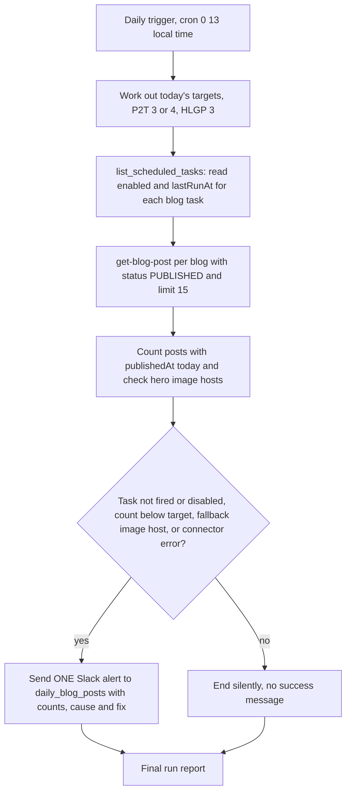

# Blog Engine Watchdog (Slack failure alerts)

> A daily check, run as a local Cowork task, that confirmed both blog engines posted their daily quota and sent one Slack alert only if something failed.

| | |
|---|---|
| **Category** | Content, SEO and newsletters |
| **Status** | Legacy or retired, as of 9 Oct 2026 (task disabled, last run 17 Sep 2026, not ported to the cloud) |
| **Type** | Local Cowork scheduled task (prompt-only, no code) |
| **Runner and schedule** | Local Claude desktop scheduler, cron `0 13 * * *` in local time; needs the PC and the desktop app |
| **Client / owner** | P2T and HLGP blogs (internal) |
| **Stack** | Scheduled-tasks MCP (`list_scheduled_tasks`), GHL MCP blog tools (`ghl-pivot2thrive`, `ghl-HLGP`), Slack MCP |
| **Source** | Main KB Part 2 section 5 (lines 865-898); Part 2 sections 0 and 20 (gaps); Portfolio KB section 16 |

## 1. Description

### What it does
Each day the watchdog worked out how many posts each blog should have published, checked that the two daily blog tasks had actually fired, counted today's published posts through the GHL blog tool, and sanity-checked the hero image hosts. If anything was wrong it sent exactly one Slack message to `#daily_blog_posts` with counts, the specific cause and the fix. If everything was fine it ended silently. The task file records an explicit preference: alert on failure only, never post success messages.

### Inputs and outputs
- **Inputs:** daily targets (P2T blog 3 posts, plus 1 on Mon/Wed/Fri while the expert engine existed, so 4; HLGP blog 3 every day); the scheduler's task list (`enabled` and `lastRunAt` per blog task); the published-post lists of both blogs.
- **Outputs:** one Slack alert only on failure, headed "Blog engine alert" with the date (the task file marks it with a rotating-light Slack shortcode), with counts per blog, what went wrong and the fix; a final run report either way.

### Key components
| Component | Role |
|---|---|
| Cowork task `blog-engine-watchdog` | The prompt and schedule (prompt copy in `cowork-tasks/blog-engine-watchdog.md`) |
| Scheduled-tasks MCP | Reads each blog task's `enabled` flag and `lastRunAt` |
| GHL MCP blog tools | `get-blog-post` per blog with `query_status: "PUBLISHED"`, offset 0, limit 15 |
| Slack MCP | Posts the single failure alert to `#daily_blog_posts` |

### Where it lives
- Repo copy: `...\Blogs\p2t-hlgp-automation\cowork-tasks\blog-engine-watchdog.md`.
- The task store `scheduled-tasks.json` shows `enabled:false`.

## 2. Flow chart

**Reading the chart**
1. A daily schedule starts the check.
2. Targets are worked out: P2T 3 posts per day (4 on Mon/Wed/Fri while the expert engine existed), HLGP 3 per day.
3. `list_scheduled_tasks` shows whether each blog task is enabled and when it last ran. A task that did not run today is a different and more serious failure than under-delivery.
4. For each blog the published-post list is requested with a status filter (the endpoint returns an empty array unless status is supplied) and the posts whose `publishedAt` is today are counted.
5. Hero image URLs are sanity-checked: P2T covers should start with `https://images.leadconnectorhq.com/image/`; any catbox or other host marks a degraded run.
6. If any of the four conditions holds (task did not fire or is disabled, count below target, fallback image host, connector error) one Slack message is sent. Otherwise the task ends silently.
7. A final run report is produced in both cases.

## 3. Case study

### The challenge
On 29-31 Aug 2026 the task `pivot2thrive-daily-blog-dark` ran but published nothing for three days because the GHL token was not attached to the task. The hero image upload failed and the no-duplicate policy correctly refused to publish. Nobody noticed because the failure was only visible in a transcript. A watchdog was needed that surfaces failures without adding daily noise.

### The solution
A second scheduled task that checks outcomes rather than logs: did each blog task fire, and are there enough posts with today's date. It tells the team in Slack only when action is needed.

### Design decisions and rules learned
- **Alert on failure only.** This is a stated preference in the task file, so the absence of a message means success.
- **Check the scheduler, not just the blog.** A task that did not fire, or is disabled, is reported separately from a run that fired but under-delivered.
- **Status filter required.** The GHL blog endpoint returns an empty array unless `query_status` is supplied, so the watchdog always passes `PUBLISHED`.
- **Resolve connector tool ids by name via ToolSearch**, since ids vary between sessions.
- The original design depends on a local scheduled-tasks tool, so it needs rework to run in the cloud. The same logic could be rebuilt as a routine using `ghl_blog.py recent <acct> --limit 15` plus the Slack connector (inferred).

### Outcome
- Task `blog-engine-watchdog` exists with `enabled:false`; its last run was 17 Sep 2026.
- It was not ported to the cloud routines. `docs/SETUP.md` section 8 says "Until the watchdog is rebuilt, check the run list or Slack yourself."
- No count of alerts sent is recorded.

### Lessons learned
- A job that fails silently is as bad as a job that does not run; a cheap outcome check by a second task pays for itself.
- Moving the engines to the cloud removed the watchdog's runner, so monitoring needs to move with the jobs.

## 4. Operating notes
- **Run / pause / debug:** Re-enable from the Cowork Scheduled sidebar (it needs the PC and the desktop app). Rebuild as a cloud routine for durable alerts.
- **Known issues and open items:** No failure alerting exists for the cloud routines now; the gap is listed in the KB's risk section. A rebuilt version should account for the P2T target dropping back to 3 on every day, since the expert series finished (inferred). The Main KB skills summary (line 4545) describes the watchdog as an alert-only check on "the three blog engines" and does not mention that it is disabled.
- **Risks:** Today the cloud blog routines can fail without anyone being told, as the 29-31 Aug failure did.

## 5. Related
- [P2T daily blog engine](p2t-daily-blog-engine.md)
- [HLGP daily SEO blog engine](hlgp-daily-seo-blog-engine.md)
- [P2T Claude Expert topic engine](p2t-claude-expert-topic-engine.md)
- [Blog backlog repair](blog-backlog-repair.md)
- [Cloud migration, October 2026](cloud-migration-oct-2026.md)
- **Sources:** Main KB Part 2 section 5 (lines 865-898), Part 2 section 20 gaps (line 1397), skills summary (line 4545). Portfolio KB section 16 lists "Blog-engine watchdog" as a hub component and gives no further detail.
