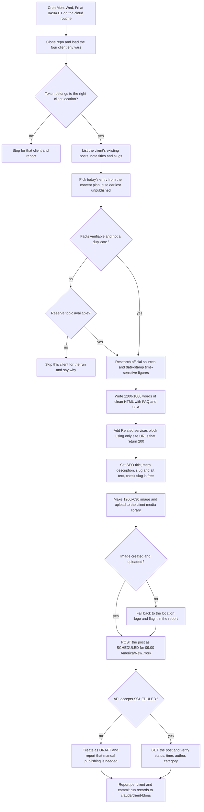
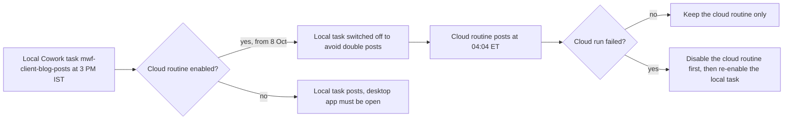

# Client Blog Engine: Summit Air and Solar Flex (Mon/Wed/Fri)

> A scheduled engine that researches, writes and schedules one SEO and AI-search (AEO) blog post per run for each of two client GoHighLevel accounts, Summit Air Heating & Cooling and Solar Flex, to go live at 9:00 AM US Eastern.

| | |
|---|---|
| **Category** | Content, SEO and newsletters |
| **Status** | Live, as of 9 Oct 2026 (cloud routine enabled 8 Oct; the result of its first run, due 9 Oct, is not found in the source; the older local task is disabled) |
| **Type** | Claude Code cloud routine with a Python image helper; legacy local Cowork scheduled task `mwf-client-blog-posts` kept only as a manual fallback |
| **Runner and schedule** | Cloud routine `client-blogs-mwf-summit-solar` at claude.ai/code/routines, `CRON_TZ=America/New_York 0 4 * * 1,3,5` (about 04:04 ET). Local task cron `0 15 * * 1,3,5` (3:00 PM IST), disabled |
| **Client / owner** | Summit Air Heating & Cooling and Solar Flex, two client sub-accounts; requested and owned by Hari (P2T) |
| **Stack** | GHL REST API (`services.leadconnectorhq.com`, `Version: 2021-07-28`, per-client Private Integration Token), Python with Pillow, WebSearch/WebFetch, `zoneinfo`, GitHub, claude.ai Routines |
| **Source** | Main KB Part 2 section 1 (lines 650-721) and Part 1 section "Mon/Wed/Fri client blog posts" (lines 503-555); Portfolio KB sections 11 and 17 |

## 1. Description

### What it does
Every Monday, Wednesday and Friday the engine picks the next topic from a 15-post content plan for each client, checks the facts against official sources on the day, writes a 1,200-1,800 word post, builds a branded 1200x630 featured image, and schedules the post in the client's own GHL blog for 9:00 AM US Eastern. Both clients are thin brochure sites with no blog history that sell mostly by cold calling and referrals, so the aim is SEO and AEO visibility: Summit Air targets NYC and NJ homeowner questions (heat pumps, ductless mini-splits), Solar Flex targets New Jersey and Northeast solar and battery questions. The client chose fully automatic publishing with no review step, so the accuracy rules in the prompt are the only safeguard.

### Inputs and outputs
- **Inputs:** `content-plan.json` (`summit[15]`, `solar[15]`; each entry has `publish_date`, `date` label, `title`, `keyword`, `category`, `stage`, `service`, `verify`); the 10-page `Blog Strategy - Next 30 Posts.docx`; each client's existing post list (the blog is the progress ledger); the client website navigation for service links; live web research of official sources; per-client tokens and location ids from environment variables.
- **Outputs:** SCHEDULED GHL blog posts (author = company name, one category), branded 1200x630 images in each client's GHL media library, a per-client run report, HTML/PNG backups in `blog-drafts`, and (cloud) run records committed to branch `claude/client-blogs`.

### Key components
| Component | Role |
|---|---|
| Cloud routine `client-blogs-mwf-summit-solar` | Scheduler and runner; repo `p2t-hlgp-automation`, reuses environment chip `blog-hlgp`; instructions currently inline in the routine |
| Local task `mwf-client-blog-posts` | Original runner (prompt in its `SKILL.md`); one recorded run on 8 Oct; now disabled |
| `content-plan.json` | 15 planned topics per client, 9 Oct to 11 Nov 2026, one per `publish_date` (America/New_York) |
| `Blog Strategy - Next 30 Posts.docx` | Strategy: clusters, calendars, measurement, client needs, risks, reserve topics, sources |
| `make_image.py` | Pillow script: brand-colour gradient, category chip, title that shrinks to fit 5 lines, logo plate; no fake photos |
| GHL Blogs and Medias endpoints | List posts, check slug, upload image, create and verify posts |
| Per-client authors and categories | Created by hand in the GHL UI; Summit has 4 categories, Solar Flex has 3 |
| Branch `claude/client-blogs` | Cloud run records: per-post HTML, details file, `ledger.json`, `last-run.md` |
| PR #5 `client-blogs-routine` | Adds the skill, plan JSON, image script, routine prompt and strategy doc to the repo; merge status not found |

### Where it lives
- Client folder under `D:\Project\Client & Agency (Pivot)\` (folder named after the client contact; name omitted here): `content-plan.json`, the strategy docx, `tools\make_image.py`, `blog-drafts\`, a local `.env` (never print), and `.claude\settings.local.json` (pre-approved Bash rules only).
- Local task prompt: `C:\Users\<user>\.claude\scheduled-tasks\mwf-client-blog-posts\SKILL.md`.
- Repo: `p2t-hlgp-automation`; PR #5 adds `.claude/skills/client-blogs/` (`SKILL.md`, `content-plan.json`, `make_image.py`), `routines/client-blogs-mwf.md`, `docs/client-blogs-strategy.docx`.
- Environment variable names (case-sensitive): `SUMMIT_AIR_PIT`, `SOLAR_FLEX_PIT`, `SUMMIT_AIR_location`, `SOLAR_FLEX_location`. The location falls back to the ID written in the instructions.
- Continuity notes: two memory files (a client-context note and `blog-author-company-name.md`) in the Claude project memory folder for that client directory.
- Cloud network allowlist (if Custom): `services.leadconnectorhq.com`, `firebasestorage.googleapis.com`, `msgsndr-private.storage.googleapis.com`, the two client sites, plus research hosts (irs.gov, nj.gov, cleanenergy.nj.gov, nyserda.ny.gov, coned.com, energy.gov, nrel.gov, eia.gov).

## 2. Flow chart

A second view shows how the two runners relate. They must never both be active, because each keeps its own record of what was posted.

**Reading the chart**
1. The cloud routine fires at about 04:04 ET on Monday, Wednesday and Friday, clones the repo and reads the client env vars. The 04:00 start leaves several hours before the 9:00 AM ET publish time.
2. First action of the cloud run: confirm each token belongs to the right business (location id match). A swapped token stops the run for that client only.
3. The existing posts are listed so no topic or search intent is repeated; existing posts are never touched.
4. The topic comes from the plan entry for today's ET date, or the earliest entry whose title or slug is not yet in the blog. If facts cannot be verified or it would duplicate, a reserve topic is used; if none is writable that client is skipped with a reason.
5. Facts are checked on the day against the entry's `verify` source and dated ("as of October 2026"); unverifiable figures are dropped.
6. The post is written as clean HTML (no h1, no inline styles). A Related services block (1-3 items) and one body link are added only if the topic really relates to an offering, using only company-site URLs that return 200.
7. Metadata is set and the slug is checked (the slug-exists call must not pass `blogId`, or it returns 422; comparing with the post list is the fallback).
8. The image is generated and uploaded; the logo fallback applies only if image creation or upload fails.
9. The post is created as SCHEDULED at 09:00 America/New_York (computed with `zoneinfo`, never a hard-coded offset). If it is already past 9:00 ET it is PUBLISHED with `publishedAt` now. If SCHEDULED is rejected it becomes a DRAFT.
10. A GET of the single post confirms status, `publishedAt`, author and category (the list endpoint omits author). The run is reported and, in the cloud, committed to `claude/client-blogs`. If writes are blocked by the environment, the run saves `<client>_<slug>.html` to `blog-drafts` and reports instead of bypassing the block.

## 3. Case study

### The challenge
Two client accounts had thin brochure websites and no blog history. The strategy document set out a 30-post programme (15 per client) with topic clusters, a content calendar and measurement. The posts had to go live at 9:00 AM Eastern, while the owner works on IST, and the client chose automatic publishing with no review step. The seed articles written first contained seven unverified facts that still needed client confirmation, so a wrong claim about rebates or tax credits was the main business risk. GHL also could not create authors or categories through the public API, and Cloudflare blocked the default Python user agent.

### The solution
A Mon/Wed/Fri engine that runs one pass per client: read the blog, follow the plan, verify facts the same day, write, add honest downsides and service links, make a branded image, schedule for 9:00 ET, then verify the saved post. It started on 8 Oct as a local Cowork task and was moved the same day to a cloud routine (repo, environment variables, branch for run records) so it no longer needs the PC. Local-task knowledge was reused: the same logic with the plan built in.

### Design decisions and rules learned
- **Author is the company name** on every post (owner decision 8 Oct), because the early articles contained unverified claims, so there is no personal byline.
- **Accuracy rules** (posts go out unreviewed): use only facts verified in an official or primary source that run; never invent statistics, prices, testimonials, reviews, credentials or brands; never say the company is a participating contractor or can submit rebate applications; never say the federal 30% solar credit or the $2,000 heat pump credit still applies (both ended for 2026 installs); when sources conflict, use the program owner's page and date it.
- **Authors and categories** cannot be created through the public GHL API, which only lists them. They were created in the GHL UI on 8 Oct with Chrome logged into the agency that owns the client sub-accounts (two other agency logins lacked access).
- **Publish time is the client's time zone** (America/New_York, Newark NJ), not IST. This was a correction on 8 Oct, when "9 AM" had first been set in IST.
- **Cloudflare error 1010**: send `User-Agent: curl/8.4.0` or use curl.
- **Changing the date of an already SCHEDULED post failed** with an internal error; switching it to DRAFT and re-scheduling worked (used on 8 Oct to move two posts to 9 Oct).
- **Do not use the GHL MCP** for these clients: the connected MCP points at the P2T account. Use the REST API with the client's own token.
- **No hidden fallbacks**: the logo fallback image is reported, and a blocked write saves HTML instead of bypassing the block.
- **Interactive auto mode blocked** the call that creates draft posts in external accounts, so scheduled-task permissions must be pre-approved (run the task once with Run now).
- Portfolio KB (section 17) offers a generic checklist (select topic, check not already published, generate, validate, apply approval rules, publish, verify, update the plan, report). The real engine matches it except that no approval step exists and the blog itself, not the plan file, is the ledger.

### Outcome
- 8 Oct: the one recorded local run succeeded and scheduled 2 posts for 9:00 AM EDT. It skipped an NJ net-metering post because only disagreeing secondary sources were found, and removed a "batteries are the biggest share of storage cost" claim it could not confirm on DOE pages. That run used the location logo as the image (a follow-up).
- Posts already live or scheduled, per the transcripts: Solar "Is Solar Still Worth It in New Jersey in 2026?" and Summit "PSE&G Heat Pump Rebates..." (back-dated to Mon 5 Oct); Summit "Do Heat Pumps Work in New Jersey Winters?" and Solar "Going Solar in New Jersey: The Installation Process From Permit to Switch-On" (back-dated Wed 7 Oct); two automation posts, Solar "Do Solar Panels Work During a Power Outage?" and Summit "Ductless Mini-Splits for NYC and NJ Homes..." (moved from 8 Oct to Fri 9 Oct, 9:00 AM ET).
- Plan horizon: 15 publishing days, Fri 9 Oct to Wed 11 Nov 2026, 15 posts per client, with review points after post 10 (30 Oct) and post 30 (11 Nov).
- Cloud routine enabled 8 Oct; first cloud run was due Fri 9 Oct at about 04:04 ET. Its result, and the merge status of PR #5, are not found.
- No traffic, ranking or lead results are recorded.

### Lessons learned
- When content publishes with no review, write the verification rules into the prompt and prefer skipping a client to guessing.
- Compute time zones with a library, and publish in the audience's zone.
- Keep one runner per job; a ledger per runner means two active runners produce duplicates.
- Read tokens only in code and never echo them while debugging.
- Verify the saved post with a single-post GET, because the list view hides fields such as author.

## 4. Operating notes
- **Run / pause / debug:** Run now at claude.ai/code/routines. It creates real scheduled posts and no dry-run switch is documented for this routine (the P2T and HLGP routines honour the words DRY RUN; this one: not found), so do not test casually. Pause with the routine toggle; re-enable the local task only if the cloud run fails, and never both. Debug: check the run log or push notification, then branch `claude/client-blogs` (search the branch list for "client-blogs", since GitHub adds a random suffix) and `client-blogs/last-run.md`; list the blog's posts to see what exists; check env var names; check the network allowlist (inferred). To add a client: new author and categories in the GHL UI, a new env-var pair, a plan entry, and a new brand in `make_image.py`.
- **Known issues and open items:** Friday 9 Oct has two posts per client (the two moved automation posts plus the plan's Friday entries); the owner was asked whether to stagger. Seven facts from the SEO report need client confirmation (rebate programme participation, solar assumptions and others). The PSE&G rebate post is NJ-only while the SEO target is NYC. One post says Summit offers payment options. The strategy document's prerequisites are still open: confirm the GHL blog is attached to each company website, linked in navigation and in the sitemap; get Search Console access; collect real install photos (images are branded graphics for now); confirm licensing, service areas and real financing terms. After PR #5 merges, the routine prompt should shrink to a pointer so instructions are read from git.
- **Risks:** Posts publish unreviewed (spot-check two posts a week for the first month, per the strategy document). Anything the routine posts appears as the owner. Security and credential-hygiene findings for this project are tracked privately and are not published here.

## 5. Related
- [P2T daily blog engine](p2t-daily-blog-engine.md)
- [HLGP daily SEO blog engine](hlgp-daily-seo-blog-engine.md)
- [GHL Blog API and shared blog tooling](ghl-blog-api-and-shared-blog-tooling.md)
- [Cloud migration, October 2026](cloud-migration-oct-2026.md)
- **Sources:** Main KB Part 2 section 1 (lines 650-721); Part 1 section "Mon/Wed/Fri client blog posts" (lines 503-555); Part 2 section 0 map (context); Portfolio KB sections 11 and 17. Discrepancies: Portfolio KB marks the engine "user-confirmed completed" and lists an approval step, while the Main KB shows no review step and an unconfirmed first cloud run; Part 1 says the cloud routine carries a 30-post plan inline, while Part 2 says the instructions are inline and the plan file arrives with PR #5 (compatible, but unconfirmed which holds the plan today). Part 1 states the local task is disabled; Part 2 says the flag was not verified.
