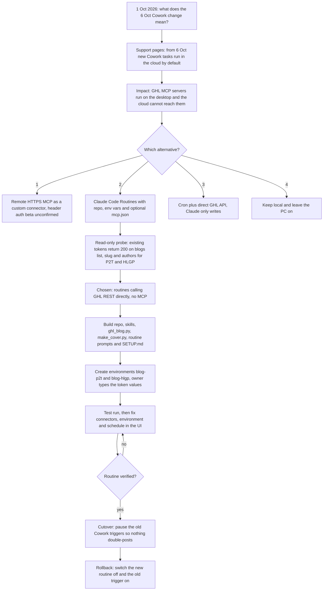
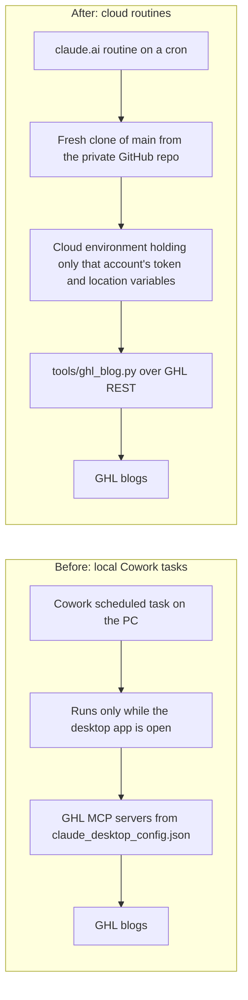

# Cloud Migration, October 2026 (why 6 Oct mattered and what was chosen)

> The record of the 1 Oct 2026 decision to move the blog engines (and later other jobs) from local Cowork scheduled tasks to Claude Code cloud routines that call the GoHighLevel REST API directly, with no MCP and no PC.

| | |
|---|---|
| **Category** | Content, SEO and newsletters (affects the whole automation estate) |
| **Status** | Reference, as of 9 Oct 2026 (migration done for the blog engines; see Outcome for client-project-updates) |
| **Type** | Migration project and decision record: local Cowork tasks to Claude Code cloud routines |
| **Runner and schedule** | One-off. Decision session 1 Oct 2026; build, test and cutover over the following days; the 6 Oct change in Cowork was the trigger |
| **Client / owner** | P2T and HLGP (internal); the client blog routine of 8 Oct reuses the result. Owner: Hari |
| **Stack** | claude.ai/code Routines, cloud environments, private GitHub repo `p2t-hlgp-automation`, GHL REST API, Python helpers, Anthropic support pages used as research |
| **Source** | Main KB Part 2 section 8 (lines 988-1032); Main KB lines 83-91 and 312 (runner comparison and context), 1393-1402 (gaps); Portfolio KB section 16 |

## 1. Description

### What it does
This file records why the blog engines and related jobs had to move and what was chosen. The research answer was that from 6 Oct new Cowork tasks on Pro and Max plans run in the cloud by default and the "Only on your computer" option goes away. The GHL MCP servers (`ghl-HLGP`, `ghl-pivot2thrive`) are processes defined in `claude_desktop_config.json` on the owner's machine, so cloud tasks cannot reach them except through the open Desktop app. The team chose Claude Code Routines in Anthropic's cloud calling the GHL REST API directly.

### Inputs and outputs
- **Inputs:** Anthropic support pages on Cowork scheduled tasks, Claude Code routines and cloud-environment docs; the local task store; the existing GHL Private Integration Tokens.
- **Outputs:** a private GitHub repo with skills, tools, routine prompts and a master guide (`docs/SETUP.md`); cloud environments `blog-p2t` and `blog-hlgp`; routines that need no PC; a cutover and rollback plan.

### Key components
| Component | Role |
|---|---|
| claude.ai/code Routines | Scheduler and runner (name, prompt file, model Opus, repo, environment, schedule, connectors removed) |
| Cloud environments | One per job family, holding only that account's `<acct>_pit` and `<acct>_location`, a network allowlist and a setup script |
| Repo `p2t-hlgp-automation` | `.claude/skills/`, `routines/*.md`, `tools/`, `docs/SETUP.md`, `README.md` |
| `docs/SETUP.md` | Master guide, sections 3 (environments), 5 (schedules), 8 (watchdog gap), 9 (templates), 10 (debug table) |
| Old Cowork triggers | Paused at cutover: `pivot2thrive-daily-blog-dark`, `hlgp-daily-seo-flux`, the expert engine and the local client-project-updates task |

### Where it lives
- Session "October 6th deprecations and alternatives" (cwd `...\Blogs`, a 37 MB transcript).
- `docs/SETUP.md`, `README.md`, `routines/*.md` in the repo; routines and environments in the claude.ai UI (cloud icon in claude.ai/code, "Add cloud environment").
- Custom schedules are set with `/schedule update`, for example `CRON_TZ=Asia/Calcutta 7 7 * * 1,3,5`.

## 2. Flow chart

The first chart shows the decision path and the build.

The second chart shows the runner architecture before and after.

**Reading the chart**
1. On 1 Oct the owner asked what the 6 Oct deprecation of "Cowork on-computer" tasks means and what the alternatives are, because the GHL MCP credentials sit in a desktop config file.
2. The research answer came from Anthropic support articles, not from the account, so the details need to be verified against the plan. Anthropic's stated reasons: work continues with the laptop closed, scheduled tasks run with no device online, sessions are resumable from desktop, web and mobile. Tasks already started on the computer stay local until finished.
3. Impact: pre-built connectors (Slack, Fathom, Drive) work in cloud tasks. Custom MCP servers from `claude_desktop_config.json` do not, except through the open Desktop app. A known issue is that cloud scheduled tasks sometimes do not load connectors (claude-code issue 43397).
4. Four alternatives were offered; option 2 (Routines with a repo, environment variables and optional `.mcp.json`) was chosen.
5. A read-only probe showed the existing tokens already return 200 for blogs list, slug check and authors on both P2T and HLGP, so no connector was needed.
6. The build produced the repo, skills, tools, routine prompts and `docs/SETUP.md`; environments were created in the claude.ai UI. The agent filled everything except the token values, which only the owner types.
7. A test run, fixes in the UI, then the cutover and rollback plan. The second chart contrasts the old and new architecture.

## 3. Case study

### The challenge
The daily blog engines, the Claude Expert engine and the client-project-updates job all ran as Cowork tasks on the owner's PC and used the GHL MCP. The 6 Oct change meant new tasks would default to the cloud, where stdio MCP servers on the desktop are not available. The jobs had to keep running on a schedule, should not need a machine to be on, and had to keep credentials out of git and transcripts. The Main KB runner comparison states the difference: local tasks fire only while the Claude desktop app is open, with a missed run firing on next launch; cloud routines run on schedule with no PC but only through REST and per-environment variables, and an allowlist governs network access. The rule is never to run the same automation in both, because each keeps its own ledger and produces duplicates.

### The solution
Move to Claude Code Routines in Anthropic's cloud and replace the MCP with plain REST calls. A private GitHub repo holds the skills, tools and prompts; each run clones `main` fresh. Cowork skills (the 9 Sep versions were newer than the `~/.claude` copies) were pulled in and de-tokenised. A helper (`ghl_blog.py`) and a cover generator (`make_cover.py`) were written, routine prompts placed in `routines/`, and `docs/SETUP.md` written as the master guide. The repo moved between GitHub owners before settling on the company organisation; the Claude GitHub app must be installed on the owning account for claude.ai to see a private org repo.

### Design decisions and rules learned
- **One routine per job and per brand**, because branding differs completely per blog.
- **One cloud environment per job family** holding only that account's `<acct>_pit` and `<acct>_location`. Anyone who can use an environment can read its variables, so environments stay personal. The API-credentials feature (hides keys from the session) is a later hardening step.
- **No tokens in git, ever.** State is needed only for client-project-updates (its own `state-client-updates` branch); the blog jobs use the blog as ledger.
- **Do not schedule exactly on the hour**: runs can start minutes late, the minimum interval is 1 hour, and the limit is 100 scheduled runs per hour per account.
- **A routine needs at least one trigger to save**; an API trigger was used as an inert placeholder before the repo was attached.
- **If GitHub is disconnected**, runs are skipped for up to 72 hours and then the routine switches itself off.
- **Ownership**: environments and routines are tied to the owner's account, and anything they post appears as the owner.
- **Test run lesson**: a manual run without DRY RUN published live. Connectors (all 12 were enabled) and a wrong environment had to be fixed in the routine editor UI; API edits were ignored. The schedule form is in IST, so 3 AM IST is 21:30 UTC; the schedule was corrected to 03:00 IST.
- **Cutover**: pause the Cowork triggers `pivot2thrive-daily-blog-dark`, `hlgp-daily-seo-flux`, the expert engine and the local client-project-updates task, so nothing double-posts. Rollback is to switch the new routine off and the old trigger on.
- Portfolio KB (section 16) lists the hub's components, including "Deployment scripts", and a generic operating pattern. It also lists the documentation still needed from the repository: entry point per job, exact schedules and time zones, per-brand settings, input and output schemas, approval policy, deployment and rollback instructions, and monitoring and alert destinations. `docs/SETUP.md` covers most of these; monitoring and alerting is the part still missing because the watchdog was not ported.

### Outcome
- Done for the blog engines: the P2T and HLGP daily routines have been live since 1-2 Oct on a 03:00 IST schedule, and the client blog routine was enabled on 8 Oct on the same pattern.
- Part 2 section 8 says the migration is "done for blogs and client-project-updates; sales-call-report and others followed (outside this slice)". Its Outputs line says "Three routines (+ later client-blogs) that need no PC" without naming the third.
- Discrepancy: the Main KB Part 1 overview says the client-project-updates cloud routine is "prepared, not cut over" and its local task is the only live runner (last run 9 Oct, 20 recorded runs). Prefer Part 1 for that job's current state.
- The 6 Oct date-stamp problem and its fix (24 posts re-dated) came out of the first days on the new runner. See the P2T daily engine file.
- No cost, time-saving or reliability figures are recorded.

### Lessons learned
- Before a platform deadline, check what the new default breaks (here, desktop-only MCP servers) and look for a path that removes the dependency instead of reproducing it.
- Test the credentials with a read-only probe before committing to an architecture.
- Treat a first "test" run as a real run; add and use a dry-run switch.
- Pause the old trigger only when the new one is verified, and write the rollback step down.
- Move monitoring together with the jobs, or the move removes the only failure alerts.

## 4. Operating notes
- **Run / pause / debug:** See the P2T daily engine file and `docs/SETUP.md` sections 5-10. Pause a routine with its on/off switch; roll back by switching the routine off and the old trigger on.
- **Known issues and open items:** `docs/SETUP.md` section 5 shows 10:07 and 10:17 IST while the live schedule is 03:00 IST. Whether the old Cowork and cloud-migrated triggers are paused is not directly confirmed (a 6 Oct check suggested yes). The client blog routine reuses the `blog-hlgp` environment. No failure alerting exists for the cloud routines.
- **Risks:** A disconnected GitHub app silently skips and then disables routines; a routine pointed at the wrong environment or left with connectors enabled can act on the wrong account or on Gmail and Slack. Security and credential-hygiene findings for this project are tracked privately and are not published here.

## 5. Related
- [P2T daily blog engine](p2t-daily-blog-engine.md)
- [HLGP daily SEO blog engine](hlgp-daily-seo-blog-engine.md)
- [P2T Claude Expert topic engine](p2t-claude-expert-topic-engine.md)
- [Client blog engine, Summit Air and Solar Flex](client-blog-engine-summit-air-solar-flex.md)
- [GHL Blog API and shared blog tooling](ghl-blog-api-and-shared-blog-tooling.md)
- [Blog engine watchdog](blog-engine-watchdog.md)
- [Client project updates](../01-scheduled-tasks-reporting/client-project-updates.md)
- [Sales call report dashboard](../01-scheduled-tasks-reporting/sales-call-report-dashboard.md)
- **Sources:** Main KB Part 2 section 8 (lines 988-1032); lines 83-91 and 312 for the runner comparison and the context caveat; lines 295-303 for the current client-project-updates state; lines 1393-1402 for gaps. Portfolio KB section 16.
