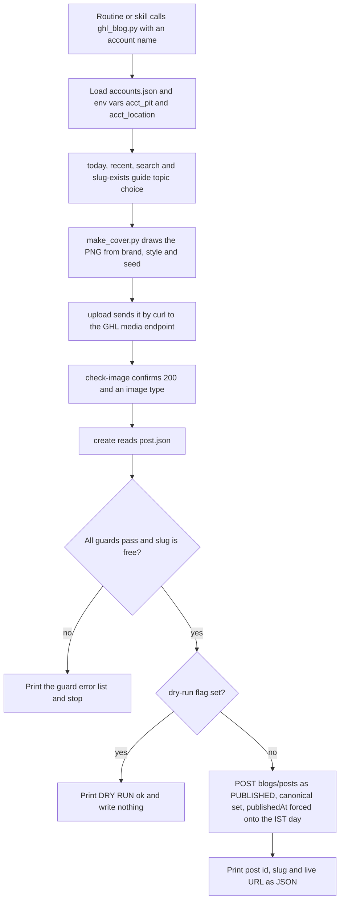

# GHL Blog API and Shared Blog Tooling (`ghl_blog.py`, `make_cover.py`)

> The shared Python helper, cover generator and GoHighLevel Blog API gotcha list that the P2T and HLGP blog routines use, so cloud runs never need the GHL MCP or a desktop.

| | |
|---|---|
| **Category** | Content, SEO and newsletters |
| **Status** | Reference, as of 9 Oct 2026 (in use by the P2T and HLGP daily blog routines and the Claude Expert engine) |
| **Type** | Python CLI helper, cover generator and API reference inside the repo `p2t-hlgp-automation` |
| **Runner and schedule** | Called by skills and routines on demand; no schedule of its own. Local smoke test: `recent`, `search`, `slug-exists`, then `create ... --dry-run` |
| **Client / owner** | P2T and HLGP (accounts `p2t` and `hlgp`); extendable to more brands |
| **Stack** | Python, Pillow, numpy, curl, GHL REST API (`https://services.leadconnectorhq.com`, header `Version: 2021-07-28`, Bearer Private Integration Token with Blogs and Medias view and write scopes) |
| **Source** | Main KB Part 2 section 7 (lines 943-987), with API facts from sections 1, 2 and 6; Portfolio KB sections 11 and 16 |

## 1. Description

### What it does
One helper (`tools/ghl_blog.py`) and one cover generator (`tools/make_cover.py`) that every blog routine reuses. The helper wraps the GHL Blog API calls a run needs (date facts, listing, searching, slug checks, image upload and verification, guarded post creation). The cover generator draws branded images offline with Pillow so no external image host is involved. The section also holds the established API facts that cost earlier runs time.

### Inputs and outputs
- **Inputs:** `accounts.json` (per account `p2t` and `hlgp`: name, site, locationId, blogId, author, `live_pages`, `dead_pages`); env vars `<account>_pit` (required) and `<account>_location` (falls back to `accounts.json`); a `post.json` for `create`; image files or cover arguments.
- **Outputs:** hosted image URLs, created posts (id, slug and live URL as JSON), guard error lists, and cover PNGs.

### Key components
| Component | Role |
|---|---|
| `tools/ghl_blog.py` | CLI: `slug-exists`, `search`, `recent`, `upload`, `check-image`, `today`, `create` |
| `tools/make_cover.py` | Cover dispatcher: `--brand p2t\|hlgp`, `--style studio\|thumb\|diagram\|circuit`, `--seed N`, `--out file.png` |
| `tools/cover_studio.py`, `cover_thumb.py`, `cover_diagram.py` | Style engines; diagram icons chosen by keyword (chat, phone, gear, browser, calendar, mail, chart, target, user, shield) |
| `tools/assets/` and `tools/photos/` | Brand logos and a bundled portrait (edges cropped to avoid baked-in badges); Poppins fonts bundled |
| `accounts.json` | Account registry and page allow/deny lists |
| `outputs_gaps.json` | Dates with no posts in the last window (one gap date for P2T, none for HLGP); filled by the 1 Oct gap check |

### Where it lives
- Repo `p2t-hlgp-automation` (`main`): the tools above, `docs/SETUP.md` (master guide), `README.md`, `routines/*.md`. Other branches: `state-client-updates` and `state-sales-report` hold memory for other routines.
- `.gitignore`: `.env`, `*.env`, `__pycache__/`, `*.pyc`, `_state_seed/`, `outputs/`, `posts/`, `work/`, `sales-dashboard/out`, `sales-dashboard/server/data`, `sales-dashboard/evidence.json`.
- Command reference: `python tools/ghl_blog.py <command> <account> [args]`.

| Command | What it does |
|---|---|
| `slug-exists <acct> <slug>` | Prints `EXISTS` or `free` |
| `search <acct> <term> [--limit N]` | Keyword probe over published posts |
| `recent <acct> [--limit N] [--offset N]` | Latest PUBLISHED posts (date, slug, title, img-ok or NO-IMAGE); limit capped at 50 |
| `upload <acct> <image.png>` | Uploads via curl, prints the RAW URL and transformed webp URL (needs host `assets.cdn.filesafe.space`) |
| `check-image <url>` | HTTP status, content type, bytes |
| `today` | IST date facts (`DATE_ISO`, `DATE_LONG`, `MONTH_YEAR`); takes no account |
| `create <acct> post.json [--dry-run]` | Runs guards, checks the slug, POSTs `/blogs/posts` as PUBLISHED, sets canonical `<site>/post/<slug>`, forces `publishedAt` onto the IST day |

Cover sizes: studio and diagram hero 1344x768, thumb 1264x1120 (GHL Central ratio), diagram section 3:2. Style arguments: `--title "..~Accent~.."`, `--subtitle`, `--category`, `--scene`; thumb adds `--hook`, `--kicker`, `--photo priya`; diagram adds `--steps`, `--nodes "Label:Sub:icon|..."`, `--hub`, `--mode hero|section`, `--label`. The generator is deterministic: an xorshift seed.

## 2. Flow chart

**Reading the chart**
1. A routine or skill calls the helper with an account name; `accounts.json` and the `<account>_pit` and `<account>_location` variables are loaded.
2. Date, listing, search and slug-exists commands support topic choice and dedupe.
3. `make_cover.py` draws the image offline, then `upload` sends it by curl (Cloudflare blocks Python's default signature) and `check-image` confirms it.
4. `create` runs the guards listed below and checks that the slug is unused.
5. On any guard failure the error list is printed and nothing is written. With `--dry-run` it stops after the guards.
6. Otherwise it POSTs the post as PUBLISHED with the canonical link and a `publishedAt` forced onto the IST calendar day, keeping the requested time slot.

## 3. Case study

### The challenge
The daily blog jobs were moving from Cowork desktop tasks to cloud routines, where the GHL MCP (a process on the owner's machine) is not reachable. The cloud runs needed a safe, repeatable way to talk to the GHL REST API and to make images, without depending on a desktop or an external image host. Past runs had also produced repeated defects (wrong link patterns, dead image hosts, double H1s, stale dates), and the GHL API had behaviours that silently failed.

### The solution
A single command-line helper that holds every blog operation, with the writing rules turned into guards inside `create`, plus a deterministic cover generator whose fonts and logos are bundled in the repo. Skills and routines call the helper rather than hand-writing API calls, so fixes made once apply to every brand.

### Design decisions and rules learned
**Guards enforced by `create`** (from the Cowork skill rules): title and slug present; no `<h1>`; `imageUrl` host in {images.leadconnectorhq.com, assets.cdn.filesafe.space}; no `<site>/blogs/<slug>` links; every internal link is `/post/...` or a known `live_pages` path; no link to any `dead_pages`; no leading HTML comment; at most 4 body images, each GHL-hosted with alt text of 8 or more characters; at most 2 affiliate links and the disclosure line if and only if an affiliate link is present; JSON-LD dates and "Updated"/"Last updated" text equal to today in IST; exactly one JSON-LD block; the slug unused.

**GHL API facts (established by testing):**
- List `GET /blogs/posts/all` needs `status=PUBLISHED` (else it returns empty) and `limit` of 50 or less; the list lacks body, version and author. A single `GET /blogs/posts/{id}?locationId=` returns them.
- Create is `POST /blogs/posts`. Edit is `PUT /blogs/posts/{id}` and needs `currentVersion` and `wordCount` to change the body (see the backlog repair file).
- `GET /blogs/posts/url-slug-exists?locationId=..&urlSlug=..` must not include `blogId` (422).
- Statuses seen: PUBLISHED, SCHEDULED, DRAFT, ARCHIVED. Changing the date of a SCHEDULED post failed; DRAFT then re-schedule worked.
- The public API cannot create authors or categories or delete posts. The agent policy forbids hard deletes, so set DRAFT or ARCHIVED instead. Posts need an existing author id and category ids.
- A categories list endpoint exists (`/blogs/categories?locationId=..&limit=..&offset=..`, used by the n8n workflow); an authors list exists too (inferred from the MCP tool `blogs_get-all-blog-authors-by-location`).
- The MCP tool `blogs_update-blog-post` is broken (no postId in its schema).
- Image upload is `POST /medias/upload-file` multipart (`file`, `name`, `hosted=false`); the JSON `url` is the image URL.
- Cloudflare returns "Error 1010" to Python's default urllib signature: send a `curl/8.4.0` User-Agent or use curl.

**Environment quirks:** PowerShell 5.1 writes a BOM into JSON (the loader reads `utf-8-sig`). The permission guard misreads `&` in `Client & Agency (Pivot)` paths (use robocopy or quoted literal paths). Cowork and Windows sandbox quirks (Plan9 mount error, NUL-padded Write files) are gone in cloud runs.

**Add a brand** (`docs/SETUP.md` section 9.2): add the brand to `BRANDS` in `make_cover.py` (accent RGB and logo), add an `accounts.json` entry, copy a new skill from `blog-p2t`, write a new routine prompt, and create a new environment.

Portfolio KB (section 11) describes the same general publishing process (validate fields, submit through the GHL API, record the response, verify, handle rate limits, avoid duplicate publication on retries). In the Main KB the duplicate guard is the slug check in `create`; no rate-limit handling is documented in the tools.

### Outcome
- Used by the P2T and HLGP daily routines (and the Claude Expert engine while it ran); the Cloudflare workaround worked in the 1 Oct and 6 Oct cloud runs.
- After the 6 Oct date-stamp problem, `create` was changed to force `publishedAt` onto the IST day and the `today` command was added.
- Limits still open: `ghl_blog.py` has no update or PUT command, so the 6 Oct re-dating and the 1 Oct drafting were done with ad-hoc scripts.
- No usage counts are recorded.

### Lessons learned
- Move rules from prompts into code guards so every brand and every run gets the same checks.
- Record API behaviours that fail silently (200 with the old body, stale version tokens, 422 on an extra parameter) next to the code.
- Keep images and fonts in the repo so the tool has no external dependency beyond GHL.

## 4. Operating notes
- **Run / pause / debug:** Local smoke test with no publish: set `<acct>_pit`, run `recent`, `search` and `slug-exists`, then `create ... --dry-run`. Health check: `python tools/ghl_blog.py recent p2t --limit 5`. Error meanings are listed in the P2T daily engine file.
- **Known issues and open items:** no update command; PowerShell BOM and path quirks when running locally; the P2T and HLGP `live_pages` and `dead_pages` lists may need updating if the 15 Sep sitemap audit results are acted on (inferred).
- **Risks:** tokens are read from environment variables only; `.env` files are git-ignored. Anyone who can use a cloud environment can read its variables.

## 5. Related
- [P2T daily blog engine](p2t-daily-blog-engine.md)
- [HLGP daily SEO blog engine](hlgp-daily-seo-blog-engine.md)
- [P2T Claude Expert topic engine](p2t-claude-expert-topic-engine.md)
- [Client blog engine, Summit Air and Solar Flex](client-blog-engine-summit-air-solar-flex.md)
- [Blog backlog repair](blog-backlog-repair.md)
- [Cloud migration, October 2026](cloud-migration-oct-2026.md)
- [PoolSafe AU blog publish scripts](poolsafe-au-blog-publish-scripts.md)
- **Sources:** Main KB Part 2 section 7 (lines 943-987); API facts also from sections 1, 2 and 6. Portfolio KB sections 11 and 16.
