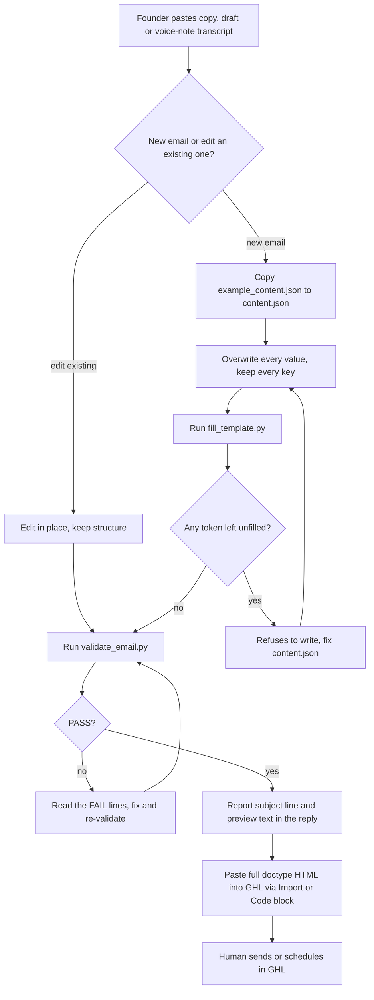

# HL Growth Brief HTML email builder

> A Claude skill that converts pasted newsletter copy into the finished, validated "HL Growth Brief" email HTML for GoHighLevel, identical section-for-section to the master template, for HL Growth Partner.

| | |
|---|---|
| **Category** | Content, SEO and newsletters |
| **Status** | On demand, as of 9 Oct 2026 |
| **Type** | Claude skill with two Python scripts (fill and validate) |
| **Runner and schedule** | Manual. Run whenever copy is ready. |
| **Client / owner** | HLGP (HL Growth Partner) |
| **Stack** | Claude skill `newsletter-hlgp`, Python 3 (`fill_template.py`, `validate_email.py`), HTML email tables, GoHighLevel email builder |
| **Source** | Main KB Part 2 section 10 (lines 1071-1104); Portfolio KB sections 18 and 27 (names only) |

## 1. Description

### What it does
Takes the founder's pasted copy, draft or voice-note transcript and drops it into a fixed email template so the result matches the gold-standard HL Growth Brief exactly. The email is locked to light mode, responsive and safe for Apple Mail, Outlook and Gmail dark-mode overrides. The wording stays the founder's; the skill does not rewrite the layout.

### Inputs and outputs
- **Inputs:** Pasted copy. A `content.json` copied from `assets/example_content.json` with 65 tokens: title, intro story paragraphs, number callout, sub copy, 3 observation cards, conclusion, 4-step framework, order explanation, offer box with 3 stats and CTA, delivery, "Also this week" and closing lines. The banner, tagline strip, signature and footer are fixed.
- **Outputs:** One validated `.html` file, written to `/mnt/user-data/outputs/` on claude.ai or to the working folder. The reply also reports the subject line and preview text, which do not go in the HTML.

### Key components
| Component | Role |
|---|---|
| `assets/example_content.json` | The 65-token content file to copy and overwrite. |
| `assets/full_template.html`, `base_shell.html` | The master template and base shell. |
| `assets/gold_standard_example.html` | The reference email to match. |
| `scripts/fill_template.py` | Fills the template, escapes entities, refuses to write if any token is unfilled. |
| `scripts/validate_email.py` | Pass or fail check on the finished HTML. |
| `references/blocks.md`, `variations.md` | How to add or remove cards and sections. |
| Merge fields | `{{contact.first_name}}` and `{{email.unsubscribe_link}}` are kept. |

### Where it lives
- Skill folder: `C:\Users\<user>\.claude\skills\newsletter-hlgp\`
- Gold-standard file (Aug 2026): `D:\Project\Client & Agency (Pivot)\HLGP & GoHighLevel\newsletter_hlgp\HL_Growth_Brief_Email.html`
- Default CTA links in the template: the audit checkout page and the booking widget link, both on the HLGP brand domains.

## 2. Flow chart

**Reading the chart**
1. The founder pastes the copy and asks for "the email", "HL Growth Brief" or "same format", or reports a dark-mode, colour or mobile problem.
2. For a brand-new email, `content.json` is copied from the example and every value is overwritten while every key is kept. For an existing email, edit in place, then validate.
3. `fill_template.py` builds the HTML and refuses to write if a token is unfilled.
4. `validate_email.py` must PASS. It checks the viewport meta, light-only colour scheme, the Apple, Outlook (`[data-ogsc]`) and Gmail (`u+.body`) dark-mode overrides, the 640px container, the mobile breakpoint, the unsubscribe merge field, the Outlook fallback and the palette.
5. The reply states the subject line and preview text.
6. The HTML is pasted into the GHL email builder through Import or a Code block with the full `<!doctype html>`. A rich-text block strips the `<style>` tag that holds the dark-mode and mobile rules, so it is never used.
7. Sending is a manual step in GHL; the source documents no send automation.

## 3. Case study

### The challenge
The HLGP newsletter needs one email that looks identical every week with only the copy changing, and it has to render correctly in Apple Mail, Outlook and Gmail in both light and dark mode, and on mobile. The skill's trigger list includes reports of dark-mode, colour or mobile problems in an HLGP email, and its first rule is to never hand-write the HTML. The source does not describe a specific earlier failure for HLGP.

### The solution
A "same-to-same" builder: a gold-standard template with 65 named tokens, a fill script that escapes content and refuses to write unfilled tokens, and a validator that fails the build if any of the dark-mode, mobile or palette safeguards are missing. Claude never hand-writes the HTML; it fills the tokens and runs the checks.

### Design decisions and rules learned
- Same-to-same: never hand-write HTML or "improve" the layout.
- The four dark-mode override groups must never be deleted or tidied.
- Every text element needs an explicit `color:`. A colour mismatch means missing explicit colours or missing dark-mode overrides.
- Tables only: no flex, grid, lists or web fonts. Both inline styles and classes are used.
- Only the approved palette: navy #07152f, teal #0d8f86, bright teal #38d5c6, blue #2f7bd8, yellow #f5c400 and the others in the template.
- Adding a card means duplicating the existing `<tr>` verbatim with the next border colour in rotation (teal, blue, yellow). Removing a section means deleting the whole `<tr>`. Never invent content.
- Paste through Import or a Code block, never a rich-text block.

### Outcome
No measured outcome recorded. What exists: the skill, its two scripts and the gold-standard `HL_Growth_Brief_Email.html` dated Aug 2026. The portfolio KB confirms only that `newsletter-hlgp` is one of the reported skills (portfolio KB).

### Lessons learned
- The skill's design choice is to lock the template and validate mechanically instead of relying on judgement to preserve the layout.
- The email-client quirks (Apple, Outlook and Gmail dark-mode selectors) are encoded in the validator, so they are checked on every build.
- The subject line and preview text are reported in the reply rather than placed in the HTML, as the skill specifies.

## 4. Operating notes
- **Run / pause / debug:** Re-run fill then validate. If validate fails, read the FAIL lines. A colour mismatch points to missing explicit colours or missing dark-mode overrides.
- **Known issues and open items:** No send automation exists; sending is manual in the GHL email builder. Skill copies have drifted (main KB Part 8 explains which is current).
- **Risks:** Hand-editing the HTML outside the scripts can remove the dark-mode groups. Pasting into a rich-text block silently drops the style rules.

## 5. Related
- [HLGP weekly newsletter drafter](hlgp-weekly-newsletter-drafter.md) produces the Markdown that is pasted into this builder.
- [P2T weekly newsletter builder](p2t-weekly-newsletter-builder.md) is the same pattern for Pivot 2 Thrive.
- [Skill `newsletter-hlgp`, listed in the skills overview](../08-claude-skills/00-skills-overview.md)
- **Sources:** Main KB Part 2 section 10; Portfolio KB sections 18 and 27.
