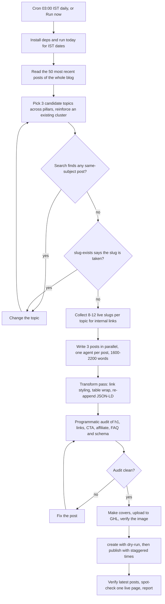

# HLGP Daily SEO Blog Engine (3 posts/day, hlgrowthpartner.com)

> A cloud routine that writes, audits and publishes three keyword-cluster SEO blog posts a day to the HL Growth Partner blog, for GoHighLevel agency owners.

| | |
|---|---|
| **Category** | Content, SEO and newsletters |
| **Status** | Live, as of 9 Oct 2026 (live since 1-2 Oct; replaced the Cowork task `hlgp-daily-seo-flux`) |
| **Type** | Claude Code cloud routine plus repo skill and Python tools |
| **Runner and schedule** | Cloud routine `hlgp-daily-blog` at claude.ai/code/routines, model Opus, `CRON_TZ=Asia/Calcutta 0 3 * * *` (03:00 IST daily; the next-run display shows 03:04 because of start jitter) |
| **Client / owner** | HLGP (HL Growth Partner), own site hlgrowthpartner.com |
| **Stack** | GHL REST API (Blogs and Medias scopes), `tools/ghl_blog.py`, `tools/make_cover.py` (Pillow, numpy), curl, Python transform and audit scripts, GitHub repo `p2t-hlgp-automation` |
| **Source** | Main KB Part 2 section 3 (lines 778-821); Part 2 section 2 for shared rules; Portfolio KB section 16 |

## 1. Description

### What it does
Each day the routine picks three new topics from across the HLGP content pillars, writes three long posts in parallel, runs a styling pass and a programmatic audit, creates covers, uploads them to GHL, and publishes with staggered times. The audience is GoHighLevel agency owners (operators), written in Australian English with real GHL terminology. The blog had about 481 posts on 1 Oct 2026, so avoiding duplicates against the whole blog is the hard part, and every new post is meant to reinforce an existing keyword cluster rather than stand alone.

### Inputs and outputs
- **Inputs:** `routines/blog-hlgp.md` and `.claude/skills/blog-hlgp/SKILL.md`; env vars `hlgp_pit` and `hlgp_location`; the live blog; the skill's list of already-covered topics (comparisons with ClickFunnels, Mailchimp, Salesforce, Kajabi, Keap, HubSpot and ActiveCampaign; calendars; Xero and QuickBooks; forms vs surveys; lead scoring; custom values; SaaS pricing and rebilling; onboarding; industry snapshots; missed call text-back; voice AI; conversation AI; email deliverability; A2P; reputation; WhatsApp; Stripe; pipelines; webinar funnels and more).
- **Outputs:** 3 PUBLISHED posts per run. The report gives title, slug, live URL `https://hlgrowthpartner.com/post/{slug}`, word count, categories, GHL-hosted cover confirmation and the blog's total post count.

### Key components
| Component | Role |
|---|---|
| Routine `hlgp-daily-blog` | Schedule, model, repo, environment `blog-hlgp` |
| Skill `blog-hlgp` and `routines/blog-hlgp.md` | Writing rules; the routine prompt overrides the skill |
| `tools/ghl_blog.py` and `tools/make_cover.py` | Safe GHL operations and covers, brand `hlgp` (accent cyan) |
| Transform and audit scripts | Style links, wrap tables, re-append JSON-LD, then check structure |
| Environment `blog-hlgp` | Variables `hlgp_pit`, `hlgp_location`; network allowlist |

### Where it lives
- Repo `D:\Project\Client & Agency (Pivot)\Blogs\p2t-hlgp-automation` (GitHub `p2t-hlgp-automation`): `routines/blog-hlgp.md`, `.claude/skills/blog-hlgp/SKILL.md`.
- Legacy: `cowork-tasks/hlgp-daily-seo-flux.md` (includes the browser-canvas cover generator `MAKECOVER`) and the older skill copy `C:\Users\<user>\.claude\skills\hlgp-daily-blog-post\`.
- GHL categories (1-2 per post): Go High Level, GHL Workflows & AI, GHL Agency Systems, GHL SaaS Mode, GHL Automation, GHL Funnels & CRM. Ids are in `accounts.json` and the KB.
- Booking CTA is the HLGP booking widget link and is always the primary conversion. Alt text pattern: "{Title} - HL Growth Partner, Dr Priya Jaganathan".
- Live pages: `/blogs`, `/home`. Dead pages: `/affiliate-disclosure`, `/speaker`.

## 2. Flow chart

**Reading the chart**
1. The routine starts at 03:00 IST (or by Run now; the words DRY RUN make it do everything except publish) and gets IST dates from `today`.
2. The 50 most recent posts are read, then 3 new topics are proposed across the pillars (AI, Workflows and Automation, SaaS, Comparisons, Snapshots and industries, Integrations, Funnels and CRM) with an Evergreen, Authority and Update mix.
3. Every candidate is searched against the whole blog. Zero results means free; any same-subject hit means a change of topic. Then `slug-exists` is checked.
4. For each topic, 8-12 live slugs are collected for internal links.
5. Three posts are written in parallel, one agent each. Structure: byline with read time (words divided by 230), affiliate disclosure if an affiliate link is present, intro with the keyword in the first 30 words, Quick Facts box when hard facts exist, H2 and H3 sections with a table when comparative, one pull-quote, common mistakes (5-6), booking CTA, FAQ (6-8), grouped Related Articles. The routine prompt overrides the skill: no On This Page box, no key-takeaway box, no social posting, and 4-5 contextual internal links per post.
6. A Python transform pass styles links (teal underline, booking link as a button), wraps tables in a scroll div and re-appends the JSON-LD. No `<h1>` is injected.
7. The audit checks zero h1, hrefs resolve, exactly one booking CTA, at most 2 affiliate links each with `rel="sponsored noopener"`, disclosure if and only if affiliate, FAQ count equals the FAQPage schema count, schema parses with exactly one Article, BreadcrumbList and FAQPage, no internal link without `/post/`, and no placeholders.
8. Covers use a mix of types (at most one with the portrait), are uploaded and verified; `create hlgp post.json --dry-run` runs the guards and then the post is published with `publishedAt` staggered at 02:00, 05:30 and 08:00 UTC.
9. The latest published posts are checked for a GHL-hosted image, today's date and staggered times; one live page is spot-checked for exactly one H1 and a canonical tag; titles, URLs and total count are reported.

## 3. Case study

### The challenge
HLGP needed daily authority content aimed at agency owners, but the blog was already large (400+ posts when the skill was written, about 481 by 1 Oct), so repeating a topic was the main risk. Older posts also carried problems that the engine must not repeat: about 158 dead catbox covers, about 144 slow iili.io covers, wrong internal links (about 12 per post before 9 Sep) and double H1s. The previous runner was a Cowork desktop task that depended on the owner's PC and, after the 6 Oct change, on cloud execution that cannot reach the local GHL MCP.

### The solution
A cloud routine with a skill that makes dedupe the first step (search for every candidate against the whole blog, not only recent posts), a parallel writing step (one agent per post), a deterministic transform and audit step, and the shared `ghl_blog.py` guards at publish time. The routine prompt carries HLGP-specific overrides. Because the blog is the ledger, no state is kept between runs.

### Design decisions and rules learned
- Everything in the P2T engine's rules applies: GHL-only images, `/post/{slug}` URLs, no h1, canonical link, verified statistics, the IST date rule, and the DRY RUN switch.
- Bare `hlgrowthpartner.com/{slug}`, `/blog/{slug}` and `/blogs/{slug}` all redirect to `/home`; about 12 internal links per HLGP post were wrong before 9 Sep.
- Legacy sandbox rules (heredoc-only scripts, 45 seconds per command, NUL-padded Write files, `ast.parse` checks) do not apply in the cloud routine, and the old FLUX/gradio/pollinations cover pipeline is gone.
- HLGP writers could not open `help.gohighlevel.com` and `ideas.gohighlevel.com` in the cloud; adding them to the `blog-hlgp` allowlist would improve sourcing.
- Reinforce an existing keyword cluster instead of isolated one-offs, and aim for 4-5 contextual internal links plus a grouped Related Articles block.
- Portfolio KB (section 16) lists the "HLGP daily SEO flux" and the HLGP daily routine as separate hub components; the Main KB shows the flux is the legacy Cowork name that the cloud routine replaced.

### Outcome
- Live since 1-2 Oct 2026; about 481 posts on the blog on 1 Oct.
- On 1 Oct the first manual run published without DRY RUN and, because the repo was not yet attached, fell back to the old synced skill; the 3 extra HLGP posts were set to DRAFT.
- On 6 Oct, 12 HLGP posts were re-dated (24 in total across both blogs, originals saved for undo).
- Read-only findings on 1 Oct: 20 old HLGP posts have no publish date, 29 Sep had 1 post and 30 Sep had 5. These are not yet repaired (not found).
- No traffic, ranking or lead results are recorded.

### Lessons learned
- With a large archive, dedupe must be run for every candidate against the whole blog, not only the latest posts.
- Put audit rules in code (zero h1, link patterns, one CTA, schema counts) so the model cannot skip them.
- A fixed prompt override (what to leave out, how many links) is easier to keep consistent than letting the skill and prompt drift.

## 4. Operating notes
- **Run / pause / debug:** Same as the P2T engine. Quick check: `python tools/ghl_blog.py recent hlgp --limit 5`. Test with Run now and the words DRY RUN. Pause with the routine's on/off switch. Change behaviour in the repo skill or prompt on `main`.
- **Known issues and open items:** the stale `docs/SETUP.md` time table (10:07 / 10:17 IST) disagrees with the live 03:00 IST schedule. 20 undated HLGP posts and the 29/30 Sep imbalance remain. Whether the old Cowork trigger is paused is not directly confirmed.
- **Risks:** Posts publish without human review. Statistics may rest on search snippets if sources stay blocked by the allowlist. No failure alerting exists for the cloud routines.

## 5. Related
- [P2T daily blog engine](p2t-daily-blog-engine.md)
- [P2T Claude Expert topic engine](p2t-claude-expert-topic-engine.md)
- [Blog engine watchdog](blog-engine-watchdog.md)
- [Blog backlog repair](blog-backlog-repair.md)
- [GHL Blog API and shared blog tooling](ghl-blog-api-and-shared-blog-tooling.md)
- [Cloud migration, October 2026](cloud-migration-oct-2026.md)
- **Sources:** Main KB Part 2 section 3 (lines 778-821), section 2 (lines 722-777) for shared rules, section 6 for the earlier damage; Portfolio KB section 16 (names the routine only, plus a generic operating pattern).
