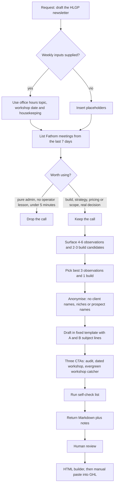

# HLGP weekly newsletter drafter

> A Claude skill that turns the last 7 days of Fathom calls into a CTA-driven weekly newsletter draft for GoHighLevel agency owners, for HL Growth Partner.

| | |
|---|---|
| **Category** | Content, SEO and newsletters |
| **Status** | On demand, as of 9 Oct 2026 |
| **Type** | Claude skill (manual), reading the Fathom MCP |
| **Runner and schedule** | Manual, on request. Monday newsletter cadence. No send automation found (not found). |
| **Client / owner** | HLGP (HL Growth Partner) |
| **Stack** | Claude skill `hlgp-weekly-newsletter`, Fathom MCP (`list_meetings`), Markdown output |
| **Source** | Main KB Part 2 section 9 (lines 1033-1070); Portfolio KB section 18 (generic newsletter process) |

## 1. Description

### What it does
Reads the last 7 days of recorded Fathom calls, selects the ones that carry a real operator lesson, and drafts the weekly HLGP newsletter in a fixed template. The audience is GoHighLevel agency owners who already operate (not beginners). The newsletter exists to sell the audit, fill the workshop, capture replies and build authority from real operator content.

### Inputs and outputs
- **Inputs:** Fathom meetings from the last 7 days, including summaries and action items. Three weekly inputs that only the owners know: the Tuesday office-hours topic, the workshop date and countdown (for example "4 DAYS TO GO"), and optional housekeeping news. Placeholders are used if any are missing.
- **Outputs:** A Markdown newsletter draft for review (body 500-650 words), plus notes: anonymisation flags, unpicked candidates and the word count. The next stage is the HTML builder, then a manual paste into GoHighLevel.

### Key components
| Component | Role |
|---|---|
| Skill `hlgp-weekly-newsletter` | Holds the process, rules and fixed structure. Also synced from claude.ai. |
| `references/newsletter-template.md` | The fixed newsletter structure. |
| `references/voice-guide.md` | The voice rules (no corporate words, no em-dashes). |
| Fathom MCP, `list_meetings` | Source of the past 7 days of calls, summaries and action items. |
| Standing CTAs | Audit page `https://hlgrowthpartner.com/audit`, workshop page `https://hlgrowthpartner.com/ghlworkshop`. Whether these pages are live is (not found). |

### Where it lives
`C:\Users\<user>\.claude\skills\hlgp-weekly-newsletter\` (`SKILL.md`, `references\newsletter-template.md`, `references\voice-guide.md`). A copy also syncs from claude.ai; the main KB points to Part 8 for which skill copy is current.

## 2. Flow chart

**Reading the chart**
1. The owner asks for "the HLGP newsletter" and supplies the three weekly inputs. If any is missing, placeholders go in.
2. The skill lists Fathom meetings from the past 7 days.
3. Calls are filtered: client build calls, strategy or partnership talks, sales calls with pricing or scope, and internal huddles with a real decision are kept; pure admin, onboarding with no operator lesson and calls under 5 minutes are dropped.
4. It surfaces 4-6 observation candidates and 2-3 build candidates, then picks the best 3 observations (50-80 words each, bold lead sentence, tension plus one lesson) and 1 build (trigger, outcome, what it replaces, time taken).
5. Everything is anonymised. Dollar amounts, timelines and mechanics stay.
6. The draft follows the fixed template: A and B subject lines under 50 characters with preheaders, greeting and one-paragraph opening, 3 observations, The Build (which hands off to the audit CTA), CTA 1 (Free GHL + AI Stack Audit), CTA 2 (dated workshop with countdown), a week-specific reply prompt, sign-off "Talk soon, Priya", CTA 3 (evergreen workshop catcher), and housekeeping (Tuesday office hours at 10am AEST plus topic, max 2 bullets).
7. A self-check list runs, and the skill returns the Markdown with notes.
8. A person reviews. The HTML build and the paste into GHL are separate manual steps (see the HL Growth Brief builder).

## 3. Case study

### The challenge
The HLGP newsletter needs fresh, credible operator content every week, and the best material is already sitting in recorded calls. The constraints are strict: client and prospect identities must never leak, the newsletter must keep one fixed structure with three CTAs, and the voice must stay free of corporate filler.

### The solution
A Claude skill that mines the week's Fathom calls, filters them by usefulness, picks three observations and one build, anonymises them and writes the draft into a fixed template. The owners add only what the calls cannot supply: the office-hours topic, the workshop date and any housekeeping news.

### Design decisions and rules learned
- No names is the firmest rule: no client names, niches or prospect names. Dollar amounts, timelines and mechanics are kept because they are the useful part.
- No em-dashes. No corporate words (leverage, synergy, robust, seamless, unlock, journey, ecosystem, optimise).
- Three CTAs every issue and the structure never changes.
- No P.S., no visible section labels, no curated link lists, no generic AI-trend commentary.
- The audit is currently free. If it becomes paid, change the copy and add scarcity.
- The Markdown draft is a stage, not a finished email: it feeds the HTML builder.

### Outcome
No measured outcome recorded. The documented result is the skill itself and its fixed template. No issue counts, send dates or open rates appear in the source.

### Lessons learned
- Filtering calls by whether they hold a real operator lesson keeps the content useful and keeps client-specific noise out.
- Returning notes (anonymisation flags, unpicked candidates) alongside the draft gives the reviewer something to check instead of re-reading every call.
- (portfolio KB) The portfolio KB lists the HLGP newsletter only as a reported workflow with a generic process (collect source, extract key points, draft, add calls to action, format, review for accuracy and sensitive content, record the final version and distribution status). It says the approval gates and email platform should be confirmed from implementation files. The main KB confirms the manual review and GHL paste, but documents no tracking of final version or distribution status.

## 4. Operating notes
- **Run / pause / debug:** Ask Claude for "the HLGP newsletter" and supply the three weekly inputs. Re-run with a different candidate selection to get another version. Nothing to pause; there is no scheduler.
- **Known issues and open items:** No send automation exists (not found). Whether `hlgrowthpartner.com/audit` and `/ghlworkshop` exist is (not found); the HLGP `accounts.json` only lists `/blogs` and `/home`. The skill also lives in a claude.ai-synced copy, and the skill copies have drifted (main KB Part 8).
- **Risks:** Anonymisation depends on the skill's rule and a human check. The Fathom calls are client material, so the review step matters.

## 5. Related
- [HL Growth Brief HTML email builder](hl-growth-brief-email-builder.md) is the next stage (Markdown to finished HTML).
- **Sources:** Main KB Part 2 section 9 and the map in section 0; Part 2 section 20 (newsletter sending is manual); Portfolio KB section 18.
