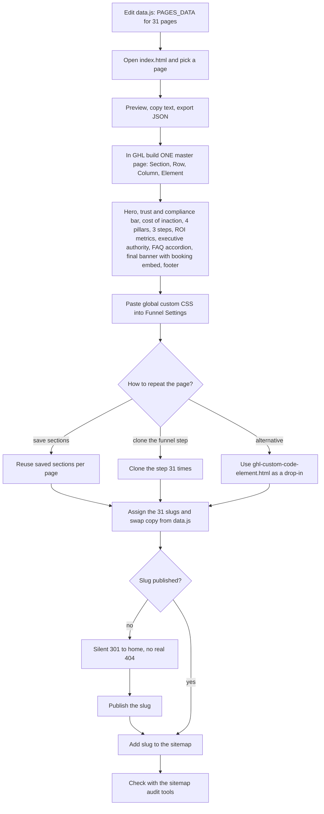

# 31-page AI and industry landing-page blueprint

> A content dictionary, static previewer and GoHighLevel build guide for 31 programmatic SEO landing pages (14 AI function pages, an industries hub and 16 industry pages) for Pivot 2 Thrive.

| | |
|---|---|
| **Category** | Content, SEO and newsletters |
| **Status** | Designed, not built, as of 9 Oct 2026 (the static preview and guide exist; the 31 pages in GHL are not confirmed) |
| **Type** | Static HTML/JS preview tool plus a GHL drag-and-drop build guide |
| **Runner and schedule** | Manual. Preview and guide built 16 Sep to 8 Oct 2026. |
| **Client / owner** | P2T (Pivot 2 Thrive) |
| **Stack** | HTML, CSS and JavaScript (`data.js`, `app.js`), GoHighLevel funnel and website builder, custom CSS |
| **Source** | Main KB Part 2 section 17 (lines 1317-1350); Portfolio KB: no matching entry found |

## 1. Description

### What it does
Defines the content and layout for 31 programmatic landing pages for Pivot 2 Thrive: 14 functional-AI pages (`/ai/product-service`, `/ai/lead-generation`, `/ai/sales`, up to `/ai/governance`), an industry directory hub (`/industries`) and 16 industry pages (`/accountants`, `/industries/legal`, `/industries/trades`, `/industries/healthcare`, up to `/industries/commercial-services`). A static preview lets the team pick any page and copy its text; a guide explains how to build one master page in GHL and clone it 31 times.

### Inputs and outputs
- **Inputs:** `data.js` with a `PAGES_DATA` content dictionary for all 31 pages (headline, subhead, pain points, 4 pillars, 3 steps, metrics, FAQs); `index.html`, `styles.css` and `app.js`; brand assets.
- **Outputs:** A browser preview with copy tools and JSON export, a drag-and-drop builder guide, a global custom CSS snippet, and (once built) 31 pages with an Australian privacy note in the footer.

### Key components
| Component | Role |
|---|---|
| `data.js` (`PAGES_DATA`) | The content for every page, keyed by page. |
| `index.html`, `styles.css`, `app.js` | The previewer: dropdown switcher, `?page=<key>` URL parameter, copy tools and JSON export. |
| `GHL_DRAG_AND_DROP_BUILDER_GUIDE.md` | Step-by-step guide for building the master page in GHL. |
| `ghl-custom-code-element.html` | A self-contained alternative drop-in for the GHL custom code element. |
| Global custom CSS snippet | Navy #0F213C, orange #F44A12 with a hover state, button and card elevation, FAQ accordion styling. Pasted into Funnel Settings, Custom CSS. |

### Where it lives
`D:\Project\Client & Agency (Pivot)\Pivot2Thrive & Content\Insdustry page\` (the folder name is spelled "Insdustry").

## 2. Flow chart

This is the designed build flow. The static preview exists; whether the 31 GHL pages were built and published is not confirmed in the source.

**Reading the chart**
1. Page content lives in `data.js`. Opening `index.html` lets the team pick a page from the dropdown (or by `?page=<key>`), copy its text and export JSON.
2. In GHL, one master page is built with drag and drop (Section, Row, Column, Element) and the standard sequence: hero, trust and compliance bar, "cost of inaction", 4-pillar solution, 3-step roadmap, ROI metrics, executive authority (the founder), FAQ accordion, final conversion banner with a booking embed, and footer.
3. The global custom CSS snippet carries the brand colours and component styling.
4. The master is repeated by saving sections or cloning the funnel step 31 times, then each of the 31 slugs is assigned and the copy swapped from `data.js`. `ghl-custom-code-element.html` is a self-contained alternative.
5. Because GHL has no real 404, any slug that is not published silently 301s to `/home`. Published slugs are then added to the sitemap and checked with the sitemap audit tools.

## 3. Case study

### The challenge
Pivot 2 Thrive needed programmatic landing pages for AI functions and for industries, 31 in all, in the GoHighLevel builder. The rule "build once, clone 31 times" shows the aim was not to lay out each page by hand. The pages also had to avoid a trap specific to GHL: unpublished slugs redirect to the homepage without any visible error.

### The solution
Separate the content from the layout. A single dictionary (`data.js`) holds the copy for every page, a static previewer lets the team review and copy any page, and a builder guide describes one master layout to build once and clone. A global CSS snippet keeps the brand consistent across all pages.

### Design decisions and rules learned
- Build once, clone 31 times.
- Keep content in one data file so copy can be edited, previewed and re-pasted without touching the layout.
- GHL has no real 404, so any slug that is not published silently 301s to `/home`. Add new slugs to the sitemap and check them with the sitemap tools.
- The pages carry an Australian privacy note in the footer.
- The brand palette is navy #0F213C and orange #F44A12.

### Outcome
No measured outcome recorded. What exists: a static preview and guide built 16 Sep to 8 Oct 2026 (the register records "built 8 Oct 2026"). Whether the 31 pages are live in GHL is (not found).

### Lessons learned
- The preview and data file are reusable even if the GHL build is delayed: editing `data.js`, previewing and re-pasting copy is the documented update path.
- Because unpublished slugs redirect quietly, a post-build sitemap check is part of the plan, not an afterthought.
## 4. Operating notes
- **Run / pause / debug:** Edit `data.js`, preview in `index.html`, then re-paste copy into the GHL pages.
- **Known issues and open items:** GHL build status is (not found). A candidate rebuilt P2T site was rated in Sep 2026 and its page set must match the sitemap decisions (main KB Part 2 section 19).
- **Risks:** Publishing 31 pages without adding them to the sitemap, or leaving any unpublished, leaves redirects to `/home`.

## 5. Related
- [P2T sitemap live/non-live audit and URL-usage finder](p2t-sitemap-audit-and-url-finder.md): used to check the new slugs.
- **Sources:** Main KB Part 2 section 17, section 0 (register), section 19 (related website-rating session).
