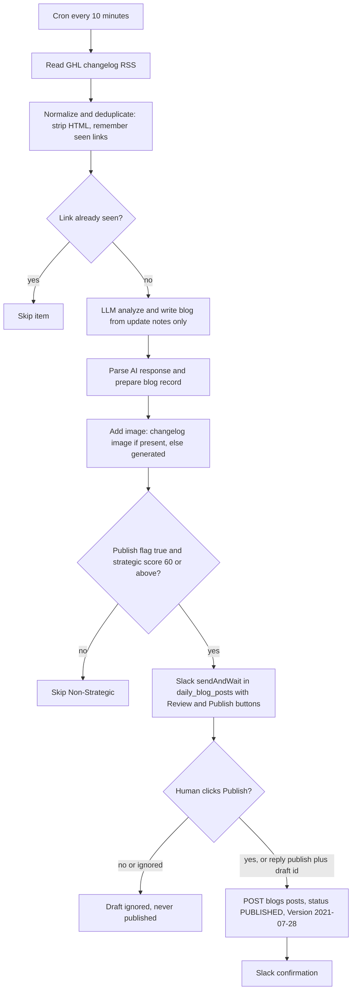
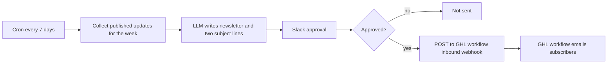

# n8n: GHL changelog to blog, and weekly newsletter (Slack approval)

> An older n8n automation that watches the GoHighLevel changelog RSS, has an LLM draft a blog post for small marketing agencies, asks the team in Slack to approve, then publishes to the HLGP blog, with a second flow for a weekly newsletter.

| | |
|---|---|
| **Category** | Content, SEO and newsletters |
| **Status** | Legacy or retired, as of 9 Oct 2026 (older export; running state not found; likely superseded for blog output, inferred) |
| **Type** | n8n workflows (two flows, JSON exports) with Slack human approval |
| **Runner and schedule** | n8n. Daily-blog flow: cron every 10 minutes per the JSON, flagged `active: true` in the export. Newsletter flow: every 7 days, `active: false`. Whether the n8n instance still runs is (not found). |
| **Client / owner** | HLGP (HL Growth Partner) |
| **Stack** | n8n, RSS, Groq or Gemini LLM, Slack (sendAndWait buttons), GHL Blogs API, a GHL workflow inbound webhook |
| **Source** | Main KB Part 2 section 13 (lines 1174-1207); Portfolio KB section 6 (RSS to AI to GHL blog); Portfolio KB section 18 |

## 1. Description

### What it does
Reads the GoHighLevel changelog RSS feed, deduplicates items, and asks an LLM to judge whether each update is strategically useful to small marketing agencies. If it is, the LLM writes a blog post; the team approves it in Slack with Review and Publish buttons; and only then is it published to the HLGP blog through the GHL Blogs API. A second flow summarises the week's published updates as a newsletter, with two subject lines and a Slack approval, and posts it to a GHL workflow webhook that emails subscribers.

### Inputs and outputs
- **Inputs:** `https://ideas.gohighlevel.com/api/changelog/feed.rss`; GHL blog categories fetched from `/blogs/categories?locationId=<HLGP location>`. Credentials live in n8n: the GHL OAuth2 credential `highLevelOAuth2Api`, Slack OAuth and a Groq or Gemini key (names only).
- **Outputs:** Blog posts after approval (500-800 words per the guide) and a weekly newsletter email. Unapproved drafts are simply ignored.

### Key components
| Component | Role |
|---|---|
| `ghl-daily-blog-weekly-newsletter.json` | Workflow "GHL Changelog Daily Blog Approval", 10-minute cron, flag `active: true` in the export. |
| `ghl-weekly-newsletter.json` and `workflow.json` | Workflow "GHL Weekly Newsletter Approval", every 7 days, `active: false`. |
| Code nodes and `.tmp\*.js` | Relevance gate, strategic intelligence, quality gate and formatter code. |
| `scripts\update-workflow-categories.js` | Script for the workflow's blog categories (purpose inferred from the file name). |
| Slack webhooks | Two n8n webhook endpoints receive the blog-action and subject-line button actions. |
| Template placeholders | `REPLACE_WITH_GEMINI_API_KEY`, `REPLACE_WITH_BLOG_PUBLISH_ENDPOINT`, `REPLACE_WITH_NEWSLETTER_ENDPOINT`, `REPLACE_WITH_SLACK_BOT_TOKEN`, `REPLACE_WITH_PRIVATE_CHANNEL_ID`. |
| Approval channel | Slack channel `daily_blog_posts`. |

### Where it lives
`D:\Project\Client & Agency (Pivot)\Other Projects\newsletter\` containing `GHL_Blog_Automation_Guide.md`, `workflows\README.md`, `workflows\GHL_Blog_Newsletter_Workflow_Guide.md`, `workflows\*.json`, `workflow.json`, and `_exec313_data.txt` (an n8n execution dump). The export is dated 4 May 2026.

## 2. Flow chart

Daily blog flow (the JSON values are used):

Weekly newsletter flow (flagged inactive):

**Reading the chart**
1. Every 10 minutes the daily flow reads the changelog RSS. The README and guide text say every 15 minutes; the exported JSON says 10 (see the discrepancy table below).
2. "Normalize and Deduplicate" strips HTML and entities and remembers seen links in workflow static data.
3. "Analyze and Write Blog" calls the LLM with strict rules: use only the update notes, no verbatim copy, no invented capabilities, pick 1-3 of 6 blog categories. It returns a publish flag, a `strategic_score`, title, meta, content, focus keyword and hashtags.
4. The record is prepared and an image is attached: the changelog image if present, otherwise a generated one.
5. A gate passes only items with the publish flag true and a score of 60 or above; everything else goes to "Skip Non-Strategic".
6. Slack `sendAndWait` posts the draft with Review and Publish buttons (or the team replies `publish <draft id>`). Nothing goes live until a person clicks Publish.
7. Publish Blog calls the GHL Blogs API (`POST /blogs/posts`, status PUBLISHED, Version 2021-07-28), then Slack confirms.
8. The weekly flow collects the week's updates, has the LLM write the newsletter with two subject lines, asks for Slack approval and posts to a GHL workflow webhook that sends the email.

## 3. Case study

### The challenge
HLGP writes for small marketing agencies that use GoHighLevel, and the GHL changelog is a steady source of topics, but only some updates matter strategically (the 60-point score gate exists to keep boring updates out). The posts are machine-drafted, so a human approval step was built in before anything is published. GHL also has no built-in way to create a blog post from a workflow.

### The solution
An n8n pipeline that does the filtering and drafting automatically but keeps a human at the publish step. The LLM scores each update and only strategic ones (60 or above) reach Slack. A person approves in Slack, and only then does an external call publish the post. A second flow turns the week's published updates into a newsletter, again behind a Slack approval.

### Design decisions and rules learned
- GHL has NO native workflow action to create a blog post, and an inbound webhook cannot create one either. That is why an external system (n8n, later cloud routines) calls `POST /blogs/posts`. The only native option is a workflow that triggers when a post is published, for example to email a list.
- Slack-approval pattern: nothing goes live until a human clicks Publish; unapproved drafts are simply ignored.
- The 60-point strategic score gate keeps boring updates out.
- The LLM prompt forbids verbatim copying and invented capabilities.
- The location ID is set inside the workflow JSON, and `blogId` must be replaced with the real blog ID in the Publish node.
- The Automation Guide prints the HLGP location ID with one character wrong. Trust the JSON and the ID table in main KB Part 2 section 0.
- (portfolio KB) The portfolio KB describes the same pattern generically: read RSS, extract title, URL, date and content, deduplicate by URL, GUID or hash, draft with an LLM, send to a human approval channel, publish only after explicit approval, and never publish rejected or ignored content. It also lists recommended safeguards that the main KB does not confirm for this workflow: treat RSS content as untrusted source material, avoid copying articles wholesale, keep an idempotency key per feed item, record source, draft, decision, status and destination URL, retry transient failures without duplicating posts, and verify publication through the GHL API or the resulting blog URL.

### Discrepancy between the documents and the export
The main KB prefers the exported JSON because it is the real artefact; the docs are stale (inferred).

| Item | README and guide text | Exported JSON |
|---|---|---|
| Daily flow cadence | Every 15 minutes | Every 10 minutes |
| LLM | Gemini (template placeholder `REPLACE_WITH_GEMINI_API_KEY`) | A Groq chat model |
| Newsletter timing | Friday 5 PM | Every 7 days, no weekday recorded in the KB |
| HLGP location ID | Printed with a typo in the guide | Correct value in the JSON |

### Outcome
No measured outcome recorded. Documented facts: the export is dated 4 May 2026; the daily flow is flagged `active: true` and the newsletter flow `active: false`; the running state of the n8n instance is (not found). The portfolio KB marks the RSS to AI to GHL blog workstream as "user-confirmed completed at the workstream level" (portfolio KB), which does not say it is still running. The main KB treats the blog output as likely superseded by the cloud blog engines (inferred).

### Lessons learned
- Put the human approval at the publish step, not the draft step, so the automation can generate freely while nothing reaches the public blog without a click.
- A numeric quality gate (score 60 or above) is a cheap way to filter low-value input before spending reviewer attention.
- Keep the docs in step with the exported JSON; here the guide's cadence, LLM and schedule drifted from what the workflow actually does.
- Check the generated IDs against the JSON rather than the prose guide.

## 4. Operating notes
- **Run / pause / debug:** Import the JSON into n8n, set credentials and the placeholder values, then activate. To pause, deactivate the workflow. Debug through n8n executions (`_exec313_data.txt` is an execution dump) and the Slack channel.
- **Known issues and open items:** Whether the n8n instance still runs is (not found). The docs and JSON disagree on cadence, LLM and weekday. The Publish node needs the real `blogId`. Template files still carry `REPLACE_WITH_...` placeholders.
- **Risks:** If the instance is still running with the daily flow active, it would also compete with the cloud blog engines on the HLGP blog (inferred). Credentials sit in n8n and in any copy of the template with real values filled; keep them out of the project folder.

## 5. Related
- [HLGP daily SEO blog engine](hlgp-daily-seo-blog-engine.md) is the current blog engine for the same site.
- [P2T daily blog engine](p2t-daily-blog-engine.md) is its Pivot 2 Thrive counterpart.
- [GHL blog API and shared blog tooling](ghl-blog-api-and-shared-blog-tooling.md) holds the API gotchas for `POST /blogs/posts`.
- [Cloud migration, Oct 2026](cloud-migration-oct-2026.md) explains why the work moved off local and n8n runners.
- **Sources:** Main KB Part 2 section 13, section 0 (register and IDs) and section 20 (document versus JSON discrepancy); Portfolio KB section 6 and section 18.
