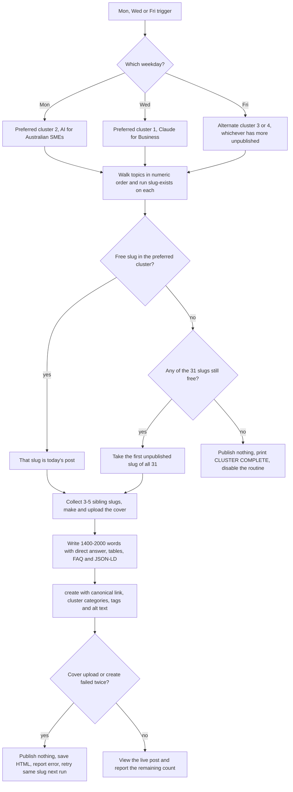

# P2T Claude Expert / AI Expert Australia Topic Engine (31 topics)

> A fixed 31-topic, four-cluster publishing engine, one post per run, built to make Pivot 2 Thrive the cited "Claude expert" entity in Australia; all 31 posts were live by 30 Sep 2026.

| | |
|---|---|
| **Category** | Content, SEO and newsletters |
| **Status** | Legacy or retired, as of 9 Oct 2026 (finished: all 31 topics live by 30 Sep 2026; no cloud routine was created; the skill is kept as a template) |
| **Type** | Repo skill `blog-p2t-expert` with a routine prompt template; original runner was a Cowork scheduled task |
| **Runner and schedule** | Nothing is scheduled. The legacy Cowork task `p2t-claude-expert-topic-engine` ran Mon/Wed/Fri and was designed to delete itself. A cloud version would end with an instruction to disable the routine |
| **Client / owner** | P2T (Pivot 2 Thrive), pivot2thrive.com.au |
| **Stack** | GHL REST API via `tools/ghl_blog.py`, `tools/make_cover.py`, web search for Claude product facts and statistics |
| **Source** | Main KB Part 2 section 4 (lines 822-864); Part 2 section 0 map; Portfolio KB section 16 |

## 1. Description

### What it does
Each run publishes exactly one post from a fixed list of 31 topics. The weekday decides which of four clusters to draw from; topics are taken in numeric order and the first slug that does not yet exist on the blog is that day's post. The blog itself is the progress ledger: a slug that exists is done. When all 31 exist the run publishes nothing and prints CLUSTER COMPLETE. Each cluster has a pillar and an offer, and posts are structured so AI search engines can cite them.

### Inputs and outputs
- **Inputs:** the 31-row topic list in the skill (number, slug, title, keyword); the live blog; sibling slugs for internal links; web search for Claude product facts (pricing, plans, features) and statistics.
- **Outputs:** one published post per run with a report (topic number and title, slug, live URL, cluster, word count, statistic sources, cover confirmation, remaining count). If the cover upload or `create` fails twice, nothing is published, the HTML is saved and the exact error is reported; the same slug is retried next run, which is why slugs act as the ledger.

### Key components
| Component | Role |
|---|---|
| Skill `blog-p2t-expert` | The 31-row topic list, cluster rules, post structure |
| `routines/blog-p2t-expert.md` | Routine prompt kept as a template for any future fixed cluster |
| `tools/ghl_blog.py`, `tools/make_cover.py` | Slug checks, cover upload and guarded `create` (shared tooling) |
| Four clusters | 1 Claude for Business (10 posts), 2 AI for Australian SMEs (10), 3 Start an AI Agency (7), 4 AI Keynote Speaker (4) |
| Legacy Cowork task | `p2t-claude-expert-topic-engine`, Mon/Wed/Fri |

### Where it lives
- Repo `D:\Project\Client & Agency (Pivot)\Blogs\p2t-hlgp-automation`: `.claude/skills/blog-p2t-expert/SKILL.md`, `routines/blog-p2t-expert.md`, `cowork-tasks/p2t-claude-expert-topic-engine.md`.
- Origin material under `...\Pivot2Thrive & Content\Seo_blogs\`: the topic engine `blog-topic-engine-claude-ai-expert.md`, the `cowork-instruction-aeo-blog-pipeline.md`, and `Batch1/2/3 ... .docx` drafts. A duplicate topic engine sits in `...\Pivot2Thrive & Content\blog\`.
- Memory notes: four files in `C:\Users\<user>\.claude\projects\D--Project-Pivot-Seo-blogs\memory\`.
- Template guidance: `docs/SETUP.md` section 9.1 (copy the skill, replace the 31-row list, copy the routine prompt).

## 2. Flow chart

This chart shows the engine as it was designed and run (Mon/Wed/Fri). It is finished, so it no longer runs.

**Reading the chart**
1. The weekday maps to a cluster: Monday is Cluster 2, Wednesday is Cluster 1, Friday alternates between Clusters 3 and 4 (whichever has more unpublished posts).
2. Topics are walked in numeric order and `slug-exists` is called on each until the first free slug.
3. If the preferred cluster is complete, the run falls back to the first unpublished slug of all 31. If all 31 exist, nothing is published and CLUSTER COMPLETE is printed with a request to disable the routine (a routine cannot delete itself).
4. Three to five nearby existing slugs are collected as sibling links, and Opus does all substantive work (sub-agents on Opus if the session model is smaller).
5. The cover is made and uploaded, then 1,400-2,000 words are written: direct answer within the first 40 words, primary keyword in the first 30, question-format H2s, at least one table or numbered list (tables mandatory for comparisons and pricing), the entity string once verbatim ("Dr Priya Jaganathan, Claude AI expert and AI keynote speaker based in Brisbane, Australia") with a credentials paragraph, a "Last updated" line, mid-article booking CTA, an Australian example, 3-5 common mistakes, an FAQ of 5 H3 Q&As, a closing CTA and Related Articles.
6. JSON-LD is Article plus FAQPage with all 5 Q&As (plus Speakable for Cluster 4). The meta description is 140-160 characters starting with the keyword. The title may include "(2026 ...)" but the slug stays fixed.
7. `create` sets the canonical link, categories per cluster, tags and alt text "primary keyword - Pivot 2 Thrive". After publishing the live post is viewed.
8. Two failures in a row mean nothing is published; the slug is retried next run.

## 3. Case study

### The challenge
The goal was to own the "Claude expert" entity in Australia and feed AI-search citations across four clusters, each with a pillar and an offer. The reasoning recorded in the original spec: AI answers appear on about half of searches; "Claude plus use case" keywords are lower competition than "ChatGPT plus use case"; and structured, enumerated, direct-answer content is the kind that gets cited. The topic set had to publish in a controlled order over weeks without a database, and without publishing the same topic twice.

### The solution
A fixed topic list in a skill and a weekday-to-cluster rule, with the live blog serving as the ledger (no state file). Slug existence decides what is next, and a fixed slug means a failed run is simply retried the next day it runs. The engine reuses the shared blog tooling for covers, uploads and guarded creation.

### Design decisions and rules learned
- The original AEO spec asked for H1 equal to the target query and a pillar link to `/claude-expert-australia`. In production there is no H1 in the body and that pillar page never existed, so the engine links `/blogs` for Clusters 1 and 2. Cluster 3 links the site home plus the booking CTA; Cluster 4 links `/speaker`.
- The three Batch .docx drafts averaged only about 800 words per post (target 1,200-1,800) and the tracker file showed no topics DONE (checked 15 Jul). The engine wrote fresh, longer posts rather than publishing those drafts (inferred).
- Claude product facts (pricing, plans, features) must be verified by web search, never from memory. No "Anthropic partner" claims without approved wording. No competitor bashing.
- Do not copy example statistics from the task file; they are illustrative and unsourced.
- Categories by cluster: Cluster 1 AI & Automation; Cluster 2 AI & Automation, plus Business Strategy for topics 14, 15 and 18; Cluster 3 GHL Agency Systems and Business Strategy; Cluster 4 Business Strategy.
- A quarterly refresh mode existed in the original spec: "run refresh" takes the 10 oldest posts, re-verifies every stat and price, updates dates and Claude product references, and outputs a changelog table. It is not automated.
- Portfolio KB (section 16) names the "P2T Claude-expert topic engine" and the P2T-expert daily routine only as hub components; it adds no schedule or safeguard facts.

### Outcome
- All 31 slugs were live by 30 Sep 2026; topic 10, `claude-code-for-non-developers`, was the last.
- Progress note in the Cowork task file: 13 of 31 live on 16 Sep. The source does not say how the remaining 18 posts were published between 16 and 30 Sep (a Mon/Wed/Fri schedule alone would give far fewer), so the pace is unexplained.
- No cloud routine was created; `docs/SETUP.md` keeps the skill and routine prompt as a template for any future fixed cluster.
- No traffic, citation or lead results are recorded.

### Lessons learned
- A finite series can use the destination (the blog) as its progress ledger, provided slugs are fixed and the title can change.
- Specs written before production (H1 rules, pillar pages) must be reconciled with what the live site supports.
- A routine cannot disable itself, so a finishing message that asks the owner to switch it off is needed.
- Draft documents that fall short of the word target should be rewritten, not published as-is.

## 4. Operating notes
- **Run / pause / debug:** Nothing is scheduled. To reuse the pattern for a new fixed cluster, copy the skill, replace the 31-row list and copy the routine prompt (`docs/SETUP.md` section 9.1). Debug steps are the same as the P2T daily engine.
- **Known issues and open items:** The Main KB register at the top (line 105) and the skills summary table (line 4523) still list a cloud routine `blog-p2t-expert` as live. Part 2 section 4 states no cloud routine was created. Part 2 is the more detailed record, so this file follows it; confirm in the routines list.
- **Risks:** None currently active since the series is complete. If a routine is ever created from the template, it must be disabled once all 31 exist.

## 5. Related
- [P2T daily blog engine](p2t-daily-blog-engine.md)
- [HLGP daily SEO blog engine](hlgp-daily-seo-blog-engine.md)
- [GHL Blog API and shared blog tooling](ghl-blog-api-and-shared-blog-tooling.md)
- [Cloud migration, October 2026](cloud-migration-oct-2026.md)
- **Sources:** Main KB Part 2 section 4 (lines 822-864); Main KB lines 95-119 and 4518-4545 (register entries that conflict with Part 2); Portfolio KB section 16. Origin session: "Knowledge update" (15 Jul 2026), which read all files, extracted docx text, wrote memory notes and then committed.
