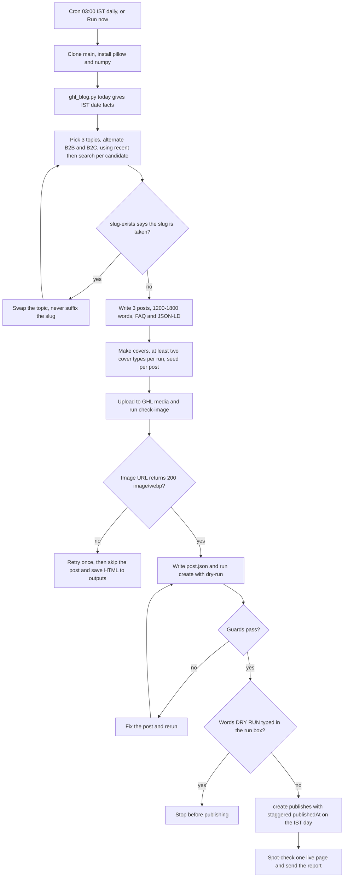

# P2T Daily Blog Engine (3 posts/day, pivot2thrive.com.au)

> A cloud routine that writes, illustrates and publishes three SEO and AEO blog posts a day to the Pivot 2 Thrive GoHighLevel blog.

| | |
|---|---|
| **Category** | Content, SEO and newsletters |
| **Status** | Live, as of 9 Oct 2026 (live since 1-2 Oct; replaced the Cowork task `pivot2thrive-daily-blog-dark`) |
| **Type** | Claude Code cloud routine plus repo skill and Python tools |
| **Runner and schedule** | Cloud routine `p2t-daily-blog` at claude.ai/code/routines, model Opus, `CRON_TZ=Asia/Calcutta 0 3 * * *` (03:00 IST daily; HLGP follows at 03:04) |
| **Client / owner** | P2T (Pivot 2 Thrive), own site pivot2thrive.com.au |
| **Stack** | GHL REST API (Blogs and Medias scopes), `tools/ghl_blog.py`, `tools/make_cover.py` (Pillow, numpy), curl, web search for statistics, GitHub repo `p2t-hlgp-automation` |
| **Source** | Main KB Part 2 section 2 (lines 722-777); Part 2 section 0 map; Portfolio KB section 16 |

## 1. Description

### What it does
Each day the routine clones the repo, reads today's IST date facts, picks three new topics (alternating B2B and B2C), writes each as a 1,200-1,800 word post with a fixed structure and JSON-LD, generates a unique cover image per post, uploads it to GHL, and publishes through a guarded `create` command. The content targets Pivot 2 Thrive's themes: AI agency how-to for Australia, speed to lead, AI receptionists and voice agents, AI lead generation, AI consulting, GoHighLevel, AI for Australian industries and cities, tool comparisons, FAQ posts and thought leadership. The blog had about 411 posts on 1 Oct 2026. The author persona is Dr Priya Jaganathan (GoHighLevel Certified Admin, Certified AI Tech Stack Consultant, keynote speaker).

### Inputs and outputs
- **Inputs:** repo skill `.claude/skills/blog-p2t/SKILL.md` and prompt `routines/blog-p2t.md`; env vars `p2t_pit` and `p2t_location`; the live blog (used as the dedupe ledger); `accounts.json` (live and dead pages); web search for verifiable statistics.
- **Outputs:** 3 PUBLISHED posts per run, each with a unique GHL-hosted cover, a canonical link and one JSON-LD block. The report lists title, slug, live URL, primary keyword, category, word count, statistic sources, confirmation the cover is GHL-hosted, and any skipped posts with saved filenames and exact errors. Failed posts are saved under `outputs/` (git-ignored) with a metadata comment block.

### Key components
| Component | Role |
|---|---|
| Routine `p2t-daily-blog` | Schedule, model (Opus), repo, environment `blog-p2t`; connectors removed |
| Skill `blog-p2t` and `routines/blog-p2t.md` | Writing rules, post structure, theme list, cover table, run steps |
| `tools/ghl_blog.py` | `today`, `recent`, `search`, `slug-exists`, `upload`, `check-image`, `create` (guards); see the shared tooling file |
| `tools/make_cover.py` | Cover styles `diagram`, `thumb`, `studio`; seed = day-of-year x 10 + post index |
| `accounts.json` | Site, ids, author, `live_pages` and `dead_pages` per account |
| Environment `blog-p2t` | Variables `p2t_pit`, `p2t_location`; network allowlist; setup script `pip install -q pillow numpy` |

### Where it lives
- Repo `D:\Project\Client & Agency (Pivot)\Blogs\p2t-hlgp-automation` (GitHub `p2t-hlgp-automation`, private): `routines/blog-p2t.md`, `.claude/skills/blog-p2t/SKILL.md`, `docs/SETUP.md`, `tools/*`, `accounts.json`.
- Legacy: `cowork-tasks/pivot2thrive-daily-blog-dark.md` and the older Cowork skill copy `C:\Users\<user>\.claude\skills\p2t-daily-blog-post\`.
- Cloud allowlist (Custom): `services.leadconnectorhq.com`, `assets.cdn.filesafe.space`, `images.leadconnectorhq.com`, `pivot2thrive.com.au`, `hlgrowthpartner.com`, plus the default package list.
- GHL names (ids are in `accounts.json`): categories AI & Automation, Marketing Automation, GHL Workflows & AI, GHL Agency Systems, Business Strategy, CRM. Three to five tags per post from a fixed list (ai agency, ai automation, ai consulting, lead generation, speed to lead, ai receptionist, ai voice agent, gohighlevel, ai agency australia, business automation, ai chatbot, crm automation, marketing automation, ai for small business). The booking CTA is a P2T booking widget link; the HighLevel affiliate link carries `rel="sponsored noopener"`.

## 2. Flow chart

**Reading the chart**
1. The routine fires at 03:00 IST (21:30 UTC the previous day) or by hand with Run now.
2. It clones `main` fresh and installs Pillow and numpy; the environment setup script already does this.
3. `today` supplies the only dates the run may use: `DATE_ISO` for JSON-LD, `DATE_LONG` for "Updated" bylines, `MONTH_YEAR` for "Last updated".
4. Three topics are chosen from the 50 most recent posts and a keyword search per candidate.
5. A taken slug usually means a duplicate topic, so the topic is swapped; the slug is never suffixed.
6. Posts follow the fixed structure (key takeaway box, on-this-page box, authority paragraph, definition, framework, Australian example, common mistakes, 5-7 FAQ, related articles, JSON-LD Article plus FAQPage). Optionally one sub-agent writes each post while publishing stays in the main thread.
7. Covers mix at least two types per run; the portrait is used at most once per run and by default not at all.
8. Upload prints `IMAGE_URL=` and `check-image` must return 200 with an image/webp type; at least one cover is viewed per run.
9. `create --dry-run` runs the guards; failures are fixed and rerun. The words DRY RUN in the run box stop the run here.
10. A live `create` forces `publishedAt` onto the IST calendar day (slots about 01:10, 02:40 and 04:10 UTC) and refuses stale dates.
11. One live page is checked for a single H1 (from the theme) and a canonical tag, then the report is sent.

## 3. Case study

### The challenge
P2T needed a steady stream of programmatic SEO and AEO content, three posts a day, that stays on-brand, is not duplicated against an already large blog, carries verified statistics, and has working internal links and hosted images. Earlier runs on the Cowork desktop depended on the owner's PC. The 6 Oct change to Cowork tasks pushed the job to the cloud, where the GHL MCP is not reachable.

### The solution
A cloud routine that uses only the GHL REST API with environment-variable tokens. A repo skill holds the voice, structure and rules; a Python helper (`ghl_blog.py`) does the safe operations and enforces guards; a cover generator produces three styles of hosted image. The blog itself is the ledger, so no state is stored between runs. The cutover from the old Cowork task is described in the cloud migration file.

### Design decisions and rules learned
- **Live URL pattern** is `https://pivot2thrive.com.au/post/{slug}`. `/blogs/{slug}` redirects to `/home`. Pages verified on 9 Sep: `/blogs`, `/powerpivot-leads-pro`, `/ai-receptionist-agent`, `/speaker`, `/home`, `/post/{slug}`. Dead pages (redirect to `/home`): `/claude-expert-australia`, `/ai-consulting`, `/about`, `/services`, `/affiliate-disclosure` (the disclosure sentence is rendered without a link). The 15 Sep sitemap audit suggests some marketing pages may be unpublished soon; if so, `accounts.json` and the skill lists need updating (inferred).
- **GHL-hosted images only.** Never catbox, iili.io, freeimage or imgur. History: about 158 HLGP and 36 P2T posts had dead catbox covers, and about 144 HLGP covers on iili.io took 21-23 seconds. Never publish without an image and never reuse one.
- **No `<h1>` in the body** (the theme renders the title; earlier posts had double H1s). Canonical link always set (the `create` tool does it). The body must start with the first real content tag.
- **Statistics:** verify each with a web search in that run and cite source and year, or state the point qualitatively. Never carry numbers over from a prompt or old post. The cloud environment blocked some sources for P2T (abs.gov.au, ato.gov.au, oaic.gov.au, acma.gov.au); without allowlisting them, facts come from search snippets only.
- **Voice:** direct, Australian spelling, proof over promises. Banned phrases include "in today's rapidly evolving landscape", "let's dive in", "game-changer", "unlock" and "leverage". At most 2 affiliate anchors per post, never in the intro or FAQ; the disclosure line appears if and only if an affiliate link is present.
- **Date rule:** the 03:00 IST run is 21:30 UTC the previous day, so the sandbox clock shows yesterday. On 6 Oct posts were found stamped one day early. The fix: `create` forces `publishedAt` onto the IST day, refuses stale JSON-LD and "Updated" dates, and a `today` command was added. 24 existing posts (12 per blog) were re-dated on 6 Oct with the originals saved for undo.
- **DRY RUN switch:** Run now without it publishes live.
- **Scratch files:** early cloud runs committed scratch files to auto-created branches (`claude/quirky-maxwell-*`, `claude/upbeat-knuth-*`). Fixed with `.gitignore` entries (`outputs/`, `posts/`, `work/`) and a "never git add or commit from a run" rule; the stray branches can be deleted on GitHub.
- **Connectors:** a routine was once found on the wrong environment and with all 12 connectors enabled. Both had to be fixed in the routine editor UI because API edits were ignored. Remove all connectors from blog routines so they cannot act on Gmail or Slack.

### Outcome
- Live since 1-2 Oct 2026 on the cloud routine; about 411 posts on the blog on 1 Oct.
- The first manual runs on 1 Oct published 3 posts per blog without DRY RUN. For HLGP the run first fell back to the old synced skill because the repo was not yet attached; the 3 extra HLGP posts were set to DRAFT (the agent cannot hard-delete), and 6 extra posts from later runs were moved onto empty past dates after approval.
- On 6 Oct, 24 posts (12 per blog) were re-dated. The Cloudflare workaround (custom User-Agent for API calls, curl for uploads) worked in the 1 Oct and 6 Oct cloud runs.
- No traffic, ranking or lead results are recorded.

### Lessons learned
- A green run status only means the session started; read the transcript (slug checks return `free`, upload prints `IMAGE_URL=`, `create --dry-run` prints `DRY RUN ok`).
- Make the tool, not the prompt, enforce the rules: guards in `create` caught stale dates, bad links, double schema and image hosts.
- The date of a cloud run can be the previous day in UTC; force the target calendar day in code.
- A test run is a real run unless the prompt has a dry-run switch and it is used.

## 4. Operating notes
- **Run / pause / debug:** Test with the routine's Run now and type DRY RUN. Health check anywhere with the repo and env vars: `python tools/ghl_blog.py recent p2t --limit 5`. Behaviour is edited in the repo skill or prompt on `main` (each run clones fresh); schedule, model and environment are edited in the routine's Edit menu; pause with the on/off switch. Debug table from `docs/SETUP.md` section 10: `403 host_not_allowed` means a domain is missing from the allowlist; `environment variable p2t_pit is not set` means a missing or misspelled variable; 401/403 from GHL means a revoked or wrongly scoped token (needs Blogs and Medias view and write); `upload returned non-JSON` or "Error 1010" is Cloudflare (tools already use curl, retry once then skip); `guard failed: ...` means fix the post and rerun `create`; a routine that did not start points to an expired GitHub connection, plan limit or a paused routine.
- **Known issues and open items:** `docs/SETUP.md` section 5 still says "Daily 10:07 IST" and 10:17 for HLGP; that table is stale and should be fixed. A transcript check on 6 Oct found no posts from the old Cowork triggers since 1 Oct, so they look switched off, but this is not directly confirmed. There is no failure alerting for the cloud routines (the watchdog was not ported).
- **Risks:** Posts are published without human review. Anyone who can use the environment can read its variables, so environments stay personal. Security and credential-hygiene findings for this project are tracked privately and are not published here.

## 5. Related
- [HLGP daily SEO blog engine](hlgp-daily-seo-blog-engine.md)
- [P2T Claude Expert topic engine](p2t-claude-expert-topic-engine.md)
- [Blog engine watchdog](blog-engine-watchdog.md)
- [Blog backlog repair](blog-backlog-repair.md)
- [GHL Blog API and shared blog tooling](ghl-blog-api-and-shared-blog-tooling.md)
- [Cloud migration, October 2026](cloud-migration-oct-2026.md)
- [P2T sitemap audit and URL finder](p2t-sitemap-audit-and-url-finder.md)
- **Sources:** Main KB Part 2 section 2 (lines 722-777); Part 2 section 0 (lines 614-649); Main KB register (lines 95-119) for the cloud runner. Portfolio KB section 16 lists the P2T daily blog routine (and the "P2T dark daily blog" under its old name) among the hub components and gives only a generic recommended operating pattern; it adds no schedule or safeguard facts. Naming note: the routine is `p2t-daily-blog`, its skill is `blog-p2t`, and other register lines in the Main KB call the routine `blog-p2t`.
