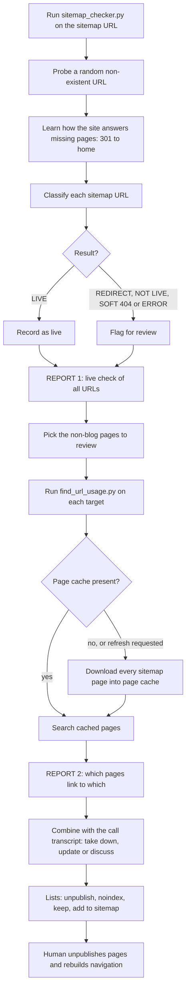

# P2T sitemap live/non-live audit and URL-usage finder

> Two Python scripts that classify every URL in the pivot2thrive.com.au sitemap as live or dead and find every place a given page is linked, so pages can be unpublished safely.

| | |
|---|---|
| **Category** | Content, SEO and newsletters |
| **Status** | On demand, as of 9 Oct 2026 (run on 15 Sep 2026, re-runnable) |
| **Type** | Python CLI scripts (`sitemap_checker.py`, `find_url_usage.py`) |
| **Runner and schedule** | Manual, local. First run for the 15 Sep 2026 page-review call. |
| **Client / owner** | P2T (Pivot 2 Thrive) |
| **Stack** | Python 3.12, `requests`, Fathom MCP or share link for the call transcript |
| **Source** | Main KB Part 2 section 15 (lines 1242-1282); section 19 (context); Portfolio KB: no matching entry found |

## 1. Description

### What it does
The Pivot 2 Thrive site is built on GoHighLevel, which never returns a real 404: a missing page is answered with a 301 to `/home`. The first script reads the sitemap and works out which URLs are really live. The second downloads every sitemap page and reports every place a given URL is linked or referenced. Together with the transcript of a page-review call, they produce clear lists of what to take down, update, keep or add.

### Inputs and outputs
- **Inputs:** The sitemap URL (default `https://pivot2thrive.com.au/sitemap.xml`; nested and `.gz` sitemaps are supported) and a Fathom share link of the 15 Sep 2026 page-review call with a team member.
- **Outputs:** `REPORT 1 - sitemap live check (all 416 urls).csv`, `REPORT 2 - which pages link to which (53 site pages).csv`, `MEETING - ... transcript.txt`, `url_usage_*.csv` and `README.txt`.

### Key components
| Component | Role |
|---|---|
| `sitemap_checker.py` | Options `[sitemap_url] --workers 20 --timeout 15 --out results.csv`. Probes a random non-existent URL first to learn how the site treats missing pages, then classifies each sitemap URL as LIVE, REDIRECT, NOT LIVE, SOFT 404 or ERROR using title and canonical fingerprints. |
| `find_url_usage.py` | Options `<url-or-path> [...] [--exclude /post/ /blogs] [--refresh] [--sitemap URL] [--out file.csv]`. Downloads every sitemap page, caches it in `.page_cache/` (about 66 MB, safe to delete), then reports each appearance of the target. |
| What it detects | `<a href>` with anchor text, data-href and onclick, form action, iframe src, canonical, meta refresh, JS redirects, mentions in script or page JSON, and pages that HTTP-redirect to the target. |
| Fathom transcript | The page-review call, used to decide take down, update or discuss. |

### Where it lives
`D:\Project\Client & Agency (Pivot)\Pivot2Thrive & Content\Seo pages\`. The work came from the session "Website live/non-live page audit" (15 Sep 2026).

## 2. Flow chart

**Reading the chart**
1. `sitemap_checker.py` fetches the sitemap and first probes a random page that cannot exist, to learn that this site answers with a 301 to `/home`.
2. Each sitemap URL is classified LIVE, REDIRECT, NOT LIVE, SOFT 404 or ERROR using title and canonical fingerprints. On 15 Sep the result was 416 URLs, 415 live, 1 dead (`/sitemap` redirecting to `/home`); 354 blog posts, 52 top-level pages, 8 `/blogs/...` pages and 2 `/bni/...` pages.
3. `find_url_usage.py` was run on the 53 non-blog pages. It uses the cached copies of every sitemap page unless `--refresh` is passed.
4. The two reports are combined with the call transcript to sort every page into take down, update, keep or add.
5. A person then unpublishes pages and rebuilds navigation; the scripts do not change the site.

## 3. Case study

### The challenge
The GHL site never returns a real 404, so a deleted or unpublished page silently redirects to `/home`, and a normal "does it return 200" check cannot tell a live page from a dead one. Before unpublishing pages after the 15 Sep 2026 page-review call, the team needed to know which pages are live and where each candidate is linked (especially from the header and footer navigation), so removing a page would not leave broken links.

### The solution
Two scripts. The checker learns the site's missing-page behaviour first and classifies each sitemap URL against it. The finder crawls every sitemap page once (cached) and reports every reference to a target URL, including in attributes and scripts. The outputs were combined with the call transcript to produce the decisions below.

### Design decisions and rules learned (findings, 15 Sep)
- **Unpublish and remove from sitemap (agreed):** `/aiwebinars` (linked from header and footer nav on 13 pages, so remove the nav item first), `/automations-9437`, `/webinar-4234`, `/home-6976` (duplicate homepage) and `/sitemap` (dead).
- **Unpublish once the founder confirms:** the PowerPivot Leads Pro page variant `/powerpivot-leads-pro-390121` and its four plan and checkout pages; `/automationbootcamp` (nav on 12 pages) with its Dubai variants and the shared `/checkout`; `/dpm` (nav on 13 pages); `/onlinemasterclass` and its thank-you page; `/webinar`; `/levelup25`. Three of the four header and footer nav items are on the take-down list, so the nav must be rebuilt first.
- **Keep the page but remove from sitemap (noindex):** about 13 thank-you and success pages, 5 checkout and plan-step pages, and two other utility pages.
- **Keep in sitemap:** `/contact`, `/events`, `/ai-receptionist-agent`, `/bni`, `/bni-oasis`, `/saas` (orphaned), `/demo` (orphaned), `/demo-calendar`, `/strategyconsultation`, `/marketing`, `/links`, `/ghl-audit-and-debrief-220587` and `/terms-conditions-privacy-policy` (the footer should link it).
- **Add to sitemap:** the homepage (missing entirely; only `/home-6976` was present), the AI Agency in a Box page, a future AI Advisory page, a 4th-offer page and the `/podcast` blog. The homepage Services section should add AI Agency in a Box and BNI.
- **Link to the blog engine (inferred):** the blog skills hard-code the list of existing pages. When a page is unpublished, update `accounts.json` `live_pages` and the skill text, or posts will link to pages that 301 to `/home`.

### Outcome
Documented facts: scripts run on 15 Sep 2026; 416 sitemap URLs checked, 415 live and 1 dead; link-usage reports produced for the 53 non-blog pages; decision lists drawn up from the call transcript (the first unpublish list is marked agreed, the second waits for the founder's confirmation). Whether the pages were actually unpublished afterwards is not documented in the source.

### Lessons learned
- On a site that never returns 404, probe first to learn how missing pages look, then classify against that fingerprint.
- Check where a page is linked (nav, footer, buttons) before unpublishing it; three of the four nav items were on the take-down list.
- Keep the blog engine's list of live pages in step with the sitemap decisions (see the cross-link below).
- (portfolio KB) No matching portfolio KB entry was found for this project.

## 4. Operating notes
- **Run / pause / debug:** `python sitemap_checker.py`, then `python find_url_usage.py /path` before unpublishing any page. Pass `--refresh` after the site changes. The `.page_cache/` folder (about 66 MB) is safe to delete.
- **Known issues and open items:** The follow-through (which pages were actually unpublished, and whether `accounts.json` `live_pages` was updated) is not documented. A candidate rebuilt P2T site (about 35 static pages, rated 18-22 Sep 2026) must match these sitemap decisions (main KB Part 2 section 19).
- **Risks:** Unpublishing a page that is still in navigation sends visitors to `/home`. Blog posts that link to removed pages will redirect to `/home` too.

## 5. Related
- [31-page AI and industry landing-page blueprint](landing-page-blueprint-31-pages.md): any new slug must be added to the sitemap and checked with these tools.
- [P2T daily blog engine](p2t-daily-blog-engine.md): hard-codes the list of live pages.
- The seo-os and website-audit skills are the heavier SEO frameworks; these scripts are the lightweight GHL-specific version (main KB Part 2 section 16).
- **Sources:** Main KB Part 2 section 15, section 16 (relation to the SEO skills) and section 19 (related website-rating session).
