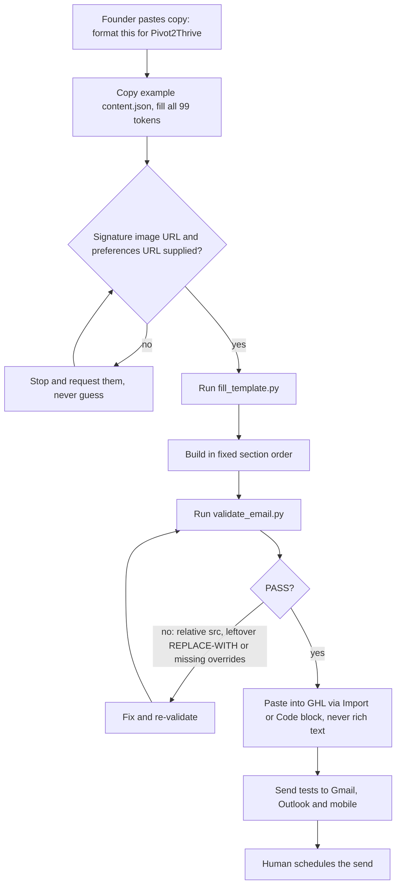
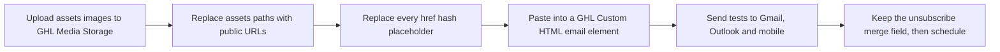

# P2T weekly newsletter HTML builder

> A Claude skill and example package that turn pasted copy into the navy and orange Pivot 2 Thrive weekly newsletter HTML, validated and ready to paste into GoHighLevel.

| | |
|---|---|
| **Category** | Content, SEO and newsletters |
| **Status** | On demand, as of 9 Oct 2026 |
| **Type** | Claude skill with Python fill and validate scripts, plus a GHL newsletter package folder |
| **Runner and schedule** | Manual. The example issue was set to send Monday 3 Aug 2026, 9am AEST. |
| **Client / owner** | P2T (Pivot 2 Thrive) |
| **Stack** | Claude skill `newsletter-p2t`, Python 3 (`fill_template.py`, `validate_email.py`), HTML email tables, GoHighLevel Media Storage and email builder |
| **Source** | Main KB Part 2 section 11 (lines 1105-1138); Portfolio KB sections 18 and 27 (names only) |

## 1. Description

### What it does
Does for Pivot 2 Thrive what the HL Growth Brief builder does for HLGP. It takes the founder's pasted copy and fills a fixed template: a story-first body, a Pro Tip, an offer block with a promo code, a signature, events, awards and grants cards, and a podcast pick. The output is light-mode locked HTML with dark-mode overrides, ready to paste into GoHighLevel.

### Inputs and outputs
- **Inputs:** Pasted copy and a `content.json` with 99 tokens (head and send notes, banner, body paragraphs and emphasis lines, pro tip, offer block, closing, signature, headings, 4 event cards, award, grant, podcast, footer). Two values must be supplied, not guessed: `SIGNATURE_IMAGE_URL` (an absolute GHL Media URL, because the master used a relative path that breaks in email) and `PREFERENCES_URL` (default `{{unsubscribe_link}}`).
- **Outputs:** Validated HTML. The 3 Aug 2026 issue (`newsletter-2026-08-03-FINAL.html` and `.md`) shows the editorial pattern, summarised without personal data: A and B subject lines (drama versus offer) with matching preheaders, a story-first body, a Pro Tip, a time-limited offer with a promo code and landing-page link, and a resources block labelled "TEAM TO SUPPLY" (events, awards and grants listings) below the fold. Its send checklist says to confirm figures, "No standing CTA this week", and "Wednesday: resend to unopened using subject line B".

### Key components
| Component | Role |
|---|---|
| Skill `newsletter-p2t` | Process and rules. Use `newsletter-hlgp` for HLGP emails instead. |
| `assets/full_template.html`, `fixed_reference.html`, `original_uploaded.html` | The master template, the fixed reference and the original uploaded file. |
| `scripts/fill_template.py`, `validate_email.py` | Fill and validate, as in the HL Growth Brief builder. The validator also fails on a relative `src` or a leftover `REPLACE-WITH` URL. |
| `references/variations.md` | How to add or remove cards and sections. |
| `ghl_newsletter_package` | Example package: `newsletter-2026-08-03-FINAL.html/.md`, `pivot2thrive_ghl_newsletter.html` (original), `README.txt`, `assets\` (header and banner images at 1280, 1800 and 2880 widths, event images, `signature.jpg`). |
| Merge fields | `{{contact.first_name}}`, `{{right_now.year}}`, `{{location.email}}`, `{{unsubscribe_link}}`. |
| Palette | Navy #102344, orange #ff6400, cream #fff7f0 and others. |

### Where it lives
- Skill folder: `C:\Users\<user>\.claude\skills\newsletter-p2t\`
- Package: `D:\Project\Client & Agency (Pivot)\HLGP & GoHighLevel\ghl_newsletter_package\`

## 2. Flow chart

Skill route (fill, validate, paste):

Manual package route (from the package `README.txt`):

**Reading the chart**
1. The trigger is "Format this for Pivot2Thrive", "put this in the P2T template" or "same format", or a colour, dark-mode or mobile problem in a P2T email.
2. `content.json` is copied from the example and all 99 tokens are filled. The signature image URL and preferences URL must come from the user.
3. `fill_template.py` builds the HTML. The section order never changes: send-checklist comment, header banner, navy tagline strip, main body, Pro Tip (cream box, orange pill), offer block (navy panel, promo code box, CTA button), post-CTA story and sign-off, signature band, UPCOMING EVENTS 2x2 cards, AWARDS TO APPLY, BUSINESS GRANTS, PODCAST PICK OF THE WEEK, navy footer.
4. `validate_email.py` must pass before pasting.
5. The paste uses Import or a Code block. Tests go to Gmail, Outlook and mobile before the send is scheduled by a person.
6. The manual package route does the same job by hand: upload images, swap paths, replace every `href="#"`, paste, test, keep the unsubscribe merge field.

## 3. Case study

### The challenge
Pivot 2 Thrive sends a weekly newsletter with many blocks (story, offer, events, awards, grants, podcast). The original `pivot2thrive_ghl_newsletter.html` had no dark-mode handling, which caused the colour mismatch. It also used a relative signature image path, which breaks inside an email.

### The solution
A copy of the HL Growth Brief pattern for P2T: a 99-token template, a fill script, a validator that rejects relative image paths and leftover placeholder URLs, and four dark-mode override groups. A worked package for the 3 Aug 2026 issue shows the full path from copy to a final HTML and Markdown pair.

### Design decisions and rules learned
- Light mode only, with four dark-mode override groups. The original file had none, which caused the colour mismatch.
- Accent colours on dark panels need their own `.t-*` class with `!important`. Never use a catch-all `.dark-section p{color:#fff!important}`.
- Tables only. Image URLs must be absolute https.
- Two-column blocks need `.stack` (plus `.stack-divider`, and `.stack-left` for the Pro Tip).
- Event cards work in pairs; keep the empty half-cell for odd counts.
- Keep the founder's wording, fix typos only, and never leave `href="#"`.
- Paste via Import or a Code block, never rich text.

### Outcome
No measured outcome recorded. What exists: the skill, the example package, and a final 3 Aug 2026 issue (to send Monday 3 Aug 2026, 9am AEST). Whether and how it performed after sending is not documented.

### Lessons learned
- The master file's relative signature path is why the signature URL is now a required input that cannot be guessed.
- Adding a catch-all dark-section colour rule breaks accent colours, so each accent gets its own class.
- The 3 Aug issue marks its events, awards and grants block "TEAM TO SUPPLY", so those listings come from the team rather than from the copy.

## 4. Operating notes
- **Run / pause / debug:** Re-run fill and validate. Paste via Import or a Code block, never rich text.
- **Known issues and open items:** No send automation exists; sending is manual in the GHL email builder (main KB Part 2 section 20). Skill copies have drifted (main KB Part 8).
- **Risks:** The send-checklist items (confirm figures, subject line B resend) are manual and can be missed.

## 5. Related
- [HL Growth Brief HTML email builder](hl-growth-brief-email-builder.md) is the HLGP twin and shares the fill and validate scripts' approach.
- [Voice note to branded newsletter](voice-note-to-branded-newsletter.md) produces a Markdown newsletter in the founder's voice for the same audience.
- **Sources:** Main KB Part 2 section 11; Portfolio KB sections 18 and 27.
