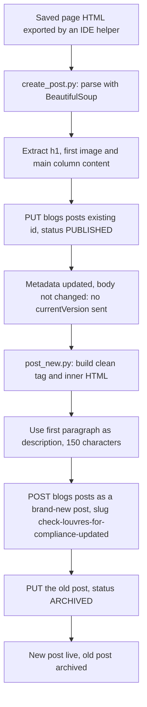

# PoolSafe AU blog publish scripts (Servigo)

> Two one-off Python scripts that moved a "Check louvres for compliance" article from a saved web page into the PoolSafe AU GoHighLevel blog, working around a silent edit failure by creating a new post and archiving the old one.

| | |
|---|---|
| **Category** | Content, SEO and newsletters |
| **Status** | Legacy or retired, as of 9 Oct 2026 (dormant one-offs from Aug 2026) |
| **Type** | Python scripts (`create_post.py`, `post_new.py`) calling the GHL Blogs API |
| **Runner and schedule** | Manual, local. Not scheduled. Not to be re-run as is (see Operating notes). |
| **Client / owner** | PoolSafe AU (client work kept under the Servigo project folder) |
| **Stack** | Python, `requests`, `bs4` (BeautifulSoup), GHL Blogs API |
| **Source** | Main KB Part 2 section 18 (lines 1351-1384); section 6 for the related gotcha; Portfolio KB: no matching entry found |

## 1. Description

### What it does
Takes the HTML of a finished article page (exported by an IDE helper), extracts the title, first image and main content, and puts it into the PoolSafe AU blog in GoHighLevel. The first script tried to update an existing post in place. When that did not change the body, the second script created a clean new post and archived the old one.

### Inputs and outputs
- **Inputs:** A saved page HTML file parsed with BeautifulSoup. Targets: the PoolSafe AU GHL location and its blog.
- **Outputs:** A new blog post with slug `check-louvres-for-compliance-updated`, and the old post set to `ARCHIVED`.

### Key components
| Component | Role |
|---|---|
| `create_post.py` | Extracts the h1, first image and main-column content from the saved page, then sends `PUT /blogs/posts/{existingId}` with status PUBLISHED. It did not update the body because no `currentVersion` was sent. |
| `post_new.py` | Builds clean `<tag>inner</tag>` HTML, uses the first paragraph as the description (150 characters), sends `POST /blogs/posts` as a brand-new post, then `PUT`s the old post to `status: ARCHIVED`. |

### Where it lives
`D:\Project\Client & Agency (Pivot)\Servigo\poolsafeau blog\` (the main KB's folders-moved table says material once under `D:\Project\Pivot\...` now sits under `D:\Project\Client & Agency (Pivot)\...`, so older transcripts may use the old path).

## 2. Flow chart

**Reading the chart**
1. The article page is built elsewhere and saved as HTML by an IDE helper.
2. `create_post.py` parses the page and extracts the h1, the first image and the main column content.
3. It sends a `PUT` to the existing post with status PUBLISHED. The body did not change because the request had no `currentVersion`.
4. `post_new.py` rebuilds the content as clean HTML, takes the first paragraph (150 characters) as the description, and posts it as a new post with the slug `check-louvres-for-compliance-updated`.
5. The old post is then set to `ARCHIVED`, so the new post replaces it.

## 3. Case study

### The challenge
A "Check louvres for compliance" article had been built as a page and needed to appear in the PoolSafe AU GHL blog. Updating the existing blog post in place appeared to succeed but left the body unchanged.

### The solution
Create the post fresh and archive the old one. `post_new.py` builds the content cleanly from the saved page, publishes it as a new post, and archives the previous post so only one version is live.

### Design decisions and rules learned
- A `PUT` that changes the body must include `currentVersion`; without it the body silently does not update (the same gotcha documented for the blog backlog repair).
- Archive-and-recreate is the workaround when the versioned `PUT` cannot be done.

### Outcome
No measured outcome recorded beyond the documented outputs: a new post with the slug above and an archived old post (Aug 2026). The source does not say whether the new post is still live.

### Lessons learned
- The edit endpoint can answer successfully while leaving the body unchanged, so verify the result rather than trust the response.
- (portfolio KB) No matching portfolio KB entry was found.

## 4. Operating notes
- **Run / pause / debug:** Do not re-run as is; the scripts are one-offs for a single article.
- **Known issues and open items:** The scripts target one article (an existing post ID and a fixed slug), so they would need editing for any other article (inferred).
- **Risks:** Archiving a post changes what the live blog shows. Security and credential-hygiene findings for this project are tracked privately and are not published here.

## 5. Related
- [Blog post backlog repair](blog-backlog-repair.md) documents the `currentVersion` and `wordCount` rule for `PUT /blogs/posts/{postId}`.
- [GHL blog API and shared blog tooling](ghl-blog-api-and-shared-blog-tooling.md) holds the wider API gotcha list.
- [GHL API contracts and quirks](../03-ghl-crm-migrations/ghl-api-contracts-and-quirks.md) covers GHL API behaviour (main KB Part 3 section 16).
- **Sources:** Main KB Part 2 section 18, section 6 (gotcha).
