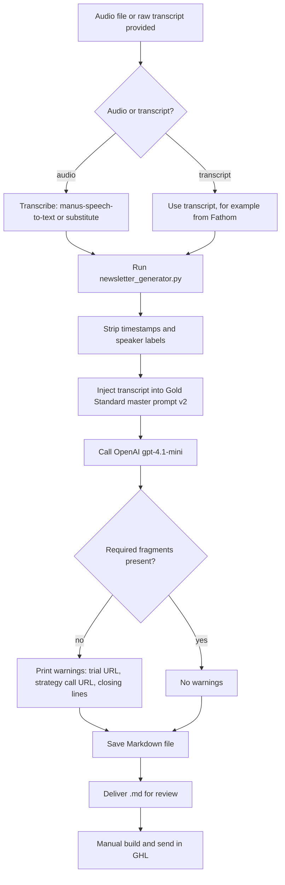

# Voice note to branded newsletter

> A Claude skill with a Python generator that turns the founder's weekly voice note, or any transcript, into a send-ready Markdown newsletter in the founder's voice for an entrepreneur audience.

| | |
|---|---|
| **Category** | Content, SEO and newsletters |
| **Status** | On demand, as of 9 Oct 2026 |
| **Type** | Claude skill with a Python CLI (`newsletter_generator.py`) calling the OpenAI API |
| **Runner and schedule** | Manual, when an audio file or transcript is provided. Prompt version v2 dated 29 Mar 2026. |
| **Client / owner** | P2T (inferred from the standing CTA links on `link.pivot2thrive.com.au`) |
| **Stack** | Claude skill `voice-to-branded-newsletter`, Python, `openai` client with model `gpt-4.1-mini`, `manus-speech-to-text` for transcription (inferred Manus origin) |
| **Source** | Main KB Part 2 section 12 (lines 1139-1173); Portfolio KB section 18 (generic process, voice provider unconfirmed) |

## 1. Description

### What it does
Takes a voice note (.m4a, .mp3 or .wav) or a raw transcript and returns a newsletter in the founder's voice: warm, honest, slightly funny, simple English, no corporate words, no em-dashes. A master prompt (the "Gold Standard", v2) is filled with the cleaned transcript, sent to an OpenAI model, and the result is checked for required fragments before being saved as Markdown.

### Inputs and outputs
- **Inputs:** An audio file converted to transcript text, or a transcript from another source such as Fathom. Reference files: `references/conversion_prompt_template.md` (the Gold Standard master prompt), `brand_config_template.json` (standing CTAs, brand names, sign-off) and `authentic_voice_guide.md`.
- **Outputs:** A Markdown newsletter. The generator warns if any of these are missing: the GHL trial URL fragment `gohighlevel.com/priya-jaganathan`, the strategy call URL fragment `link.pivot2thrive.com.au/widget/bookings`, and two signature closing lines ("supported by systems, not willpower" and "reply and tell me what you're building").

### Key components
| Component | Role |
|---|---|
| `scripts/newsletter_generator.py` | Strips timestamps and speaker labels, injects the transcript into the master prompt, calls OpenAI `gpt-4.1-mini`, validates required fragments, saves. |
| `references/conversion_prompt_template.md` | The Gold Standard master prompt. |
| `brand_config_template.json` | Standing CTAs, brand names and sign-off. |
| `authentic_voice_guide.md` | The voice guide used alongside the master prompt. |
| `manus-speech-to-text` | Transcription step, only in the original Manus environment (inferred). |
| OpenAI API key | Needed in the environment; the usual name is `OPENAI_API_KEY` (inferred). Needs `pip install openai`. |

### Where it lives
`C:\Users\<user>\.claude\skills\voice-to-branded-newsletter\`. The skill uses `/home/ubuntu/skills/...` paths (inferred Manus origin), which need replacing on Windows.

## 2. Flow chart

**Reading the chart**
1. An audio file or a transcript is provided. Audio needs transcribing first (`manus-speech-to-text` in the original setup, or any transcript source).
2. The generator strips timestamps and speaker labels, then injects the transcript into the master prompt.
3. OpenAI `gpt-4.1-mini` writes the newsletter. The prompt asks for this structure: 2 subject lines under 40 characters with preheaders; a `Hey <firstname>,` hook story of 2-3 paragraphs; one core lesson; one actionable insight woven into prose; a personal bridge; optional proof; curated opportunities only if mentioned (with `[LINK]` placeholders); a weekly-specific reply prompt; a custom closing line; "Talk soon, Priya"; and ONE conditional standing CTA (the HighLevel trial OR a strategy call), omitted on vulnerable weeks.
4. Validation checks for the required fragments and prints warnings; the file is saved either way and the warnings are what to compare on a re-run.
5. The `.md` is delivered. Turning it into a sent email is a manual step in the GHL email builder (main KB Part 2 section 20 says no scheduled send or GHL API step exists).

## 3. Case study

### The challenge
The founder records a weekly voice note and needs it to become a newsletter that still sounds like the founder, not like generic AI copy. The audience is entrepreneurs, so the tone must be warm, honest and simple, and each issue must carry exactly one lesson and at most one standing call to action.

### The solution
A skill that wraps a long, specific master prompt in a small Python CLI. The CLI cleans the transcript, runs the prompt on an OpenAI model and checks the output for the brand's required links and closing lines. A voice guide and a brand config template sit alongside the prompt.

### Design decisions and rules learned
- Preserve the founder's rawest lines verbatim and capture specifics. Expand every letter of an acronym.
- No visible section labels. One lesson per email. Never a fixed reply keyword.
- NEVER include a positioning line, a Before/After block, a "PRO TIP" label, a fixed-keyword soft CTA, an "I see you" block, a cost-of-inaction line or a P.S.
- The standing CTA is conditional and is dropped on vulnerable weeks.
- The overview voice rules also call for Australian English, no em-dashes and no corporate filler such as leverage, synergy or unlock (main KB overview rule 15).
- The skill appears to be ported from a Manus environment (inferred), so the transcription step and the `/home/ubuntu` paths need substitutes on Windows.
- Inconsistency to resolve before sending: the validator expects `gohighlevel.com/priya-jaganathan` as the HighLevel trial link, while the blog skills use `https://www.gohighlevel.com/priya` as the affiliate link. Check which is correct.

### Outcome
No measured outcome recorded. The documented result is the working skill at prompt version v2 (29 Mar 2026). No run counts or issues sent are recorded.

### Lessons learned
- A validator that checks for required links and signature lines catches a model that drifts from the brand, but it only warns, so a person still reads the result.
- (portfolio KB) The portfolio KB lists a voice-to-branded-newsletter workflow without naming the transcription provider, email platform or approval gates, and says to confirm them from implementation files. The main KB supplies the provider (Manus CLI, inferred) and the OpenAI model.
- A skill moved between environments carries hidden dependencies (a CLI, a key, absolute paths), so list them before relying on it locally.

## 4. Operating notes
- **Run / pause / debug:** Re-run the generator with the same transcript and compare warnings. Needs `pip install openai` and an OpenAI API key in the environment. Set UTF-8 output on Windows (`PYTHONIOENCODING=utf-8`, main KB rule 19).
- **Known issues and open items:** Depends on Manus tooling and an unconfirmed OpenAI key (main KB open item 10). The affiliate URL mismatch above is unresolved. No scheduled send or GHL API step exists.
- **Risks:** The model output goes into a newsletter in the founder's name, so the review step matters. The audio and transcript are personal content; the source does not describe where they are stored.

## 5. Related
- [P2T weekly newsletter builder](p2t-weekly-newsletter-builder.md) turns finished copy into the branded P2T HTML.
- [Weekly Content Engine SOP](weekly-content-engine-sop.md) is the LinkedIn-side weekly content process.
- [Skill `voice-to-branded-newsletter`, listed in the skills overview](../08-claude-skills/00-skills-overview.md)
- **Sources:** Main KB Part 2 section 12, overview rule 15 and open item 10; Portfolio KB section 18.
