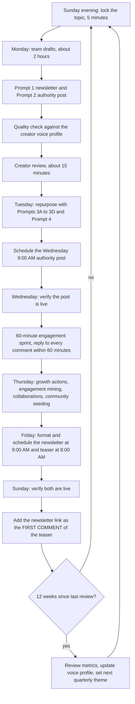

# Weekly Content Engine SOP (LinkedIn newsletter and authority post)

> A delegable weekly SOP, packaged as a Claude skill, that lets a team or VA run a creator's LinkedIn authority content with about 15 minutes of creator review per week.

| | |
|---|---|
| **Category** | Content, SEO and newsletters |
| **Status** | On demand, as of 9 Oct 2026 (manual SOP, no automation found) |
| **Type** | Claude skill holding a weekly checklist and prompt set (v2 Authority Builder) |
| **Runner and schedule** | Manual. Weekly rhythm: Sunday newsletter at 9:00 AM, Wednesday authority post at 9:00 AM. A 12-week review cycle. |
| **Client / owner** | Not documented in the source (a generic SOP for "a creator"; the voice profile is filled once per quarter) |
| **Stack** | LinkedIn, Claude skill `weekly-content-engine-sop`, reference Markdown files |
| **Source** | Main KB Part 2 section 14 (lines 1208-1241); Portfolio KB section 18 (generic process) |

## 1. Description

### What it does
Defines a repeatable weekly publishing workflow for thought-leadership content on LinkedIn. Each week produces a long-form LinkedIn newsletter (1,000-1,500 words, published Sunday) and a short authority post (under 300 words, published Wednesday). Both are repurposed into a teaser, an X thread, a carousel and a video script. The team does the heavy work; the creator spends about 15 minutes on review.

### Inputs and outputs
- **Inputs:** Reference files in the skill: `references/creator-voice-profile.md` (fill once per quarter), `topic-strategy.md`, `ai-prompts.md`, `weekly-schedule.md`, `growth-metrics.md`.
- **Outputs:** The newsletter, the authority post, the repurposed posts and the tracking record.

### Key components
| Component | Role |
|---|---|
| `creator-voice-profile.md` | The voice standard the quality check is run against. Filled once per quarter. |
| `topic-strategy.md` | Topic choice and the quarterly theme. |
| `ai-prompts.md` | Prompt 1 (newsletter), Prompt 2 (authority post), Prompts 3A-3D (repurposing), Prompt 4 (growth comment). |
| `weekly-schedule.md` | The day-by-day checklist. |
| `growth-metrics.md` | What is measured and reviewed every 12 weeks. |

The roles of the reference files are taken from their names and the schedule, except where the KB states them.

### Where it lives
`C:\Users\<user>\.claude\skills\weekly-content-engine-sop\`. The trigger is any mention of a LinkedIn newsletter, a content calendar, thought leadership, repurposing or a weekly publishing workflow.

## 2. Flow chart

**Reading the chart**
1. Sunday evening, a 5-minute topic lock sets the week's topic.
2. Monday, the team drafts for about 2 hours using Prompt 1 (newsletter) and Prompt 2 (authority post) and checks the result against the creator voice profile. The creator then reviews for about 15 minutes.
3. Tuesday, the content is repurposed with Prompts 3A-3D and a growth comment (Prompt 4), and the Wednesday 9:00 AM post is scheduled. The repurposed formats are a teaser, an X thread, a carousel and a video script; the mapping of those to the letters A-D is not documented.
4. Wednesday, the post is verified live and a 60-minute engagement sprint runs.
5. Thursday, growth actions: engagement mining, collaborations and community seeding.
6. Friday, the Sunday newsletter is formatted and scheduled for 9:00 AM, and the teaser for 8:00 AM.
7. Sunday, both are verified and the newsletter link goes in as the first comment of the teaser (the teaser body must not contain the link).
8. Every 12 weeks, metrics are reviewed, the voice profile updated and the next quarterly theme set.

## 3. Case study

### The challenge
The stated aim is a process a team or VA can run for a creator's weekly authority content, with only about 15 minutes of creator review. It has to keep the creator's voice and avoid AI-speak. The source does not describe an earlier failed approach.

### The solution
A skill that packages the whole weekly cycle as a checklist plus a prompt library. A voice profile (refreshed quarterly) anchors the tone; prompts produce the long and short pieces and their repurposed forms; a fixed weekly schedule assigns each day's task; and a 12-week review feeds metrics back into the voice profile and theme.

### Design decisions and rules learned
- Authority over activity is the SOP's guiding principle.
- The teaser body must NOT contain the newsletter link. The link goes in as the first comment, after verifying on Sunday.
- Reply to every comment within 60 minutes.
- Tone is enforced against AI-speak, using the voice profile as the benchmark.
- The creator's input is capped at about 15 minutes of review; the team carries the drafting (about 2 hours).

### Outcome
No measured outcome recorded. The source documents the skill (v2 Authority Builder) and the schedule, but no posts published, follower or engagement numbers, or adoption by a named team.

### Lessons learned
- A fixed weekly rhythm with explicit publish times (Sunday 8:00 and 9:00 AM, Wednesday 9:00 AM) makes the work delegable.
- Link placement (first comment, not the teaser body) is written into the SOP as a hard rule, so it is checked on the Sunday verify step.
- (portfolio KB) The portfolio KB lists the weekly content-engine SOP among reported newsletter and content workflows with only a generic process. The main KB is the detailed source.

## 4. Operating notes
- **Run / pause / debug:** Follow the checklist and use the prompts file. Nothing to pause; there is no scheduler or automation.
- **Known issues and open items:** No automation exists (not found). The owner of the creator voice profile and the team running the SOP are not named in the source.
- **Risks:** The SOP depends on the quarterly voice profile being kept current; a stale profile weakens the quality check (inferred).

## 5. Related
- [Voice note to branded newsletter](voice-note-to-branded-newsletter.md) is the email-newsletter counterpart.
- **Sources:** Main KB Part 2 section 14; Portfolio KB section 18.
