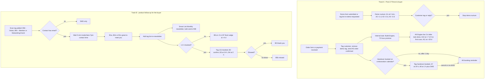
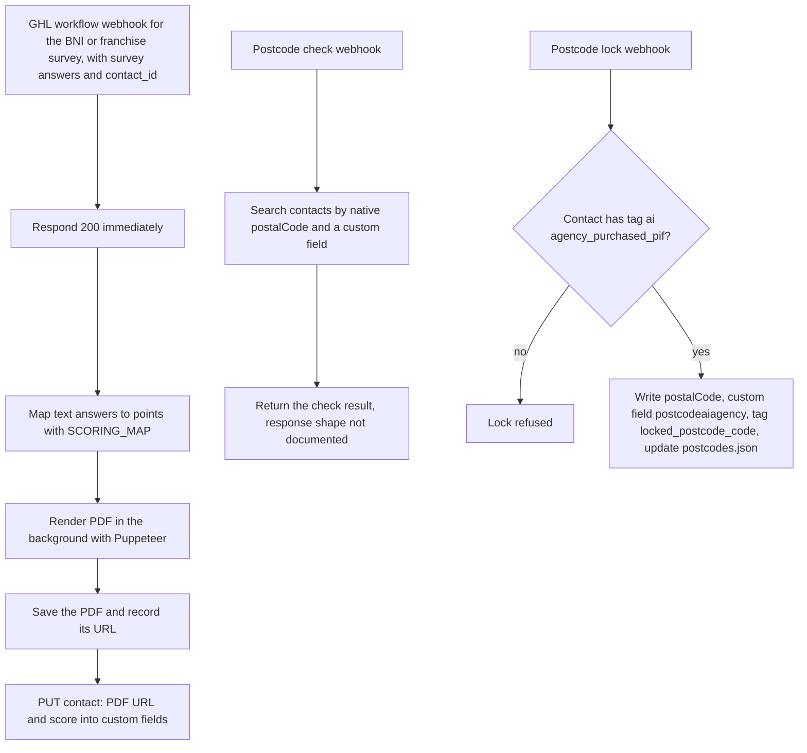

# BNI Referral Engine email-automation pack (and BNI/Expo scoring webhook backends)

> A written specification of every email, trigger, wait, tag and workflow for the "BNI Referral Engine" done-for-you product, plus the Express webhook backends that score BNI and Expo surveys into PDFs, built for Pivot 2 Thrive.

| | |
|---|---|
| **Category** | GoHighLevel, CRM and migration automation |
| **Status** | Designed, not built, as of 9 Oct 2026 (spec written 2026-10-01, nothing created in GHL; the backend code exists but its deployment status is not documented; the main KB register lists the pack and backends as built artefacts and the 24 template shells and 6 workflows as not created) |
| **Type** | Specification document (GHL email and workflow pack) plus Node/Express webhook backends |
| **Runner and schedule** | Spec: none, build is manual in GHL. Backend: `node server.js`, event-driven by GHL workflow webhooks |
| **Client / owner** | Pivot 2 Thrive (P2T sub-account for Track A); the product itself is built once in a snapshot for buyers (Track B) |
| **Stack** | GoHighLevel (email templates, workflows, tags, custom values, calendars), Express, Puppeteer, nginx, markdown spec |
| **Source** | Main KB Part 3 section 10 (lines 1935-1981). Portfolio KB: no BNI Referral Engine entry found |

## 1. Description

### What it does
The pack specifies, in two separate tracks, all the email automation for the "BNI Referral Engine", a $97 AUD per month done-for-you product. Track A is Pivot 2 Thrive talking to the buyer (demo nurture, onboarding, handover reminders). Track B is the product itself, the follow-up the buyer's account sends to people they scan at BNI meetings and events, built once in a snapshot using `{{custom_values.*}}`.

Alongside the pack sits related BNI/Expo code: webhook backends that receive GHL survey answers, score them, render a PDF and write the score and PDF link back to the contact, plus territory (postcode) locking for an AI-agency offer.

### Inputs and outputs
- **Inputs (pack):** landing, demo, checkout and thank-you pages (`index.html` which equals `ghl-embed-ready.html`, `demo.html`, `checkout.html` with header/footer/summary blocks, `thankyou.html`); custom values (Track A: `demo_url`, `checkout_url`, `handover_booking_url`, `support_email`; Track B: `owner_first_name`, `business_name`, `what_we_do`, `booking_link`, `owner_phone`, `chapter_name`, `ideal_referral`); tags `bni-re-demo-requested`, `bni-re-customer`, `bni-re-handover-booked`, `bni-re-first-scan`, `bni-re-121-booked`, `bni-re-newsletter`.
- **Inputs (backend):** survey answers plus `contact_id` posted by a GHL workflow webhook.
- **Outputs:** the markdown pack (copy-ready subjects, preheaders, bodies, a build checklist and 6 page fixes); potential 24 empty template shells and 6 workflows (none created); from the backend, a scored PDF with its public URL and score saved into contact custom fields.

### Key components
| Component | Role |
|---|---|
| `BNI-Referral-Engine-GHL-Email-Automation.md` (24 KB) | The specification: templates, triggers, waits, tags, workflows, checklist |
| Track A workflows A1-A3 | Demo nurture, customer onboarding, handover reminders |
| Track B workflows B1-B3 | Card-scan follow-up, 1-2-1 reminders, monthly newsletter |
| `EXPOBNI\email-backend\server.js` | Express + Puppeteer webhooks: BNI survey to scored PDF, franchise score PDF, postcode check and postcode lock |
| `bni2\email-backend\server.js` | Older BNI-only copy with the survey-to-PDF webhook |
| Six HTML email drafts in `bni2` | `client-report-email`, `customer-welcome`, `hesitation-followup`, `internal-alert`, `onboarding-start`, `order-notification`; not referenced by that server.js (inferred drafts for the GHL email builder) |
| nginx conf | Proxies the webhook and report paths to the local backend |

### Where it lives
- Spec: `D:\Project\Client & Agency (Pivot)\Pivot2Thrive & Content\bni referal\BNI-Referral-Engine-GHL-Email-Automation.md`, with the HTML pages and `bni referal.zip` in the same folder.
- Backends: `D:\Project\Client & Agency (Pivot)\BNI & Expos\` (`EXPOBNI\email-backend\`, `bni2\email-backend\`). Environment-variable names: `GHL_API_KEY`, `GHL_LOCATION_ID`, `GHL_CUSTOM_FIELD_ID`, `GHL_SCORE_FIELD_ID`, `GHL_REVENUE_FIELD_ID`, `GHL_PDF_CUSTOM_FIELD_ID`, `GHL_FRANCHISE_SCORE_FIELD_ID`, `BASE_URL`, `PUBLIC_URL`, `PORT`.
- Two neighbouring folders are web builds, not GHL automation: `Bni_Oasis\` (BNI member directory "Oasis Connect": scraper, Google Apps Script, Express `/api/members` and `/api/chapters`; GHL optional and no GHL calls found in its `server.js`) and `bni\` (landing, calculator, survey pages, flyers).

## 2. Flow chart

Designed flow of the email pack (nothing below exists in GHL yet). Track A is from Pivot 2 Thrive to the buyer; Track B is what the product sends for the buyer.

A second chart shows the scoring and territory webhooks in the BNI/Expo backend (code exists; whether it is deployed is not documented).

**Reading the chart**
1. A1: a visitor submits the demo form (or the demo tag is added). The nurture sends A1 two minutes later, then A2, A3 and A4 on days 1, 2 and 3. It stops when the contact becomes a customer or replies (Customer Replied stops the workflow).
2. A5-A7: an order or payment tags the customer, removes the demo tag, sends the order confirmation and creates an internal task with a 72-hour build promise.
3. A8-A10: if the handover is not booked after one day, a reminder goes out; once booked, tag and reminders (24 h, 1 h plus a 160-character SMS) follow. A cancellation or no-show loops back to the booking reminder after one day.
4. A11: "Engine live" is sent three days after the build task is done; first-scan help at +7 days if no first-scan tag; "what else" at +30 days.
5. B1-B5: adding a scan tag starts the follow-up (one trigger, three filters). Contacts without an email get SMS only (what happens after that branch is not specified). Others wait five minutes inside the 8am-7pm window, then receive a "great to meet you" email.
6. B6-B8: the contact is tagged for the newsletter and joins the monthly Smart List; if no 1-2-1 is booked, nudges go out at +3 and +4 days.
7. B9-B12: a booking adds the 1-2-1 tag and sends confirmation and reminders; a thank-you goes to attendees and a "missed" email to no-shows.
8. W1-W6: survey webhooks answer 200 straight away, score in the background, render the PDF and write the result back to the contact.
9. T1-T7: postcode checks search contacts; a lock is allowed only for a contact carrying the paid-in-full tag, and writes the postcode, custom field and lock tag.

## 3. Case study

### The challenge
P2T wanted to sell a $97 AUD per month done-for-you referral product to BNI members and needed every email, trigger and wait defined before building. Two audiences had to be kept apart: the buyer being sold and onboarded by P2T, and the buyer's own contacts being followed up by the product. The tooling could not do the whole job: the GHL MCP can list and create email templates but its template tool has no body field, and workflows cannot be created via the API at all.

### The solution
A 24 KB markdown specification with copy-ready subjects, preheaders and bodies, naming rules, wait windows, a build checklist and six page fixes. Track A is built in the P2T sub-account; Track B is built once in a snapshot driven by custom values so each buyer's account personalises it. In parallel, the older BNI and Expo survey work was handled by Express webhook backends that score answers into PDFs and lock postcode territories.

### Design decisions and rules learned
- Keep Track A and Track B apart and prefix every template `BNI-RE | <id> <name>` so they never mix with the 75 existing P2T templates (for example `BNI Network`, `BX Network Cardscan`).
- Templates are single-column plain emails, footer with business name, address and `{{email.unsubscribe_link}}` (Spam Act 2003); run a DND check at the start of every workflow; keep waits inside 8am-7pm.
- Appointment merge fields differ per builder version: insert them from the variable picker rather than typing `{{appointment.*}}`, and guard against an empty `contact.company_name`.
- Disable 1-2-1 confirmation B2 if the calendar already sends GHL's own confirmation.
- Survey-driven webhooks respond 200 immediately and generate PDFs in the background.
- Territory locks require the tag `ai agency_purchased_pif`, so a lock cannot be taken without payment.
- Pages need fixes before launch: the checkout is a mock (no payment or contact creation); the thank-you page promised "CRM credentials" in the first email although logins come from the platform's own account email (A5 was written to match); the checkout testimonial name appears to match the sample contact in the scanner animation; the "99.8% OCR accuracy" claim is unsupported (Australian Consumer Law); timing claims disagree (same day, within minutes, within seconds; the spec uses 5 minutes); a 30-day refund must be in the terms.
- The P2T account reported `saasMode: setup_pending`, which must be finished (plan, Stripe, snapshot) before Track B can be deployed as a product.

### Outcome
- Spec written on 2026-10-01. The assistant checked the P2T account (75 existing templates, `saasMode: setup_pending`) and offered to create 24 empty `BNI-RE |` template shells. The user's decision is not recorded (not found), and nothing was created in GHL.
- Track A cannot fire until the native GHL order form is wired, because the current checkout is a mock.
- Backend code exists for two survey-to-PDF webhooks and postcode locking. No run counts or deployment confirmation are documented.

### Lessons learned
- When the platform cannot create workflows or template bodies through the API, a precise copy-ready specification is the practical deliverable.
- Separate the "selling" automation from the "product" automation early; the naming prefix is what keeps them apart.
- Marketing claims on the supporting pages (accuracy, delivery speed) need reviewing before launch, not after.

## 4. Operating notes
- **Run / pause / debug:** Build from the checklist in the md in this order: custom values, tags, templates, workflows, wire forms, then test with a spare email. Backend: `node server.js` in `EXPOBNI\email-backend` (needs puppeteer and a `.env`), behind an nginx proxy.
- **Known issues and open items:** 24 template shells and 6 workflows not created; the decision on creating shells is not recorded; whether the `BNI-RE` pages sit on an Opportunity-based status is unknown; the six `bni2` HTML emails are unreferenced drafts.
- **Risks:** Unsupported advertising claims and refund terms (Australian Consumer Law); Spam Act compliance depends on the unsubscribe footer. Security and credential-hygiene findings for this project are tracked privately and are not published here.

## 5. Related
- [GHL webhook automation](../08-integrations-operations/ghl-webhook-automation.md)
- [BNI network value calculator and PDF factory](../05-excel-workflow-tools/bni-network-value-calculator-and-pdf-factory.md)
- [GHL API contracts and quirks](ghl-api-contracts-and-quirks.md) (template and workflow limits)
- Pivot GHL Hub (`editor`) holds a BNI quiz workflow screenshot: see Part 5 section 8 of the main KB.
- **Sources:** Main KB Part 3 section 10; session "Email automation setup in GHL"; session "Page redesign with graphical theme" (not GHL automation).
