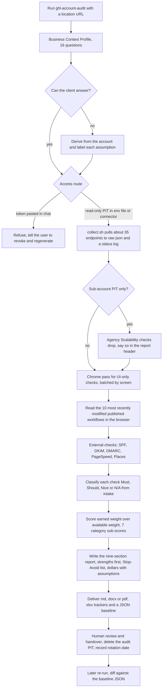

# GHL account audit (skill, ghl_audit runs and a complete client audit)

> A business-need-driven audit of a GoHighLevel sub-account across 260 features, scored 0-100 and dollar-quantified, with a Stop/Avoid list and a 30/60/90 roadmap, used on the team's own accounts and for a client.

| | |
|---|---|
| **Category** | GoHighLevel, CRM and migration automation |
| **Status** | On demand, as of 9 Oct 2026 |
| **Type** | Claude skill (`ghl-account-audit`) with a headless collection script, a Chrome review pass, and report/tracker builders |
| **Runner and schedule** | Manual: `/ghl-account-audit` with a location URL, a read-only PIT in `.env`, and Chrome desktop. No schedule |
| **Client / owner** | P2T and HLGP (own accounts) and client sub-accounts |
| **Stack** | GHL REST read endpoints, Claude Chrome extension, Google PageSpeed and Places APIs, DNS lookups, Node (docx report builder), Python (xlsx trackers), bash (`collect.sh`) |
| **Source** | Main KB Part 3 section 12 (lines 2021-2063) and Part 8 skill entry (lines 4726-4735); Portfolio KB section 20 (lines 662-686) |

## 1. Description

### What it does
The skill audits a GHL sub-account (and, with an agency token, the wider agency) against a library of 260 features: 94 checkable through the API alone, 12 through API plus the browser extension, 147 only through the UI (reviewed with Chrome), 6 external (DNS, PageSpeed, Places) and 1 to ask the client. It starts from the business (a 16-question intake) so that each check can be classified as Must, Should, Nice or not applicable, then scores the account and writes a fixed nine-section report in Australian English that names strengths first, quantifies money at risk with labelled assumptions, and ends with a Stop/Avoid list and a 30/60/90-day roadmap.

### Inputs and outputs
- **Inputs:** the 16-question Business Context Profile (`references\access-and-intake.md`; five answers are load-bearing: industry, average deal value, sales cycle, lead volume, biggest frustration). Where the client cannot answer, values are derived from the account and each assumption is labelled. Access via a connected GHL connector, an agency-level read-only Private Integration Token, or a view-only user for UI checks. Environment-variable names in `ghl_audit\.env`: `GHL_PIT_TOKEN`, `GHL_BASE_URL`, `GHL_API_VERSION`, `GHL_AGENCY_ID`, `GHL_LOCATION_IDS`, `GOOGLE_PAGESPEED_API_KEY`, `GOOGLE_PLACES_API_KEY`, `CLIENT_NAME`, `GHL_PLAN`, `TOKEN_CREATED_DATE`, `TOKEN_ROTATION_DUE`. A client-engagement `.env` uses the shorter names `location` and `pit`.
- **Outputs:** reports (`.md`, `.docx`, `.pdf`), trackers (`.xlsx` gap tracker and full check tracker), and a JSON baseline for diffing a later run. Part 8 also lists an optional plain-English client version in the extended variant.

### Key components
| Component | Role |
|---|---|
| `SKILL.md` and `references\` | Method, rules, check library (`check-library.md`, 57 KB), `api-map.md`, `relevance-matrix.md`, `report-template.md`, `access-and-intake.md`; the `ghl_audit` copy adds `execution-playbook.md` and `deliverable-formats.md` |
| `scripts\collect.sh` | Headless pull of about 35 endpoints into `output\<date>\raw\*.json`, with `_collection_log.tsv` of HTTP statuses |
| Chrome extension pass | UI-only checks batched by screen; `screenshots_map_*.md` and `ui_results_*.md` |
| `build_report.js` (docx), `build_gap_tracker.py`, `build_full_gap_tracker.py`, `add_deeplinks.py` | Report and tracker builders |
| Scoring model | Earned weight divided by available weight; 0, 0.5 or 1 per check; N/A excluded from both sides; bands 0-39 Critical, 40-59 Underbuilt, 60-79 Functional, 80-100 Strong |

The seven categories are Foundation & Compliance 46, Client Experience 44, Marketing Activation 38, Automation 37, Pipeline & Revenue 36, Agency Scalability 35 and Data Health 24. These numbers add up to 260, so they are likely the check counts per category (inferred).

### Where it lives
- Skill: `C:\Users\<user>\.claude\skills\ghl-account-audit\` (user level, modified 2026-09-01) and an extended copy in `ghl_audit\.claude\skills\` (dated 2026-08-03).
- Output folders: `D:\Project\Client & Agency (Pivot)\HLGP & GoHighLevel\ghl_audit\` (`output\2026-08-03`, `clients\hlgp`, `clients\p2t`, `scripts`) and `D:\Project\Client & Agency (Pivot)\<client-folder>\` for the client engagement (report md/pdf, data-pack xlsx, an internal engagement map, a dated `audit-run-*.json` baseline, an SEO/AEO findings file, the superseded first pass).

## 2. Flow chart

**Reading the chart**
1. A1-A4: the audit starts from the business, not the settings. Unanswered intake questions are derived from the account and labelled as assumptions.
2. A5-A6: access is by connector, a read-only agency PIT in a `.env`, or a view-only user. A token pasted into chat is never accepted; the user is told to revoke and regenerate it.
3. A7-A9: `collect.sh` runs headless. A sub-account PIT silently loses the 34-35 Agency Scalability checks (the `locations/search` call returns 403), so the header must say so.
4. A10-A12: the browser pass covers the 147 UI-only checks; workflow logic is only visible in the browser because the API returns names and status, never triggers or actions. External checks cover DNS, PageSpeed and Places.
5. A13-A14: checks are classified from the intake (no paid ads drops about 12 checks; no physical location drops the GBP and listings checks), N/A is excluded from both sides of the score.
6. A15-A16: the report is written and delivered in the formats above; strengths are named before problems and N/A checks are never mentioned.
7. A17-A18: a person reviews and hands over; the audit token is deleted; a later run is compared with the baseline.

## 3. Case study

### The challenge
Inherited or long-running GHL accounts hide wasted spend and broken automation, and a feature checklist alone does not say what matters to a given business. The audit had to be repeatable, honest about what the access method could not see, usable on a client's account without overreach, and expressed in money.

### The solution
A skill that front-loads a business intake, splits the 260 checks by how they can be collected (API, API plus extension, UI-only, external, ask the client), scores them by relevance, and produces a fixed report. Runs completed:
- 2026-08-03: first-pass audits of the team's own accounts and one other account.
- 2026-10-07: a complete audit of a client sub-account, scored provisionally on the applicable checks; an earlier first pass was superseded.

Scores and findings are client-confidential and are not published here. The complete client run added a permissions probe (read permissions tested one by one; write permissions deliberately not tested), sub-agents for a website SEO/AEO review and for the screen-by-screen Chrome review, a multi-tab workbook, a PDF of about 25 pages rendered from HTML via Chrome, an internal engagement map (hours estimated, prices left blank), and a JSON baseline for a 90-day diff.

### Design decisions and rules learned
- A sub-account PIT silently drops the Agency Scalability checks; state this in the report header.
- The workflows endpoint returns only id, name and status. Read the 10 most recently modified published workflows in the browser and state the cap; label "zero sends" conclusions as inference.
- Tasks are readable per contact only: sample, never scan 32k contacts.
- Never accept a PIT pasted in chat. A PIT is static, so record a rotation date (90 days). Name audit PITs "Audit (Read Only)" and delete them afterwards.
- Check engagement rights: a client sub-account may sit under a different agency than your own, so your own agency connectors cannot see it.
- Do not criticise a client's own build like a competitor's; never mention N/A checks; cite dollars with labelled assumptions and confirm the client's currency.
- UI review can change account state (opening Conversations can mark a thread as read) and the audit log can show actions the auditor did not take: tell the client.
- Add a `.gitignore` for env files before running `git init` in an audit folder.
- (Portfolio KB) For audits, record scope, checks, findings, severity and remediation status.

### Outcome
- Four scored audits are on record (three on 2026-08-03, one on 2026-10-07) with reports, trackers and a baseline JSON.
- The deliverable shape is fixed: a nine-section report, a gap tracker and a full check tracker, a data-pack workbook and a JSON baseline for the next diff. Client findings are confidential and are not published here.
- Whether the client acted on the findings, and what the engagement was worth, is not documented in the source.

### Lessons learned
- Say what the access method cannot see; coverage honesty is part of the product.
- The API shows that a workflow exists, not what it does; logic needs the browser.
- Treat the audit credential as a liability: read-only, named, rotated, then deleted.
- Supersede early numbers openly (a provisional score replaced a first-pass score) rather than quietly editing.

## 4. Operating notes
- **Run / pause / debug:** run `/ghl-account-audit`, put the PIT in `.env`, run `./scripts/collect.sh`, then do the Chrome review; re-run later and diff against `audit-run-*.json`. API rate limit is 100 requests per 10 s (200,000 per day); batch UI checks by screen (about 25-35 minutes per sub-account, Part 8).
- **Known issues and open items:** The latest client score is provisional because not every applicable check could be verified; engagement hours and prices are blank in the internal map.
- **Risks:** The reports contain client-confidential findings and dollar estimates, so strip or anonymise before any portfolio use; PITs are static and must be rotated; UI review can change account state, so tell the client.

## 5. Related
- [Skill `ghl-account-audit`, listed in the skills overview](../08-claude-skills/00-skills-overview.md)
- [GHL API contracts and quirks](ghl-api-contracts-and-quirks.md) (PIT, rate limit and workflow-endpoint limits)
- **Sources:** Main KB Part 3 section 12; Part 8 skill entry `ghl-account-audit`; Portfolio KB section 20; sessions "Setup GHL account audit skill environment" and "GHL account audit".
