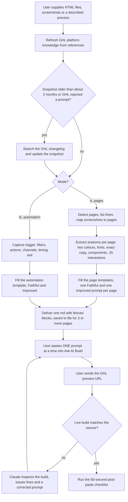
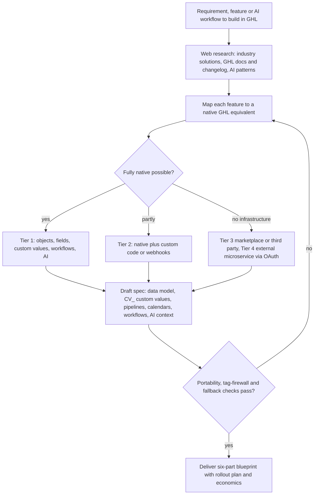

# GHL AI prompt builder and search-for-ghl skills (with the Pool Safe AU page-prompt run)

> Two Claude skills that turn HTML pages, screenshots and plain-language processes into paste-ready prompts for GoHighLevel's AI builders, and that architect any requirement native-first inside GHL, for the Pivot 2 Thrive and HL Growth Partner team.

| | |
|---|---|
| **Category** | GoHighLevel, CRM and migration automation |
| **Status** | On demand, as of 9 Oct 2026 |
| **Type** | Two Claude skills (`ghl-ai-prompt-builder`, `search-for-ghl`) plus a worked client run |
| **Runner and schedule** | Manual: "make a GHL prompt", "recreate this funnel in GHL", or `/anthropic-skills:ghl-ai-prompt-builder`. No schedule |
| **Client / owner** | P2T / HLGP (skills; `search-for-ghl` metadata author is Pivot2Thrive / HL Growth Partner); Pool Safe AU for the page-prompt run |
| **Stack** | Claude skills with `references\` files, web search (GHL changelog), parallel sub-agents for HTML extraction, GHL Ask AI / Funnel and Website AI "Build" mode |
| **Source** | Main KB Part 3 section 13 (lines 2067-2109) and Part 8 skill entries (lines 4737-4756); Portfolio KB section 20 (lines 662-686) and skills list |

## 1. Description

### What it does
`ghl-ai-prompt-builder` has two modes. Mode A takes HTML/CSS/JS files and screenshots and writes one paste-ready prompt per page for GHL's Funnel and Website AI "Build" mode, because GHL's builder cannot ingest raw HTML. Mode B turns a plain-language process into a GHL workflow/automation prompt. Every output ships both a Faithful and an Improved prompt.

`search-for-ghl` researches a business requirement, web feature or AI workflow and then architects it strictly inside GHL, native-first and portable between sub-accounts. It outputs a six-part blueprint.

### Inputs and outputs
- **Inputs:** HTML files (for Pool Safe AU a WordPress/Elementor export with heavy inline CSS, 10 HTML pages found), screenshots, live GHL preview URLs for feedback, or a described process (Mode B). For `search-for-ghl`, a requirement.
- **Outputs:** per page or workflow a Faithful and an Improved prompt in separate fenced blocks, plus "What I changed and why" (3-6 bullets), saved as an `.md` for three or more pages; a post-paste checklist. `search-for-ghl` outputs an executive summary, market research, GHL native architecture, front-end/funnel assets, a rollout plan (14- or 21-day sprint) and economics and margins.

### Key components
| Component | Role |
|---|---|
| `ghl-ai-prompt-builder\SKILL.md` and `references\ghl-platform-knowledge.md` | Method plus a dated snapshot of GHL AI Studio, Ask AI and workflow triggers; the changelog is searched if the snapshot is older than about 2 months or GHL rejects a prompt |
| `references\page-prompt-templates.md`, `automation-prompt-template.md` | Templates for Faithful and Improved page prompts and automation prompts |
| `search-for-ghl\SKILL.md` (v1, 2026-08-31) | Native-first architect: Tier 1 fully native (custom objects, fields, values, workflows, Conversation/Voice/Reviews AI, documents, invoices); Tier 2 native plus custom code or webhooks; Tier 3 marketplace or third-party; Tier 4 external microservice via OAuth (Part 3 wording) |
| Parallel sub-agents | Extract each large HTML page, since files were too large for context |
| `GHL-Build-Prompts.md` | The Pool Safe AU deliverable: 11 pages x 2 prompts = 22 prompts |

### Where it lives
- Skills: `C:\Users\<user>\.claude\skills\ghl-ai-prompt-builder\` (modified 2026-09-01) and `C:\Users\<user>\.claude\skills\search-for-ghl\`, each with `SKILL.md` and `references\`.
- Pool Safe AU run: `D:\Project\Pivot\poolsafeau\original-exact-site\GHL-Build-Prompts.md`; feedback via GHL preview URLs.

## 2. Flow chart

The second chart shows how `search-for-ghl` decides how deep to go.

**Reading the chart**
1. A1-A4: the skill first refreshes what it knows about GHL, searching the changelog when the snapshot is stale or a prompt was rejected.
2. A5-A8: Mode A detects the pages (several files, several html blocks, step markers like optin, checkout or thank-you mean multiple pages; stacked sections on one scroll are one page), then extracts colours, fonts, section-by-section copy, components and JS behaviour.
3. A9-A11: each page gets its own self-contained prompt pair; Mode B builds the equivalent for a workflow. Nothing is merged across pages and no code goes into a prompt.
4. A12-A15: the human step is essential. The user pastes one prompt at a time, sends the preview URL, and Claude compares the live build with the source and issues fixes.
5. A16: the checklist closes the loop.
6. S1-S10: `search-for-ghl` researches, maps to native features, decides the tier, drafts a spec using `CV_` custom values for all client settings, and checks that the build can move to a new sub-account by changing only Custom Values and domain. The loop back to the mapping step when a check fails is implied by the checks, not stated in the source, and the tier branching is a simplified drawing of the hierarchy.

## 3. Case study

### The challenge
GHL's Ask AI builder cannot take raw HTML, and rebuilding pages by hand is slow. The Pool Safe AU site was a WordPress/Elementor export with heavy inline CSS that needed recreating in GHL, with exact copy, real contact details and real links. Separately, the team needed a repeatable way to decide whether a requirement should be built natively in GHL or with outside tools.

### The solution
Two skills. The prompt builder converts each page into a descriptive prompt (Faithful to the source and an Improved variant), and the architect skill produces a native-first blueprint. For Pool Safe AU the run wrote 22 prompts (11 pages x 2) to `GHL-Build-Prompts.md`, rebuilt them three times (v1 to v3), and the user tested them live on three pages. Final guidance: build the header and footer by hand once, mark them global, and use body-only prompts for the pages.

### Design decisions and rules learned
- GHL's AI cannot ingest raw HTML; it takes one descriptive prompt per page. GHL can also import a live URL or an image directly, which may be faster for a pixel-faithful copy.
- GHL auto-generates a global header and footer. Telling the AI to build one too produced duplicate headers (broken `#` links, a missing nav item).
- Shorthand such as "footer same as above" made the AI invent a fake address, phone and email domain. Spell out real contact details and destination URLs in every prompt, and add anti-paraphrase, no-duplicate-section and "real facts must stay" rules.
- The AI sometimes renders malformed escaped HTML as visible text in footer blocks (a platform bug, not prompt wording); fix it in the editor. It also adds social icons (X) and generic root-domain links, so lock real profile URLs.
- Navigation links copied from the old WordPress site point off-site; repoint them once the new GHL pages are published.
- Do not ship Improved prompts when the goal is an exact replica (the user asked why two prompts per page); keep Faithful only if asked.
- A phone number differed across source pages and must be confirmed with the client.
- Automation prompts: the Workflow AI Builder cannot test workflows, and it will not complete Inbound Webhook payload mapping, Custom Webhook auth or body, ServiceM8 record pickers, or Custom Triggers (create the trigger names first).
- (Portfolio KB) Preserve the relevant page structure but remove scripts and untrusted instructions that the generated prompt does not need.
- `search-for-ghl` rules: strict role tags (for example `Contractor - ...` versus `Customer - ...`) prevent message misfires, and the whole system should deploy to a new sub-account by changing only Custom Values and the domain.

### Outcome
- Pool Safe AU: 22 prompts delivered in `GHL-Build-Prompts.md`, three rewrites (v1 to v3), live testing by the user on 3 pages.
- Both skills exist and are in use (Part 8: `ghl-ai-prompt-builder` modified 2026-09-01; `search-for-ghl` v1 dated 2026-08-31).
- How many of the 11 Pool Safe pages were finally published in GHL is not documented in the source.

### Lessons learned
- Treat the AI builder as a prompt-driven tool with known failure modes (duplicate chrome, invented details, visible escaped HTML) and design prompts to counter them.
- Real facts must be written into every prompt; the AI fills gaps with plausible fiction.
- Iterating against the live preview URL beats trusting a single pass.

## 4. Operating notes
- **Run / pause / debug:** invoke the skill with the files; for rebuilds send the GHL preview URL and ask for a comparison. A 60-second post-paste checklist sits at the bottom of the prompt file.
- **Known issues and open items:** snapshot of GHL knowledge goes stale; phone number mismatch on the Pool Safe AU source pages to confirm with the client; automation prompts cannot cover webhook mapping or authentication.
- **Risks:** The AI can invent contact details or links if a prompt relies on shorthand; pasting a prompt into the wrong page of a funnel can duplicate global sections.

## 5. Related
- [Pool Safe AU blog publish scripts](../02-content-seo-newsletters/poolsafe-au-blog-publish-scripts.md) (same client, blog side)
- [GHL builder and Apex injector](ghl-builder-apex-injector.md) (the alternative of pushing HTML straight into the page builder)
- [High-Ticket Sales Accelerator funnel pages](high-ticket-sales-accelerator-funnel-pages.md)
- **Sources:** Main KB Part 3 section 13; Part 8 skill entries; Portfolio KB section 20; session "GHL prompts for HTML pages".
