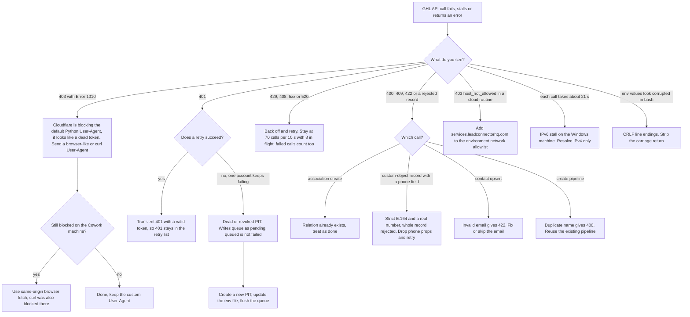
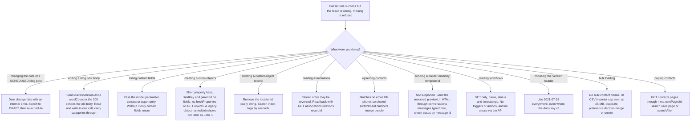

# GHL API contracts and quirks (consolidated reference)

> A consolidated reference of how the GoHighLevel API actually behaves, learned across the team's migrations, audits, blog tooling and imports, with a troubleshooting decision tree built from those quirks.

| | |
|---|---|
| **Category** | GoHighLevel, CRM and migration automation |
| **Status** | Reference, as of 9 Oct 2026 |
| **Type** | Reference table and troubleshooting guide (no code of its own) |
| **Runner and schedule** | Not applicable; consulted when building or debugging any GHL integration |
| **Client / owner** | P2T and HLGP; applies to every GHL project including client sub-accounts |
| **Stack** | GHL REST API v2 (`https://services.leadconnectorhq.com`), Private Integration Tokens, Cloudflare in front of the API, Windows and cloud runners |
| **Source** | Main KB Part 3 section 16 (lines 2196-2217); extra quirks from Part 0 sections 3 and 6 (lines 168-180, 242-257) and the Part 2 blog notes. Portfolio KB: general API and credential practice only (sections 31-32) |

## 1. Description

### What it does
This is not a program. It is the team's memory of GHL API behaviour that differs from the documentation or surprises a new build: headers, rate limits, retries, custom objects, associations, contacts, custom fields, pipelines, email, workflows, the page builder and import limits. Each row records a behaviour and the project in which it was learned (Part 3 section numbers). Part 0 of the main KB points here for "the full GHL API quirks table".

### Inputs and outputs
- **Inputs:** a failing or surprising GHL API call, or a plan for a new integration.
- **Outputs:** a likely cause and a fix, or a design choice that avoids the quirk.

### Key components
The quirks, grouped. "Where learned" uses the Part 3 section numbers, with the project file for each in section 5.

| Area | Behaviour | Where learned |
|---|---|---|
| Auth and headers | `Authorization: Bearer <PIT>` with `Version: 2021-07-28` works everywhere (the docs claim `v3` for create-pipeline) | 1, 8 |
| Cloudflare | The default Python User-Agent gets `403 Error 1010`, which looks like a dead token; use a browser-like or curl User-Agent | 3, 7 |
| Network | IPv6 stalls about 21 s per call on the Windows machine; resolve IPv4 only | 7 |
| `.env` files | Windows CRLF line endings corrupt values when sourced in bash; strip `\r` | 8 |
| Rate limits | 100 requests per 10 s burst and 200,000 per day per location; no bulk contact create; failed calls count; run at 70 per 10 s or fewer with 8 in flight | 1, 6 |
| Retries | Retry 429, 408, 5xx (also 520) and 401 (which can be transient even with a valid token) | 1 |
| Custom objects | Records use SHORT property keys; fields need `fieldKey` and `parentId`; `GET /objects/` rejects `fetchProperties`; legacy objects named `job` make the UI label ours "Jobs 1" | 1, 2 |
| Associations | Stored order may be reversed; relation-exists returns 400, 409 or 422; unlimited relations per record; read with `GET /associations/relations/{recordId}?locationId&skip&limit` | 1, 2 |
| Delete | `DELETE /objects/{key}/records/{id}` fails with `?locationId=`; the search index lags by seconds | 1 |
| Phones | Custom-object PHONE fields need strict E.164 and a real number or GHL rejects the whole record (drop phone props and retry); the contacts endpoint is more lenient | 1, 2 |
| Contacts | `POST /contacts/upsert` matches on email OR phone (merges people on shared switchboards); invalid email gives 422; `POST /contacts/search` supports `page` and `searchAfter` and operators such as eq, not_eq, contains, not_contains, wildcard; `GET /contacts/` pages through `meta.nextPageUrl`; native `postalCode` is searchable | 1, 2, 7, 10 |
| Custom fields | `GET/POST /locations/{id}/customFields?model=contact`; without `model` only contact fields return, so opportunity fields look missing; custom fields exist for contacts and opportunities only, not appointments | 3 |
| Pipelines | `POST /opportunities/pipelines`; a duplicate name gives 400; a pipeline update replaces the whole stage list; workflows are GET-only (name, status, timestamps) | 8, 12 |
| Email | The API cannot send an Email Builder template by id; send the rendered `previewUrl` HTML via `POST /conversations/messages {type:"Email"}` and check status with `GET /conversations/messages/email/{id}`; the MCP `emails_create-template` creates empty shells with no body | 7, 10 |
| Workflow engine | Only Inbound Webhook is premium; workflows enrol a contact (needs email or phone); the Workflow AI Builder cannot test or finish webhook mapping or auth | 3, 13 |
| Page builder | The builder AI auto-adds a global header and footer; the save format is flat elements plus `sectionStyles` for preview | 13, 15 |
| Native LTV | Counts only payments through GHL rails | 3 |
| Import limits | The UI CSV importer file cap observed was 25 MB; the duplicate preference decides merge versus create; purchased-list policy risk | 6 |

Extra quirks recorded elsewhere in the main KB (not in the section 16 table):
- Changing the date of an already SCHEDULED blog post fails with an internal error; switching it to DRAFT and re-scheduling works (Part 0 runbook, Part 2 client-blog notes).
- To change a blog post body the PUT must include both `currentVersion` and `wordCount`, or the endpoint returns 200 and echoes the OLD body; `currentVersion` goes stale on every PUT; carry `categories` through unchanged; the MCP tool `blogs_update-blog-post` is broken (Part 2 backlog-repair notes).
- A cloud routine returning `403 host_not_allowed` means the GHL domain is missing from the environment's network allowlist (Part 0 runbook).
- On the Cowork machine even curl was blocked by Cloudflare; the backlog task used same-origin browser fetch, whereas the cloud tools sent a custom User-Agent and shelled out to curl (Part 2).

### Where it lives
Part 3 section 16 of the main KB (`automation-knowledge-base.md`). The ServiceM8 migration skill carries the undocumented custom-object contracts in its own references (Part 8).

## 2. Flow chart

Troubleshooting decision tree 1: errors, stalls and bad responses.

Troubleshooting decision tree 2: the call succeeds but the result is wrong, missing or refused.

**Reading the chart**
1. Tree 1, 403: a 1010 error from the default Python User-Agent is a Cloudflare block, not a revoked token. Change the User-Agent first; on the Cowork machine curl was blocked too and a browser fetch was used.
2. Tree 1, 401: retry first, because 401 can be transient with a valid token. If one account keeps failing, the PIT is dead: writes sit in a pending queue (queued is not failed), so create a new PIT, update the env file and flush.
3. Tree 1, 429, 408, 5xx, 520: retry with back-off while staying under the rate limit; failed calls also count against it.
4. Tree 1, 400/409/422: the meaning depends on the call. Existing association relations and duplicate pipeline names are expected conflicts; phone fields on custom objects reject the whole record.
5. Tree 1, slow or odd environment symptoms: a 403 `host_not_allowed` means the cloud allowlist; about 21 s per call means IPv6; garbled values mean CRLF.
6. Tree 2: nothing errors, so check the behaviour for the thing being done. The scheduled-post date change and the blog `currentVersion` and `wordCount` rules come from the blog tooling; the rest come from the migration, audit and import projects.

## 3. Case study

### The challenge
Across migrations, imports, audits, blog tooling and pipeline copies, the team repeatedly met GHL behaviour that the documentation did not predict, and each project risked rediscovering the same problem. Some failures were misleading: a Cloudflare block looked exactly like a revoked token, and a blog PUT without the right fields returned 200 while silently keeping the old body.

### The solution
A single consolidated table of 18 areas in the main KB, each pointing to the project in which the behaviour was found, with the Part 0 runbook and engineering habits holding the operational fixes. This file turns that table into two decision trees so a failure can be diagnosed from its symptom.

### Design decisions and rules learned
What the API taught the team, as documented:
- A 403 can be Cloudflare, not auth. Check the error body (1010) before regenerating a token.
- A 401 deserves a retry before panic, but a persistent 401 on one account means a dead token. When one account's token was rejected while the other kept working, the client-updates script parked that account's writes in `pending/`; after the token was replaced a single flush wrote 55 tasks, 6 notes, 1 opportunity (already existed) and 2 stage moves (Part 1). "Queued does not mean failed."
- Respect the rate limit by design (70 per 10 s, 8 in flight) because failed calls count and there is no bulk contact create.
- Verify counts from the GHL API, not a local id-map, and confirm no earlier run is alive before starting another; two overlapping runs made 25 duplicates (Part 0 engineering habits).
- Conflicts such as "relation already exists" are normal, not errors to alarm on.
- Success codes are not proof: the blog PUT returns 200 with the old body unless `currentVersion` and `wordCount` are present, and a similar silent failure on the PoolSafe blog led to creating a new post and archiving the old one.
- Some things are simply not available through the API: workflow creation, workflow triggers and actions, Email Builder sending by template id, and template bodies through the MCP. Those need the UI, the browser, or a written specification.
- On Windows set `PYTHONIOENCODING=utf-8` and watch for BOM and CRLF in files written or sourced by PowerShell and bash (Part 0).

### Outcome
No measured outcome recorded for the reference itself. Documented facts: 18 behaviour areas are consolidated, each traced to Part 3 sections 1 to 15, and the 401 episode above shows the retry and queue-and-flush approach recovering a full backlog in one run.

### Lessons learned
- Record each quirk with the project that found it, so the next build can find the evidence.
- Prefer defensive defaults (custom User-Agent, retries, IPv4, CRLF stripping, dry runs) over fixing each failure separately.
- Treat "docs say X, API does Y" as normal and keep the working header, for example `2021-07-28` rather than `v3`.

## 4. Operating notes
- **Run / pause / debug:** start at the decision tree for the symptom; if the symptom is not covered, capture the request and response (without tokens), find the project in the "where learned" column that is closest, and add the new quirk to the main KB table.
- **Known issues and open items:** the section 16 table does not list the blog-specific quirks (scheduled-post date change, `currentVersion` and `wordCount`); they live in Part 0 and Part 2 and are summarised above. The 401 guidance has two parts (retry, then dead token) that are stated in different places of the main KB. The ServiceM8 migration skill lacks Wasteman's later fixes (phone drop-and-retry, existing-contact guard and others).
- **Risks:** several documented behaviours are not in GHL's public documentation and can change without notice (inferred). Security and credential-hygiene findings for this project are tracked privately and are not published here.

## 5. Related
- [ServiceM8 to GHL migration engine](servicem8-ghl-migration-engine.md) (sections 1 and the custom-object, association, phone and delete rows)
- [Wasteman ServiceM8 to GHL migration](wasteman-servicem8-ghl-migration.md) (section 2)
- [ServiceM8 and GHL two-way sync blueprint](servicem8-ghl-two-way-sync-blueprint.md) (section 3: custom fields, Cloudflare, native LTV)
- [Zaffarology list split and import estimate](zaffarology-list-split-and-import-estimate.md) (section 6: import limits and rate limits)
- [Zaffarology email batch tooling](zaffarology-email-batch-tooling.md) (section 7: email send, IPv6, Cloudflare)
- [HLGP to P2T pipeline copy](hlgp-to-p2t-pipeline-copy.md) (section 8: pipelines, CRLF)
- [BNI Referral Engine email pack](bni-referral-engine-email-pack.md) (section 10: template shells, contact search)
- [GHL account audit](ghl-account-audit.md) (section 12: workflow endpoint limits)
- [GHL AI prompt builder and search-for-ghl](ghl-ai-prompt-builder-and-search-for-ghl.md) (section 13)
- [GHL builder and Apex injector](ghl-builder-apex-injector.md) (section 15)
- [Client Project Updates](../01-scheduled-tasks-reporting/client-project-updates.md) (401 queue and flush)
- [GHL blog API and shared blog tooling](../02-content-seo-newsletters/ghl-blog-api-and-shared-blog-tooling.md), [Blog backlog repair](../02-content-seo-newsletters/blog-backlog-repair.md) and [Client blog engine for Summit Air and Solar Flex](../02-content-seo-newsletters/client-blog-engine-summit-air-solar-flex.md) (blog quirks)
- [GHL webhook automation](../09-integrations-operations/ghl-webhook-automation.md)
- **Sources:** Main KB Part 3 section 16; Part 0 sections 3 and 6; Part 1 (client-updates queue episode); Part 2 (blog notes); Portfolio KB sections 31-32 (general API and credential practice: timeouts, rate-limit handling, minimum scopes, rotation).
