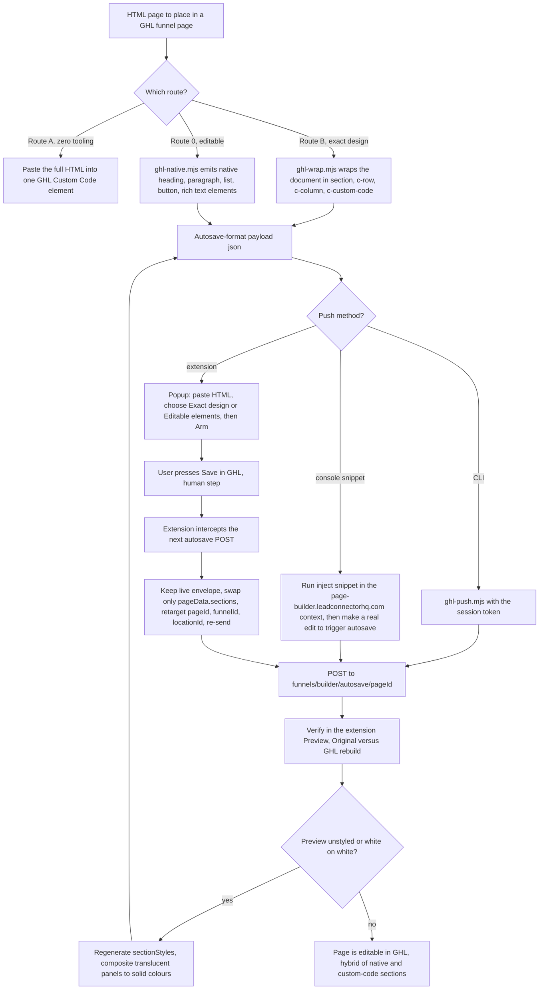

# ghl-builder and Apex GHL Injector (push HTML into the GHL page builder)

> Experimental tooling that gets an arbitrary HTML page, or editable native elements, into a real GoHighLevel funnel page by reusing GHL's own builder autosave request, for the Pivot 2 Thrive and HL Growth Partner team.

| | |
|---|---|
| **Category** | GoHighLevel, CRM and migration automation |
| **Status** | On demand, as of 9 Oct 2026 (experimental; last touched 2026-06-12/13; not part of any scheduled workflow) |
| **Type** | Node CLI scripts, a Chrome MV3 extension ("Apex GHL Injector"), a console injection snippet, plus a Next.js `builder\` app |
| **Runner and schedule** | Manual: the user arms the extension and clicks Save in GHL. No schedule |
| **Client / owner** | P2T / HLGP tooling (an AUSTRAC page payload is also in the folder; its client is not documented in the source) |
| **Stack** | Node (`.mjs` scripts), Chrome extension (Manifest V3), GHL page-builder autosave API on `backend.leadconnectorhq.com` |
| **Source** | Main KB Part 3 section 15 (lines 2154-2192); Part 5 section 8 for the related Hub. Portfolio KB: no matching entry found |

## 1. Description

### What it does
The tooling takes an HTML page and places it in a real GHL funnel page without hand-building it. It does this by capturing the payload GHL's own page builder sends when it autosaves, reproducing that format, and re-sending it. Three outcomes are supported: a whole page wrapped in one Custom Code element (exact design), editable native elements (headings, paragraphs, lists, buttons, rich text), or a hybrid of both.

### Inputs and outputs
- **Inputs:** an HTML page; captured real autosave payloads (`capture_autosave.json`, `capture_element-template_sync.json`); target `funnelId`, `pageId` and `locationId` when retargeting; a session token (JWT) for the CLI route.
- **Outputs:** an autosave-format payload JSON (for example `payload.json`, `austrac-native-payload.json`); an editable or exact-design page in GHL.

### Key components
| Component | Role |
|---|---|
| `ghl-wrap.mjs` | Wraps a whole HTML document in the real envelope `section -> c-row -> c-column -> c-custom-code` (`extra.customCode.value.rawCustomCode`); options `--new-ids --funnel --page --location` |
| `ghl-native.mjs` | Emits editable native elements: `c-heading`, `c-paragraph`, `c-bullet-list`, `c-button`, `c-sub-heading`, `c-rich-text` |
| `ghl-push.mjs` | Pushes a payload to GHL with a token |
| `build-inject-snippet.mjs` and `inject-austrac.js` | Produce a console snippet for injection |
| `extension\` (Apex GHL Injector) | Popup: paste HTML, choose Exact design or Editable elements, Arm; intercepts GHL's next autosave POST (fetch and XHR), keeps the live envelope, swaps only `pageData.sections`, retargets IDs and re-sends; has a Preview (Original versus GHL rebuild) |
| `builder\` | A Next.js app in the same folder (purpose not detailed in the source) |
| `GHL-EXPORT-README.md` | Usage notes |

### Where it lives
- `D:\Project\Client & Agency (Pivot)\HLGP & GoHighLevel\ghl-builder\`
- Memory notes: `C:\Users\<user>\.claude\projects\D--Project-Pivot-ghl-builder\memory\`

## 2. Flow chart

**Reading the chart**
1. A1-D1: three routes. Route A needs no tooling: paste the HTML into one Custom Code or JS element.
2. R2 and R3: Route B keeps the exact design inside one custom-code element; Route 0 builds editable native elements, which render in GHL's default theme.
3. P1-D2: either route produces a payload in the real autosave format; then it is pushed by CLI, by a console snippet or by the extension.
4. P3: for the console route, switch DevTools context from `top` to `page-builder.leadconnectorhq.com`, allow pasting, and trigger a real edit so GHL autosaves. Red 404s and AxiosErrors in the console are GHL noise.
5. P4-H1: browser automation cannot click an extension popup and the token lives in a cross-origin iframe, so the user does the arming click and presses Save.
6. X1-X3: the extension keeps the live envelope, replaces only the sections, retargets the IDs and re-sends to the autosave endpoint.
7. V1-F1: preview shows the result. If headings are unstyled the compiled `sectionStyles` are missing; if sections render white on white, translucent panels need to be alpha-composited to solid colours.
8. E1: native elements keep editability; custom designs (cards, tables, countdowns) survive only in the custom-code route, so a hybrid is the practical answer.

## 3. Case study

### The challenge
GHL's AI builder cannot ingest raw HTML, and the public API exposes list and read endpoints for forms, funnels and surveys but not full create-and-update of the visual builder (a limit recorded in the Pivot GHL Hub project, Part 5 section 8). The need was a way to get designed pages into real funnel pages without rebuilding each element by hand.

### The solution
Capture what GHL itself sends when the builder autosaves, learn the real page schema from those captures, and reuse that request. The tooling provides three ways to build the payload and three ways to push it, with the extension as the most convenient route because it intercepts GHL's next autosave and swaps only the page sections. Confirmed working in June 2026 for native elements and custom-code wrapping on a live page.

### Design decisions and rules learned
- Real save endpoints (POST, host `backend.leadconnectorhq.com`): `funnels/builder/autosave/{pageId}` (body `{funnelId, pageData, pageVersion, pageType:"draft", manualSave, integrations}`), `funnels/builder/element-template/sync/changes`, `.../prebuilt-section/sync/changes` and `.../global-sections/{funnelId}`.
- Real schema: sections have `metaData` and a FLAT `elements[]` whose hierarchy is rebuilt via string-id `child` references; styles are `{value, unit}` objects, not CSS strings. An earlier "invented" nested schema was rejected by GHL.
- The published or preview page renders ONLY from each section's `general.sectionStyles` (compiled CSS keyed by element ids); the builder renders from element `styles`. Always generate `sectionStyles` or preview shows unstyled headings.
- Translucent panels on dark themes must be alpha-composited to solid colours, otherwise sections render white on white.
- Native elements render in GHL's default theme; custom designs survive only through the custom-code route, so a hybrid (native content plus custom-code sections) is the practical answer.

### Outcome
- Confirmed working for native elements and custom-code wrapping on a live page (work dated 2026-06-12/13).
- A Chrome MV3 extension "Apex GHL Injector" is packaged; a Next.js `builder\` app and an AUSTRAC page payload (`austrac-native-payload.json`, `inject-austrac.js`) are in the folder.
- Other usage counts, pages shipped or time saved are not documented in the source.

### Lessons learned
- Copy the platform's real payloads rather than inventing a schema; the invented nested schema failed.
- Preview and builder render from different data, so both must be produced.
- Some steps stay human: arming the extension, pressing Save, and passing the token cannot be automated from outside the page.

## 4. Operating notes
- **Run / pause / debug:** follow the route steps above; retarget IDs when pushing to another page (`--new-ids --funnel --page --location`); verify with the extension's Preview (Original versus GHL rebuild). Console debugging notes are in step 4 of the chart reading.
- **Known issues and open items:** the tool depends on endpoints that appear in GHL's own traffic rather than in public docs, so a GHL change could break it (inferred); the Next.js `builder\` app's role is not detailed; whether the tooling has been used beyond the confirmed live-page test is not recorded.
- **Risks:** A wrong `pageId` or `funnelId` would overwrite the wrong page, so keep a copy of the live page first (inferred); the push route uses a session token (JWT), which must be handled as a secret and not left in shell history or notes (inferred); do not commit captured payloads that contain account ids or tokens.

## 5. Related
- Pivot GHL Hub (`editor`), an OAuth read-only inventory app for forms, funnels and surveys: see Part 5 section 8 of the main KB. Its entry mentions the Apex GHL Injector page-builder work as documented elsewhere, so the two are related but separate projects: the Hub is read-only and uses the public OAuth API, while the injector reuses the builder's own autosave request.
- [GHL AI prompt builder and search-for-ghl](ghl-ai-prompt-builder-and-search-for-ghl.md) (the prompt-based alternative)
- [High-Ticket Sales Accelerator funnel pages](high-ticket-sales-accelerator-funnel-pages.md) (pages built for paste into custom-code elements)
- [GHL API contracts and quirks](ghl-api-contracts-and-quirks.md)
- **Sources:** Main KB Part 3 section 15; Part 5 section 8; `GHL-EXPORT-README.md`, `austrac-native-payload.json`, `capture_*.json`.
