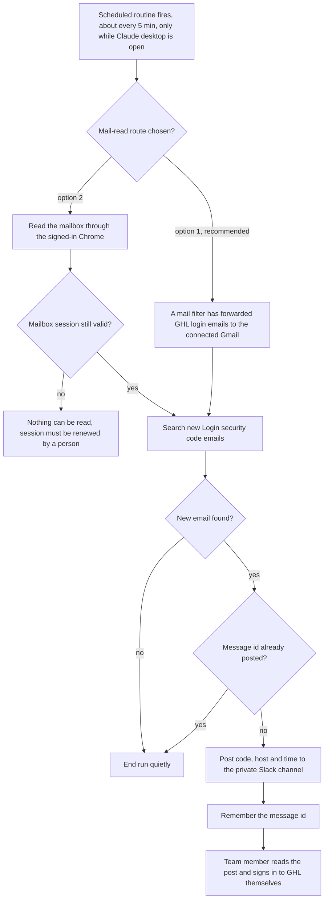

# GHL login security-code relay from a team mailbox to Slack (design only)

> A proposed scheduled routine that would surface GoHighLevel "Login security code" emails, which arrive in a shared team mailbox, in a private Slack channel so team members can log in without access to the mailbox.

| | |
|---|---|
| **Category** | GoHighLevel, CRM and migration automation |
| **Status** | Designed, not built, as of 9 Oct 2026 |
| **Type** | Proposed Claude scheduled task (mail read, then Slack post) |
| **Runner and schedule** | Proposed: every ~5 minutes; would only run while the Claude desktop app is open. Nothing is scheduled |
| **Client / owner** | The team's own GHL logins (which accounts is not stated; P2T and HLGP inferred) |
| **Stack** | Claude scheduled tasks, Gmail connector, Slack connector, optionally the Chrome extension; a hosted team mailbox as the source |
| **Source** | Main KB Part 3 section 11 (lines 1982-2017); Portfolio KB section 20 (lines 662-686) |

## 1. Description

### What it does
The design would look for new GHL "Login security code" emails in a team mailbox and post a short message to a private Slack channel, so that a team member who needs to sign in to GHL can see the code without being given the mailbox itself. It is a relay of messages the team already receives; it would never type a password or a code into a login form.

Only the design exists. This file describes it and the decisions still open; it does not contain, and must never contain, any code values, credentials or mailbox details.

### Inputs and outputs
- **Inputs (proposed):** new "Login security code" emails from GHL's sender addresses; a mail-read route (undecided); the Slack channel. No credentials are stored anywhere.
- **Outputs (proposed):** one Slack message per new email in the form "GHL OTP, host, time"; a record of posted message ids to avoid duplicates. Currently no output exists.

### Key components
| Component | Role |
|---|---|
| Scheduled routine (`schedule` skill) | Would poll about every 5 minutes |
| Mail-read route, option 1 (recommended) | A mail filter forwards GHL's login emails to a Gmail account already connected to Claude; the Gmail connector reads it, with no browser dependency |
| Mail-read route, option 2 | Sign in to the mailbox in the Chrome that Claude controls and read through the browser; breaks when the session expires |
| Private Slack channel | Delivery channel; must be private and team-only |
| Posted-id memory | Remembers message ids already relayed |

### Where it lives
Nothing is built. The working folder for this idea is empty (not found: any script or credential file). The only trace is a single planning transcript.

## 2. Flow chart

Designed flow only; no part of this exists yet.

**Reading the chart**
1. A1: a scheduled routine fires roughly every five minutes; because it is a local Claude task it only runs while the desktop app is open.
2. A2-A4: the route decision is still open. Forwarding to Gmail is recommended because it needs no browser; the browser route depends on a mailbox session that does not persist reliably.
3. A5-A6: if the browser session has expired, nothing can be read until a person signs in again (the reason forwarding is preferred).
4. A7-A10: the routine searches for new security-code emails and skips any message id it has already posted.
5. A11-A12: it posts the code, the GHL host and the time to the private channel, then records the message id.
6. A13: the human step remains: a team member reads the post and logs in. The routine never enters the code.

## 3. Case study

### The challenge
GHL sends a login security code to a shared team mailbox. Team members who need to log in to GHL do not have access to that mailbox, so each login depends on the mailbox owner. The need was a way to show those codes to the team safely and without a person watching the inbox.

### The solution
A design (not an implementation): a polling routine that relays only those emails into Slack, with duplicate protection. The planning session investigated the environment to choose a route and found these facts:
- A suitable private Slack channel already exists; an older bot that posted there was removed in September.
- The Gmail account connected to Claude receives no GHL security-code emails.
- The browser was not signed in to the mailbox.
- No scheduled routine existed.

The session stopped at the question of how to read the mailbox, and the user's answer is not recorded.

### Design decisions and rules learned
- Treat codes as secrets: never store them in files or repositories; the Slack channel must be private and team-only.
- Browser sessions with a hosted mailbox do not persist reliably, so forwarding is the more robust option.
- (Inferred design note) The routine only relays codes the team already receives; it must not type passwords or codes into login forms itself.
- (Portfolio KB) Treat OTP and 2FA as a sensitive authentication process: never store codes in plaintext logs and never bypass security controls.

### Outcome
No measured outcome recorded. The routine was never created and no test message was sent.

### Lessons learned
- Check what the connected tools actually receive before designing around them: here the connected Gmail saw none of the GHL mail.
- Relaying a second-factor code into a chat channel turns that channel into an authentication factor, so its membership and retention need to be controlled (inferred).
- A browser-session design is fragile for unattended work; a server-side forward is sturdier.

## 4. Operating notes
- **Run / pause / debug:** To resume, decide between forwarding and browser reading, name the mailbox, create the scheduled task with the `schedule` skill, and send one test message. There is nothing to pause today.
- **Known issues and open items:** Route undecided; no mailbox access arranged; no scheduled task; the portfolio KB lists OTP/2FA login handling for GHL as reported work, but the main KB found no build (the main KB is preferred).
- **Risks:** Posting second-factor codes to Slack weakens the intent of 2FA if the channel membership grows or messages are retained; the routine would run only while a desktop is open, so it is not a dependable login path; alternatives such as individual accounts or a managed shared-login arrangement are worth weighing (inferred).

## 5. Related
- [Slack team notifications](../09-integrations-operations/slack-team-notifications.md)
- [GHL API contracts and quirks](ghl-api-contracts-and-quirks.md)
- **Sources:** Main KB Part 3 section 11; Portfolio KB section 20; one planning transcript.
