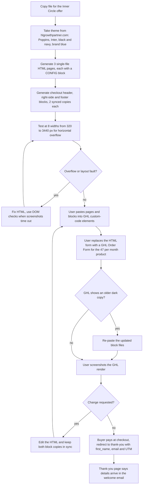

# High-Ticket Sales Accelerator funnel pages (offer, checkout and thank-you HTML for GHL)

> Three single-file HTML pages and three checkout blocks for the HL Growth Partner "High-Ticket Sales Accelerator" Inner Circle membership, ready to paste into GoHighLevel custom-code elements.

| | |
|---|---|
| **Category** | GoHighLevel, CRM and migration automation |
| **Status** | On demand, as of 9 Oct 2026 (pages built and iterated to a final state; live GHL wiring and the Order Form product are the user's job and not verified) |
| **Type** | Static HTML funnel pages (CSS and JS inline) for GHL Custom Code elements |
| **Runner and schedule** | Manual request in Claude Code. No schedule |
| **Client / owner** | HL Growth Partner (HLGP) |
| **Stack** | HTML, CSS, vanilla JS, GoHighLevel funnel Custom Code elements and Order Form element; theme from hlgrowthpartner.com |
| **Source** | Main KB Part 3 section 14 (lines 2113-2150). Portfolio KB: no matching entry found |

## 1. Description

### What it does
Builds the offer page, checkout page and thank-you page for the HLGP "High-Ticket Sales Accelerator" Inner Circle membership from the copy in `High-Ticket_Sales_Accelerator_Inner_Circle_Copy.md`. Each page is one HTML file with CSS and JavaScript inline so it can be pasted into a GHL custom-code element. Extra paste-in blocks cover the checkout header, right-hand side and footer.

### Inputs and outputs
- **Inputs:** the markdown copy file; the theme taken from hlgrowthpartner.com (Poppins extra-bold headings, Inter body, black and navy with a bright blue accent `#008DF5`, gradient text); a logo asset from the Sprint page; a hosted portrait image URL on the GHL media CDN; the user's screenshots of GHL renders.
- **Outputs:** `funnel/high-ticket-sales-accelerator.html`, `...-checkout.html`, `...-thankyou.html`, plus `checkout-header.html`, `checkout-right-side.html`, `checkout-footer.html` (two identical copies of each kept in sync, one set with the `high-ticket-sales-accelerator-` prefix).

### Key components
| Component | Role |
|---|---|
| `CONFIG` block at the top of each script | Holds checkout and redirect URLs, deadline, seat counter, support email and links, so values change in one place |
| Offer page | Sells the membership; price $47 USD per month everywhere |
| Checkout page | Light theme, HLGP logo header linking to `https://hlgrowthpartner.com/`; redirects to the thank-you page with `first_name` and `email` query parameters and preserves UTM |
| Thank-you page | Says the details arrive in the welcome email |
| GHL Order Form element | The part that actually takes payment; tied to a $47 per month recurring product (set up by the user in GHL) |

### Where it lives
`D:\Project\Client & Agency (Pivot)\HLGP & GoHighLevel\High-Ticket Sales Accelerator\funnel\*.html`, with the md copy file in the parent folder. Paths on `hlgrowthpartner.com` are set to `/high-ticket-sales-accelerator`, `/high-ticket-sales-accelerator-checkout` and `/high-ticket-sales-accelerator-thankyou`.

## 2. Flow chart

**Reading the chart**
1. A1-A4: pages and blocks are generated from the copy file and the HLGP site theme, each with a `CONFIG` block for URLs, support email and links.
2. A5-A7: layouts are tested at eight widths from 320 to 3440 px; where screenshots time out, DOM checks are used.
3. A8-A9: the human steps. The user pastes the HTML into GHL custom-code elements and swaps the non-paying HTML form for a GHL Order Form element tied to the real product. The product price in GHL is what actually charges.
4. A10-A11: GHL once kept an older dark copy after edits, so updated block files are re-pasted.
5. A12-A14: the user shares screenshots; changes are made and re-pasted. The requested iterations were: logo header only, a white checkout (no black), $17 changed to $47, remove the first-call date and the vault mention, remove "membership terms", an image grid, an animated background, and a mobile hero tweak.
6. A15-A16: on payment the buyer is sent to the thank-you page with `first_name` and `email` parameters and UTM preserved.

## 3. Case study

### The challenge
HLGP needed an offer, checkout and thank-you experience for a new Inner Circle membership that matched the HLGP brand and could be dropped into GHL without rebuilding it by hand. The pages had to work from 320 px phones to 3440 px ultrawide screens and carry no promises that could not be kept.

### The solution
Single-file HTML pages with inline CSS and JS, each driven by a `CONFIG` block, plus paste-in checkout blocks. Build began on 2026-09-25 and the user then directed a series of refinements until the final state: price $47 USD per month everywhere, a light checkout theme, the HLGP logo header linking to the HLGP site, responsive from 320 to 3440 px, no deadline, seat or first-call-date claims, and a thank-you page that points to the welcome email for details.

### Design decisions and rules learned
- The HTML checkout form does not take payment. Swap it for a GHL Order Form element tied to a $47 per month recurring product; the product price in GHL is what charges.
- Re-paste updated block files into GHL; GHL kept an older dark copy after edits.
- Same-domain relative paths work only once the pages are live with exactly those step paths, so local files do not resolve their links.
- The footer and sign-off still said "Pivot 2 Thrive" while the brand was HL Growth Partner: confirm the brand per page.
- The final pages carry no deadline, seat or first-call-date claims (the first onboarding call date and the vault mention were removed at the user's request), although the `CONFIG` block still has deadline and seat-counter settings.

### Outcome
- Three HTML pages and three checkout blocks (with copies) built and iterated from 2026-09-25 to the final state described above.
- Not verified in the source: that the funnel steps are live on the HLGP domain, that the Order Form product exists, or any sales result.

### Lessons learned
- Keep payment in the platform's own order element; custom HTML is for presentation only.
- Keep editable values in a `CONFIG` block so URL, price copy and links change in one place.
- Verify branding on every page and every pasted block, since copies drift (two copies per block, GHL's own cached copy).

## 4. Operating notes
- **Run / pause / debug:** edit the `CONFIG` block; open locally to check layout (links resolve only on the live domain); re-paste into GHL after each change; check at several widths.
- **Known issues and open items:** footer and sign-off brand mismatch (Pivot 2 Thrive versus HL Growth Partner); live GHL wiring not verified; the Order Form product must match $47 per month.
- **Risks:** a price mismatch between page copy and the GHL product; stale GHL copy of a block; promises (dates, seats) reintroduced by mistake.

## 5. Related
- [GHL AI prompt builder and search-for-ghl](ghl-ai-prompt-builder-and-search-for-ghl.md) (another way to get pages into GHL)
- [GHL builder and Apex injector](ghl-builder-apex-injector.md)
- **Sources:** Main KB Part 3 section 14; session "Checkout funnel HTML page".
