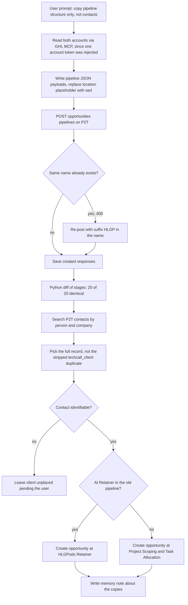

# HLGP to P2T pipeline copy and client placement

> A one-off script-and-API job that copied the structure of the HLGP "Lead Pipeline" and "Client Project Status" pipelines into the P2T GHL sub-account and placed the 17 current P2T clients into the new status pipeline.

| | |
|---|---|
| **Category** | GHL, CRM and migrations |
| **Status** | On demand, as of 9 Oct 2026 (one-off run completed 2026-09-11) |
| **Type** | One-off Claude Code session using the GHL REST API, the two GHL MCP servers and JSON payload files |
| **Runner and schedule** | Manual, one session (the same prompt appears in 4 transcript copies). No schedule. |
| **Client / owner** | P2T (Pivot 2 Thrive) and HLGP (HL Growth Partner), internal; owner Hari |
| **Stack** | GHL API v2 (`POST /opportunities/pipelines`, `POST /opportunities/`), GHL MCP connectors `ghl-HLGP` and `ghl-pivot2thrive`, Python (diff), bash `sed` |
| **Source** | Main KB Part 3 section 8; Portfolio KB section 20 (brief mention) |

## 1. Description

### What it does
Copies the pipeline STRUCTURE (not contacts or opportunities) of the HLGP "Lead Pipeline" and "Client Project Status" into the P2T sub-account, then puts the 17 current P2T clients into the new Client Project Status pipeline as opportunities. The user corrected the scope mid-run: only the pipeline structure, not the contacts.

### Inputs and outputs
- **Inputs:** `D:\Project\Client & Agency (Pivot)\Pivot2Thrive & Content\Hlgp and pipeline setup\.env` with the NAMES `hlgp_location`, `hlgp_pit`, `p2t_location`, `p2t_pit`; the client list given by the user in chat; both accounts' pipelines read through the MCP connectors.
- **Outputs:** two pipelines in P2T, "Lead Pipeline (HLGP)" (12 stages) and "Client Project Status (HLGP)" (8 stages), 20 of 20 stages diffed identical to HLGP; 17 client opportunities; JSON payloads `pipelines\lead-pipeline.json`, `pipelines\client-project-status.json` and the created responses `pipelines\created-*.p2t.json`; a memory note `p2t-hlgp-pipeline-copies.md`.

### Key components
| Component | Role |
|---|---|
| `pipelines\lead-pipeline.json`, `client-project-status.json` | Payloads: name, `showInFunnel`, `showInPieChart`, `useOpportunityProbability`, `colorRenderMode`, stages with position, probability and colour. The `locationId` placeholder `__P2T_LOCATION__` is replaced by `sed`. |
| GHL MCP servers | Read-only access to both accounts when one account's token was rejected. |
| Diff script (Python) | Compares name, position, `showInFunnel`, `showInPieChart`, probability and colour between source and copy. |
| Memory note | `p2t-hlgp-pipeline-copies.md` so later sessions know the copies exist. |

Client Project Status stages copied (8): Project Scoping & Task Allocation (20%), Sprint (80), Phase 1 (40), Phase 2 (60), HLGPods Retainer (80), Onboarding & Support (80), Project Blocked / Paused (80), Project Completed (80), colour `#64748B`. Lead Pipeline stages (12, colour mode bg-tint): an advisor lead-to-follow-up stage, New Lead, Strategy Call (Scheduled, No Show-Cancelled, SHOWED), Proposal Sent, Proposal Signed, Invoicing, Onboarding Email sent, On-boarding call Scheduled, Not Interested, Active Client.

### Where it lives
`D:\Project\Client & Agency (Pivot)\Pivot2Thrive & Content\Hlgp and pipeline setup\` (`pipelines\client-project-status.json`, `pipelines\created-client-project-status.p2t.json`; the lead-pipeline JSON files are referenced by the session but not present). A `.claude\launch.json` in that folder belongs to an unrelated sales-dashboard preview.
## 2. Flow chart

**Reading the chart**
1. The user asked for the pipeline structure only; contacts and opportunities were not to be copied.
2. One account's token returned `401 Invalid Private Integration token`, so both accounts' pipelines were read through the GHL MCP connectors (read-only worked).
3. Payloads were written with a placeholder location id, replaced with `sed`.
4. `POST /opportunities/pipelines` on P2T used `Version 2021-07-28` (works although the docs say v3). The first attempt failed with `400 Pipeline with the same name already exists`, so the name got the suffix " (HLGP)".
5. A Python diff confirmed all 20 stages match on name, position, funnel and pie flags, probability and colour.
6. For each of the 17 clients the full contact record was found and an opportunity created at the entry stage, except clients already at "Retainer" in the old pipeline who went to "HLGPods Retainer".
7. One client was left unplaced pending which contact to attach.
8. A memory note records that the copies exist.

## 3. Case study

### The challenge
The team wanted P2T to use the same Lead Pipeline and Client Project Status structure that HLGP had. Only the pipeline structure was in scope; contacts and opportunities were explicitly out of scope, and the 17 current P2T clients then had to be placed into the new status pipeline.

### The solution
Read the source pipelines, write them as JSON, create them through the API with the stage definitions copied exactly, verify with a programmatic diff, then add the 17 clients as opportunities at the correct entry stage. The original same-named P2T pipelines (Lead Pipeline with 5 open opportunities; Client Project Status with 27 open opportunities) were left untouched.

### Design decisions and rules learned
- GHL rejects duplicate pipeline names in a sub-account (400). Rename or suffix.
- GHL has no API for Workflows, and a pipeline update replaces the whole stage list, so never rename or create stages programmatically.
- The `.env` has Windows CRLF line endings; sourcing in bash corrupts values. Use `. <(tr -d '\r' < .env)`.
- If a token is rejected, create a new one in that sub-account (Settings, Private Integrations) before write work; read-only MCP access worked meanwhile.
- Duplicate low-quality "techcall_client" contacts (created 10 Jul 2026, name and company only) exist for most clients: use the full records and merge in GHL later.
- A stage mapping for a later migration of the 32 old opportunities was proposed (old `Retainer` to `HLGPods Retainer`; others to the entry stage) but NOT executed.
- Working rule: stages are moved manually by the team; the automation handles notes and tasks (see Client Project Updates).

### Outcome
- Completed 2026-09-11. Created "Lead Pipeline (HLGP)" (12 stages) and "Client Project Status (HLGP)" (8 stages), 20 of 20 stages diffed identical to HLGP.
- 17 client opportunities created in the new Client Project Status pipeline, all at the entry stage "Project Scoping & Task Allocation" except retainer clients.
- One client left unplaced pending the choice of contact. The old pipelines still exist and some clients appear in both.

### Lessons learned
- Scope matters: the user corrected the run mid-way ("only the pipeline structure, not the contacts"), so confirm exactly what is to be copied before starting.
- Verify copies with a programmatic diff, not by eye.
- Leave the original records alone; put copies beside them with a distinct name.

## 4. Operating notes
- **Run / pause / debug:** Re-posting the same payload fails with the duplicate-name error; to re-copy, change the name. Dry-diff stages through `GET /opportunities/pipelines?locationId=`.
- **Known issues and open items:** The 32 old opportunities have not been migrated to the new pipeline; one client is unplaced; the lead-pipeline JSON files are not present on disk.
- **Risks:** Two pipelines with similar names exist in P2T (original and "(HLGP)" copy), so clients can appear in both and be confused. A pipeline update replaces the whole stage list.

## 5. Related
- [Client Project Updates](../01-scheduled-tasks-reporting/client-project-updates.md) (the automation that keeps the Client Project Status pipelines current)
- [GHL API contracts and quirks](ghl-api-contracts-and-quirks.md)
- **Notes on sources:** Portfolio KB section 20 lists "Pipeline copying from HLGP to P2T" without detail; no conflict with the main KB.
- **Sources:** Main KB Part 3 section 8; Portfolio KB section 20.
