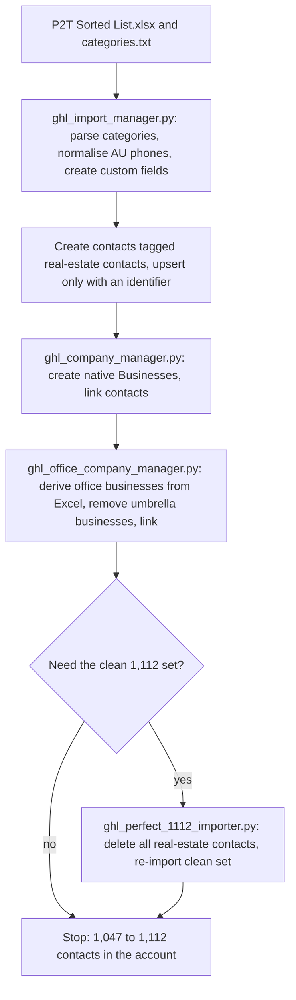
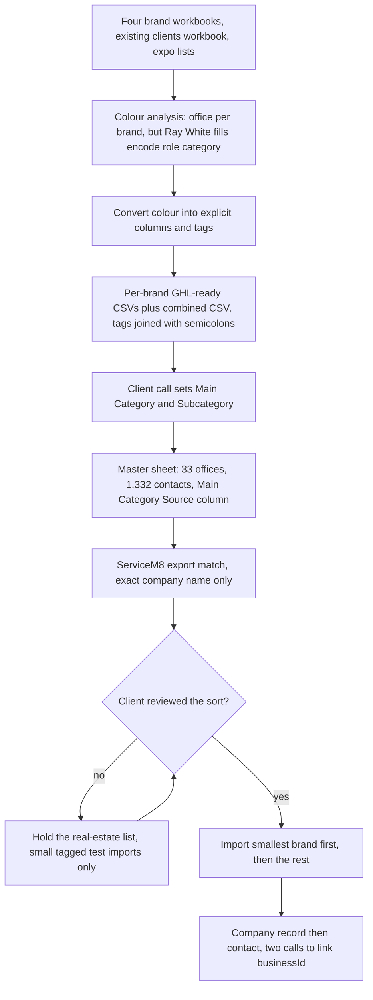

# Real-estate prospect importers (Python scripts and colour-coded workbook staging)

> Python scripts and a staged master sheet that load Wasteman Rubbish Removal's real-estate prospect lists into its GHL account as tagged contacts grouped under per-office Businesses.

| | |
|---|---|
| **Category** | GHL, CRM and migrations |
| **Status** | Legacy or retired, as of 9 Oct 2026 (earlier importers done; the colour-coded workbook import was never run in full) |
| **Type** | Python scripts (pandas, requests, dotenv), plus ad-hoc in-session Python for the workbook staging |
| **Runner and schedule** | Manual `python <script>.py`. Importer files are dated 2026-08-18; workbook sessions ran 2026-08-05 to 2026-08-11. |
| **Client / owner** | Wasteman Rubbish Removal (client); built by the P2T team (owner: Hari) |
| **Stack** | GHL v2 REST (contacts, businesses, custom fields), Python, pandas, openpyxl, Excel/CSV |
| **Source** | Main KB Part 3 section 4; Part 5 section 4 |

## 1. Description

### What it does
Two related efforts for the same client. (a) Four Python scripts loaded an AI-scraped real-estate prospect list (`P2T Sorted List.xlsx` plus a two-level `categories.txt` taxonomy) into the Wasteman GHL account as contacts tagged `real-estate contacts`, grouped under native GHL Businesses per real-estate office. (b) A planning-and-staging session turned messy, colour-coded brand workbooks into GHL-ready CSVs and a master sheet that preserves the hierarchy brand tag, company (office), contact, details.

### Inputs and outputs
- **Inputs:** `P2T Sorted List.xlsx`, `categories.txt`, `.env` keys `pit_token`, `Location`. For the workbook work (in `Workflows & Automation\excel\`): four brand workbooks (Harcourts/PropertyHub Gold Coast, LJ Hooker Gold Coast/Tweed Shire, McGrath Gold Coast/Tweed Shire, Ray White Gold Coast/Tweed Shire FINAL), an existing-clients real-estate workbook in HubSpot shape, expo material (exhibitor list docx with 216 people, stand-meetings contact list, a voucher image), `ServiceM8_Export.xlsx`, a Fathom call with the client contact, and a Google Sheet pilot roster of 245 people.
- **Outputs:** contacts and Businesses in the Wasteman location; per-brand GHL-ready CSVs, `Wasteman_Master_Import_Sheet.xlsx`, a GHL Import Architecture artifact (a private Claude artifact that contains real business data), and tagged test records.

### Key components
| Component | Role |
|---|---|
| `ghl_import_manager.py` | Parse categories, normalise AU phones, create or get contact custom fields, create contacts tagged `real-estate contacts` (upsert only when an identifier exists). |
| `ghl_company_manager.py` | Create native Businesses from `COMPANIES_TO_CREATE`, fetch all contacts, link contacts to businesses. |
| `ghl_office_company_manager.py` | Derive office businesses from the Excel with `clean_office_name`, remove "umbrella" businesses, set contact company names, link. |
| `ghl_perfect_1112_importer.py` | Delete all `real-estate contacts` and re-import the clean 1,112 set with office businesses and mobile normalisation. Destructive for that tag. |
| `Wasteman_Master_Import_Sheet.xlsx` | README, Companies tab (33 unique offices), All Contacts tab (1,332 after recovering 23 people). |

### Where it lives
`D:\Project\Client & Agency (Pivot)\Websites & Funnels\wasteman\master_sheet\ghl_*_manager.py` and `ghl_perfect_1112_importer.py`; logs `ghl_import.log`, `ghl_companies.log`, `ghl_office_companies.log`, `ghl_perfect_1112_import.log` (not found on disk). Workbook sources: `D:\Project\Client & Agency (Pivot)\Workflows & Automation\excel\` (the session's original working folder no longer exists). The staging outputs (master sheet, `Coastal_Property_Agents_Classified.xlsx`, per-brand CSVs, `Company_Name_Conflicts_TO_REVIEW.csv`) and the Excel and `categories.txt` inputs for the scripts were not found (probably moved). Transcripts: `C:\Users\<user>\.claude\projects\D--Project-Pivot-excel\` (four forks).

## 2. Flow chart

Python importers (completed earlier). Re-running the last step is destructive for the tag.

Colour-coded workbook staging (planned, import gated on client sign-off):

**Reading the chart**
1. The scripts start from the sorted list and category file, create contact custom fields, normalise phones and create contacts only when an email or phone exists.
2. Native Businesses are created and contacts linked; later the offices are derived from the Excel and umbrella businesses removed. Matching is by name, so reruns are idempotent.
3. The "perfect 1,112" script deletes every `real-estate contacts` contact and re-imports the clean set, so it is not to be run casually.
4. In the workbook work, colour meaning differs per brand (office for three brands, role category for Ray White), so colour is converted into explicit columns and tags before import.
5. The client call defined the real classification (Residential, Commercial, Education, Government; subcategories such as Real Estate Agent and Property Management).
6. The real-estate list is gated: sort, client review, then import only after sign-off. The expo list imports directly.
7. Linking a contact to a company takes two API calls: create the contact, then update with `businessId` (not accepted on create). The contact's Company Name must match the Company record name exactly.

## 3. Case study

### The challenge
Wasteman's marketing database lived in spreadsheets whose relationships were encoded in cell colour or per-file structure. The team needed a clean hierarchy in GHL (click a company, see its people and details) without duplicating contacts, and the scraped prospects had to remain distinguishable from ServiceM8 customers.

### The solution
Scripts created contacts and per-office Businesses with a protective tag. For the colour-coded workbooks, the colour meaning was analysed per brand and converted into columns, then CSVs, a master sheet and a classification driven by explicit signals. Small tagged test imports verified the approach before any full import.

### Design decisions and rules learned
- The target hierarchy is tag (brand or source), then Company record (office or building), then Contact. GHL's location had `allowDuplicateContact:false` with email and phone matching, so re-imports update rather than duplicate.
- Tags in CSVs are joined with `;` because GHL splits on `;` and some names contain commas.
- Main Category is set from explicit signals in priority order (job title text, office or company text including "RWC" as Ray White Commercial, the Coastal brand field). 71% (951) were left blank because no signal existed. Subcategory was Real Estate Agent (1,141) or Property Management (191). Repeat or new is held until a ServiceM8 match. Grey rows mean blank; orange means Needs Review.
- ServiceM8 matching uses exact company name only (9 of 33 companies matched); fuzzy matching was removed after two false positives. Customer status was derived from ServiceM8 jobs: 2 or more completed means Repeat, exactly 1 means New, jobs but none completed means Unsuccessful Quote.
- Names that look duplicated may be different businesses (the client said two Ray White offices are separate; the earlier "conflict" flag was wrong). Always check every sub-sheet: Ray White's Property Managers tab held 23 people missing from its own master tab.
- `backup_and_delete_sm8.py` refuses to delete any contact tagged `real-estate contacts` (a safe-tag guard); copy that guard for any bulk delete. Phone sharing among office switchboards is the main hazard when later upserting ServiceM8 people.
- User rules in session: label everything "Wasteman", not P2T or HLGP; do not include ServiceM8 in the classification pass unless asked; do not push to Pivot 2 Thrive; "HLGP" and "HLGP Demo" are different accounts.
- Credentials: a `.env` written as `pit:...` / `location:...` is not KEY=VALUE and was never read. A PIT is scoped to exactly one location. Repeated `401 Invalid Private Integration token` through the plugin connector could not be fixed by editing `.env`; direct REST calls with the PIT as Bearer worked.
- The GHL connector tools can create, update, upsert and get contacts only (no delete, no custom-field or company creation); with a PIT the REST API can do those.
- Phones auto-normalise to +61. A voucher expiry conflict (image says 30 Sept 2026, contact list says 31 Aug) was left to resolve before a field goes live.

### Outcome
- The Wasteman account held 1,047 to 1,112 `real-estate contacts` after the importer work, with office Businesses. The 1,112-set importer is dated 2026-08-18.
- Test imports: 19 contacts were pushed to the Pivot 2 Thrive account (tagged `TEST - Wasteman Trial (safe to delete)`; the user objected and the connector had no delete tool, so a manual bulk delete by tag was required). A sandbox "HLGP Demo" location then received 4 custom fields (Main Category, Subcategory, Wasteman Lead Source, Customer Status), one real Company record and 3 linked contacts.
- `ServiceM8_Export.xlsx` counts: Companies 7,046; Company Contacts 6,910; Categories 122; Jobs 10,973; Job Contacts 16,897.
- The full real-estate import was NOT run; it was gated on client sign-off of the category sort. Whether the 1,047-1,112 contacts came from the workbooks or the sorted list is not stated; they are documented as the AI-scraped list.

### Lessons learned
- Fix the data model before importing; a master sheet with a source column for each decision keeps classification auditable.
- Keep unmatched or unknown companies with a "Needs Review" tag rather than guessing.
- Use removable test tags for any trial import, and never use the P2T account for client tests.

## 4. Operating notes
- **Run / pause / debug:** Re-run order: import manager, then company and office managers (idempotent matching by name). `ghl_perfect_1112_importer.py` deletes the whole tag first; do not run casually. For workbook work, no packaged script exists; rebuild CSV or XLSX from the source workbooks, import the smallest brand first (McGrath, 79 contacts) as a test batch, and filter by the TEST tag to review or delete.
- **Known issues and open items:** Inputs and logs not found on disk; full import pending client sign-off.
- **Risks:** Destructive re-import; phone collisions on switchboard numbers; the architecture artifact contains real business data and sharing is the user's own step.

## 5. Related
- [Wasteman ServiceM8 to GHL migration](wasteman-servicem8-ghl-migration.md) (must preserve these contacts)
- [ServiceM8 to GHL migration engine](servicem8-ghl-migration-engine.md)
- **Sources:** Main KB Part 3 section 4; Part 5 section 4. Portfolio KB has no matching entry.
