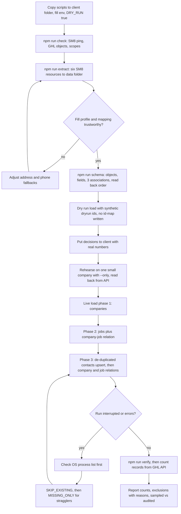
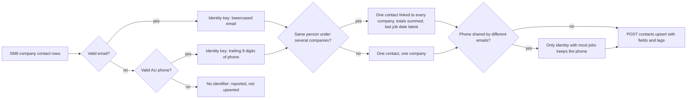

# ServiceM8 to GoHighLevel migration engine (skill and Tint Melbourne reference run)

> A tested, resumable Node.js engine that loads a ServiceM8 account into a client's GoHighLevel sub-account as native custom objects with associations, so any CRM contact shows its company, its jobs and its job contacts.

| | |
|---|---|
| **Category** | GHL, CRM and migrations |
| **Status** | On demand, as of 9 Oct 2026 |
| **Type** | Node.js CLI scripts (zero dependencies) packaged as the Claude skill `servicem8-ghl-migration` |
| **Runner and schedule** | Manual. Steps are run by hand with `npm run ...`. No schedule, and nothing writes back to ServiceM8. |
| **Client / owner** | Tint Melbourne (reference run); reused for Wasteman. Built by the P2T team (owner: Hari). |
| **Stack** | Node 20.6 or later (native fetch and `--env-file`), ServiceM8 REST API, GHL API v2 (custom objects, associations, contacts upsert) |
| **Source** | Main KB Part 3 section 1; Part 8 skill entry `servicem8-ghl-migration`; Portfolio KB section 14 |

## 1. Description

### What it does
Performs a one-time, one-way load of a ServiceM8 (SM8) account (companies, company contacts, jobs, job contacts, categories) into a client's GHL sub-account. Companies and jobs become custom objects, contacts are de-duplicated into native GHL contacts with rollup fields, and three associations let every record navigate to the other two. Flattening jobs into `job_1_*` contact fields or a JSON text blob was rejected because the biggest Tint client has 1,196 jobs.

### Inputs and outputs
- **Inputs:** SM8 API key (`SM8_API_KEY`, sent as `X-Api-Key`) or `SM8_EMAIL` plus `SM8_PASSWORD` as a Basic-auth fallback. A GHL Private Integration Token for the CLIENT sub-account (`GHL_TOKEN`) and `GHL_LOCATION_ID`, with scopes for contacts, object schema, object records, associations, relations and location custom fields. The client plan must include Custom Objects (Opportunities are the documented fallback). Optional exclusion CSV (`EXCLUDE_CSV`).
- **Outputs:** two custom objects, 39 object fields, 8 contact fields, 3 associations, company and job records, de-duplicated contacts tagged `sm8-imported`. Local files: `out/schema-map.json`, `out/id-map.json`, `out/shape.json`, run logs, `data/*.json` extracts.

### Key components
| Component | Role |
|---|---|
| `scripts/00-check.js` | Pings SM8 and GHL, checks objects, associations and scopes. A 403 means a missing objects/schema scope, a 401 means a bad token. |
| `scripts/01-extract.js` | Pulls six SM8 resources (company, companycontact, job, jobcontact, category, staff) and prints a field-fill profile. |
| `scripts/02-schema.js` | Idempotent. Creates objects, folder, fields, contact fields and associations, then reads back the stored order into `schema-map.json`. |
| `scripts/03-load.js` | Three-phase load with dry-run mode, `--only` rehearsal, `SKIP_EXISTING` and `MISSING_ONLY` resume. |
| `scripts/04-verify.js` | Compares the id-map to expected and prints the deepest companies. |
| `src/transform.js` | `buildContactIdentities()` de-duplication, phone and date cleaning. |
| `src/pool.js`, `src/http.js` | 8 requests in flight, limiter of 70 requests per 10 s, retry with `Retry-After`. |
| `MIGRATION-PROMPT.md` (13 KB) | Reusable prompt to drive the same job from a fresh Claude session. |

Entity model (SM8 to GHL):

| SM8 resource | GHL target |
|---|---|
| `company` | custom object `custom_objects.sm8_company` (14 fields, primary display Company Name) |
| `job` | custom object `custom_objects.sm8_job` (25 fields, primary display Job Number, status Quote / Work Order / Completed / Unsuccessful) |
| `companycontact` | native GHL contact, de-duplicated, plus 8 rollup custom fields and tags |
| `jobcontact` | embedded on the Job record by default (Job Contact, Role, Phone, Email, All Job Contacts, count). `CREATE_JOB_CONTACTS=true` also creates them as contacts. |
| `category` | Job field `Category` plus contact tags `sm8-category-<slug>`; inactive categories stay in the lookup |
| links | 3 associations: `sm8_company_contacts`, `sm8_company_jobs`, `sm8_job_contacts`. GHL renders both sides, giving 6 navigation directions. |

Tags on migrated contacts: `sm8-imported`, `sm8-category-<slug>`, `sm8-status-<last job status>`, `sm8-multi-company`, `sm8-no-jobs`.

### Where it lives
- Reference code: `D:\Project\Client & Agency (Pivot)\Tint_melbourne\` (`scripts\`, `src\`, `test\`, `package.json`, `README.md`, `MIGRATION-PROMPT.md`).
- Skill copy: `C:\Users\<user>\.claude\skills\servicem8-ghl-migration\` (`SKILL.md`, `references\model.md`, `data-validation.md`, `ghl-api-contracts.md`, `scripts\migration\`), also zipped as `Tint_melbourne\servicem8-ghl-migration.skill` (54 KB).
- Environment variable NAMES (`.env`, gitignored): `SM8_API_KEY`, `SM8_EMAIL`, `SM8_PASSWORD`, `GHL_TOKEN`, `GHL_LOCATION_ID`, `DRY_RUN`, `LINK_CONTACTS_TO_JOBS`, `CREATE_JOB_CONTACTS`, `EXCLUDE_CSV`, `CONCURRENCY`, `SKIP_EXISTING`, `MISSING_ONLY`, `DRY_RUN_VERBOSE`; the skill adds `PHONE_COUNTRY_CODE`, `PHONE_NATIONAL_PREFIXES`, `PHONE_NATIONAL_LENGTH`.
- The agency MCP servers (`ghl-pivot2thrive`, `ghl-HLGP`) cannot see the Tint sub-account, so a client-specific token from `.env` is used.

## 2. Flow chart

**Reading the chart**
1. Copy `scripts/migration/` into the client folder, create `.env` from `.env.example` and keep `DRY_RUN=true`.
2. `check` confirms both APIs answer and the token has the right scopes.
3. `extract` writes the six resources to `data/*.json` and prints how well each field is filled. The profile must be read before trusting the mapping.
4. If fill rates disagree with the mapping (for example city/state/postcode ~19% filled versus `billing_address` 89%), adjust fallbacks and re-extract.
5. `schema` is idempotent and records the association order GHL actually stored.
6. A dry run mints synthetic ids so relation counts are meaningful and never writes the id-map.
7. Open decisions go to the client with numbers: orphan jobs, placeholder clients, the exclusion CSV, pre-existing GHL contacts, whether job contacts become CRM contacts.
8. A one-company rehearsal is read back from the API and eyeballed in GHL.
9. The live load runs companies, then jobs, then contacts.
10. If the run died, first confirm no `node` process is still running, then resume with `SKIP_EXISTING`, then `MISSING_ONLY`.
11. Verification counts from GHL itself, not from the id-map, and the report names what was sampled.

Contact de-duplication (phase 3) is a distinct sub-flow:

1. Identity is the lowercased valid email, otherwise the last 9 digits of an AU-normalised phone.
2. Rows with neither identifier cannot be upserted and are reported, never silently dropped.
3. A person found under several companies becomes one contact associated with every company, with Total Jobs and Lifetime Value summed.
4. A phone shared by people with different emails (switchboards) stays with the identity that has the most jobs; a phone is never stripped from someone whose only identifier it is.
5. The collapsed identity is then upserted, so GHL's merge on email or phone cannot overwrite people.

## 3. Case study

### The challenge
Tint Melbourne needed its ServiceM8 history inside GHL so that clicking a contact shows the company, every job, the job contacts and categories. ServiceM8 holds one contact row per company, so the same person repeats (one email sat under 7 clients), and GHL upserts on email OR phone with last-write-wins. The source was large: 8,701 companies (8,645 active), 10,994 jobs (10,828 active), 8,094 company contacts (8,068 active), 15,427 job contacts and 18 categories (6 active). Only about 94.6% of contacts were reachable and roughly 435 had no identifier.

### The solution
A custom-object model (company, job) with three associations, plus a de-duplicated contact layer with rollup fields. The load was split into companies, jobs and contacts, with a checkpointed id-map for resume, a dry run, a one-company rehearsal and a verification step that counts from GHL. The work was then packaged as a skill on 2026-09-18 and reused for Wasteman.

### Design decisions and rules learned
- Custom objects rather than flattened contact fields: unlimited jobs per company, and navigation both ways. GHL imposed no cap on relations per record (verified at 1,196 job relations on one company).
- Read-only extract and schema first, with the field-fill profile reviewed before any load (the owner did not want all data imported blindly).
- Job contacts embedded on the job record instead of becoming CRM contacts (the owner's call).
- Duplicates: contacts in the duplicates CSV were withheld, everything else migrated with proper tags. Deleting 25 duplicate company records was put to the owner first.
- Twelve GHL API contracts were learned the hard way, including: records take the SHORT property key; `POST /custom-fields/` needs `fieldKey` and `parentId`; associations can be stored reversed (2 of 3 flipped), so always pass relation ends by object key; "relation already exists" returns 400, 409 or 422 and counts as success; transient `401` under load must be retried; `PHONE` fields need strict E.164. See [GHL API contracts and quirks](ghl-api-contracts-and-quirks.md) for the consolidated list.
- Data-validation rules: AU E.164 conversion (never invent an area code), take only the phone-like prefix of free text, treat `0000-00-00 00:00:00` as empty, strip newlines from addresses, take SM8 timestamps as written. A bad field never fails a record.
- Measure the real rate: the first estimate (2.3 h from the rate limit) was wrong because sequential calls were latency-bound at about 675 ms each. About 58.8k API calls would take ~11 h sequentially versus ~2.4 h with 8 in flight at roughly 7 req/s.
- A background process can survive session teardown while the task tracker says stopped. Two overlapping runs created 25 duplicate company records, so check the OS process list before every resume.
- Orphan analysis: 471 orphan jobs (450 under archived clients, 21 with no company); 429 of them sat under internal placeholder clients (staff-leave scheduling), only about 42 look like real customer jobs.

### Outcome
- Tint run COMPLETE and verified from the GHL API on 2026-09-10: 8,645 companies, 10,357 jobs and 7,207 contacts migrated (plus 32 pre-existing non-SM8 contacts), 0 duplicate UUIDs, sampled contacts all showing Company and Jobs panels.
- Dry run reported 8,645 companies, 10,357 jobs, 7,365 contacts and 34,623 relations with 0 errors. Run 2 reported 28,551 relations created; the exact final relation count was not recorded.
- Relation health was sampled, not exhaustively audited (a ~90 minute full audit was offered; no evidence it ran).
- Not migrated by design, client decisions still open: 471 orphan jobs and 157 contacts withheld because they were in the duplicates CSV (their companies and jobs did migrate).
- Packaged as a skill on 2026-09-18; the skill copy has 37 tests. The Part 8 skill entry also records "learned on a real account".
- Run history: run 1 died mid-phase 3 at about 3.8k of 7.2k contacts when the session ended; run 2 resumed (247 `429` lines because the original process was still running; final totals contacts 7,202, relations 28,551, errors 26); a repair pass died at 1,400 of 7,207 contacts; a final `MISSING_ONLY` pass created the last 2 jobs and 5 contacts in seconds.

### Lessons learned
- Log the response body on errors. A status code alone is undiagnosable: the first live start failed on every company with 400 and was stopped within seconds.
- The search index lags writes by seconds. After deleting 25 records the count read 8,649, then 8,645. Re-count before concluding.
- Dry run must never write the id-map, or synthetic ids poison the real run.
- Report counts from GHL, state exactly what was sampled, and put decisions to the client with real numbers before the live load.
- Definition of done: counts from GHL, zero duplicate UUIDs, an explicit exclusion list with reasons, tests passing, and a README documenting the contracts.

## 4. Operating notes
- **Run / pause / debug:** Fresh client: `npm run check && npm run extract && npm run schema`, dry-run `npm run load`, rehearse with `--only`, then `DRY_RUN=false npm run load` and `npm run verify`. To refresh after SM8 changes run `extract` then `load`; keep `out/id-map.json` (deleting it re-creates everything). Interrupted: confirm no `node` process (PowerShell `Get-Process node`), then `SKIP_EXISTING=true`, then `MISSING_ONLY=true`. Debug with a single `--only` company, read `err.body` after the `|` in ERROR lines, compare `schema-map.json` association order, and look for phone or email junk on 400s. `npm test` runs offline.
- **Known issues and open items:** Later Wasteman fixes (timezone-safe `toDate`, dry-run schema bug, scope, phone drop-and-retry, existing-contact guard, `05-audit.js`) are NOT carried back to the skill copy. The Tint/skill `toDate` still goes through `Date()` and can shift a day on machines east of UTC. Orphan jobs and the "Unassigned (ServiceM8)" company offer (~20 min) await client decisions. AU phone rules are the default; NZ or UK need their own prefix table (env-configurable in the skill copy only).
- **Risks:** Live client CRM writes; overlapping runs create duplicates; contact upsert on email or phone can update pre-existing GHL contacts; the id-map is the only idempotency key.

## 5. Related
- [Wasteman ServiceM8 to GHL migration](wasteman-servicem8-ghl-migration.md) (second run of this engine, with scope filters and an audit script)
- [ServiceM8 to GHL two-way sync blueprint](servicem8-ghl-two-way-sync-blueprint.md) (design only; this engine is one-way)
- [GHL API contracts and quirks](ghl-api-contracts-and-quirks.md)
- **Portfolio KB note:** section 14 describes the same framework as extract, schema, transform, load, deduplicate, map IDs, verify, repair, report, calls it "ServiceM8 to GHL integration" that may "move or synchronize", and says it was used for Tint and the Wasteman real-estate master sheet. The main KB (read from real files) shows a one-way migration only; any bidirectional sync needs explicit field ownership, conflict, deletion, loop and retry rules and is not built (see the sync blueprint).
- **Sources:** Main KB Part 3 section 1; Part 8 skill entry `servicem8-ghl-migration` (lines 4758-4768); Portfolio KB section 14.
