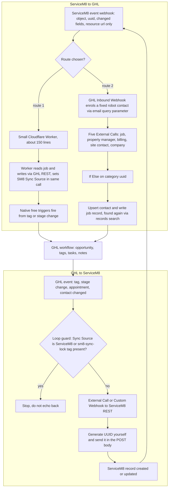

# ServiceM8 to GoHighLevel two-way sync blueprint

> A designed, GHL-native two-way sync between ServiceM8 and GoHighLevel for Wasteman Rubbish Removal (jobs to opportunities, contacts, scheduling, payments), published as a 35-workflow blueprint and build pack but never built.

| | |
|---|---|
| **Category** | GHL, CRM and migrations |
| **Status** | Designed, not built, as of 9 Oct 2026 |
| **Type** | Design: Claude artifacts (blueprint, 35-prompt build pack, GHL-only test pack) plus a Python joiner and provisioning scripts |
| **Runner and schedule** | Not runnable. Intended runtime: ServiceM8 webhooks into GHL, and GHL workflow events out to ServiceM8. |
| **Client / owner** | Wasteman Rubbish Removal; designed by the P2T team (owner: Hari) |
| **Stack** | ServiceM8 REST API and webhooks, GHL workflows (Inbound Webhook, External Call, Custom Webhook), GHL REST API, optional Cloudflare Worker, Python |
| **Source** | Main KB Part 3 section 3; Part 5 section 3 ("Automate" sessions); Portfolio KB section 14 (bidirectional note) |

## 1. Description

### What it does
Designs a sync that keeps ServiceM8 and GHL aligned in both directions for a field-service client: clients and contacts, jobs to opportunities, scheduling, notes and tasks, quotes, invoices, payments and review requests. The stated constraint was "I cannot use any apps except GHL" (no external server), with a PIT and a ServiceM8 API key available. The same sessions also built and verified a ServiceM8 entity joiner on synthetic fixtures.

### Inputs and outputs
- **Inputs:** ServiceM8 API (REST, `X-Api-Key` header, 25 named webhook events such as `job.quote_sent`, `job.quote_accepted`, `job.checked_in`, `job.invoice_paid`, `job.review_received`); GHL REST API with a location-scoped PIT; the optional ServiceM8 marketplace app in GHL (per-action $0.005); env keys `pit_token`, `Location`, `servicem8` in `master_sheet\.env`.
- **Outputs:** three published private Claude artifacts and the field map `sm8_ghl_field_map.json` (22 fields: 8 contact fields `SM8 Client UUID, Contact UUID, Client Name, Sync Source, Sync Status, Last Sync, Last Error, Retry Count` and 14 opportunity fields) plus 11 planned sync tags. No live sync.

### Key components
| Component | Role |
|---|---|
| Sync Blueprint artifact (private Claude artifact) | 35 workflows, 6 folders, 3 phases of 12 / 15 / 8. Its own tally said 11 / 17 / 7, which was wrong. |
| 35-prompt build pack (private Claude artifact) | One GHL Workflow-AI-builder prompt per workflow, with a shared status tracker. |
| GHL-only build and test pack (private Claude artifact) | Four flow diagrams and options A (SM8 webhook into GHL Inbound Webhook with a robot contact), B (polling loop on a robot contact), C (GHL to SM8). |
| `servicem8_connect.py` | Joiner for the ServiceM8 entity graph, flags `--cached` and `--all`. Verified on synthetic fixtures on 2026-09-07. |
| `ghl_sm8_provision.py` | Creates sync fields and tags; dry run by default, `--apply` to write. |
| `backup_and_delete_sm8.py`, `check_totals.py`, `ghl_audit.py`, `inspect_ghl.py`, `analyze_contacts.py` | Support and teardown scripts. |

### Where it lives
`D:\Project\Client & Agency (Pivot)\Websites & Funnels\wasteman\master_sheet\` (the older project folder name appears in transcript paths). Sessions: "Service M8 entity relationships", and "Automate" (three transcripts plus an empty stub, 2026-09-07 and follow-up 2026-10-02). Project memory notes `servicem8-ghl-sync-project.md` and `ghl-servicem8-api-gotchas.md` sit in the Claude project memory folder. The joiner outputs (`sm8_raw/`, `servicem8_connected.json`, `sm8_*.csv`, `servicem8_master.xlsx`, `servicem8_integrity.json`) were not found in `master_sheet\` on 9 Oct.

## 2. Flow chart

This is the DESIGNED flow. Nothing below is built or live.

**Reading the chart**
1. A ServiceM8 webhook carries only the object, uuid, changed fields and a `resource_url`; it has no email or phone.
2. Route 1 (found by another session): a worker receives the webhook and writes through the GHL REST API, so free native triggers (tags and stages as the event bus) fire the workflows. About $0.11 per job. A pending decision when the session ended.
3. Route 2: the Inbound Webhook (GHL's only premium trigger) enrols a fixed "robot" contact because GHL workflows can only enrol a contact. External Calls fetch the job and its contact roles; an If/Else branches on category (free).
4. Records are written with `POST /contacts/upsert` and a custom-object job record; re-sync finds existing records by `records/search` on `properties.sm8_job_uuid` and contacts by `customFields.sm8_company_uuid`, so no id-map is needed.
5. GHL events pass a loop guard first. The guard is the tag `sm8-sync-lock` (not a timestamp, because GHL date fields hold no time) plus `SM8 Sync Source` written in the SAME API call as the inbound update.
6. Outbound calls go to ServiceM8 (`PUT /api_1.0/job/{uuid}.json`, create client or job). ServiceM8 returns a new UUID in the `x-record-uuid` response header, which GHL cannot map, so the UUID is generated in advance and posted in the body.
7. Outbound writes can echo back inbound; the loop guard exists to break that cycle.

## 3. Case study

### The challenge
Wasteman invoices and schedules in ServiceM8 but sells and follows up in GHL. A two-way sync needed to move jobs, contacts, scheduling and payments without any app other than GHL, while avoiding loops, duplicates and unreliable pasted capability lists.

### The solution
A design-first approach. API surfaces were probed live rather than trusting a pasted iPaaS capability list (rejected as an incomplete subset). The result: a 35-workflow blueprint, a 35-prompt build pack, a GHL-only test pack, field and tag lists, cost lanes and a loop-guard design. A first scaffolding (22 custom fields plus sync tags, 2026-09-07) was torn down on 2026-09-18 when the custom-object migration replaced it (see the [Wasteman migration](wasteman-servicem8-ghl-migration.md)).

### Design decisions and rules learned
- Pull and index SM8 objects with five calls and join in memory: Category by `category_uuid` to Job, Job by `company_uuid` to Company, CompanyContact by `company_uuid`, JobContact by `job_uuid`. Incremental read uses `GET /job.json?$filter=edit_date gt '<watermark>'`. Contact roles are fetched with a `type` filter (Property Manager, BILLING, JOB); order is NOT reliable without it.
- Cost lanes: A marketplace app action $0.005; B Custom Webhook or External Call $0.01; C ServiceM8 events into Inbound Webhook (the only premium trigger) $0.01. About $0.20 per job hybrid versus $0.27 all-webhook; the Worker route about $0.11. Measured volume about 345 job changes a month, so about 2,400-3,000 premium executions a month, fitting Workflow Pro ($10).
- Phase 1 dependencies first: SM8-CORE-01, CORE-02, CORE-03 (called via Custom Trigger) before OUT-01, OUT-03, IN-02, IN-03. Highest risk: SM8-OUT-05 (allocation).
- `joballocation` is the real booking; an "Allocation Window" is a reusable named slot. GHL appointment custom fields do not exist (custom fields are contact and opportunity only).
- Marketplace-app gaps: no Update Job trigger or action, Job Payment is trigger-only, no search or list action (so "does this client exist" cannot be answered), 15 of 25 events have no app equivalent. Attachment and Note triggers fire on every upload (15 photos = 15 billed triggers); leave them off.
- GHL has no workflow or pipeline write API (workflows are GET only), so all 35 workflows must be built in the UI. The Workflow AI builder cannot test workflows and will not finish payload mapping, Custom Webhook auth/body, ServiceM8 record pickers or Custom Trigger names.
- ServiceM8 keys use `X-Api-Key`, not HTTP Basic (Basic returns a misleading `401 Invalid username or password`). GHL custom-field picklists are written with `options: [...]` under `Version: v3`. `GET /locations/{id}/customFields` returns contact fields only unless `?model=opportunity`.
- Cloudflare "Error 1010" on a 403 is a user-agent block (default Python UA), not an auth failure; it made an existence check report every field as missing. Send a browser-like `User-Agent`.
- Writes are last-writer-wins and a retried step can double-apply; never build a money total by read-modify-write alone.
- Native GHL Customer LTV counts only payments through GHL rails, so it reads $0 for ServiceM8-invoiced clients. ServiceM8 has no per-client LTV (Reports add-on only). The migration already populated `sm8_lifetime_value` and `sm8_total_jobs` on contacts.
- Review-chase intervals (17-day quote chase, 28-day invoice chase) are Claude defaults, not the client's policy; agree them with the client first.
- Premium actions must be enabled at agency level or External Call is missing; publish the workflow (Draft never fires); allow re-enrolment for the robot contact; labels may read "Custom Webhook".

### Outcome
Documented facts only:
- Three private Claude artifacts published; both the blueprint and build pack were edited from more than one session, so re-read before republishing.
- NOT built. As of 2026-10-02 (verified by API in-session): the Wasteman account held 1,263 contacts tagged `sm8-imported` at that time, 9 contact `sm8_*` fields (migration schema, not sync schema), 0 opportunity custom fields, 13 migration-era `sm8-*` tags and none of the 11 sync tags, 7 ServiceM8-related workflows all in `draft` (last touched 2026-09-07; loosely IN-01/02/06/07, OUT-06/07, CORE-02), and 0 ServiceM8 webhook subscriptions. The published blueprint's "Build status" section was wrong on all three counts at that time.
- The first scaffolding was torn down on 2026-09-18: `backup_and_delete_sm8.py` preserved all contacts tagged `real-estate contacts` (1,047) and deleted 7,856 SM8-tagged contacts (10 threads, about 9.5 req/s), 22 custom fields and 18 tags after saving a 9.26 MB backup (`sm8_contacts_backup.json`, not found in the folder now).
- The blocking test (can an Inbound Webhook enrol a robot contact if the URL carries `?email=`; fallback is a polling loop) has not been run. Result not found.
- A pending decision remains between route 1 (Worker writes via REST) and route 2 (Worker to Inbound Webhook); six cards (SM8-IN-03, IN-04, IN-05, IN-08, IN-09 and the "read this first" box) change if route 1 is chosen.

### Lessons learned
- Always re-verify account state by API before trusting a "build status" claim, including in published artifacts.
- Connected GHL MCP servers point at the P2T and HLGP sub-accounts, not Wasteman. Reading via MCP and writing via a project `.env` token hits two different accounts. Call `GET /locations/{id}` first to confirm the target.
- Never promise to create workflows or pipeline stages programmatically.
- A migration script alone does not give safe two-way sync: field ownership, conflict resolution, deletions, loop prevention, retries and out-of-order events need explicit rules (portfolio KB).

## 4. Operating notes
- **Run / pause / debug:** Not a runnable system. To resume: (1) create sync fields and tags with `python ghl_sm8_provision.py --apply` after re-checking field names against the migration fields, (2) run Test 1 (Inbound Webhook with `?email=`), (3) build workflows from the 35-prompt pack in dependency order, CORE-01/02/03 first; OUT-05 (allocation) is the highest-risk item (test whether the app's Create Allocation Window really lands a job on the dispatch board, otherwise use a Custom Webhook to `/joballocation.json`). Verification pattern: `GET /locations/{id}`, then `customFields` (also `?model=opportunity`), tags and workflows (read-only), with a browser User-Agent. Re-check the memory notes before acting.
- **Known issues and open items:** Blocking test not run; route decision pending; blueprint phase tally and "Build status" text are wrong; joiner outputs missing.
- **Risks:** Echo loops between systems; double-applied retries on money totals; per-trigger billing. Security and credential-hygiene findings for this project are tracked privately and are not published here.

## 5. Related
- [ServiceM8 to GHL migration engine](servicem8-ghl-migration-engine.md) (the one-way load that replaced the first scaffolding)
- [Wasteman ServiceM8 to GHL migration](wasteman-servicem8-ghl-migration.md)
- [GHL API contracts and quirks](ghl-api-contracts-and-quirks.md)
- **Discrepancies between sources:** Part 3 says the sync tags were deleted 2026-09-18 and Part 5 reports the same account on 2026-10-02 with none of the 11 sync tags; these agree. The 1,263-contact figure is a 2026-10-02 snapshot and is much lower than Wasteman's later total (see the Wasteman migration file).
- **Sources:** Main KB Part 3 section 3; Part 5 section 3; Portfolio KB section 14.
