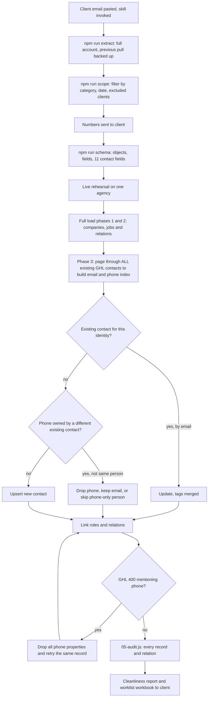

# Wasteman ServiceM8 to GoHighLevel migration (real-estate scope, then all categories for 24 months)

> A scoped second run of the ServiceM8 migration engine that loaded Wasteman Rubbish Removal's real-estate clients, and later all categories for the last 24 months, into its GHL sub-account with property-manager, billing and site-contact tiers.

| | |
|---|---|
| **Category** | GHL, CRM and migrations |
| **Status** | On demand, as of 9 Oct 2026 |
| **Type** | Node.js CLI scripts (adapted copy of the migration engine) plus Python support scripts |
| **Runner and schedule** | Manual, from `D:\Project\Client & Agency (Pivot)\Websites & Funnels\wasteman\master_sheet\sm8_ghl_migration\`. Re-run `npm run extract` then `npm run load` whenever the client wants a refresh. |
| **Client / owner** | Wasteman Rubbish Removal (client); run by the P2T team (owner: Hari) |
| **Stack** | Node.js, ServiceM8 REST API, GHL API v2 custom objects, associations and contacts, Excel worklist export |
| **Source** | Main KB Part 3 section 2; Portfolio KB section 14 (brief mention) |

## 1. Description

### What it does
Reuses the [ServiceM8 migration engine](servicem8-ghl-migration-engine.md) for Wasteman. Phase A loaded the Realty categories with jobs from 2025-01-01. Phase B (Oct 2026) widened the scope to all categories, jobs dated on or after 2024-10-08, including private and residential clients because contacts keep value through repeat jobs. Each job carries three contact tiers in the client's priority order: client company plus property manager, billing contact, and the person on site.

### Inputs and outputs
- **Inputs:** the client brief by email (priority: client company plus property manager, then billing contact, then site contact); ServiceM8 as the source of truth (NOT the spreadsheet the client reviewed, which held 291 jobs versus 319 live); the existing GHL contacts, including about 1,047 AI-scraped prospects tagged `real-estate contacts`. `.env` NAMES: `SM8_API_KEY`, `GHL_TOKEN`, `GHL_LOCATION_ID`, `DRY_RUN`, `LINK_CONTACTS_TO_JOBS` (false here), `CREATE_JOB_CONTACTS` (true here), `PHONE_COUNTRY_CODE`, `PHONE_NATIONAL_PREFIXES`, `PHONE_NATIONAL_LENGTH`, `CONCURRENCY`, `SCOPE_CATEGORIES`, `SCOPE_FROM_DATE`, `SCOPE_EXCLUDE_CLIENTS`. Older Python scripts use `pit_token`, `Location`, `servicem8`.
- **Outputs:** custom objects `custom_objects.sm8_company` and `sm8_job`, contacts, associations, 11 contact fields, and local audit files. Deliverable `ServiceM8 data worklist.xlsx` for the client.

### Key components
| Component | Role |
|---|---|
| `scripts/01b-scope.js` | Read-only scope step: filters jobs by category prefix, date and excluded clients, then reports numbers for the client. |
| `src/scope.js` | Scope rules and rollups. Lifetime values come from EVERY active job ever; job records are limited to the window. |
| `scripts/03-load.js` | Three-phase load. Phase 3 first indexes all existing GHL contacts by email and phone. |
| `scripts/05-audit.js` | Exhaustive audit: walks every custom-object record and `GET /associations/relations/{recordId}`; writes `out/audit.json`. |
| `scripts/99-cleanliness.js`, `99-worklist-export.js`, `99-trace-unlinked.js` | Data-quality reports and the client worklist. |
| `scripts/99-ltv-check.js`, `99-ltv-split.js`, `99-trace.js`, `99-refresh-contact.js` | Lifetime-value checks, trace a rollup to jobs, re-upsert one identity. |
| `scripts/99-cleanup-test-records.js` | Deletes excluded clients' test records; refuses to delete a contact that also belongs to a real client; dry run by default. |

### Where it lives
`D:\Project\Client & Agency (Pivot)\Websites & Funnels\wasteman\master_sheet\` holds `sm8_ghl_migration\` (`src\{scope,model,transform}.js`, `scripts\`, `.env`, `.env.example`, `README.md`, tests `test\{exclusions,transform,wasteman}.test.js`, 50-55 passing), the Realtors spreadsheet, the worklist workbook, `sm8_deletion.log`, `sm8_deletion_report.json` and `sm8_ghl_field_map.json`. Outputs under `out\`: `id-map.json`, `schema-map.json`, `scope-report.json` (332 KB), `audit.json`, `cleanliness.json`, `unlinked.json`, `worklist.json`, logs `load-24mo.log`, `load-dual-ltv.log`, `load-fieldfix.log`. A previous data pull is backed up as `data_20260918_backup\`. Note: the older project folder had a different name; transcript folders still use it.

## 2. Flow chart

**Reading the chart**
1. The user ran `/servicem8-ghl-migration` with the client email pasted in.
2. `extract` pulls the full account (jobs alone are about 25 MB).
3. `scope` is read-only and is the step whose numbers go to the client.
4. `schema` adds a dual lifetime-value field set (person versus client account) and `SM8 Categories`.
5. A live rehearsal on one agency precedes the full load.
6. Phases 1 and 2 load companies and jobs; phase 3 starts by indexing every existing contact so that existing people are updated, not duplicated.
7. For each person: existing by email gets an update with merged tags; a phone owned by a different existing contact is dropped (or a phone-only person is skipped); otherwise the person is upserted.
8. A phone complaint from GHL (400 naming phone) triggers drop-all-phone-properties and a retry of the same record.
9. The audit walks every record and relation, then the cleanliness report and the client worklist workbook are produced.

## 3. Case study

### The challenge
Wasteman wanted ServiceM8 clients and their people inside GHL for marketing and repeat-job follow-up. The client brief prioritised the client company and property manager, then billing contacts, then the on-site person (often blank on purpose). The existing GHL account already held roughly 1,047 AI-scraped real-estate prospects that had to stay intact and distinguishable. The client also asked for lifetime value for both the contact and the company, and for advice on data cleanliness.

### The solution
The engine was copied into the project and extended with a read-only scope step, three contact tiers per job, role tags (`sm8-role-property-manager`, `sm8-role-billing`, `sm8-role-site-contact`), category tags (`sm8-category-*`), dual lifetime-value fields, an existing-contact index with a same-person guard, a phone drop-and-retry rule, an exhaustive audit script and a set of support scripts that produced a worklist workbook for the client.

### Design decisions and rules learned
- SM8 is relational with flat records joined by UUID. There is no nesting or `?expand=`. `jobcontact` has NO foreign key to `companycontact`; SM8 snapshots the company contact onto the job, so the same person has different UUIDs. Job records hold no names; names come from `jobcontact` and `company`.
- "Owner C/-" billing rows render as `Owner (C/-)` on the job and never name a CRM contact. A nameless accounts inbox is called `<Agency> - Accounts`.
- Blank JOB rows (372) are ServiceM8's deliberate "nobody on site" placeholders: ignored, not counted, not on the worklist.
- `LINK_CONTACTS_TO_JOBS=false`: contacts link only to jobs they were named on; account-level contacts reach every job through the Company panel.
- Lifetime values use every active job ever, while job records stay in the window. With only the window, a contact's figure understated the relationship.
- Do not tighten phone validation. Drop-and-retry kept 177 valid numbers (0493, 0480, 0482, 0460, 0461 and others) that a stricter validator would have dropped to catch one bad one.
- Field fall-through: email and phone take the first field that yields a usable value (an email typed into the SM8 `mobile` field recovered 3 in-scope contacts).
- Same-person test for existing contacts: exact name, or one name leading the other on the same company, or the existing contact carries `sm8-imported` on that company.
- Dates are taken as written (calendar date), not through the machine timezone.
- In the GHL contact UI, panels "Companies (0)" and "Jobs (0)" are GHL's native objects and always empty; ours appear as "ServiceM8 Companies" and "Jobs 1". A legacy empty `custom_objects.job` made GHL auto-rename ours.
- Property-manager lifetime value: the field answers "how much is this client worth", the Jobs panel answers "which jobs was this person on", so both field sets exist.
- Working rules seen: run all tests first and proceed if they pass; answer honestly with GHL-counted numbers; corrections were reported openly (33 versus 3 flagged clients was a regex bug; 37 broken emails across ten years versus 6 in the window; 4/3 unlinked versus real 25/25).

### Outcome
- Phase A (Sept 2026, Realty categories, jobs from 2025-01-01): complete and fully audited from GHL: 70 companies, 319 jobs, 215 contacts (156 property-manager, 118 billing, 68 site; roles overlap), 973 relations, 0 errors. Every job and company relation was audited, not sampled.
- Phase B (Oct 2026, all 76 categories, `SCOPE_CATEGORIES` empty): 2,245 companies, 3,471 jobs, 2,651 SM8 contacts plus 1,047 scraped = 3,698 contacts, 0 errors, audited. Relation coverage at audit: jobs to company 100%, companies with at least one job 100%, jobs with at least one contact 3,442 of 3,473, companies with at least one contact 2,221 of 2,247 (before final tweaks). Fresh source pull: 11,261 jobs, 7,213 companies.
- Phase B load detail: 2,737 SM8 contact rows became 2,649-2,656 people (69 span more than one company, 119 phone-only merged, 97 shared phones withheld, 152 no identifier, 372 blank rows ignored; roles PM 189, BILLING 1,813, JOB 2,336); 215 existing GHL contacts updated with tags merged; 9,054 relations; 1 error (phone), fixed by drop-and-retry.
- Test records ("Test Client", "Test Client 2", a team test contact and their 2 job records) were deleted on the user's chat instruction and added to `SCOPE_EXCLUDE_CLIENTS`. A client account marked "do not use" was deliberately kept, not merged, by user decision.
- Worklist workbook for the client: cannot create as contact [152, later 147], changed employer [55 people attached to more than one client], broken email values [6 in the window], phone-only people [845], unlinked companies and jobs with reasons [25 plus 25].
- Open: 5 contacts whose only identifier is an 8-digit number without area code (not written); 147 people with a name but no email or phone remain only on job records.

### Lessons learned
- Always re-read a stale contact with `99-refresh-contact.js` because `MISSING_ONLY` skips identities that already have an id.
- Answer with GHL-counted numbers and correct earlier figures openly.
- Put scope numbers to the client before the live load.
- Delete test data only on explicit instruction, with a guard against deleting a contact that belongs to a real client.

## 4. Operating notes
- **Run / pause / debug:** `cd` to the folder, then `npm run extract`, `npm run scope`, `DRY_RUN=false npm run load`. Resume with `SKIP_EXISTING=true` or `MISSING_ONLY=true`. Audit with `node --env-file=.env scripts/05-audit.js`. Edit scope in `.env` only.
- **Known issues and open items:** The Wasteman copy has fixes (timezone-safe `toDate`, dry-run schema bug, scope, phone drop-and-retry, existing-contact guard, `05-audit.js`) that are NOT in the skill copy. See the engine file for the carry-back gap.
- **Risks:** Writes to a live client CRM; shared office switchboard phones can merge or overwrite people; the scraped prospect contacts tagged `real-estate contacts` must never be deleted by a bulk run.

## 5. Related
- [ServiceM8 to GHL migration engine](servicem8-ghl-migration-engine.md)
- [ServiceM8 to GHL two-way sync blueprint](servicem8-ghl-two-way-sync-blueprint.md) (design for the same client; not built)
- [Real-estate prospect importers](real-estate-prospect-importers.md) (source of the `real-estate contacts` prospects)
- **Portfolio KB note:** section 14 mentions the framework being used for "the real-estate master sheet" for this client; it adds no further detail.
- **Related sessions (main KB):** "Servicem8 real estate data import" and two forks. The `wasteman\webpage\` folder holds unrelated site and form HTML.
- **Sources:** Main KB Part 3 section 2; Portfolio KB section 14.
