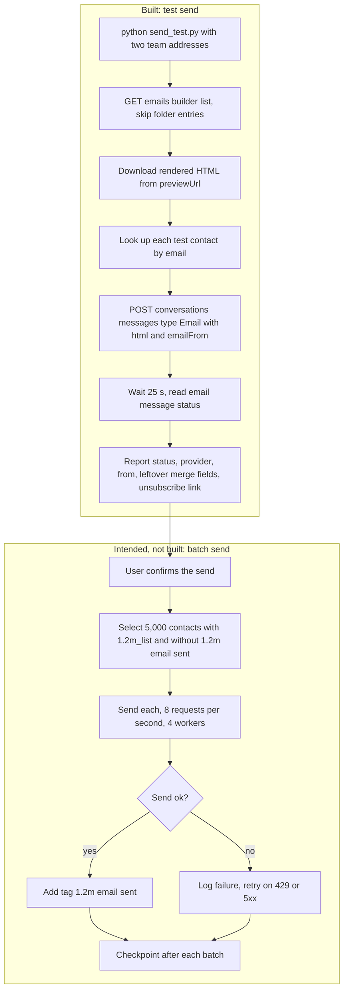

# Zaffarology email batch tooling (`email_batch`)

> Partly built Python tooling to send the "1.2M List" GHL email template to batches of 5,000 contacts tagged `1.2m_list` and tag them as sent, only after explicit confirmation; the test sender exists, the batch sender was never written.

| | |
|---|---|
| **Category** | GHL, CRM and migrations |
| **Status** | On demand, as of 9 Oct 2026 (partial: config, API client and test sender built; batch sender not built and never run at scale) |
| **Type** | Python CLI scripts |
| **Runner and schedule** | Manual. The user wanted explicit confirmation before any send ("get everything ready, do not send"). |
| **Client / owner** | Zaffarology (client GHL sub-account); run by the P2T team (owner: Hari) |
| **Stack** | Python, GHL API v2 (conversations messages, contacts search, email builder), requests with a token-bucket limiter, GHL Email Builder |
| **Source** | Main KB Part 3 section 7; main KB register (section 2 of the overview), row "Zaffarology bulk sender"; Portfolio KB section 20 (brief mention) |

## 1. Description

### What it does
Prepares to send the "1.2M List" email to the first batch of 5,000 contacts tagged `1.2m_list`, then tag each recipient `1.2m email sent`. Today it can find the template, render its HTML, send a test email to named team addresses and report delivery details. The selector, sender and tagger for real batches were not built.

### Inputs and outputs
- **Inputs:** `email_batch\config.json` with `template_name` "1.2M List", the campaign subject line, `source_tag` `1.2m_list`, `sent_tag` `1.2m email sent`, `email_from` (a named sender on the client's domain), `batch_size` 5000, `requests_per_second` 8, `workers` 4. `.env` one folder up with `GHL_ACCESS_TOKEN` and `GHL_LOCATION_ID`.
- **Outputs:** a preview HTML snapshot of the template and test-send results. Whether the 2 test emails were delivered is not recorded (output truncated).

### Key components
| Component | Role |
|---|---|
| `config.json` | Template name, subject, tags, sender, batch size, rate settings. |
| `ghl_api.py` | `GHL()` client: thread-local sessions, token-bucket limiter, retries on 429 and 5xx with `Retry-After`, IPv4-only resolution, browser-like User-Agent. |
| `send_test.py` | Finds the template by name, downloads the rendered HTML from `previewUrl`, looks up each test contact, sends, waits 25 s, reads the delivery status. |
| `template_1.2M_List_preview.html` | Rendered snapshot of the GHL Email Builder template. |
| Batch selector, sender, tagger (planned) | Folders `batches\` and `logs\` were planned; not found. |

### Where it lives
`D:\Project\Client & Agency (Pivot)\Zaffarology\zaffar-dataimport\email_batch\{config.json, ghl_api.py, send_test.py, template_1.2M_List_preview.html}`. The GHL Email Builder template "1.2M List" has merge fields `{{email.unsubscribe_link}}`, `{{email.preference_management_link}}`, `{{location.name}}`, `{{location.email}}` and `{{right_now.year}}`. Planning session: "GHL email campaign setup".

## 2. Flow chart

The test path is built. The batch path below it is the intended design and is NOT implemented.

**Reading the chart**
1. `send_test.py` takes two team email addresses that must already exist as contacts.
2. The template is found by name in the Email Builder list (`GET /emails/builder?locationId&limit=100&offset=` returning `builders[]`).
3. The public API cannot send a template by id, so the rendered preview HTML is sent as `html`.
4. After 25 seconds the message is read back to report status, provider, sender, stored body, any unreplaced `{{merge}}` fields and the unsubscribe link.
5. After a clean test, the intended batch step selects 5,000 tagged contacts without the sent tag, sends each, adds the sent tag and checkpoints after each batch. The user interrupted the session while checking tag-exclusion filters, so this part does not exist.

## 3. Case study

### The challenge
After the 1.2M-record list was imported (about 1.19 million contacts tagged `1.2m_list`), the client wanted a first batch of 5,000 invitations sent. GHL's native tools did not obviously support "send this template to the next 5,000 untagged contacts, then tag them", and the user wanted full control before any send.

### The solution
A small Python client with rate limiting and a test sender, so the template, rendering, unsubscribe link and delivery path could be checked on a few team addresses before building the batch sender with checkpointing.

### Design decisions and rules learned
- The public API CANNOT send an Email Builder template by id (`422 Template not found for id`). The workaround is to render the `previewUrl` HTML and send it as `html`.
- Cloudflare in front of the API rejects the default python-urllib and requests User-Agent (error 1010); set a browser-like UA.
- On the Windows machine, IPv6 connects to the API hung about 21 s each before falling back; forcing IPv4 with a `socket.getaddrinfo` patch cut it from 21.5 s to 0.5 s per call.
- Account state at the time: 1,175,419 of 1,186,197 tagged contacts were added on or after 2026-09-11 and 10,778 before; none had `dnd=true`. An earlier outbound email in the account showed status "failed" (provider Mailgun), so check deliverability and the sender before a bulk send.
- Contacts search supports `page` or `searchAfter` paging. Filter operators include eq, not_eq, contains, not_contains, wildcard, not_wildcard, match, not_match and exists; for tag exclusion `not_contains` and `not_eq` work and `ne` does not.
- Sending to a purchased list risks suspension of the sub-account's email sending; see the split file for the policy note.

### Outcome
- Built: config, GHL API client, test sender. Not built (not found): batch selector, sender, tagger, idempotent state.
- The session ended after the user interrupted while checking tag-exclusion filters. Whether the 2 test emails were delivered is not recorded.
- The register in the main KB overview (section 2) lists the "Zaffarology bulk sender" as never saved to disk.
- No measured outcome recorded.

### Lessons learned
- Test the rendered template, merge fields and unsubscribe link on a few addresses first.
- Make the sender idempotent (tag after each send, checkpoint each batch) before sending at scale.
- Work around network quirks (IPv6 stalls, Cloudflare User-Agent blocks) in the client once, not per script.

## 4. Operating notes
- **Run / pause / debug:** `cd email_batch && python -u send_test.py <teammate@...> <teammate@...>` (both must exist as contacts). Then build the batch sender with checkpointing (not present).
- **Known issues and open items:** Batch sender missing; deliverability of the sending domain unchecked (earlier "failed" Mailgun message); tag-exclusion filter was being checked when the session stopped.
- **Risks:** Purchased-list sending policy; unsubscribe and consent handling for 5,000 recipients per batch; double-sends if the tag step fails after a send.

## 5. Related
- [Zaffarology list split and import estimate](zaffarology-list-split-and-import-estimate.md) (produced the `1.2m_list` contacts)
- [GHL API contracts and quirks](ghl-api-contracts-and-quirks.md)
- **Notes on sources:** Portfolio KB section 20 lists "Zaffarology email batches" and advises checking duplicates and consent status before campaign sends; no conflict with the main KB.
- **Sources:** Main KB Part 3 section 7; main KB overview register line "Zaffarology bulk sender: Never saved to disk"; Portfolio KB section 20.
