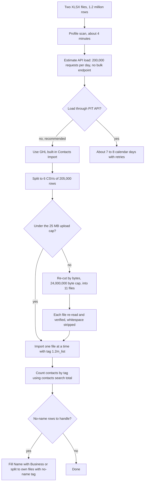

# Zaffarology 1.2M-record list: XLSX to CSV split and import-time estimate

> Profiled a purchased 1.2 million record Australian marketing list, estimated how long a PIT-based API import would take, and re-cut the list into 11 CSV files small enough for GHL's built-in importer.

| | |
|---|---|
| **Category** | GHL, CRM and migrations |
| **Status** | On demand, as of 9 Oct 2026 (estimate and split done 2026-09-11; contacts are in GHL) |
| **Type** | One-off Python data preparation (scan and split) plus an analysis, run through Claude Code |
| **Runner and schedule** | Manual request in Claude Code (session "XLSX upload time estimate to GHL"). No schedule. |
| **Client / owner** | Zaffarology (client GHL sub-account); run by the P2T team (owner: Hari) |
| **Stack** | Python (inferred; the splitter is not saved as a script), XLSX and CSV, GHL built-in Contacts importer, GHL contacts search API |
| **Source** | Main KB Part 3 section 6; Portfolio KB section 20 (brief mention) |

## 1. Description

### What it does
Gets a purchased Australian marketing list (two XLSX files, 1.2 million records) ready to load into the Zaffarology GHL sub-account under the tag `1.2m_list`, and answers "how long will it take through the PIT?". It profiles the data, estimates API loading time, then splits the list into CSV files that fit the importer's observed 25 MB upload cap.

### Inputs and outputs
- **Inputs:** `D:\Project\Client & Agency (Pivot)\Zaffarology\zaffar-dataimport\Business Master List Jun 2026 Part 1.xlsx` (69 MB) and `Part 2.xlsx` (73 MB); the same two files also sit in `zaffar-data\`. `.env` NAMES in both folders: `GHL_ACCESS_TOKEN`, `GHL_LOCATION_ID`.
- **Outputs:** 11 CSV files `Business_Master_List_Jun2026_01..11.csv` (1,218,240 rows total, 14-24 MB each), the time estimate, and no-name row counts per file.

### Key components
| Component | Role |
|---|---|
| Profile scan | About 4 minutes to read both XLSX files and report counts, uniqueness and column fill. |
| Estimate | Compares API loading (one call per contact) with GHL's server-side importer. |
| Splitter (not saved) | Re-cuts by BYTES (24,000,000-byte cap) rather than by row count; each file re-read and verified. |
| `split_csv\` and `split_csv - Copy\` | Output folders: 11 files in the Copy folder; files 01-05 are gone from `split_csv\`, as if moved after upload, and 06-11 remain. |

### Where it lives
`D:\Project\Client & Agency (Pivot)\Zaffarology\zaffar-dataimport\` (`split_csv`, `split_csv - Copy`, the two XLSX) and `Zaffarology\zaffar-data\` (XLSX names only). The splitter script itself was not found.

## 2. Flow chart

**Reading the chart**
1. The profile found 576,535 plus 641,705 = 1,218,240 data rows, 1,218,112 unique emails (128 duplicates), mobile on 13.6%, landline on 84.4%, only 388,764 unique phone numbers, and 16 columns (Business, Industry, Name, Surname, Job Description, Email, Email Validation, Mobile, Landline, Street, City, State, P/code, Website, Employees, Revenue). Rows 1-2 are vendor branding rows.
2. The API route has no bulk-create endpoint: 1,218,240 divided by 200,000 requests a day is 6.1 days, so 7-8 calendar days with retries. At 10 req/s the daily quota is gone in about 5.5 hours, and failed calls and separate add-tag calls also count (put tags and custom fields in the create payload).
3. The recommended path was GHL's built-in importer (hours to a day of babysitting).
4. The first split gave 6 CSVs of 205,000 rows; the user could not upload files over 25 MB, so the files were re-cut by size into 11.
5. Imports run one file at a time, tagged `1.2m_list`, then the count is checked with `POST /contacts/search` filter `tags eq 1.2m_list` and the `total` field.
6. 253,030 rows (20.8%) have no first and no last name; offered options were filling Name with the Business name or splitting those rows out with a `no-name` tag.

## 3. Case study

### The challenge
A purchased list of 1.2 million Australian business contacts had to reach the Zaffarology sub-account. The question was whether the PIT-based API could do it in a reasonable time, and how to format the files for GHL's importer, which refused uploads over 25 MB.

### The solution
Profile first, then estimate, then choose the importer. The split used a byte cap rather than a row cap, kept the original 16-column header and continuous order across both source files, and wrote UTF-8 with no BOM and CRLF line endings. Cleaning was deliberately light: whitespace stripped (3,085 `"NT "` rows) and numeric cells prevented from becoming `2075.0`; lower-case state variants and duplicate emails were left as they were.

### Design decisions and rules learned
- About 800,000 rows share a phone with another row (multi-person business landlines). GHL's duplicate check matches email AND phone, so the import would either burn quota on "duplicated contacts" errors or silently merge people. Set the location duplicate preference to email-only before importing, or map Landline to a custom field instead of `phone`.
- GHL/LeadConnector policy prohibits sending to purchased lists; a cold blast risks the sub-account's email sending being suspended. Decide the outreach plan before importing.
- The importer file cap was observed at 25 MB; a row cap was unknown.
- Phone formats are inconsistent (leading 0 stripped on landlines, some with spaces). The location default country +61 handles AU, but spot-check after the first file.
- Blank first names make `{{contact.first_name}}` render empty ("Hi ,").
- Re-cut from the existing CSVs rather than re-reading the XLSX; it is faster.

### Outcome
- Estimate and CSV split done on 2026-09-11. Per-file row counts: 118,275 / 109,748 / 107,749 / 110,120 / 112,702 / 108,455 / 113,093 / 122,697 / 117,576 / 115,619 / 82,206.
- The contacts are in GHL: 1,186,197 contacts tagged `1.2m_list` were counted through the API the same day (source 1,218,240 rows; the importer drops duplicates and invalid rows). The import method is not recorded; the built-in importer is inferred.
- No time-saving or timing outcome beyond the 7-8 day API estimate was recorded.

### Lessons learned
- Estimate with the real rate limit before choosing the method, and account for failed calls and tag calls.
- Check how the platform handles shared phone numbers before a bulk import.
- Decide consent and outreach policy before loading a purchased list.

## 4. Operating notes
- **Run / pause / debug:** To re-cut by size, re-chunk from the existing CSVs. Import one file at a time in GHL with tag `1.2m_list`; check the contact count with the contacts search `total`.
- **Known issues and open items:** The splitter script and the first five split files are not in the folder; no-name rows (253,030) still need a decision; phone-sharing duplicate preference needs to be confirmed as set.
- **Risks:** Email sending suspension risk for purchased lists; silent merging of people sharing a landline; blank first names rendering as "Hi ," in email merge fields.

## 5. Related
- [Zaffarology email batch tooling](zaffarology-email-batch-tooling.md) (the planned send to these contacts)
- [GHL API contracts and quirks](ghl-api-contracts-and-quirks.md)
- **Notes on sources:** Portfolio KB section 20 lists "Zaffarology email batches and split-CSV imports" and "XLSX bulk-upload estimates" with operational notes to validate headers, check duplicates and consent before sends, and track import batches and rejected rows. It adds no further detail and does not conflict.
- **Sources:** Main KB Part 3 section 6; Portfolio KB section 20.
