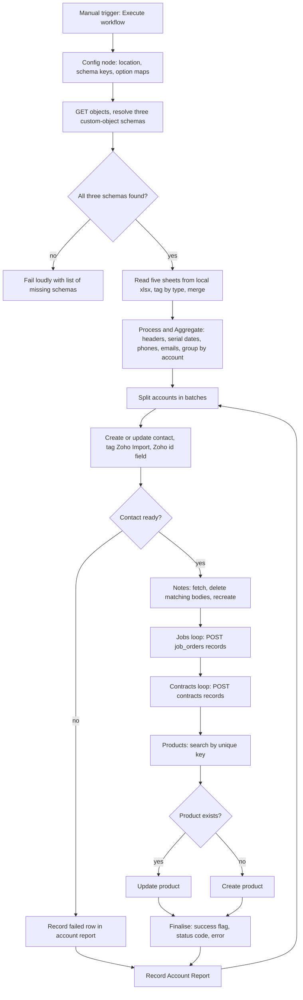

# Zoho to HighLevel idempotent migration (Clixpert, n8n)

> An n8n workflow that migrates a Zoho CRM Excel export for Clixpert into HighLevel: accounts become contacts, and jobs, contracts and products become custom-object records, with notes kept on the contact.

| | |
|---|---|
| **Category** | GHL, CRM and migrations |
| **Status** | On demand, as of 9 Oct 2026 (workflow exported; live execution not recorded in the main KB) |
| **Type** | n8n workflow ("Zoho Excel -> HighLevel v2 Idempotent Migration [Fresh Import]") |
| **Runner and schedule** | Manual trigger ("When clicking Execute workflow"). n8n ran locally on a Windows machine (inferred from the local file path). |
| **Client / owner** | Clixpert (client); built by the P2T team (owner: Hari) |
| **Stack** | n8n, HighLevel REST API v2 (`Version: 2021-07-28`), HighLevel OAuth2 credential, Excel, custom objects |
| **Source** | Main KB Part 3 section 5; Part 5 section 5; Portfolio KB section 3 |

## 1. Description

### What it does
Reads a Zoho CRM workbook and writes it into a HighLevel sub-account. Each Zoho account becomes a contact (tag `Zoho Import`, with a custom field that holds the Zoho id). Job Orders, Contracts and Products become records in three custom objects, and Notes are written to the contact. The workflow is idempotent: rerunning it should update, not duplicate. "v2" in the name means a rebuilt version.

### Inputs and outputs
- **Inputs:** the Excel file `Clixpert Sales Products & Services-2026-27.xlsx` read from `C:\Users\<user>\.n8n-files\` (not in the repo), with sheets `Accounts Record`, `Notes`, `Job Orders`, `Contracts` and `InventoryItems-20250110.csv` (products). A HighLevel OAuth2 credential (`highLevelOAuth2Api`, named "HighLevel account 2" in n8n). A `Config` Code node holds the location id, schema ids, default phone country `+61`, dropdown/amount/date key lists and option maps for status, job_status and invoice_status.
- **Outputs:** HighLevel contacts, notes, three custom-object record sets (`custom_objects.job_orders`, `custom_objects.contracts`, `custom_objects.products`) and per-account report rows (status, operation, reason, timestamp).

### Key components
| Component | Role |
|---|---|
| `Config` Code node | In-node configuration (location, schema keys, option maps); its note says `$env` is blocked in this n8n. |
| `Get Object Schemas` and `Resolve Object Schemas` | `GET /objects/?locationId=`; finds the three schemas by key, name or label, throws with the list of any missing ones. |
| Spreadsheet File nodes, Merge nodes | Read the five sheets, tag each row by `type`, merge. |
| `Process & Aggregate` Code node | Normalises headers to snake_case, converts Excel serial dates to ISO, cleans phones to E.164-ish (+61 default, +1 for United States), basic email validation, one item per account with its notes, jobs, contracts and products. |
| `Create Contact` (HighLevel node), `Resolve Contact Upsert Result`, `If Contact Ready` | Upsert contact and record created or updated or failed. |
| Notes nodes | Fetch notes, delete those matching a source note, recreate. |
| Job, Contract, Product loops | POST records, search-then-update-or-create for products. |
| `Record Account Report` | Per-account result rows. |

### Where it lives
Workflow JSON: `D:\Project\Client & Agency (Pivot)\Workflows & Automation\zoho\workflow.json` (94 KB, 2026-04-24) and `connected-workflow.json` (58 KB, same graph minified, an n8n export with ids and timestamps, 2026-05-01). The JSON carries no token. A separate client folder `D:\Project\Client & Agency (Pivot)\Clixpert\` (PHP webhook and job-order scripts, logs) was not reviewed.

## 2. Flow chart

**Reading the chart**
1. A manual run starts the workflow. A `Config` code node supplies all settings.
2. The schema lookup fails loudly if any of the three custom objects is missing.
3. The five sheets are read from the local workbook, tagged by type and merged; the aggregate step normalises everything and groups jobs, contracts, products and notes under each account by normalised company name.
4. Accounts run in batches. Each gets a contact create or update; a failed contact is recorded in the report.
5. For a ready contact, notes are re-created so reruns do not duplicate them, then jobs, then contracts (contracts start after all jobs finish), then products.
6. Products are searched by unique key and updated or created.
7. Every API node uses `continueOnFail`; the finalise nodes record operation, success, status code and error per record, and the account report row closes each iteration.

## 3. Case study

### The challenge
Clixpert's CRM history was in Zoho. It needed to arrive in HighLevel without duplicate contacts and with the related jobs, contracts, products and notes attached to the right account. Source data was messy: Excel serial dates, free-text statuses, missing or invalid emails and phones.

### The solution
A single n8n workflow with explicit mappings and lookup-based idempotency, run from a local Excel file. It checks that the target custom objects exist before writing, builds one payload per account, and records an outcome per account for follow-up.

### Design decisions and rules learned
- Idempotency is by lookup, not by an id-map: products by search on a unique key, notes by body signature, contacts by upsert with the Zoho id custom field. Unique keys (record ids, `jobUniqueKey`, `contractUniqueKey`) back this up.
- Prefer stable external ids over name-only matching (portfolio KB principle). Notes, jobs and contracts, however, are matched to accounts by normalised company name.
- Dropdown option values must be mapped to existing option KEYS (lower snake case) or they are dropped; for example `ended` maps to `completed`, `job_cancelled` and `pending` map to `work_in_progress`.
- Excel dates arrive as serial numbers; the Notes and Jobs sheets are read with `headerRow:false`.
- The custom-object schema key must be the `schemaKey` used in `/objects/{schemaKey}/records`.
- A missing or invalid email is replaced by a placeholder `zoho_<id>@example.com`; notes are capped at 3,500 characters each.
- Split-in-batches output order matters: 0 means done, 1 means loop.
- Check API permissions for protected fields (portfolio KB).

### Outcome
- Two versions of the workflow JSON exist (2026-04-24 and 2026-05-01).
- Portfolio KB calls the migration "user-confirmed completed", but the main KB records that whether it was executed against a live account is not recorded, and found no Claude transcript for it. Treat the live outcome as unconfirmed.
- Portfolio KB known exception: amount-related fields were reported as pending due to permissions at the time of the earlier work, so confirm their current status before describing every field as migrated.
- No measured outcome (record counts, error counts) recorded.

### Lessons learned
- Resolve schemas first and stop if any is missing.
- Keep source-to-destination mappings explicit and keep a report row per account so reruns and exceptions can be reviewed.
- Normalise dates, empty values, phone numbers and emails before writing, and log failures.
- Verify migrated records and mapped values after the run (portfolio KB).

## 4. Operating notes
- **Run / pause / debug:** Import the JSON into n8n, set the HighLevel OAuth2 credential, edit the `Config` node (location id and schema ids), place the workbook at the Read Binary File path, execute manually and check `Record Account Report`. Code nodes print `console.log` lines for debugging. Resume equals re-run.
- **Known issues and open items:** Live execution unconfirmed; amount fields may have been blocked by permissions; the note re-creation logic is partly inferred from node names in one source, and described in detail in the other (fetch, delete matching bodies, create).
- **Risks:** Placeholder `example.com` emails could be mistaken for real contacts; name-based matching of notes, jobs and contracts can mis-assign records for similarly named accounts; deleting matched notes before re-creating them assumes the body signature is reliable.

## 5. Related
- [ServiceM8 to GHL migration engine](servicem8-ghl-migration-engine.md) (a code-based alternative approach to CRM migration)
- **Discrepancies between sources:** The main KB (read from files) says execution is unrecorded; the portfolio KB (conversation-derived) says completed. The main KB is preferred for the file facts. Part 3 names the config node `Config`; Part 5 uses the suffixed names (`Config1` and so on) for the same nodes (inferred).
- **Sources:** Main KB Part 3 section 5; Part 5 section 5; Portfolio KB section 3.
