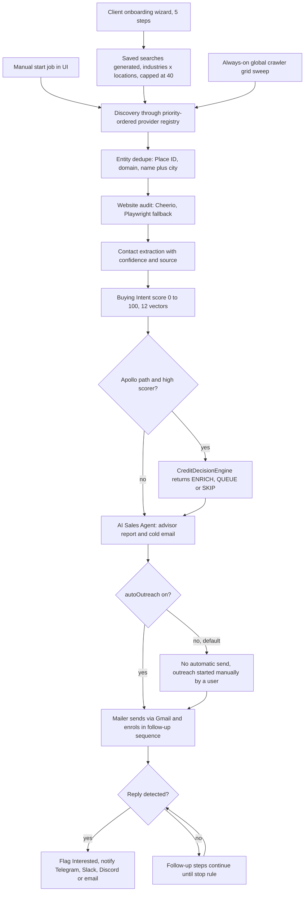

# Client Finder AI platform (project "scaber", now "scraper")

> A multi-tenant SaaS that finds local and B2B businesses missing digital tooling, scores them by buying intent, enriches contacts, writes AI outreach, sends follow-ups and notifies on replies, for digital agencies and AI automation firms.

| | |
|---|---|
| **Category** | Lead generation, outreach and data pipelines |
| **Status** | Live, as of 9 Oct 2026 (production-deployed per the section text; the KB register lists it under "built and used on demand") |
| **Type** | Web app (Node/Express API, React/Vite frontend) with background crawlers and schedulers |
| **Runner and schedule** | AWS EC2, PM2 process `client-finder`, backend port 5005. Always-on server loop, node-cron schedulers, manual "start job" in the UI. |
| **Client / owner** | Stack&Code folder; built by Hari. End customers are called "clients" and only see leads and conversations. |
| **Stack** | Node/Express, TypeScript, Drizzle ORM (Prisma also present), node-cron, Playwright, Cheerio, ImapFlow, nodemailer, React, Vite, Tailwind, SSE, MariaDB 10.11.15, Groq / OpenRouter / OpenAI |
| **Source** | Main KB Part 4 sections 2 and 3 (plus section 0 map); Portfolio KB section 21.2 and 21.3 (project name only) |

## 1. Description

### What it does
Finds businesses that lack tooling an agency could sell (no chatbot, no booking engine, no review automation, no CRM), audits their websites, extracts contacts with a confidence rating, scores buying intent from 0 to 100, has an AI write an advisor report and a cold email, sends and follows up by Gmail, and flags replies. The intended behaviour is "like Apollo": a self-filling shared lead database, where a client states who they want and the system does the finding.

### Inputs and outputs
- **Inputs:** search criteria (industry x location), a saved ICP from the onboarding wizard, optional provider API keys, and up to eight Gmail accounts for sending and reading replies.
- **Outputs:** database tables for companies, websites, contacts, people, AI analyses, sent emails, campaign leads, follow-up data, suppression list, saved-search configs and the discovery grid; dashboards in the UI; notifications to Telegram, Slack, Discord or email.

### Key components
| Component | Role |
|---|---|
| Provider registry (`lead-intelligence/providers`) | Priority 1 Google Maps/Places; priority 2 Yellow Pages and directories; priority 5 DuckDuckGo fallback. Files also exist for OpenStreetMap, Yelp, GitHub directory and the official Apollo API. |
| Entity dedupe | Three tiers: Google Place ID, normalised domain, normalised name plus city. |
| Website audit | Cheerio over HTTP with a Playwright fallback: latency, SSL, mobile viewport, Schema.org, CMS and tech stack, chat widgets, booking engines, review tools. |
| Contact extraction | JSON-LD (confidence 99), `/contact /about /team /support` pages (95), generated role patterns checked against the domain (88). Each field keeps `confidence`, `source`, `is_verified`. |
| Buying Intent score | 0-100 across 12 vectors; flags "URGENT BUYER". |
| Apollo path | Official API only; Stage 1 pre-contact score out of 90, Stage 2 persona contactability out of 10, and a `CreditDecisionEngine` returning ENRICH, QUEUE or SKIP. |
| AI Sales Agent | 6-part advisor report and 5W1H profile plus cold email (Groq llama-3.3-70b primary, OpenRouter or OpenAI fallback via `AI_PROVIDER`). |
| Lead Engine and crawlers | See [Node GlobalCrawler and Autonomous Lead Engine](node-globalcrawler-and-autonomous-lead-engine.md) and [Python global lead-discovery crawler](python-global-lead-discovery-crawler.md). |
| Follow-Up Email Engine | See [Follow-up Email Engine](followup-email-engine.md). |
| Roles | Capability model client < admin < super_admin (cumulative), 22 capabilities in 3 tiers, in `backend/src/auth/capabilities.ts`. |
| Watcher service | Snapshots sites over time and alerts on tech changes (documented; scheduling not verified). |

### Where it lives
- Repo folder: `D:\Project\<owner>\Stack&code\scraper` (git repo `scaber`, branch `home`). The old path `D:\Project\<owner>\scaber` no longer exists. Last snapshot has uncommitted scraper edits.
- Server: an EC2 deployment with `ecosystem.config.js` (PM2, 256 MB cap) and `nginx_client.conf`.
- Docs in the repo root: `README.md`, `SYSTEM_ARCHITECTURE.md`, `APOLLO_INTEGRATION_GUIDE.md`, `FOLLOWUP_SYSTEM_PLAN.md` and `PRODUCT_ROLES_PLAN.md`.
- Env var NAMES in `backend\.env.example`: `PORT`, `DATABASE_PATH`, `HEADLESS`, `LOG_LEVEL`, `SCAN_INTERVAL_MINUTES`, `MIN_MATCH_SCORE`, `MIN_BUDGET`, `AI_PROVIDER`, `GROQ_API_KEY`, `OPENROUTER_API_KEY`, `OPENAI_API_KEY`, `TELEGRAM_TOKEN`, `TELEGRAM_CHAT_ID`, `SLACK_WEBHOOK_URL`, `DISCORD_WEBHOOK_URL`, `APOLLO_API_KEY`, `APOLLO_ENRICHMENT_THRESHOLD`. Also used per transcript: `DATABASE_URL`, `DATABASE_POOL_MAX`, `JWT_SECRET`, `GOOGLE_CLIENT_ID`, `PUBLIC_BASE_URL`, `GMAIL_1..8_EMAIL`, `GMAIL_1..8_PASSWORD`, `GOOGLE_MAPS_API_KEY`.

## 2. Flow chart

This chart shows the platform as designed in `SYSTEM_ARCHITECTURE.md`, `APOLLO_INTEGRATION_GUIDE.md` and `PRODUCT_ROLES_PLAN.md`. Stages are built to different depths; see the status notes in the case study.

**Reading the chart**
1. Searches come from three places: the 5-step onboarding wizard, a manual "start job" in the UI, and the always-on crawler grid.
2. Discovery runs the provider registry in priority order; results are de-duplicated in three tiers.
3. Each company website is audited, contacts are extracted with confidence and source, and a 12-vector buying-intent score is computed. The rule is never to assume a gap without DOM proof.
4. On the Apollo path only high scorers spend credits; the free people search runs first.
5. The AI Sales Agent writes the report and email. `autoOutreach` defaults to false, so sending is not automatic unless it is switched on; otherwise outreach is started manually.
6. Sending and follow-ups are handled by the Follow-Up Email Engine; replies are flagged "Interested" and pushed to the mailbox owner's channels.

## 3. Case study

### The challenge
Digital agencies and AI automation firms need a steady supply of prospects who demonstrably lack a chatbot, booking, review automation or CRM, plus a way to contact them and track replies. Scraping Apollo or LinkedIn directly is not an option (terms of service, blocking, and risk to the sending domain). The product also had to be multi-tenant, authenticated, real-time and customisable from Settings, while hiding crawler and queue internals from end customers.

### The solution
A Node/Express and React platform that combines a free global backbone (OpenStreetMap), optional paid or keyed sources (Google Places, Yelp, Apollo official API), a website auditor that produces objective gap evidence, an intent score, an AI writer and a follow-up engine. A shared, Apollo-style lead pool is filled by crawlers; per-user saved searches and notifications sit on top. The database moved from SQLite/JSON to PostgreSQL (Supabase) and then to MariaDB 10.11.15 in August 2026, with an idempotent schema bootstrap.

### Design decisions and rules learned
- **User rules:** everything customisable from Settings; authenticated; real-time; scalable to many devices and users; clients must not see crawler or queue internals.
- **Roles decision (15 Aug):** client sees Dashboard, My Leads, Conversations, Deal Pipeline, Notifications, Settings. Admin adds client accounts, lead pool, templates, deliverability, scoring and analytics. Super_admin adds Lead Engine, health, users and roles, AI keys, global settings and the Telegram assistant. The onboarding wizard's output is capped at 40 saved searches.
- **Official APIs only:** never scrape Apollo or LinkedIn directly; LinkedIn is reached only through public X-ray search. Credits are spent only on high scorers (`APOLLO_ENRICHMENT_THRESHOLD`).
- **Shared pool by design:** the `li_*` lead tables have no `user_id`; system settings are one global row; only notifications and saved searches are per-user.
- **Lead-source strategy advice (Part 4 section 3, 21 Aug session "Remote control", advice only, no code):** discover by structured APIs rather than SERP scraping (Google Places for local businesses, at about $0.03 per result; Apollo official API for B2B); use industry directories (Yellow Pages AU, TrueLocal, Hotfrog, healthdirect/HealthEngine, Clutch) as high-intent sources; use job boards such as Seek as a buying-signal layer; use the free ABN Lookup API as a "real, GST-active business" gate before spending crawl time or credits; keep the in-house crawler for verification and pain-point scoring; use DuckDuckGo only as a free supplement. Do not scrape Google Maps HTML or LinkedIn directly. Whether Google Places discovery was wired into `leadPipelineEngine.ts` after this advice is (not found).
- **Security review:** an authentication and input-handling review was carried out and its fixes made in the codebase; details are tracked privately and are not published here.
- **Deploy script:** `bash deploy.sh` on the server does `git pull origin home`, Prisma generate if the schema changed, rebuilds the frontend only if changed, backend install and build, then `pm2 restart client-finder --update-env`.
- **Portfolio KB (portfolio KB):** names `scaber` as the reported project for the follow-up system (developed across two sessions) and `scaber/crawler` for the crawler, saying crawler rules, data sources and rate limits were not supplied. The main KB supplies those details, so no conflict; the portfolio's caution "a project is deployed just because a script exists" is satisfied here by the documented EC2 and PM2 deployment.

### Outcome
- Production-deployed on EC2 (PM2 process `client-finder`); active development in August 2026.
- 19 of 19 API smoke checks passed against local and production (see [Platform hardening and production smoke test](platform-hardening-and-smoke-test.md)).
- The existing database held 136k+ rows at the time of the crawler upgrade (see the Python crawler file); no lead-quality or revenue outcome is recorded.
- Later requests on 17 Aug (rework the People, Companies and Lists pages with Apollo-style filters and hot reload; hide "Data enrichment" from clients but keep it for admin and super_admin) have an outcome that is (not found) in the transcript.
- "Today's Best 40" daily ranking is documented but (not found) in `backend/src` or `frontend/src`.
- No measured business outcome (sales, reply rate) recorded.

### Lessons learned
- Use official APIs and public sources; scraping gated platforms can poison the sending domain.
- Evidence-based gap detection (DOM proof) is what makes the intent score credible.
- Decide early whether the lead pool is shared or per-tenant; this one is shared, which limits per-client isolation.
- A security review early in the build paid off: most findings came from missing basic controls, not exotic bugs.

## 4. Operating notes
- **Run / pause / debug:**
  - Local: `cd backend && npm install && npx playwright install chromium && npm run dev` (port 5005); `cd frontend && npm install && npm run dev` (port 3008).
  - Production: SSH to the EC2 box and run `./deploy.sh`.
  - Health: `GET /api/health` is public; detailed probes need a token.
  - If the UI shows "0 saved DB leads" with 502s and `ERR_INCOMPLETE_CHUNKED_ENCODING` on SSE, suspect nginx proxy buffering for SSE (`nginx_client.conf`) rather than the pipeline.
- **Known issues and open items:** both Drizzle and Prisma are present; ad-hoc `query*.py` and `check_*.py` scripts remain; orphan camelCase columns from the Postgres-to-MariaDB migration need cleanup SQL run on the server.
- **Risks:**
  - **Security:** security and credential-hygiene findings for this project are tracked privately and are not published here.
  - **Outreach compliance:** the Spam Act (Australia), GDPR and CAN-SPAM apply to the outreach side. Keep unsubscribe on, honour opt-outs through the suppression list, and email only with a genuine reason (the owner's own README note).
  - **Data licence:** Google Maps data terms, and Apollo and LinkedIn terms, apply to what is stored and reused.
  - **Tenant isolation:** lead tables are shared by design.

## 5. Related
- [Node GlobalCrawler and Autonomous Lead Engine](node-globalcrawler-and-autonomous-lead-engine.md)
- [Python global lead-discovery crawler](python-global-lead-discovery-crawler.md)
- [Follow-up Email Engine](followup-email-engine.md)
- [Platform hardening and production smoke test](platform-hardening-and-smoke-test.md)
- [Google Maps Places API lead extractor](google-maps-places-lead-extractor.md)
- **Sources:** Main KB Part 4 sections 0, 2, 3 (lines 2244-2260, 2336-2412); Portfolio KB sections 21.2, 21.3.
