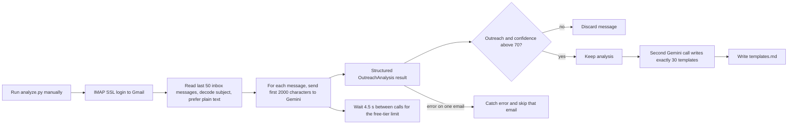

# Cold-Email Strategy Miner

> A Python script that reads the owner's own Gmail inbox over IMAP, uses Gemini to pick out the cold and warm outreach emails and ad emails that arrived, and generates 30 distinct outreach templates from what it finds.

| | |
|---|---|
| **Category** | Lead generation, outreach and data pipelines |
| **Status** | Personal tool, as of 9 Oct 2026 (script only; the generated `templates.md` is not found) |
| **Type** | Python script (IMAP reader plus Gemini structured output) |
| **Runner and schedule** | Manual, run from a local virtual environment |
| **Client / owner** | Personal tool of the owner, used to inform Stack&Code outreach (the use for Stack&Code is inferred) |
| **Stack** | Python, `imaplib` over Gmail IMAP, google-genai (Gemini), pydantic, beautifulsoup4, python-dotenv |
| **Source** | Main KB Part 4 section 13; Portfolio KB: no matching entry |

## 1. Description

### What it does
Connects to Gmail by IMAP, reads the last 50 inbox messages, and asks Gemini to classify each one as outreach or not and to describe the strategy it uses. The emails that are confidently outreach are then passed to a second Gemini call that writes exactly 30 different outreach templates, each with subject lines, body, call to action and the psychological mechanism it relies on. The result is written to `templates.md`.

### Inputs and outputs
- **Inputs:** The last 50 inbox messages from a Gmail account (needs IMAP enabled and an app password). Environment variable names (loaded from a local `.env` file): `gmail`, `pass`, `GEMINI_API_KEY`. `requirements.txt`: google-genai, python-dotenv, beautifulsoup4, pydantic.
- **Outputs:** `templates.md` in the working directory (not found in the source folder).

### Key components
| Component | Role |
|---|---|
| `analyze.py` | The whole pipeline: fetch, classify, filter, generate, write |
| Pydantic schema `OutreachAnalysis` | Structured classification fields: is_outreach, confidence, outreach_type, target_persona, pain_point, value_proposition, cta, tone, personalization_level, strategy_name |
| Pydantic schema `TemplateCollection` | Structured output for the 30 templates |
| Gemini model (code id `gemini-3.6-flash`) | Classification at temperature 0.2, template generation at temperature 0.7 |

### Where it lives
`...\Automation & Data\outreach` (the KB abbreviates the prefix; section 12 gives the full prefix as `D:\Project\Personal Tools & Labs (<owner>)`) with `.venv`, `analyze.py` and `requirements.txt`.

## 2. Flow chart

**Reading the chart**
1. The script is run by hand inside the local virtual environment.
2. It logs in to Gmail over IMAP SSL and reads the last 50 inbox messages, decoding the subject, preferring the text/plain part and stripping HTML.
3. Each message's first 2,000 characters go to Gemini with the `OutreachAnalysis` schema. The script sleeps 4.5 seconds between calls to stay under the free-tier 15 requests per minute.
4. Only results with `is_outreach` true and confidence above 70 are kept. Errors on a single email are caught and that email is skipped.
5. One more Gemini call (temperature 0.7) generates exactly 30 different templates (`TemplateCollection`).
6. The templates are written to `templates.md`.

## 3. Case study

### The challenge
Cold and warm outreach and ad emails land in the owner's own inbox. The aim stated in the KB is to learn from them and produce a varied set of 30 outreach templates, rather than writing each from scratch. The KB does not say which business the templates were for (Stack&Code is an inference).

### The solution
A small pipeline that treats the inbox as a corpus of real-world outreach. Gemini first labels each email (persona, pain point, value proposition, call to action, tone, personalisation level, strategy name) and then uses the confident hits to write 30 distinct templates. Structured Pydantic schemas keep the model output machine-readable.

### Design decisions and rules learned
- Confidence threshold: only results above 70 are kept, so non-outreach mail does not pollute the template set.
- Low temperature (0.2) for classification, higher (0.7) for creative template generation.
- 4.5 second sleep between calls to respect the Gemini free tier of 15 requests per minute.
- Per-email errors are caught and skipped rather than stopping the run.
- Quality depends on how many real outreach emails are among the last 50.
- Reading an inbox requires IMAP to be enabled and a Gmail app password.

### Outcome
No measured outcome recorded. The folder contains the script and a virtual environment. The generated `templates.md` is not found, so the KB does not show that the script ever completed a run.

### Lessons learned
- A 50-message window is small; the template set is only as varied as the outreach that happened to land there.
- The model id in the code (`gemini-3.6-flash`) should be checked against current availability before a run, since this is the kind of value that goes stale (compare the Transcript recorder, whose model id is already old).

## 4. Operating notes
- **Run / pause / debug:** `cd outreach && .venv\Scripts\activate && python analyze.py`. The run is short: 50 messages with a 4.5 s gap between calls.
- **Known issues and open items:** `templates.md` not found; no record of a completed run; no tests described.
- **Risks:**
  - Security and credential-hygiene findings for this project are tracked privately and are not published here.
  - Up to the first 2,000 characters of each of 50 inbox emails (which may include personal or confidential mail) are sent to the Gemini API. Review what lands in the inbox window first.
  - Using app passwords with IMAP lowers the account's security posture; revoke the app password when the tool is not in use.

## 5. Related
- [Stack&Code email trigger with crawler](./stackandcode-email-trigger-crawler.md) and [Cold Outreach Leads analyzer](./cold-outreach-leads-analyzer.md), the tools whose pitches this miner is meant to inform (inferred)
- **Sources:** Main KB Part 4 sections 13 and 17
