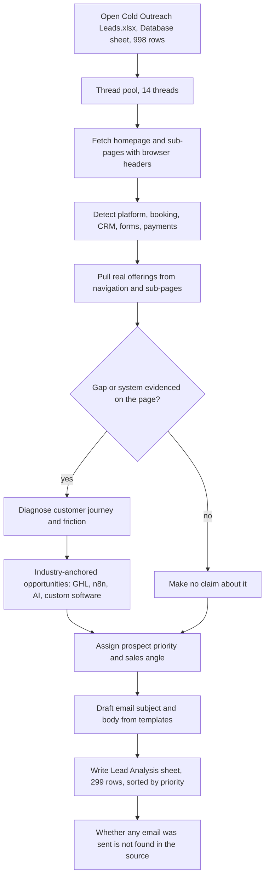

# Cold Outreach Leads Analyzer

> A set of Python scripts that crawl each lead's website in the Stack&Code cold-outreach spreadsheet, diagnose real friction and automation opportunities, score and prioritise the lead, and draft an email subject and body anchored to the lead's actual industry.

| | |
|---|---|
| **Category** | Lead generation, outreach and data pipelines |
| **Status** | On demand, as of 9 Oct 2026 (four script generations, last run 3 Oct 2026) |
| **Type** | Python scripts (spreadsheet in, analysed spreadsheet out) |
| **Runner and schedule** | Manual, run on the owner's machine |
| **Client / owner** | Stack&Code |
| **Stack** | Python, urllib, BeautifulSoup, openpyxl, ThreadPoolExecutor. No LLM; rules and templates only. |
| **Source** | Main KB Part 4 section 11 (and sections 12, 17); Portfolio KB section 21 (general lead systems) |

## 1. Description

### What it does
Reads the `Database` sheet of `Cold Outreach Leads.xlsx` (998 rows), fetches each lead's website, and detects the visible digital systems (platform, booking, CRM and marketing, forms, payments). It then diagnoses the customer journey and friction, proposes opportunities in four lanes (GoHighLevel, n8n, AI, custom software), assigns a prospect priority and writes a cold email subject and body. The aim stated in the KB is "zero hallucination": only claim gaps with evidence from the page and keep every angle anchored to the lead's real industry.

### Inputs and outputs
- **Inputs:** `Cold Outreach Leads.xlsx`, sheet `Database` (998 rows). Columns: Business, Website, Phone, Email, Instagram, Industry, Email sent, Follow up 1, Country, Notes, Score and "Posibility" (spelling as in the source). The path is hard-coded as `d:\Project\<owner>\Stack&code\Data\lead\Cold Outreach Leads.xlsx`.
- **Outputs:** A `Lead Analysis` sheet of 299 rows, with 15 columns: Business Name, Website, Industry, Website Quality, Visible Digital Systems, Customer Journey, Primary Automation Opportunity, GHL Opportunity, n8n Opportunity, AI Opportunity, Custom Software Opportunity, Prospect Priority, Primary Sales Angle, Email Subject, Cold Email Body.

### Key components
| Component | Role |
|---|---|
| `analyze_leads.py` | Minimal single-site fetch helper; note it disables SSL verification |
| `run_full_lead_analysis.py` (v1) | 16 threads; keyword signatures for platforms and tools; writes the `Posibility` column |
| `deep_lead_analyzer.py` (V2) | Multi-page crawl, richer browser headers, real offerings pulled from navigation and sub-pages, friction diagnosis |
| `fix_lead_analysis.py` | "Strict industry-anchored" rewrite, 14 threads, after generic output was judged inaccurate |
| `set_full_multi_tier_sheet.py` (final) | 14 threads; writes all 15 columns including Custom Software Opportunity and tech-partnership positioning; sorted by priority |

Signature lists in v1 cover: platforms (Shopify, WooCommerce, WordPress, Squarespace, Wix), booking tools (Fresha, Timely, Mindbody, Zenoti, Phorest, Calendly, Acuity, OpenTable and others), CRM and marketing (HubSpot, Mailchimp, Klaviyo, ActiveCampaign), forms (Typeform, JotForm, Gravity Forms, WPForms) and payments.

### Where it lives
`D:\Project\<owner>\Stack&code\Data\lead\*`. A copy of `Cold Outreach Leads.xlsx` also sits in `Data_processing` (998-row `Database` sheet, no analysis sheet). The Stack&code copy is the working one.

## 2. Flow chart

**Reading the chart**
1. The final script opens the `Database` sheet of the workbook (hard-coded path).
2. Leads are fetched in parallel by 14 threads, each site with browser-like headers and sub-pages (V2 onward).
3. Detection rules find the platform, booking, CRM and marketing, form and payment tools in use.
4. Real offerings are taken from navigation and sub-pages so the angle matches the business (for example, a corporate gifting business on Shopify gets a bulk-order portal as a custom-software angle).
5. The KB's rule is to claim a gap only when the page gives evidence. Where there is none, no claim is made. How leads whose pages could not be fetched are written to the sheet is not documented in the source.
6. Friction is diagnosed and opportunities proposed in four lanes.
7. The lead is prioritised and given a sales angle.
8. A subject and body are drafted from templates.
9. All results are written to the `Lead Analysis` sheet sorted by priority. These scripts contain no send step as described in the KB, and whether any of the emails were ever sent is (not found).

## 3. Case study

### The challenge
The 998-row cold-outreach database needed more than generic pitches. Early output was judged inaccurate because it was generic, and a pitch that claims a gap that does not exist undermines credibility.

### The solution
Four iterations of the same idea, each stricter than the last. v1 added fast multi-threaded technology detection. V2 added deeper crawling and friction diagnosis. The "strict industry-anchored" rewrite fixed generic output. The final script writes a full multi-tier sheet that includes a custom-software opportunity and technical-partnership positioning, sorted by priority, with a ready-to-edit subject and body per lead.

The portfolio KB (section 21) describes lead generation and outreach systems at a general level and does not describe this analyser; it lists "lead discovery and master-database processing" among the case studies to write up.

### Design decisions and rules learned
- Only claim gaps with evidence from the page.
- Anchor every angle to the lead's industry; industry-specific logic beats generic templates.
- Use rules and templates rather than an LLM, which keeps the output deterministic and cheap.
- Treat the Stack&code copy of the workbook as the working copy.
- `analyze_leads.py` disables SSL verification; the KB flags this and it should not be carried into production use.
- The source workbook already has `Score` and `Posibility` columns; v1 writes the `Posibility` column.

### Outcome
- Four script generations written, with the final run on 3 Oct 2026.
- 299 leads analysed into the `Lead Analysis` sheet of a 998-row database.
- Whether emails were sent is (not found) in the source.

### Lessons learned
- Generic analysis was judged inaccurate; strict industry anchoring and page evidence were the fix.
- Hard-coded file paths and four overlapping scripts make the tool hard to re-run; the final script should be the only entry point.
- A scored sheet of drafts is a prepared asset, not an outcome. Replies, bookings or revenue are not recorded.

## 4. Operating notes
- **Run / pause / debug:** Run `set_full_multi_tier_sheet.py` (the final script) after checking the hard-coded workbook path. The earlier three scripts are superseded.
- **Known issues and open items:**
  - Why 299 of 998 leads were analysed (how they were selected) is not documented.
  - Whether the drafts were reviewed or sent is (not found).
  - Hard-coded paths and a disabled-SSL helper script.
- **Risks:**
  - The workbook holds business contact details and an "Email sent" and "Follow up 1" tracking layout, but no suppression or unsubscribe handling is described. Apply the consent and opt-out rules in Part 4 section 17 before sending.
  - Crawling 998 sites with 14 threads and browser-like headers can get the machine blocked by target sites.
  - Drafts produced by rules can still contain a wrong claim; read each one before use.

## 5. Related
- [Contact-list merge and master database builder](./contact-list-merge-master-database.md), which also reads the same 998-row workbook
- [Stack&Code email trigger with crawler](./stackandcode-email-trigger-crawler.md), the LLM-based single-prospect tool
- **Sources:** Main KB Part 4 sections 11, 12 and 17; Portfolio KB section 21
