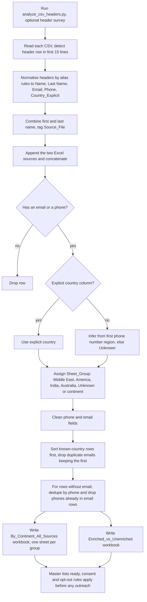

# Contact-List Merge and Master Database Builder

> Python scripts that merge dozens of messy contact exports and lead sheets into one de-duplicated master list grouped by country or continent, and split into enriched (email and phone) versus unenriched records.

| | |
|---|---|
| **Category** | Lead generation, outreach and data pipelines |
| **Status** | On demand, as of 9 Oct 2026 (run 20-21 Aug 2026; final scripts and outputs present) |
| **Type** | Python data-processing scripts (CSV and Excel in, Excel out) |
| **Runner and schedule** | Manual, run on the owner's machine |
| **Client / owner** | Appears to be a client's event and community contacts, plus Stack&Code cold-outreach lists (client not named in the source) |
| **Stack** | Python, pandas, xlsxwriter, openpyxl, `phonenumbers`, `pycountry`, `pycountry_convert` |
| **Source** | Main KB Part 4 section 12 (and 17); Portfolio KB section 21.5 |

> **Privacy.** The inputs and outputs are real people's contact details (names, emails, phone numbers). This file describes structure and counts only. No contact data is reproduced anywhere in this document.

## 1. Description

### What it does
Reads every contact export in a folder (about 65 CSVs from event registrations, attendee lists, Zoom reports, newsletter and CRM exports, Google Forms) plus two Excel sources, normalises the columns, works out each record's country, removes duplicates and writes master workbooks. One workbook has a sheet per country group or continent; another separates records that have both an email and a phone ("enriched") from the rest.

### Inputs and outputs
- **Inputs:**
  - Folder `CSV Files-Customers, Leads` (about 65 CSVs: webinar and masterclass registrations, attendee lists, Zoom reports, MailerLite and HubSpot exports, Google Forms).
  - `Cold Outreach Leads.xlsx` (998 rows).
  - `23k SaaS Leads (1).xlsx`, one sheet "Live Infusionsoft Sites", about 40,000 rows by sheet dimension although the name says 23k, with 40+ firmographic and technology columns (name, title, email, domain, spend and revenue estimates, employees, company, vertical, traffic ranks, telephones, socials, location, detection dates).
- **Outputs:**
  - `Master_Database_By_Continent_All_Sources.xlsx`: 12,273 unique records, columns Email, Source_File, Name, Phone, Final_Country, Sheet_Group, one sheet per group.
  - `Master_Database_Enriched_vs_Unenriched.xlsx`: enriched 4,695, unenriched 7,578.
  - Earlier iterations: `Master_Database_By_Continent.xlsx` (CSV-only, 1,207 rows), `Master_Database_By_Country.xlsx` and `_V2.xlsx` (one sheet per country).
  - `scratch_headers.json`: header survey of 67 files.

### Key components
| Component | Role |
|---|---|
| `analyze_csv_headers.py` | Reads only headers (`nrows=0`, utf-8 then latin1 fallback) of every non-empty CSV into `scratch_headers.json`: column count, any country/location/city/state columns, first 15 columns |
| `merge_csvs.py` | Header-row detection, alias normalisation, country inference, grouping, cleaning, de-duplication, Excel writing |
| `phonenumbers`, `pycountry`, `pycountry_convert` | Phone region to country name, then country to continent |

### Where it lives
`D:\Project\Personal Tools & Labs (<owner>)\Automation & Data\Data_processing`, files `merge_csvs.py, analyze_csv_headers.py, scratch_headers.json, Master_*.xlsx`. The scripts hard-code the stale folder `d:/Project/<owner>/Data_processing/...`; edit the paths before re-running.

## 2. Flow chart

**Reading the chart**
1. An optional first pass reads only headers of all non-empty CSVs (67 files recorded) so the alias rules can be designed.
2. `merge_csvs.py` auto-detects the header row as the first of the first 15 lines containing "name" or "email", then maps headers to a common schema. Phone aliases include WhatsApp, number and telephones, and exclude duration and meeting columns.
3. The two Excel sources are appended and everything is concatenated. Rows with neither email nor phone are dropped.
4. Country comes from the explicit column. If absent, the first phone number is parsed (a `+` prefix is needed) and its region converted to a country name; otherwise "Unknown".
5. The group sheet is Middle East, America (US and Canada), India, Australia, Unknown, or otherwise a continent. Unresolved values become their own sheet name.
6. Phones are cleaned (strip "ph:", take the first of a `;` or `,` list, keep digits and `+`) and emails reduced to the first of a comma list.
7. Duplicates: known-country rows sort first and duplicate emails are dropped keeping the first. Rows without an email are de-duplicated by phone, and phones already present among email rows are dropped.
8. Two workbooks are written. "Enriched" means both a non-empty email and a non-empty phone.

## 3. Case study

### The challenge
Contact data was scattered across dozens of CSV exports with different headers, encodings and header-row positions, plus two spreadsheets of leads. The team needed one master list, grouped by geography so outreach could be segmented, with duplicates removed and a clear view of which records had both email and phone.

### The solution
A two-script pipeline. A header survey informs the alias rules; the merge script normalises every source to a common schema, infers countries from phone numbers where there is no explicit country, groups by country or continent, de-duplicates and writes Excel workbooks.

Final group sheet counts: North America 7,943; Unknown 1,777; Oceania 829; Europe 717; Middle East 541; Asia 152; South America 122; India 107; Perth 54; Africa 11; America 12; Other 5; Bunbury 3. These sum to 12,273.

The portfolio KB (section 21.5) describes the same consolidation in general terms, as roughly 23,000 SaaS leads and cold-outreach lists consolidated into master databases: import CSV sources, normalise schemas and encodings, standardise country and continent, de-duplicate on stable identifiers, keep provenance columns, merge, validate counts and export. This matches the main KB's process. Discrepancy: the portfolio KB says about 23,000 SaaS leads, while the main KB finds about 40,000 rows by sheet dimension in a file named "23k". The main KB, read from the files, is preferred. The final master is 12,273 unique records, and the KB does not say how many rows each source contributed.

### Design decisions and rules learned
- "Enriched" means a record has both an email and a phone.
- Country order: explicit column, then phone-number region, then "Unknown".
- Dedupe keeps the first source alphabetically; later duplicates lose their source attribution.
- Excel sheet names are truncated to 31 characters and stripped of `: / \ ? * [ ]`.
- Country-per-sheet outputs contain junk sheets named with 2-letter codes (Ae, In, Ng, Om, Qa, Ao, Ag) and city names (Perth, Bunbury) because the explicit country column was not normalised. The fix is to map ISO-2 codes and city names before grouping.
- The header survey reads only headers (`nrows=0`, utf-8 with latin1 fallback) and records them in `scratch_headers.json` before any merge.

### Outcome
- 12,273 unique records in the master by-continent workbook.
- Enriched 4,695 and unenriched 7,578 in the enriched-versus-unenriched workbook.
- Run 20-21 Aug 2026. Earlier iterations produced a CSV-only continent workbook (1,207 rows) and two per-country workbooks.
- No downstream outreach results are recorded.

### Lessons learned
- Normalise country values (ISO-2 codes, city names) before grouping, or junk sheets appear.
- Preserve provenance: keeping only the first duplicate loses where later duplicates came from.
- Hard-coded paths make re-runs fragile.

## 4. Operating notes
- **Run / pause / debug:** Fix the folder paths in `merge_csvs.py`, then run `python analyze_csv_headers.py` (optional) and `python merge_csvs.py`. Install: `pip install pandas openpyxl xlsxwriter phonenumbers pycountry pycountry-convert`.
- **Known issues and open items:**
  - Stale hard-coded paths.
  - Remaining non-country sheet names in the final group list (Perth 54, Bunbury 3, America 12, Other 5).
  - The KB reports about 65 CSVs in the folder and 67 files in the header survey; the difference is not explained.
  - Row counts per source are not recorded.
- **Risks:**
  - Personal data: the lists are real people's contact details, likely collected for other purposes (events, newsletters). Apply consent and opt-out rules (Spam Act, GDPR, CAN-SPAM, see Part 4 section 17) before any outreach.
  - A purchased or exported third-party SaaS lead sheet carries its own licence and consent limits.
  - Store the master workbooks securely and do not commit them to git.

## 5. Related
- [Cold Outreach Leads analyzer](./cold-outreach-leads-analyzer.md), which uses the same 998-row workbook as one input
- [Stack&Code email trigger with crawler](./stackandcode-email-trigger-crawler.md), a downstream outreach tool (no live send logged)
- Client Finder AI platform lead database: see Part 4 section 2 of the main KB
- **Sources:** Main KB Part 4 sections 12 and 17; Portfolio KB section 21.5
