# Follow-up Email Engine (Default Mode and Custom Mode)

> A sequence-based follow-up system inside Client Finder AI that sends threaded Gmail follow-ups to leads who have not replied and stops at once on reply, bounce or unsubscribe.

| | |
|---|---|
| **Category** | Lead generation, outreach and data pipelines |
| **Status** | On demand, as of 9 Oct 2026 (built 15 Aug 2026; master switch off by default; never run end-to-end against real Gmail because working mail accounts were not available) |
| **Type** | Background dispatcher, reply watcher and API inside a Node/TypeScript server |
| **Runner and schedule** | node-cron every minute (`FollowUpDispatcher` and `EmailScheduler`); reply watcher every `replyPollMinutes` (default 5). Enrolment on send (compose, campaign, lead-intelligence) when auto-enrol is on, or manual and bulk. |
| **Client / owner** | Client Finder AI platform (Stack&Code folder), built by Hari |
| **Stack** | Node, TypeScript, node-cron, nodemailer (SMTP out), ImapFlow (IMAP in), MariaDB, zod config, SSE, optional AI personalisation (Groq / OpenRouter / OpenAI), Telegram / Slack / Discord / email alerts |
| **Source** | Main KB Part 4 section 6 (plus section 0 map); Portfolio KB section 21.3 |

## 1. Description

### What it does
After a normal outreach email is sent, the lead is enrolled in a follow-up sequence (default "Smart 3-Step"). Each minute a dispatcher finds due enrolments, claims them, runs a list of pre-send checks, renders the step and sends it as a `Re:` reply in the same Gmail thread from the same sending account. A reply watcher reads each mailbox, matches replies to the original thread and stops the sequence. The owner required two modes: one-click Default Mode and a fully Custom Mode where every behaviour is a user setting, authenticated, real-time and built to scale.

### Inputs and outputs
- **Inputs:** `followUpConfig` (JSON in the `settings` key-value table, zod-validated); sequences, steps and enrolments; up to eight Gmail accounts through env `GMAIL_1..8_EMAIL` / `GMAIL_1..8_PASSWORD` (names only); lead intelligence (`li_ai_analyses` pain points) for personalisation; `PUBLIC_BASE_URL` (needed for tracking and unsubscribe links) and `JWT_SECRET`.
- **Outputs:** an enrolment and message ledger, a suppression list, SSE events (`enrollment:created`, `followup:sent`, `reply:detected`, `cap:reached` and others), Telegram / Slack / Discord / email alerts to the mailbox owner, an "Interested" inbox, and an analytics endpoint (SQL aggregates).

### Key components
| Component | Role |
|---|---|
| `followupDispatcher.ts` | Per-minute claim, checks, send, schedule next step. |
| `followupService.ts`, `followupRoutes.ts`, `followupTypes.ts`, `followupEvents.ts` | Service logic, JWT-protected API, config schema and defaults, event stream. |
| `replyWatcher.ts` | Per-account IMAP watcher with watermark, direction check and thread correlation. |
| `mailer/mailerService.ts`, `scheduler/emailScheduler.ts` | Sending and scheduled sends; per-row claim. |
| Tables | `followup_sequences`, `followup_steps`, `followup_enrollments` (active, processing, paused, awaiting_approval, replied, completed, stopped, bounced, failed), `followup_messages`, `email_events`, `suppression_list`. |
| API | `/api/followups/{config,sequences,enroll,enroll/bulk,enrollments,approvals,messages/:id/approve,suppression,analytics,stream}` behind JWT; public HMAC-signed routes `/t/o/:sig.png` (open), `/t/c/:sig` (click), `/u/:sig` (unsubscribe; GET confirms, POST acts). |
| Test | `testFollowupEngine.ts`, to run against the database before enabling. |

### Where it lives
`D:\Project\<owner>\Stack&code\scraper\backend\src\followups\*` (with `mailer` and `scheduler`); plan in `FOLLOWUP_SYSTEM_PLAN.md` (9 sections including a roughly 50-knob settings catalog A-J).

## 2. Flow chart

```mermaid
flowchart TD
    subgraph SEND["Send path, every minute"]
        A1["Outreach email sent, Message-ID saved"] --> A2["Lead auto-enrolled in Smart 3-Step unless opted out"]
        A2 --> A3["Dispatcher selects due active enrolments"]
        A3 --> A4["Claim: UPDATE to processing WHERE status is active"]
        A4 --> D1{"Affected rows above 0?"}
        D1 -->|"no"| A5["Skip, another worker has it"]
        D1 -->|"yes"| D2{"Pre-send checks pass?"}
        D2 -->|"no"| A6["Do not send now, deferrals are logged, for example daily cap reached"]
        D2 -->|"yes"| A8["Render step: template, AI, or AI inside guardrails"]
        A8 --> D3{"Approval required?"}
        D3 -->|"yes"| A9["Hold as awaiting approval"]
        D3 -->|"no"| A10["Send as Re: with In-Reply-To and References, same account"]
        A9 --> A10
        A10 --> D4{"SMTP send ok?"}
        D4 -->|"no"| A11["Retry with backoff, then failed and alert after max attempts"]
        D4 -->|"yes"| A12["Schedule next step with jitter, or mark completed"]
    end
    subgraph WATCH["Reply watcher, every 5 minutes"]
        B1["IMAP search SINCE watermark per account"] --> B2["Direction check and match In-Reply-To to sent message"]
        B2 --> D5{"Reply from lead?"}
        D5 -->|"yes"| B3["Set replied, cancel queued steps, alert owner, AI intent summary"]
        D5 -->|"no"| B4["Advance watermark, dedupe by Message-ID"]
        B3 --> D6{"Stop keyword in reply?"}
        D6 -->|"yes"| B5["Add lead to suppression list permanently"]
        D6 -->|"no"| B6["Positive or Question goes to Interested inbox"]
    end
```

**Reading the chart**
1. A normal outreach send stores the SMTP Message-ID and auto-enrols the lead (unless opted out at send time). `next_send_at` is always a UTC ISO string because string comparison breaks on other formats.
2. Each minute the dispatcher claims due rows with a guarded update and proceeds only if a row was actually changed.
3. Pre-send checks, each a setting: engine not killed, account still configured, lead not suppressed, not already replied, inside the send window (checked at dispatch), under per-account and total daily caps, minimum gap per account, weekend rule, `maxEmailsPerLead`.
4. The step is rendered (static template with variables such as `{{firstName}}`, `{{company}}`, `{{painPoint}}`, AI-generated, or AI within guardrails). A Phase 3 approval queue exists (`awaiting_approval` status, approvals routes); exactly when a step is held for approval is not detailed in the source.
5. The send is a threaded `Re:` from the sticky sender account. The SMTP try/catch covers only the send; bookkeeping errors park the enrolment instead of re-sending. After `maxSendAttempts` (3) with backoff the enrolment fails and alerts.
6. The final status write is guarded on `status='processing'`, so a reply arriving mid-send is never overwritten.
7. The reply watcher runs separately per account and stops sequences, alerts the owner and suppresses leads whose replies contain stop keywords ("unsubscribe", "not interested", "stop emailing", "remove me").

## 3. Case study

### The challenge
Outreach that stops after the first email leaves most replies on the table, but naive follow-ups damage deliverability and annoy recipients. The system had to follow up only when no reply had come, stay in the same thread, stop instantly on reply, bounce or unsubscribe, respect send windows and daily caps on Gmail app-password accounts, and be switchable between a simple default and a fully custom mode. The existing mailer also had bugs that a follow-up engine would have amplified.

### The solution
A sequence engine with a settings cascade: defaults, then global `followUpConfig`, then sequence `settings_json`, then enrolment `overrides_json`. The default sequence "Smart 3-Step" sends step 1 after 3 days (gentle bump), step 2 four days later on day 7 (value-add on the pain point) and step 3 seven days later on day 14 (polite breakup). Default config (`followupTypes.ts`): enabled=false, autoEnroll=true (compose, campaign, lead intelligence), window 09:00-17:00, weekends off, timezone Asia/Kolkata, jitter 15 min, `dailyCapPerAccount` 50 (max 400), `dailyCapTotal` 200 (max 2000), minimum gap 90 s (10-900), `maxEmailsPerLead` 5, `maxSendAttempts` 3, stopOnReply and stopOnBounce true, `replyPollMinutes` 5, `notifyOnReply` true.

### Design decisions and rules learned
- **Sticky account per thread.** Rotation applies only to new conversations (least-sent-today account under cap). Switching accounts mid-thread breaks threading and looks like spam.
- **Tracking off by default** for deliverability; unsubscribe link and `List-Unsubscribe` header on by default. The realistic Gmail app-password ceiling is about 500 a day in total; defaults are far below.
- **Unsubscribe must be POST-confirmed**, because link scanners were auto-unsubscribing on GET. Tracking links must be HMAC-signed with a real secret; no unsigned `?u=` redirect.
- **Pre-existing bugs fixed first:** scheduler double-send (no claim-before-send), `scheduledAt` stored verbatim, reply-direction check inverted (own sent mail fired "New Reply" alerts), `status='replied'` had no writer, Message-ID and In-Reply-To fetched then discarded, subject-plus-recipient dedupe hid second replies, account removal made scheduled rows bounce permanently, and the inbox poll did 17 table scans plus 8 IMAP connections per request.
- **Review-found critical:** the reply watcher watermark advanced from the sender-written Date header, so a future-dated spam mail could silence reply detection forever. It now uses the server `internalDate`, clamped to now, with a 10-minute overlap and Message-ID dedupe.
- **ImapFlow `'error'` events on auth failure were unhandled and crashed the whole Node process** (HTTP, schedulers, dispatcher). Fixed with listeners on every client plus a global safety net.
- **Inbox performance:** a shared 20 s snapshot with single-flight (10 concurrent cold requests become one rebuild), hidden browser tabs stop polling, gzip, indexes and `DATABASE_POOL_MAX`.
- **Compliance note from the owner's README:** GDPR, the Australian Spam Act and CAN-SPAM apply to the outreach side; keep unsubscribe on, honour opt-outs through the suppression list, and email only with a genuine reason.
- **Portfolio KB (portfolio KB):** describes the same shape as a suggested process (read eligible leads and prior state, decide whether a follow-up is due, check unsubscribe, bounce and suppression lists, generate or select the approved message, send, record message ID, timestamp and delivery state, schedule the next step only if permitted) and notes the project was developed across two sessions. The main KB confirms each step with concrete rules; no conflict.

### Outcome
- Designed 14 Aug (plan published as an artifact); built and adversarially reviewed 15 Aug: 22 confirmed findings fixed, 25 refuted.
- Compile and build clean; 11 scheduling checks pass.
- Phases 0-2 largely built; Phase 3 (approval queue) and parts of Phase 4 (tracking, unsubscribe, suppression, analytics) present. An `ab_group` field exists in the schema and routes but an automatic A/B winner feature was not verified. Phase 5 (pg-boss queue, IMAP IDLE) is (not found) in the code; node-cron with claim-then-send is what runs.
- Not run end-to-end against real Gmail: the mail accounts could not be used during the build window, so there was no sending and no reply detection. The roadmap says the engine "cannot send or detect replies" until working mail accounts are connected.
- No send counts, reply rates or deliverability results recorded.

### Lessons learned
- Fix the base mailer first; a follow-up engine multiplies any existing double-send or threading bug.
- Claim before send, guard the final write, and trust the server's timestamps rather than sender-controlled headers.
- Make destructive links (unsubscribe) require a POST confirmation so scanners cannot trigger them.
- An unhandled error event from a mail library can take down the whole process; attach listeners to every client.

## 4. Operating notes
- **Run / pause / debug:** use Settings, Follow-Ups in the app, or `PUT /api/followups/config`. The master switch `enabled` and a separate `killSwitch` control it. The default sequence is created on first run. Run `testFollowupEngine.ts` against the database before enabling. Debug by reading enrolment `status` and `stop_reason`, and `[Followups]` log lines; deferrals log "daily cap ... reached".
- **Known issues and open items:** connect working Gmail accounts, then do an end-to-end test with live Gmail; confirm whether the fixes were deployed (production ran older follow-up code with Postgres-only SQL for the analytics and enrol endpoints until redeployed); auto-winner A/B and pg-boss queue are not built.
- **Risks:**
  - **Compliance:** Spam Act (Australia), GDPR and CAN-SPAM require a working unsubscribe, accurate sender identity and honoured opt-outs. The suppression list and `List-Unsubscribe` are implemented here, but nothing has run live.
  - **Deliverability:** high volume or account switching mid-thread can look like spam; protect the sending domain.
  - **Security:** security and credential-hygiene findings for this project are tracked privately and are not published here.

## 5. Related
- [Client Finder AI platform](client-finder-ai-platform.md)
- [Node GlobalCrawler and Autonomous Lead Engine](node-globalcrawler-and-autonomous-lead-engine.md) (can auto-enrol leads into sequences)
- [Platform hardening and production smoke test](platform-hardening-and-smoke-test.md) (claim helper used by the dispatcher)
- For contrast, the Stack&Code outreach CLI has only a footer opt-out line and no suppression list (see Part 4 section 8).
- **Sources:** Main KB Part 4 sections 0 and 6 (lines 2253, 2524-2573); Portfolio KB section 21.3.
