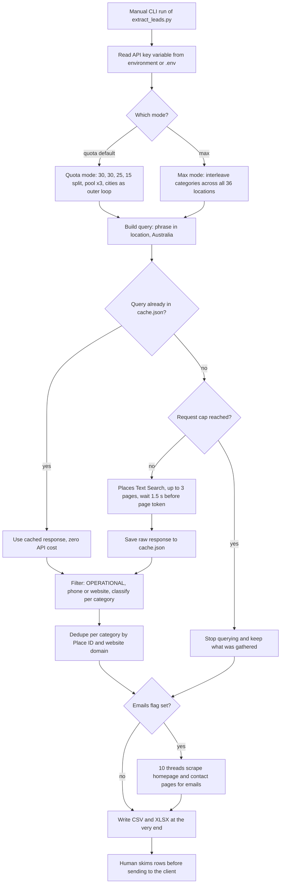

# Google Maps Places API lead extractor

> A Python command-line tool that bulk-extracts Australian business leads (law firms, aesthetic clinics, real estate agencies, financial advisors) from the Google Places API (New) into CSV and XLSX for a client lead-list order.

| | |
|---|---|
| **Category** | Lead generation, outreach and data pipelines |
| **Status** | On demand, as of 9 Oct 2026 (built and run 6 Oct 2026) |
| **Type** | Python CLI script |
| **Runner and schedule** | Manual CLI run on the owner's machine. No scheduler. |
| **Client / owner** | Client lead-generation project under the Pivot agency work, built by Hari (client name omitted; the KB calls it "map leads") |
| **Stack** | Python 3 standard library (`urllib`), optional `openpyxl`, Google Cloud Places API (New) Text Search |
| **Source** | Main KB Part 4 section 1 (plus section 0 map); Portfolio KB section 21.1 |

## 1. Description

### What it does
Builds search queries of the form "phrase in location, Australia", calls the Places API (New) Text Search endpoint, filters out irrelevant or non-operational businesses with category-specific rules, de-duplicates, optionally scrapes each business website for an email address, and writes the result to CSV and XLSX. The original client ask was 100 "done for you" leads in a 30/30/25/15 mix; the owner then asked for "as much as it can give" so the dataset could be re-cut for more deliveries.

### Inputs and outputs
- **Inputs:** `GOOGLE_MAPS_API_KEY` (from the environment or a `.env` next to the script; `.env.example` holds only the variable name). Hard-coded in the script: 15 core cities (Sydney, Melbourne, Brisbane, Perth, Adelaide, Gold Coast, Canberra, Newcastle, Sunshine Coast, Wollongong, Geelong, Hobart, Parramatta, Townsville, Darwin), 21 extra suburbs and regional towns used by the max mode, and 4 categories with search phrases (law 3, aesthetic 4, real estate 2, financial 3).
- **Outputs:** in the `output` folder: `cache.json` (about 11 MB, query to raw place list), `leads_final.csv`, `leads_final.xlsx` (sheets "Final Leads" and "Full Pool"), `leads_pool.csv`, and `run_max.log` (one line per query). Columns: `category, business_name, address, state, search_city, phone, website, email, rating, review_count, google_maps_url, place_id`.

### Key components
| Component | Role |
|---|---|
| Query builder | Combines category phrases with 36 locations. |
| Places Text Search call | `POST places.googleapis.com/v1/places:searchText` with `regionCode=AU`, `pageSize=20`, up to 3 pages (60-result ceiling per query), 1.5 s wait before using a `nextPageToken`. |
| Field mask | Requests only id, name, address, phones, website, Maps URL, rating, review count, business status, types. Phone and website push the request into the Enterprise pricing tier. |
| `cache.json` | Stores every raw response keyed by query string, so re-runs cost zero API calls. |
| `classify()` | Per-category regex on business name and Google `types` (see rules below). |
| Quota mode | Default, `--total 100`: quotas 30/30/25/15, candidate pool = quota x pool multiplier (3), `pick_final()` ranks phone and website first then review count, round-robins across cities, caps 2 per brand. |
| Max mode | `--max`: interleaves categories across all 36 locations, ignores quotas, checks `API_CALLS + 3 > --max-requests` before each query. |
| Email scraper (`--emails`) | 10 threads fetch homepage, `/contact`, `/contact-us` (8 s timeout, first 400 KB), regex-extract emails, drop images, Sentry, Wix and placeholder junk, prefer an address on the business's own domain. |
| Writers | CSV in utf-8-sig and XLSX with header styling, freeze panes and filters. |

### Where it lives
`D:\Project\Client & Agency (Pivot)\<client-folder>\map leads` with `extract_leads.py`, `.env.example`, `output\*`. Session transcript: "Google Maps API business leads extraction".

## 2. Flow chart

**Reading the chart**
1. The run is started by hand; there is no scheduler. A `--dry-run` flag lists the planned queries with no API calls.
2. The key is read from the environment or a local `.env`. A 400, 401 or 403 response aborts with a checklist message.
3. Quota mode produces a 100-lead cut; max mode produces the large dataset and stops at the request cap.
4. Each query is served from the cache when present, otherwise it is fetched (up to 3 pages) and cached.
5. Every place is filtered (operational, has phone or website, passes the category classifier) and de-duplicated.
6. The optional email step scrapes about 5,000 sites. Google does not return emails, so this is the only source.
7. Outputs are written only at the end of the run. The last step is a human skim of rows (advised, not documented as done).

## 3. Case study

### The challenge
A client order called for 100 Australian leads split 30% law firms, 30% aesthetic clinics (explicitly not beauty clinics), 25% real estate and 15% financial consultants and advisors. The owner then wanted far more than 100 so the data could serve further deliveries, but with a tight cost limit ("use high cap" then "use $0"), because Places Text Search at the Enterprise tier is billed per request.

### The solution
A single Python script with a cache-first design. Quota mode produced the original mix; max mode swept 36 locations with multiple phrases per category to get volume past the 60-results-per-query ceiling. Category classifiers cut noise (legal aid, courts, banks, nail and hair salons, tax-return shops). A threaded website scraper added emails, because the API returns none. The result is one flat table that can be re-cut by category, state or review count.

### Design decisions and rules learned
- **Cache everything.** Every raw response is stored, so rebuilding or re-filtering is free. If the long email step dies, rebuild from `cache.json`.
- **Cost control.** The pricing page showed Text Search Enterprise at about $35 per 1,000 requests; the session assumed a free allowance of 1,000 requests a month (the fetched pricing page did not state it, so confirm in Google Cloud Billing, Reports). A 1,500-request run (about $10-20) was stopped and restarted with `--max-requests 850` to stay under the allowance. Do not run again in the same calendar month, because a second run counts against the same allowance.
- **60 results per query** is a Google ceiling, hence 36 locations times several phrases.
- **Classifier rules.** Law: drop legal aid, court, tribunal, law society, university. Aesthetic: reject any name containing "beauty" (a "Beauty... Cosmetic Medical Clinic" had slipped through), salon-type names and salon-type Google types unless the name says aesthetic, cosmetic, medical or derma. Real estate: `real_estate_agency` type or agency and franchise names. Financial: reject banks, credit unions, tax-return, bookkeeping and pawn; require financial, wealth, adviser, planner, retirement, investment or super in the name.
- **Dedupe** by Place ID and by website domain; **placeholder emails** such as `user@domain.com` are filtered.
- **Geographic spread is not guaranteed in quota mode.** The first 100-lead run only sampled Sydney, Melbourne, Brisbane and Perth because the loop stops once the pool is full.
- **Looks stuck, is not.** Outputs are written only at the end and the email step has no progress counter; it took roughly 20-35 minutes.
- **Portfolio KB view (portfolio KB):** the generic process is define scope, collect listing fields, normalise, de-duplicate, export CSV and XLSX, validate sample rows, and comply with platform terms and applicable privacy and marketing rules. The main KB's detailed run matches this shape and adds the concrete numbers and filters above. No discrepancy between the two sources.

### Outcome
- Final dataset from the max run on 6 Oct 2026: **5,334 leads**. Law Firm 1,667; Real Estate 1,300; Aesthetic Clinic 1,241; Financial Advisor 1,126.
- Phone present on 5,270, website on 5,031, email on 2,817 (53%).
- By state: NSW 1,621; QLD 1,302; VIC 1,276; WA 309; SA 308; ACT 214; TAS 156; NT 144.
- The run log ends with "Done. 5334 leads, 848 billable API requests"; about 52 further requests came from earlier runs, so about 900 of the assumed 1,000 free requests were used.
- In the max run the final, pool and CSV files are identical (5,334 rows each).
- A "best 100 in a 30/30/25/15 mix" cut was offered but is (not found) as a produced file. Whether the data was delivered to the client is (not found).

### Lessons learned
- Build the cache layer first; it turned an expensive API into a free re-cut tool.
- Put a hard request cap on any paid-API loop and log one line per query.
- Show progress during long scraping steps, otherwise a healthy process looks hung.
- Hand-check a sample before delivery. The rows were not hand-checked in the session.

## 4. Operating notes
- **Run / pause / debug:**
  - `python extract_leads.py --dry-run` lists planned queries.
  - `python extract_leads.py` runs the 100-lead quota mode (plus 3x pool).
  - `python extract_leads.py --total 100 --pool-multiplier 4 --emails` adds emails.
  - `python extract_leads.py --max --max-requests 850 --emails` produced the 5,334 leads.
  - Re-run for free with the cache present (only the email scraping repeats). For a 100-lead cut, filter `leads_final.csv` by category using quotas 30/30/25/15 (website and phone first, sort by review count) or run quota mode from cache.
  - A 403 means the API is not enabled, billing is off, or the key restriction blocks the machine.
- **Known issues and open items:** the 100-lead cut file and delivery status are not found; the key allowance assumption needs confirming in billing.
- **Risks:**
  - Spam Act and unsubscribe obligations apply when emailing these B2B leads (the KB points to Part 4 section 17 for the compliance notes). Scraped emails have a 53% hit rate and are not verified.
  - Google Maps data licence and terms of service apply to storing and reusing Places data.
  - Security and credential-hygiene findings for this project are tracked privately and are not published here.

## 5. Related
- [Client Finder AI platform](client-finder-ai-platform.md), whose provider registry also includes a Google Maps and Places source and whose lead-source advice recommends Places for local businesses.
- Other Part 4 items not detailed here: Stack&Code outreach CLI and the data-cleaning and master-database tools (Part 4 sections 8-16).
- **Sources:** Main KB Part 4 sections 0 and 1 (lines 2244-2332); Portfolio KB section 21.1.
