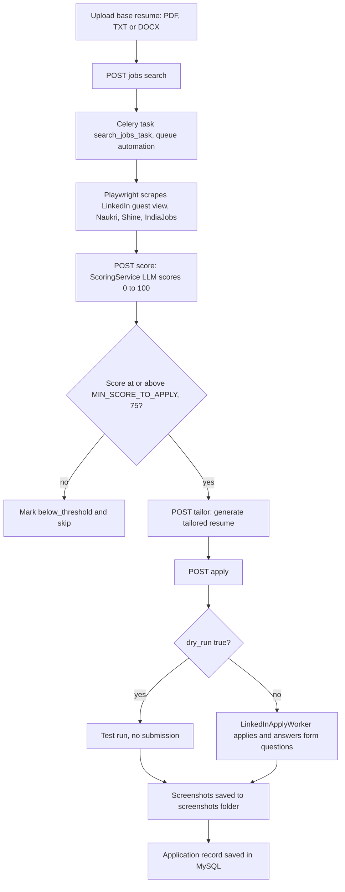

# Job Agent (folder `pdf`): Resume Tailoring and Job Application Automation

> A FastAPI scaffold for AI-assisted targeted job applications: scrape job boards, score each job against a resume, generate a tailored resume and auto-apply with Playwright.

| | |
|---|---|
| **Category** | Lead generation, outreach and data pipelines (personal tooling, grouped here by the KB) |
| **Status** | Designed, not built, as of 9 Oct 2026. A scaffold from May 2026 with 1 git commit; the core scraping task and PDF parsing are listed as next steps. |
| **Type** | FastAPI backend with Celery workers and Playwright automation (scaffold) |
| **Runner and schedule** | API calls or Celery tasks; no schedule described. Run via Docker Compose or local uvicorn plus two Celery workers. |
| **Client / owner** | Not documented in the source; probably the owner's own tool (inferred) |
| **Stack** | FastAPI, SQLAlchemy with aiomysql (MySQL 8), Alembic, Celery with Redis (queues `ai` and `automation`, Flower on port 5555), Playwright, Docker Compose, Next.js frontend skeleton, Groq or OpenAI for scoring and tailoring |
| **Source** | Main KB Part 4 section 14 (and 17); Portfolio KB section 24 |

> **Status note.** The main KB's register (section 2) lists the Job Agent among tools "built and used on demand", but the section text describes a scaffold whose README "Next steps" still include implementing `search_jobs_task`. The section text is more specific, so this file follows it. The folder name `pdf` is misleading; the README title is "Job Agent - FastAPI Backend".

## 1. Description

### What it does
The intended workflow is: upload a base resume, search several job boards, score each job against the resume with an LLM, generate a tailored resume for jobs above a threshold, and apply automatically through a Playwright worker with form questions answered by the agent. A dry-run flag lets the application step be tested without submitting.

### Inputs and outputs
- **Inputs:**
  - A base resume (PDF, TXT or DOCX).
  - Job searches through the API.
  - Settings in `app/core/config.py`, by name: `SECRET_KEY`, `DATABASE_URL`, `REDIS_URL`, `AI_PROVIDER` (groq or openai), `GROQ_API_KEY`, `OPENAI_API_KEY`, `MIN_SCORE_TO_APPLY` (75), `LOCAL_STORAGE_PATH`, `SCREENSHOT_DIR`, `BROWSER_DATA_DIR`, `GOOGLE_CLIENT_ID`, `GOOGLE_CLIENT_SECRET`, `GOOGLE_REDIRECT_URI`, `APP_ENV`.
- **Outputs:** Job scores (0-100), a tailored resume per job, application records and Playwright screenshots in `screenshots\`. Database tables: users, resumes, jobs, applications.

### Key components
| Component | Role |
|---|---|
| API `POST /api/v1/jobs/search` | Queues the Celery task `search_jobs_task` (not yet implemented per the README) |
| Playwright scrapers | LinkedIn (guest view), Naukri, Shine, IndiaJobs |
| `ScoringService` (LLM) | Scores 0-100: skill_match 30, experience_fit 25, location 20, salary 15, low_mismatch 10 |
| Tailoring endpoint | Generates a tailored resume |
| `LinkedInApplyWorker` (Playwright) | Fills the application, answers form questions, saves screenshots |
| Celery workers and Redis | Queues `ai` and `automation`, monitored by Flower |
| MySQL, SQLAlchemy, Alembic | Persistence and migrations |

### Where it lives
`...\Automation & Data\pdf` (the KB abbreviates the prefix; section 12 gives the full prefix as `D:\Project\Personal Tools & Labs (<owner>)`). Docker Compose exposes the API on port 8000 with docs at `/docs`.

## 2. Flow chart

Designed flow. Only the scaffold exists; the job search task, resume PDF parsing, LinkedIn session cookie vault, frontend and notifications are listed as next steps.

**Reading the chart**
1. A base resume is uploaded. PDF parsing with PyMuPDF or pdfplumber is still a next step.
2. A search request queues a Celery task. `search_jobs_task` is not yet implemented.
3. Playwright scrapes the listed job boards.
4. The scoring endpoint asks the LLM for a 0-100 score using the weighted rubric (skill match 30, experience fit 25, location 20, salary 15, low mismatch 10).
5. Jobs under `MIN_SCORE_TO_APPLY` (default 75) are marked `below_threshold` and skipped.
6. For jobs that pass, a tailored resume is generated.
7. The apply endpoint takes `dry_run`; true tests the flow without submitting. False runs `LinkedInApplyWorker`, which answers the form questions.
8. Screenshots go to `screenshots\` and the application is stored in the `applications` table.

The KB describes no human approval step before a real application is submitted.

## 3. Case study

### The challenge
Applying for jobs with a tailored resume for each posting is repetitive: find postings across boards, judge fit, rewrite the resume, fill the same forms again. The goal was to automate that loop.

### The solution
A FastAPI backend with Celery queues split into `ai` (scoring and tailoring) and `automation` (scraping and applying), Playwright for browser work, MySQL for state and Docker Compose for local running. A weighted scoring rubric and a minimum score gate decide which jobs deserve a tailored resume and an application. A dry-run mode exists so the apply step can be tested safely.

The portfolio KB (section 24) lists only "PDF/resume Playwright application" among personal and system tools and says such items should be classified by their actual behaviour rather than assumed to be business automations. It adds nothing about the design.

### Design decisions and rules learned
- Score-gated applications: below `MIN_SCORE_TO_APPLY` (75) a job is skipped.
- Separate queues for AI and browser automation.
- Keep `dry_run` on while testing.
- Scraping or automating LinkedIn violates its terms of service and risks account bans (inferred risk in the KB).
- Planned: a LinkedIn session cookie vault, Next.js frontend and notifications.

### Outcome
No measured outcome recorded. The scaffold dates from May 2026 with one git commit. The KB records no job applications submitted, no scraped job counts and no scores.

### Lessons learned
- The folder name `pdf` hides what the project is; name folders after the project.
- Automating a third-party site that forbids it is a project risk, not just a technical one.
- Several of the pieces that make it useful (job search task, resume parsing, cookie vault) were still unbuilt, so the project should be tracked as a scaffold.

## 4. Operating notes
- **Run / pause / debug:** `docker-compose up --build` (API on 8000, docs at `/docs`), or run uvicorn locally plus two Celery workers (queues `ai` and `automation`). Flower is on 5555. Test the apply step with `dry_run=true`.
- **Known issues and open items:** Implement `search_jobs_task`; add PDF parsing for resumes (PyMuPDF or pdfplumber); LinkedIn session cookie vault; Next.js frontend; notifications.
- **Risks:**
  - LinkedIn ToS and account-ban risk; the browser data directory and any stored session cookie are sensitive.
  - Security and credential-hygiene findings for this project are tracked privately and are not published here.
  - Submitting applications with LLM-generated answers and a tailored resume could misstate the applicant's experience; there is no described human approval step.
  - Resume and job data would be sent to Groq or OpenAI.

## 5. Related
- [Transcript meeting recorder](./transcript-meeting-recorder.md), another prototype from the same `Automation & Data` area
- **Sources:** Main KB Part 4 sections 14 and 17 (and register in section 2); Portfolio KB section 24
