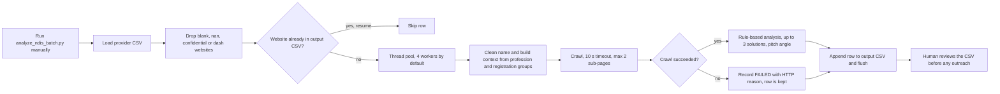

# NDIS Batch Intelligence Analyzer

> A resumable Python batch tool that crawls and rule-analyses NDIS provider websites into a reviewable intelligence CSV, without calling an LLM or sending any email, so Stack&Code outreach can be prepared in bulk.

| | |
|---|---|
| **Category** | Lead generation, outreach and data pipelines |
| **Status** | On demand, as of 9 Oct 2026 (15 of 2,495 providers analysed) |
| **Type** | Python CLI (`analyze_ndis_batch.py`) |
| **Runner and schedule** | Manual CLI on the owner's machine |
| **Client / owner** | Stack&Code |
| **Stack** | Python, the crawler and analyser modules from the email trigger project, ThreadPoolExecutor, rich progress bar, CSV |
| **Source** | Main KB Part 4 section 9 (and section 8, 17); Portfolio KB section 21.4 |

## 1. Description

### What it does
Runs the crawl and analyse half of the [Stack&Code email trigger with crawler](./stackandcode-email-trigger-crawler.md) across the cleaned NDIS provider list, with no sending and no LLM call. For each provider it detects an industry, lists operational bottlenecks, picks up to three Stack&Code solutions and composes a suggested pitch angle. Results are appended to a CSV so they can be reviewed before any outreach.

### Inputs and outputs
- **Inputs:** `NDIS_Active_Providers_with_Website.csv` (2,495 rows, see [NDIS provider dataset cleaning](./ndis-provider-dataset-cleaning.md)). Flags: `--input`, `--output`, `--limit` (default 10), `--all`, `--start`, `--workers` (default 4), `--resume` (on by default).
- **Outputs:**
  - `NDIS_Analyzed_StackandCode_Intelligence.csv`, 19 columns: Cleaned Company Name, Website, Email, Phone, State, Suburb/City, Detected Industry, Key Services, Key Operational Bottlenecks, Stack&Code Solution 1/2/3 (title and implementation each), Suggested Pitch Angle, Original Provider Name, Crawl Status, Analyzed At.
  - `NDIS_INTELLIGENCE_REPORT.md`, a companion narrative report.

### Key components
| Component | Role |
|---|---|
| `analyze_ndis_batch.py` | Batch driver: loads the CSV, resumes, runs the thread pool, writes the CSV row by row |
| Crawler module (shared with the email trigger project) | Fetches the site with a 10 s timeout and at most 2 sub-pages |
| Rule-based analyser (shared) | Keyword rules that give industry, pain points and solutions; no LLM |
| `NDIS_INTELLIGENCE_REPORT.md` | Market insights, 3 provider categories, 4 core bottlenecks, 3 turnkey solutions, 3 sample cases, plus "how to continue" and "how to trigger outreach later" |

### Where it lives
`D:\Project\<owner>\Stack&code\Email trigger  with crawler` (double space in the folder name), alongside the email trigger code. Output CSV and report sit in the same folder.

## 2. Flow chart



**Reading the chart**
1. The batch is run by hand, for example `--limit 50`, `--limit 200 --workers 6` or `--all --workers 6`.
2. The CSV is loaded and rows whose website is blank, "nan", "confidential" or "-" are dropped.
3. Any website already present in the output CSV is skipped, which makes the run resumable by website string.
4. Remaining rows go to a thread pool. Each worker cleans the company name, builds context from the Profession and Registration Groups columns, and crawls.
5. A failed crawl is recorded as `FAILED: HTTP ...` in the Crawl Status column rather than dropped.
6. A successful crawl is analysed by rules and gets up to three solutions and a suggested pitch angle.
7. Every result is appended and flushed immediately, so a stop loses at most the rows in flight.
8. Review is a human step. The dedupe database is written only by the email trigger's `main.py`, so this tool does not feed the "already contacted" check.

## 3. Case study

### The challenge
The 2,495-row NDIS provider list was too large to pitch one by one, and the email trigger tool analyses and writes one prospect at a time. The team wanted an intelligence sheet that could be reviewed in bulk first, with no risk of an accidental send.

### The solution
A separate batch script reuses the crawler and rule-based analyser and writes a 19-column CSV with a checkpoint after each provider. A companion report summarises the NDIS market view: three provider categories, four core bottlenecks, three turnkey solutions and three sample cases. The report states these bottlenecks: manual participant intake with a 3-5 day delay, compliance/SOP formatting taking 15-20 hours a week, disconnected field and office tools, and staff policy hunting taking 20+ minutes per query. These figures come from the report text and the KB records no measurement behind them.

The portfolio KB (section 21.4) lists the analyser as one step of an NDIS crawler, analyser, Groq-based generator, emailer, tracker and Telegram chain. It does not describe the batch tool separately.

### Design decisions and rules learned
- No LLM and no sending here: the tool is rule-based and read-only with respect to outreach.
- Resume by website string, with an immediate flush per provider, so long runs can stop and restart safely.
- Failures are recorded as `FAILED: HTTP ...` instead of being dropped, so they stay visible for a retry.
- More workers gives speed but the crawl should respect the target sites.
- Review the CSV before any outreach.
- This tool uses a 10 s timeout and 2 sub-pages, while the single-prospect tool uses 12 s and 3 sub-pages.

### Outcome
- 15 of 2,495 providers analysed. The remaining batch has not been run.
- 13 successful crawls and 2 HTTP failures.
- 12 classified as NDIS and 3 as professional services.
- All 15 rows have an email (from the source CSV).
- The report states "zero emails sent".

### Lessons learned
- Separating analysis from sending makes it safe to prepare a large list and review it first.
- A 15-row sample cannot validate the keyword rules; substring matching can mis-classify industries (inferred in the KB for the shared analyser).
- Because dedupe is written only by `main.py`, a reviewed batch CSV and the contact log are separate records that must be reconciled by hand before sending.

## 4. Operating notes
- **Run / pause / debug:**
  ```
  python analyze_ndis_batch.py --limit 50
  python analyze_ndis_batch.py --limit 200 --workers 6
  python analyze_ndis_batch.py --all --workers 6
  ```
  Stop at any time and re-run; completed websites are skipped. Check the Crawl Status column for failures.
- **Known issues and open items:**
  - Only 15 of 2,495 providers analysed.
  - The input list was filtered with a checker whose timeouts account for about 95% of removals (see the dataset cleaning file), so the 2,495 survivors may undercount reachable providers.
  - No outreach has been prepared from this CSV as far as the KB records.
- **Risks:**
  - Crawling without robots.txt checks (the shared crawler, inferred from code) at higher worker counts can get the machine blocked by target sites.
  - The output holds business contact details taken from the source list; apply the consent, sender-identity and opt-out rules in Part 4 section 17 of the KB before any outreach.
  - The tool does not feed the dedupe database, so a later live send could duplicate contact unless the history is checked.

## 5. Related
- [Stack&Code email trigger with crawler](./stackandcode-email-trigger-crawler.md), the single-prospect tool that shares the crawler and analyser
- [NDIS provider dataset cleaning](./ndis-provider-dataset-cleaning.md), which produces the input list
- **Sources:** Main KB Part 4 sections 8, 9 and 17; Portfolio KB section 21.4
