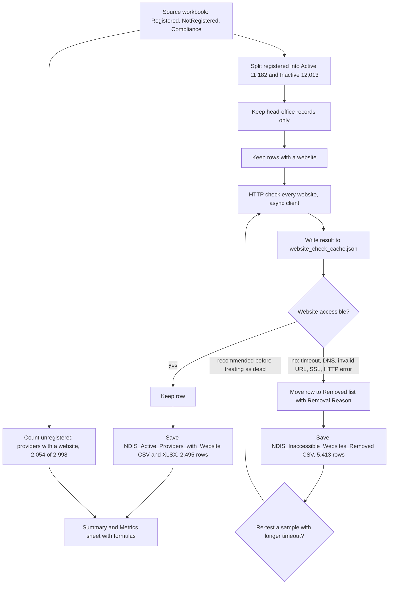

# NDIS Provider Dataset Cleaning

> A one-off data-cleaning exercise that turned the raw August 2026 NDIS provider directory into a contactable target list of active registered head offices with working websites, for Stack&Code outreach.

| | |
|---|---|
| **Category** | Lead generation, outreach and data pipelines |
| **Status** | On demand, as of 9 Oct 2026 (one-off run; outputs created 26 Sep 2026; the cleaning script is not found) |
| **Type** | Data-cleaning pipeline (Excel and CSV, async HTTP website check, JSON cache) |
| **Runner and schedule** | Manual one-off |
| **Client / owner** | Stack&Code |
| **Stack** | Excel and CSV, HTTP website checks (aiohttp-style errors suggest an async client, inferred), JSON cache |
| **Source** | Main KB Part 4 section 10; Portfolio KB section 21.4 |

> **Evidence note.** The script that did the cleaning and website checking is (not found) in `Data arrangement`, `Data` or `scraper`. The method below is reconstructed from the outputs and the workbook's Summary sheet (inferred). Counts are as stated in the KB.

## 1. Description

### What it does
Takes the NDIS provider directory workbook (registered, not registered and compliance sheets), keeps active registered head offices that list a website, checks every website over HTTP, and removes the ones that did not respond. Survivors become the target list used by the outreach tools. Removed rows are saved with a reason so they can be re-tested.

### Inputs and outputs
- **Inputs:** `NDIS Providers - Registered + Not Registered (Aug 2026).xlsx` (3.9 MB) with three sheets:
  - `Registered`: 23,195 rows (provider, outlet, record type, active flag, ABN, contact and address fields, head-office flag, profession, registration groups, opening hours, coordinates).
  - `NotRegistered`: 2,998 rows (provider and entity names, ABN, organisation type, contact fields, services, locations, age groups, specialisations, languages, rating, reviews, early-childhood flag, profile).
  - `Compliance`: 3,704 rows (type, effective dates, name, ABN, location, provider number, registration groups).
- **Outputs:**
  - `NDIS_Active_Providers_with_Website.csv` and `NDIS Providers - Active with Website.xlsx` (2,495 survivors).
  - `NDIS_Inaccessible_Websites_Removed.csv` (5,413 removed active head offices, with a `Removal Reason` column).
  - `website_check_cache.json` (7,810 entries keyed by website string, each `{accessible, reason, final_url}`).
  - The workbook adds a sheet `Unregistered with Website` (2,054 rows) and a `Summary & Metrics` sheet with formulas.

### Key components
| Component | Role |
|---|---|
| Source workbook | Raw directory, Aug 2026 |
| Website checker (script not found) | Asynchronous HTTP check per website, results cached |
| `website_check_cache.json` | Skip list for known URLs, makes a re-test cheap |
| Output CSV and XLSX files | Clean target list, removed list and summary metrics |

### Where it lives
`D:\Project\<owner>\Stack&code\Data arrangement\*`. Consumers: the [email trigger with crawler](./stackandcode-email-trigger-crawler.md) and the [NDIS batch intelligence analyzer](./ndis-batch-intelligence-analyzer.md).

## 2. Flow chart

Method reconstructed from outputs (inferred), not from a script.

**Reading the chart**
1. The workbook has three sheets. `Registered` is split into Active (11,182) and Inactive (12,013).
2. Only head-office records (`Record Type = Head office`) are kept for the outreach list.
3. Rows with a website are checked over HTTP. Each result is cached by website string as accessible or not, with a reason and final URL.
4. Accessible sites survive. Some HTTP error codes such as 403 were kept as accessible.
5. Inaccessible sites go to the removed file with a reason. By state the removed rows are NSW 1,898, VIC 1,317, QLD 1,080, WA 477, SA 395, ACT 92, NT 86, TAS 68.
6. Survivors are saved as 2,495 rows, all Active and all Head office; 2,420 have an email. By state: NSW 915, VIC 615, QLD 464, WA 216, SA 159, NT 46, TAS 43, ACT 37.
7. The Summary sheet shows total 26,193, active registered 11,182, active with website 2,495 (22.3%) and unregistered with website 2,054.
8. The KB recommends re-testing a sample of the removed rows with a longer timeout and lower concurrency; the cache makes that cheap.

## 3. Case study

### The challenge
The raw directory held 26,193 provider records across registered and unregistered providers, many inactive, many without a website and many with a website that no longer responded. Outreach needed a short list of providers that are active and reachable online.

### The solution
Filter to active head offices, check each website, and split the results into a clean list and a removed list with reasons. The cache file keeps every check result so later tools can skip known URLs, and the Summary sheet gives headline counts.

Cache results: 7,810 entries, of which 2,454 accessible and 5,356 not. Failure reasons in the cache: Timeout 5,100, DNS Error or Domain Not Found 114, Invalid URL format 46, ServerDisconnected 25, a few SSL/connector errors, and the rest "HTTP" followed by a status code. The removed-rows file lists reasons Timeout 5,156, DNS 114, HTTP errors 64, invalid URL 46, others. The KB does not reconcile the small differences between the cache figures and the file figures.

The portfolio KB (section 21.4) lists "provider data cleanup for inaccessible websites" as one component of the NDIS crawler, analyser and outreach system and gives only a generic sequence (collect, normalise, deduplicate, check website accessibility, clean invalid records). It adds no counts.

### Design decisions and rules learned
- Keep head-office records only, so each organisation appears once.
- Cache every check by website string so a re-run is incremental.
- Write removed rows with a reason rather than deleting them, so a sample can be re-tested.
- Some HTTP error responses (403 and similar) were kept as accessible.
- Only about 22% of active providers (2,495 of 11,182) have a website that responded; the rest list no website or none that responded.

### Outcome
- 2,495 active head-office providers with a responding website (22.3% of active registered); 2,420 of them have an email.
- 5,413 active head offices removed for inaccessible websites.
- 2,054 of 2,998 unregistered providers (68.5%) have a website.
- Outputs created 26 Sep 2026. The list feeds the outreach CLI and batch analyzer.

### Lessons learned
- Timeouts are 95% of failures (5,100 of 5,356). That is far more than genuinely dead sites would give, so the checker's timeout or concurrency was probably too aggressive (inferred in the KB). Before treating the 5,413 removed rows as dead, re-check a sample with a longer timeout and lower concurrency.
- Not saving the script meant the method had to be reconstructed. Cleaning scripts should be kept next to their outputs.

## 4. Operating notes
- **Run / pause / debug:** To re-run, reimplement the check as a script that reads the `Registered` sheet (Active, Head office, non-empty Website) and reuses `website_check_cache.json` to skip known URLs. The batch analyzer's resume pattern is the model.
- **Known issues and open items:**
  - The original cleaning and website-check script is (not found).
  - The 5,413 removals are likely over-counted because of timeouts.
  - Cache and file counts differ slightly and are not reconciled in the KB.
- **Risks:**
  - The dataset holds business contact details and ABNs; treat it as a business-contact source and honour opt-out and consent rules before outreach (Part 4 section 17).
  - Re-checking thousands of sites at high concurrency can look like abusive traffic; keep concurrency low.

## 5. Related
- [Stack&Code email trigger with crawler](./stackandcode-email-trigger-crawler.md), which takes this CSV as input
- [NDIS batch intelligence analyzer](./ndis-batch-intelligence-analyzer.md), which analyses this CSV in bulk
- **Sources:** Main KB Part 4 sections 8-10 and 17; Portfolio KB section 21.4
