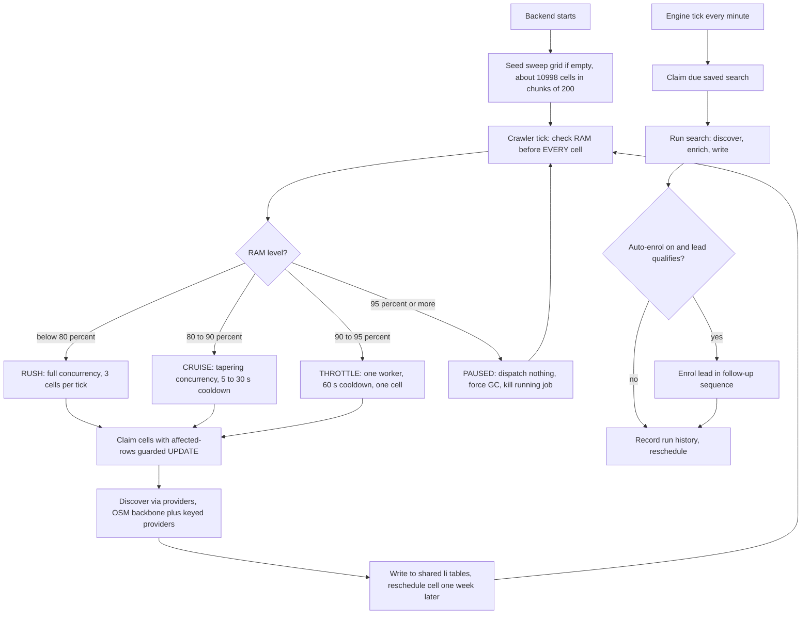

# Node built-in GlobalCrawler and Autonomous Lead Engine

> An always-on crawler and scheduled saved-search engine built into the Client Finder AI web server, so lead discovery runs by itself with RAM-aware pacing and no one clicking "start job".

| | |
|---|---|
| **Category** | Lead generation, outreach and data pipelines |
| **Status** | On demand, as of 9 Oct 2026 (built 15 Aug 2026; compile-verified, RAM pacing observed live once; production rollout of this code not confirmed) |
| **Type** | Background services inside a Node/TypeScript Express server |
| **Runner and schedule** | Starts with the backend and loops forever (`globalDiscoveryCrawler.ts`); `autonomousLeadEngine.ts` ticks every minute for due saved searches. Resumes when the backend restarts. |
| **Client / owner** | Client Finder AI platform (Stack&Code folder), built by Hari |
| **Stack** | Node, TypeScript, Express, MariaDB (Drizzle), SSE, optional Google Maps, Yelp, Yellow Pages, DuckDuckGo, GitHub providers; OpenStreetMap as free backbone |
| **Source** | Main KB Part 4 section 5 (plus section 0 map); Portfolio KB section 21.2 (crawler project name only) |

## 1. Description

### What it does
Two cooperating services. The GlobalCrawler sweeps a pre-seeded grid of country, city and industry cells, discovers businesses through the configured providers, writes them into the shared `li_*` tables and reschedules each cell a week later. The Autonomous Lead Engine runs each user's saved searches on their own schedule (for example "dentists in Brisbane every 12 hours, max 25 leads"), optionally enrolling qualifying leads into a follow-up sequence. Both pace themselves by server RAM.

### Inputs and outputs
- **Inputs:** `global_discovery_targets` (about 10,998 cells seeded on first boot in chunks of 200); `lead_discovery_configs` (user saved searches: criteria, interval 1-10080 minutes, max leads 1-500, optional auto-enrol into follow-up sequences); provider keys such as `GOOGLE_MAPS_API_KEY` and `APOLLO_API_KEY` for quality.
- **Outputs:** rows in `li_companies`, `li_contacts`, `li_websites`; run history on the config row; SSE events to the UI; per-user notifications.

### Key components
| Component | Role |
|---|---|
| `sweepGrid.ts` | Seeds the grid: 66 countries, 234 cities, 47 industries; priority bands 1 (US, UK, CA, AU, IN and similar) to 4 (long tail). |
| `globalDiscoveryCrawler.ts` | Per-tick RAM check before every cell, claims cells, discovers, writes, reschedules one week later. |
| `autonomousLeadEngine.ts` | Claims due saved searches, runs discover, enrich, write; optional follow-up enrolment; reschedules; recovers crashed runs after 1 hour. |
| `leadEngineRoutes.ts` | API including admin `POST /api/lead-engine/crawler/seed` and super_admin `PUT /crawler/config` for thresholds. |
| `LeadEngine.tsx` | Super_admin UI page. |
| Notifications | `notifications/NotificationManager.ts` per user; Telegram AI bot `telegramAiBot.ts` (super_admin also has AI access). |
| Interest detection | The reply watcher's AI verdict (Positive, Question, Negative) feeds an "Interested" inbox and alert. |

### Where it lives
`D:\Project\<owner>\Stack&code\scraper\backend\src\lead-engine\*` and `...\src\notifications\*`; role design in `PRODUCT_ROLES_PLAN.md`. The Python crawler shares the same grid table (see Related).

## 2. Flow chart

**Reading the chart**
1. On startup the grid is seeded if empty (manual re-seed through the admin route).
2. Before each cell the crawler checks RAM and picks a pace: RUSH below 80%, CRUISE at 80-90%, THROTTLE from 90% (up to the pause line), PAUSED at 95% and above. A job already running is killed if RAM crosses the pause line.
3. Cells are claimed with the affected-rows guard so two servers never take the same cell.
4. Providers discover businesses (OSM is the free global backbone); results go into the shared tables and the cell is rescheduled a week out.
5. In parallel, the engine ticks every minute, claims a due saved search, runs it and optionally enrols qualifying leads in a follow-up sequence. One failing search never stops the others; crashed runs self-recover after an hour.
6. Replies later flow back through the reply watcher into the "Interested" inbox (handled in the follow-up engine).

## 3. Case study

### The challenge
Discovery depended on a person starting jobs. The goal was a shared, Apollo-style company database that fills and refreshes by itself, plus per-user scheduled searches, on a modest server. Apollo and LinkedIn cannot be mirrored by scraping their sites (logins, credit limits, terms), so volume had to come from free or official sources.

### The solution
A crawler loop and a one-minute engine tick inside the web server, both driven by database state (grid cells and saved-search configs) so they survive restarts. A RAM-based pacing governor protects the server: the owner's rule was to slow down above 90%, rush below 80%, keep going until the server stops and resume on restart.

### Design decisions and rules learned
- **Owner's rules:** RAM above 90% slow down, below 80% rush; run continuously and resume on restart; "all over country company data"; all users can read the shared data; super_admin gets every access.
- **Use OSM for volume, keyed providers for quality.** OSM is free, worldwide and quota-free; add `GOOGLE_MAPS_API_KEY` or `APOLLO_API_KEY` for quality.
- **Shared grid table across both crawlers.** The Node and Python crawlers use the same table. Postgres hit `XX000 FATAL` when two backends ran at once (Supabase connection ceiling); set `DATABASE_POOL_MAX` below the plan limit.
- **Orphan columns.** Leftover camelCase columns such as `nextRunAt` in `global_discovery_targets` come from the Postgres-to-MariaDB migration; live code uses snake_case. Cleanup SQL `backend/migrations/2026-08-17-drop-orphan-camelcase-columns.sql` is written but must be run by the owner on the server (dry-run report first).
- **Claim pattern** is shared with the rest of the platform (see [Platform hardening and production smoke test](platform-hardening-and-smoke-test.md)).
- **Portfolio KB (portfolio KB):** only names the project `scaber/crawler` and says detailed rules were not supplied; the main KB's Python crawler section covers the standalone crawler, and this section covers the in-server one. No conflict.

### Outcome
- Built 15 Aug 2026.
- Verified: compile; create, list and update searches; validation and clamping; tenant isolation (User A 2 searches, User B 0); live RAM pause. The development machine sat at 88-97% RAM and the crawler paused with "Paused - RAM at 96%", the first live confirmation of the pacing.
- Not verified: a full real discovery sweep. The Gmail side was down at the time.
- No lead counts or sweep coverage recorded.

### Lessons learned
- Check resources before every unit of work, not once per batch, so a slow machine stops itself.
- Keep scheduling state in the database so loops are restart-safe.
- Two backends on one shared pool need an explicit pool ceiling.

## 4. Operating notes
- **Run / pause / debug:** start the backend and watch for `[GlobalCrawler] RUSH - RAM 62%` style lines (pace, RAM, RSS, cells swept). Seed manually with admin `POST /api/lead-engine/crawler/seed`. Thresholds can be changed with `PUT /crawler/config` (super_admin). UI page: `LeadEngine.tsx`.
- **Known issues and open items:** a full real sweep is unverified; orphan-column cleanup SQL awaits the owner; whether the 15 Aug code is what runs in production is not confirmed (production was running older follow-up code at one point until redeployed).
- **Risks:** the crawler writes a shared pool to which all users have read access (by design); outreach to discovered contacts must respect Spam Act, GDPR and CAN-SPAM rules (see the follow-up engine file); keyed providers carry cost and data-licence terms.

## 5. Related
- [Client Finder AI platform](client-finder-ai-platform.md)
- [Python global lead-discovery crawler](python-global-lead-discovery-crawler.md)
- [Follow-up Email Engine](followup-email-engine.md)
- [Platform hardening and production smoke test](platform-hardening-and-smoke-test.md)
- **Sources:** Main KB Part 4 sections 0 and 5 (lines 2252, 2481-2520); Portfolio KB section 21.2.
