# Platform hardening, multi-server claim safety and production smoke test

> A set of database claim-safety fixes and a one-command Playwright API smoke test that let the Client Finder AI app and the Python crawler share one MariaDB without double-processing, and let the owner check production quickly.

| | |
|---|---|
| **Category** | Lead generation, outreach and data pipelines |
| **Status** | On demand, as of 9 Oct 2026 (done 15-17 Aug 2026; deploying the fixes to production was left to the owner) |
| **Type** | Shared code helper (`dbClaim.ts`), idempotent schema bootstrap and an API test suite |
| **Runner and schedule** | Smoke test is manual (`npm run test:api`). The claim helper runs on every scheduler tick of the platform. |
| **Client / owner** | Client Finder AI platform (Stack&Code folder), built by Hari |
| **Stack** | MariaDB 10.11.15, Drizzle ORM with mysql2, Playwright (request-only), TypeScript |
| **Source** | Main KB Part 4 section 7 (plus section 0 map); Portfolio KB has no matching entry |

## 1. Description

### What it does
Makes the platform and the standalone Python crawler safe to run on two servers against one MariaDB. Every work-queue claim becomes a single-row primary-key `UPDATE ... WHERE id=? AND status='<expected>'` that proceeds only if a row was actually changed, which removes deadlocks and double-processing. A Playwright request-only test suite runs 19 checks against production or local and explains failures in plain language.

### Inputs and outputs
- **Inputs:** `API_URL` (target). Named targets: `prod` = the production deployment, `local` = `http://localhost:5005`.
- **Outputs:** a pass or fail list per check; `e2e_audit_results.json` exists in the repo root. Failures distinguish unreachable server, HTTP 502, and HTML returned instead of JSON.

### Key components
| Component | Role |
|---|---|
| `backend/src/utils/dbClaim.ts` | Exports `rowsAffected()` and `claimed()` helpers. |
| Claim sites | `globalDiscoveryCrawler.claimTargets`, `autonomousLeadEngine`, `followupDispatcher` (claim plus finish guard), `emailScheduler` (per row), and the Python `claim_cells`. |
| `backend/src/database/mysqlBootstrap.ts` | Idempotent MariaDB bootstrap: reads `backend/drizzle/*.sql`, `CREATE TABLE IF NOT EXISTS`, ADD COLUMN diffs through `information_schema`; failure is non-fatal to boot. |
| `frontend/e2e/api-smoke.spec.ts` | 19 request-only checks; config `playwright.api.config.ts`; run from `frontend/`. |
| `frontend/e2e/README.md` | Documentation. |

### Where it lives
`D:\Project\<owner>\Stack&code\scraper\backend` and `...\scraper\frontend\e2e`. Production host: the platform's EC2 deployment (PM2).

## 2. Flow chart

```mermaid
flowchart TD
    subgraph CLAIM["Claim pattern on every scheduler tick"]
        A1["Worker finds a due row"] --> A2["UPDATE single row by primary key WHERE status is the expected value"]
        A2 --> D1{"Affected rows above 0?"}
        D1 -->|"no"| A3["Another worker won, skip"]
        D1 -->|"yes"| A4["Do the work"]
        A4 --> A5["Finish with a guarded update on status"]
    end
    subgraph SMOKE["Production smoke test"]
        B1["Run npm run test:api with API_URL target"] --> B2["Playwright request-only, 19 checks"]
        B2 --> D2{"Server reachable?"}
        D2 -->|"no"| B3["Report unreachable"]
        D2 -->|"yes"| D3{"JSON returned, not 502 or HTML?"}
        D3 -->|"no"| B4["Report 502 or HTML-instead-of-JSON in plain language"]
        D3 -->|"yes"| B5["Per-check pass or fail list"]
    end
    subgraph BOOT["Startup"]
        C1["Backend boots"] --> C2["mysqlBootstrap creates missing tables and columns"]
        C2 --> D4{"Bootstrap failed?"}
        D4 -->|"yes"| C3["Non-fatal to boot, but production shows 502"]
        D4 -->|"no"| C4["App serves requests"]
    end
```

**Reading the chart**
1. Any scheduler or worker that needs exclusive ownership of a row issues one guarded update and checks the affected-row count. Only the winner proceeds.
2. The finishing write is also guarded on the expected status, so a state change made in the meantime (for example a reply) is not overwritten.
3. The smoke test needs no browser or dev server. It hits the API, classifies failures, and prints the reason.
4. At startup the idempotent bootstrap brings the schema up to date. A bootstrap failure does not stop the process, but production is down (502) if it fails.

## 3. Case study

### The challenge
The platform's schedulers and the standalone Python crawler were going to run on two servers against one MariaDB. The older claim logic could double-process work or deadlock, and a real double-processing bug had been found on 17 Aug in the Python `claim_cells`: with autocommit on, `FOR UPDATE SKIP LOCKED` locks were released immediately and a blind `UPDATE ... WHERE id IN (...)` followed. The owner also wanted a one-command way to see whether production works after a deploy.

### The solution
One shared claim pattern applied to every work queue, an idempotent MariaDB bootstrap that tolerates re-runs, and a Playwright request-only smoke suite whose failures read in plain language (unreachable, 502, HTML instead of JSON).

### Design decisions and rules learned
- **MariaDB, not MySQL.** It supports `SKIP LOCKED` (10.6 or later) but has no `UPDATE ... RETURNING` and no `@@transaction_isolation`. The drizzle-mysql2 `update()` returns `[ResultSetHeader, ...]`, so `affectedRows` is `result[0].affectedRows`.
- **Single-row primary-key updates cannot form lock cycles**, so they are deadlock-free. `FOR UPDATE SKIP LOCKED` under autocommit releases locks immediately, so it alone does not prevent double-claims.
- **Postgres to MySQL migration traps:** TEXT cannot be a primary key, unique or foreign key (use `varchar(191)`, 512 for URLs); `count(*) FILTER (WHERE)` becomes `SUM(CASE WHEN ...)`; `pg_advisory_xact_lock` becomes `GET_LOCK` / `RELEASE_LOCK` (session-scoped, release in `finally`). Production was running old follow-up code with Postgres-only SQL (analytics and enrol endpoints) until redeployed.
- **Playwright `baseURL` plus a leading-slash path drops the `/api` prefix.** Use the bare origin as `baseURL` and full `/api/...` paths.
- **The tool classifier blocks ad-hoc database-mutating scripts** (heredoc plus ts-node against production). Keep schema and data fixes as reviewable committed code or SQL that the owner runs on the server.

### Outcome
- Done 15-17 Aug 2026.
- 19 of 19 smoke checks passed against local and production.
- A live two-instance concurrency test was not completed: the local IP was temporarily blocked by MariaDB for connection errors.
- Deploying the fixes to production was left to the owner; the deployed state is (not found).

### Lessons learned
- Check affected rows, not just that a query ran.
- A request-only API test is a cheap, repeatable production check and its plain-language failures save debugging time.
- Database migrations between engines break on small syntax and type differences; list them before porting.

## 4. Operating notes
- **Run / pause / debug:** `cd frontend && API_URL=<production-origin> npm run test:api` (or the `local` target). Failures print plain-language reasons.
- **Known issues and open items:** the live two-instance concurrency test is outstanding; deployment of the fixes is with the owner; MariaDB can block a host after many failed connections (`mariadb-admin flush-hosts`).
- **Risks:** a failed bootstrap takes production down (502). Security and credential-hygiene findings for this project are tracked privately and are not published here.

## 5. Related
- [Client Finder AI platform](client-finder-ai-platform.md)
- [Node GlobalCrawler and Autonomous Lead Engine](node-globalcrawler-and-autonomous-lead-engine.md)
- [Python global lead-discovery crawler](python-global-lead-discovery-crawler.md)
- [Follow-up Email Engine](followup-email-engine.md)
- **Sources:** Main KB Part 4 sections 0 and 7 (lines 2254, 2577-2614).
