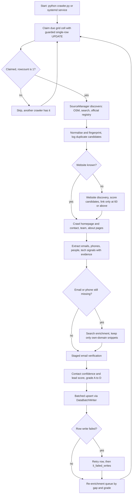
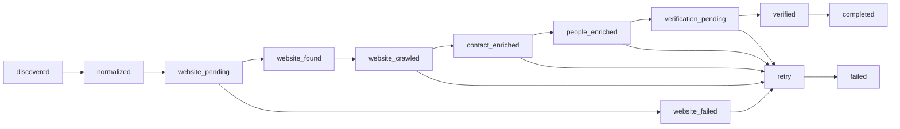

# Python global lead-discovery crawler ("leadengine" v4)

> A standalone Python worker that discovers businesses worldwide, enriches them with verified contacts and scores, and writes directly into the Client Finder AI database, designed for a cheap 2 vCPU / 2 GB server.

| | |
|---|---|
| **Category** | Lead generation, outreach and data pipelines |
| **Status** | On demand, as of 9 Oct 2026 (code and 149 offline tests complete on 18 Aug; never run against the production database in-session) |
| **Type** | Python asyncio worker (CLI plus optional systemd service) |
| **Runner and schedule** | `python crawler.py`, or systemd service `crawler.service` on a separate server (`Restart=always`, `MemoryMax=900M`, `MemoryHigh=700M`, `Nice=10`, working dir `/opt/crawler`). Runs forever; grid cells recycle. |
| **Client / owner** | Client Finder AI platform (Stack&Code folder), built by Hari |
| **Stack** | Python, asyncio, aiohttp, MySQL/MariaDB (or Postgres) pool, Redis (optional), OpenStreetMap Overpass, DuckDuckGo HTML search, `dnspython` |
| **Source** | Main KB Part 4 section 4 (plus section 0 map); Portfolio KB section 21.2 |

## 1. Description

### What it does
Claims a due city-by-industry grid cell from the shared `global_discovery_targets` table, discovers companies from pluggable sources (OpenStreetMap by default), finds and scores each company's official website, crawls contact-bearing pages, extracts emails, phones, people and tech signals with provenance, verifies emails in stages, scores each lead, and upserts everything in batches so the leads appear in the web app's Lead Intelligence view. About 12k lines across 25 modules.

### Inputs and outputs
- **Inputs:** `DATABASE_URL` (the only required variable; same database as the app, `mysql://` or `postgresql://`); optional `REDIS_URL`; everything else has defaults. Notable env var NAMES: `RUSH_BELOW_PERCENT=75`, `THROTTLE_AT_PERCENT=88`, `PAUSE_AT_PERCENT=95`, `MAX_WORKERS=3000`, `PER_DOMAIN_CONCURRENCY=4`, `PER_DOMAIN_DELAY_MS=250`, `ROBOTS_RESPECT`, `DISCOVERY_SOURCES`, `MAX_PAGES_PER_SITE=12`, `WEBSITE_DISCOVERY_MIN_SCORE=60`, `SEARCH_PROVIDERS`, `EMAIL_VERIFICATION_ENABLED`, `EMAIL_SMTP_PROBE_ENABLED`, `EMAIL_INFERENCE_ENABLED`, `DEDUPE_MIN_CONFIDENCE=70`, `RETRY_BACKOFF_MINUTES=1,5,15,60,360,1440`, `MAX_ATTEMPTS=6`, `JOB_LEASE_SECONDS=900`, `MIGRATION_PHASE_LIMIT`, `CRAWLER_ID`, `USER_AGENT`, `METRICS_INTERVAL`. Config files: JSON overrides for countries, sources, roles and directories.
- **Outputs:** new or extended tables `li_companies, li_websites, li_contacts, li_people, li_sources, li_contact_evidence, li_enrichment_jobs, li_search_results, li_company_aliases, li_duplicate_candidates, li_verification_events, li_failed_writes`, with fields such as `website_score`, `website_match_reason`, `official_website_confidence`, `canonical_company_id`, `duplicate_confidence`, `is_inferred`, `lead_score`, `lead_grade`, `enrichment_status`, `attempt_count`, `next_retry_at`, `locked_by`, `locked_at`. A metrics log line every `METRICS_INTERVAL` seconds (req/s, pages/s, companies/s, cache hit, error rate, p95, source yield per 1,000).

### Key components
| Component | Role |
|---|---|
| Grid claim | Guarded single-row `UPDATE ... WHERE status IN ('pending','failed')`, kept only if `rowcount == 1`. About 11k cells: 66 countries, 234 cities, 47 industries; priority bands US/UK/CA/AU/IN first. |
| `SourceManager` | Runs pluggable sources `osm` (default), `search`, `official_registry` and returns normalised `CompanyCandidate` records. |
| Normalise and fingerprint | Name, domain, phone, address, country fingerprints; cross-source duplicates go to `li_duplicate_candidates` and `li_company_aliases`; nothing is ever auto-merged or deleted. |
| Website discovery | Searches company plus city plus country, fetches up to 6 candidates and scores them (exact name 34, phone 26, domain match 24, address 16, schema 14, search 10, city 8, social 8, country TLD 6). A candidate with no corroborating evidence is capped at 25; link only at 60 or above. |
| Crawler and extractors | Homepage then contact, team, about, support, locations and careers pages from the link graph plus localised paths; same registrable domain only; page budget per site. |
| Verification | Staged: discovered, syntax valid, domain exists, MX exists, SMTP possible, mailbox verified. Only mailbox verified sets `is_verified`. |
| Scoring | Contact confidence (95-100 extremely strong down to 0-49 low) with reasons; company lead score (contact availability 20, email 16, identity 15, website 12, decision maker 12, phone 10, verification 6, source 5, recency 4); grade A at 80, B at 65, C at 45, D below. |
| `DataBatchWriter` | Batched upsert; failed rows are retried individually then written to `li_failed_writes`. |
| Re-enrichment | Continuous, ordered by gap, with quality-aware intervals (A 30 days, B 14, C/D 7, verified contact 60). |
| Tools | `tools/diagnostics.py` (read-only) and `tools/backfill.py` (phased). |

### Where it lives
`...\scraper\crawler\` (modules in `leadengine\*`, plus `crawler.py`, `crawler.service`, `update_server.sh`, `README.md`, `requirements.txt`, `check_*.py`, `query*.py`). Migration: `crawler\migrations\2026-08-18-lead-engine-upgrade.sql` (idempotent, never drops or deletes). Docs: `crawler\docs\ARCHITECTURE.md`, `ENRICHMENT_PIPELINE.md`, `DATA_MODEL.md`, `SOURCE_CONFIGURATION.md`, `OPERATIONS.md`. Config: `crawler\.env` copied from `.env.example`. Session transcript: "Global lead discovery crawler upgrade".

## 2. Flow chart

Second view: the company status machine and retry path.

**Reading the chart**
1. A worker (or several) claims a grid cell; the guarded update means only one worker wins. Cells recycle after `REFRESH_AFTER_HOURS`; "No cells due - sleeping" means the grid has been swept.
2. Sources produce normalised candidates. Duplicates are flagged for human review, never merged automatically.
3. If no website is known, candidates are searched and scored; the first search result is never accepted blindly.
4. Pages are crawled within a budget on the same domain only; contacts are stored with evidence rows.
5. Search enrichment runs only when email or phone is still missing.
6. Email goes through the staged verifier; scores and a grade are computed.
7. Writes are batched with row-level retry and a failed-writes table.
8. Re-enrichment runs forever, prioritising the largest gaps. In the status machine, any stage can drop to `retry` and then `failed`; retry timing comes from `RETRY_BACKOFF_MINUTES` and `MAX_ATTEMPTS` (the chart shows a subset of the transitions).

## 3. Case study

### The challenge
The existing Python crawler was fast but produced weak data: it marked `is_verified=1` after only checking that a domain resolved, emitted a placeholder "Key Decision Maker" with no name, and its `MAX_WORKERS=4000` was unsafe for a 2 GB box. The goal was a worldwide, cheap-to-run crawler that writes straight into the app's database, with trustworthy contacts, and without rewriting the app or the schema.

### The solution
A 25-module `leadengine` package with source plug-ins, evidence-backed extraction, scored website discovery, staged email verification, duplicate candidates instead of merges, queue leases for multi-crawler safety, and phased rollout tooling. The implementation prompt in the transcript is titled "ANTIGRAVITY IMPLEMENTATION PROMPT".

### Design decisions and rules learned
- **Hard rules from the owner:** keep the high-concurrency design (`MAX_WORKERS=3000`) and do not cut concurrency because the box is small, only RAM pacing may throttle; do not rewrite as a React app; extend the schema, do not replace it; never fabricate emails, phones, names, websites or decision-makers; free and public sources first with every paid provider optional and off by default; respect robots.txt and never bypass authentication, CAPTCHA or paywalls, with no anti-bot evasion.
- **Verified count drops after upgrade, by design.** The migration back-fills old "verified" rows as `domain_exists`, because the old check proved only that the domain resolves.
- **Email inference is off by default.** If enabled, only patterns already observed on that domain, flagged `is_inferred`, confidence capped at 45, upgraded when observed.
- **KPI is usable high-confidence leads per 1,000 companies processed** (`li_sources.yield_per_1000`), not rows discovered. Duplicate review is a human decision.
- **Tests caught two real bugs:** `acme.com` in the placeholder blocklist would discard real leads; a loose obfuscation regex turned "meet at noon dot sharp" into an email.
- **Multi-crawler safety:** grid cells are claimed by guarded UPDATE, companies by a `locked_by` / `locked_at` lease that expires after `JOB_LEASE_SECONDS` (hourly release job). On 17 Aug a real double-processing bug was found in the older `claim_cells`: autocommit released the `FOR UPDATE SKIP LOCKED` locks, then a blind `UPDATE ... WHERE id IN (...)` ran; it was fixed with a per-cell guarded claim (see [Platform hardening and production smoke test](platform-hardening-and-smoke-test.md)).
- **Rollout rule:** never point the new engine at all 136k+ existing rows on day one. Phase 100, then 1k, 10k, all, with `tools/backfill.py`, comparing coverage and yield before and after; `MIGRATION_PHASE_LIMIT` caps the continuous engine.
- **Server notes:** a "2 core, 2 GB, nothing there" box needs only the `crawler` folder plus `.env`. The grid must be seeded first (start the web app once, which seeds about 11k cells, or admin `POST /api/lead-engine/crawler/seed`). "The discovery grid is empty" means not seeded.
- **Portfolio KB (portfolio KB):** says the detailed crawler rules, data sources and rate limits "were not supplied" and should be documented from the code. The main KB now supplies them; no conflict.

### Outcome
- Code complete 18 Aug 2026: about 12k lines, 25 modules, 149 tests passing offline, docs written, idempotent migration written.
- "Nothing has been run against the production database" in-session; later production state is (not found).
- Backfill of the existing 136k+ rows is planned in phases, not reported as done.
- No yield, coverage or cost figures recorded.

### Lessons learned
- A verification flag must reflect what was actually proven; downgrade old data honestly rather than keep an inflated count.
- Autocommit plus `SKIP LOCKED` does not prevent double-claims; use a guarded single-row update and check affected rows.
- Roll out data-writing engines in phases against a large live table and compare before and after.
- Write tests around the extractors; both bugs found were silent data-quality failures.

## 4. Operating notes
- **Run / pause / debug:**
  - Setup: `cd /opt/crawler && python -m venv venv && venv/bin/pip install -r requirements.txt`, copy `.env.example` to `.env` and set `DATABASE_URL`; optionally apply the migration SQL (the engine adapts to missing columns).
  - Read-only checks: `python tools/diagnostics.py database|crawler|queue|sources|coverage|verification|all --json`.
  - Backfill: `python tools/backfill.py --build-queue`, then `--phase 1 --priority no_website --json-out phase1.json`, then phases 2, 3, 4.
  - Run: `python crawler.py`, or `systemctl enable --now crawler` and `journalctl -u crawler -f`.
  - Troubleshooting: `DATABASE_URL is not set` (missing `.env`); cannot connect (database firewall must allow the server IP; MariaDB blocks hosts after many failed connections, fix with `mariadb-admin flush-hosts`); "All Overpass mirrors unavailable" (rate-limited, auto-retries); wrong website linked (read `website_match_reason`, raise `WEBSITE_DISCOVERY_MIN_SCORE`).
- **Known issues and open items:** never run against production in-session; the Node crawler and this one share the same grid table and Postgres hit a `XX000 FATAL` when two backends ran at once (Supabase connection ceiling), so set `DATABASE_POOL_MAX` below the plan limit; cleanup SQL for orphan camelCase columns is written but must be run on the server.
- **Risks:**
  - **Security:** security and credential-hygiene findings for this project are tracked privately and are not published here.
  - **Data quality:** unverified or inferred emails must never be treated as verified.
  - **Compliance:** crawling and storing business contact data, then emailing it, brings Spam Act, GDPR and CAN-SPAM obligations (see the outreach engine file and Part 4 section 17). The crawler honours robots.txt and avoids anti-bot evasion by rule.
  - **Capacity:** two backends plus a crawler on one MariaDB can exhaust connections or trigger host blocking.

## 5. Related
- [Client Finder AI platform](client-finder-ai-platform.md)
- [Node GlobalCrawler and Autonomous Lead Engine](node-globalcrawler-and-autonomous-lead-engine.md) (shares the grid table)
- [Platform hardening and production smoke test](platform-hardening-and-smoke-test.md)
- [Follow-up Email Engine](followup-email-engine.md)
- **Sources:** Main KB Part 4 sections 0 and 4 (lines 2251, 2414-2477); Portfolio KB section 21.2.
