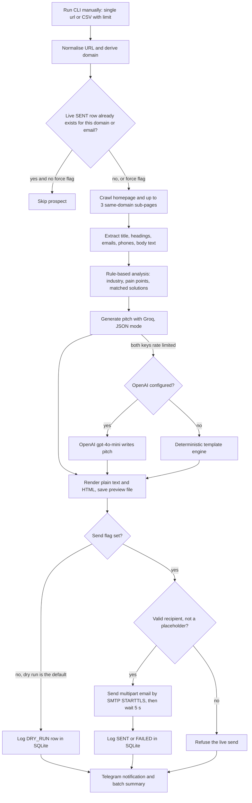

# Stack&Code Email Trigger with Crawler

> A Python command-line tool that crawls a prospect's website, works out its industry and pain points, has an LLM write a personalised pitch, optionally sends it by SMTP, logs it in SQLite and pings Telegram, for Stack&Code cold outreach.

| | |
|---|---|
| **Category** | Lead generation, outreach and data pipelines |
| **Status** | On demand, as of 9 Oct 2026 (working CLI, dry runs only so far) |
| **Type** | Python CLI (crawler, analyser, LLM generator, emailer, tracker, notifier) |
| **Runner and schedule** | Manual CLI only, run on the owner's machine. No scheduler and no loop. |
| **Client / owner** | Stack&Code (Hari's engineering and automation agency) |
| **Stack** | Python, requests, BeautifulSoup/lxml, pydantic, pandas, rich, Groq (llama-3.3-70b-versatile), OpenAI (gpt-4o-mini) as fallback, smtplib (Gmail SMTP), SQLite, Telegram Bot API |
| **Source** | Main KB Part 4 section 8 (with section 17 for limits and compliance); Portfolio KB section 21.4 |

> **Read this first.** The KB records that `outreach_history.db` holds 7 rows and ALL are dry runs. No live send was ever logged. The only opt-out mechanism is a footer line asking the reader to reply with "Unsubscribe". There is no suppression list, no bounce handling, no inbound reply handling and no real unsubscribe handling. The tool should not be described as a running outreach system.

## 1. Description

### What it does
Given one website, or a CSV of businesses (the NDIS provider list is the typical input), the tool crawls the site, extracts contact details and page text, classifies the business into an industry, and maps it to Stack&Code solutions. An LLM then writes a problem-first pitch email. By default it only saves an HTML preview (dry run). With `--send` it sends the email over SMTP, logs the result and notifies Telegram.

### Inputs and outputs
- **Inputs:**
  - Single `--url` (optional `--name`, `--email`) or `--csv <file> --limit N` (default 5).
  - CSV columns are auto-detected: website (`Website`, `url`, `web`), name (`Provider Name`, `company`, `name`), email (`Email`, `mail`), plus context columns (`profession`, `registration groups`, `services`, `category`, `industry`, `notes`). Overrides: `--url-col`, `--name-col`, `--email-col`.
  - Typical CSV: the 2,495-row `NDIS_Active_Providers_with_Website.csv` (see [NDIS provider dataset cleaning](./ndis-provider-dataset-cleaning.md)).
  - `STACKANDCODE_CAPABILITIES.md`, a ground-truth capability document whose first 2,000 characters are injected into the prompt.
  - Environment variable names (in `.env`, with `.env.example`): `GROQ_API_KEY_1`, `GROQ_API_KEY_2`, `GROQ_MODEL`, `OPENAI_API_KEY`, `OPENAI_MODEL`, `TELEGRAM_BOT_TOKEN`, `TELEGRAM_CHAT_ID`, `ENABLE_TELEGRAM_NOTIFICATIONS`, `SENDER_NAME`, `SENDER_EMAIL`, `REPLY_TO`, `BOOKING_URL`, `WEBSITE_URL`, `SMTP_HOST`, `SMTP_PORT`, `SMTP_USER`, `SMTP_PASSWORD`, `SMTP_USE_TLS`, `DRY_RUN`, `DELAY_BETWEEN_EMAILS_SECONDS`, `MAX_EMAILS_PER_RUN`.
- **Outputs:**
  - `previews\<company>_preview.html` (always written; 4 sample files exist).
  - `outreach_history.db` (SQLite log).
  - Terminal tables (industry, services, pain points, matched solutions).
  - Telegram messages.
  - A multipart plain text and HTML email, only in live mode.

### Key components
| Component | Role |
|---|---|
| `main.py` (`process_single_prospect`) | Orchestrates one prospect end to end; CLI flags `--url`, `--csv`, `--limit`, `--send`, `--force`, `--test-smtp`, `--test-telegram` |
| `crawler.py` | Fetches the homepage and up to 3 same-domain sub-pages; extracts title, description, headings, emails, phones, cleaned body text |
| `analyzer.py` | Keyword rules that assign an industry, three pain points and 2-3 Stack&Code solutions |
| `generator.py` | Writes the pitch: Groq, then OpenAI, then a deterministic template engine; renders plain text and responsive HTML |
| `groq_client.py` (`GroqManager`) | Holds up to 2 Groq keys and switches key on rate limit |
| `emailer.py` | Saves the preview, then in live mode sends via SMTP with a delay between sends |
| `tracker.py` | SQLite log and the "already contacted" check |
| `telegram_notifier.py` | Telegram Bot API messages for events and a batch summary |
| `config.py` | Loads `.env` next to it |

### Where it lives
`D:\Project\<owner>\Stack&code\Email trigger  with crawler` (note the DOUBLE space in the folder name). Files: `main.py, config.py, crawler.py, analyzer.py, generator.py, groq_client.py, emailer.py, tracker.py, telegram_notifier.py, README.md, STACKANDCODE_CAPABILITIES.md, NDIS_INTELLIGENCE_REPORT.md, requirements.txt, previews\, outreach_history.db`. The README's path `d:\Project\<owner>\Email trigger  with crawler` is stale; the folder now sits under `Stack&code`.

## 2. Flow chart



**Reading the chart**
1. The run is started by hand. Nothing triggers it automatically.
2. The URL is normalised and the domain derived. The tracker is checked: a prior live send (`status='SENT'` and not a dry run) to the same domain or email skips the prospect unless `--force` is passed.
3. The crawler fetches the homepage (12 s timeout, Chrome-like User-Agent, falls back to http if https fails) and up to three same-domain sub-pages whose path contains contact, about, service, what-we-do, team, ndis or solutions.
4. The analyser picks an industry by keyword order (NDIS and Disability, Field Service and Trades, Healthcare and Clinical, Digital/Marketing Agency, B2B SaaS, else Professional and Commercial Services) and maps pain points and solutions.
5. The generator tries Groq first with two-key failover. If Groq is exhausted it falls back to OpenAI when configured, otherwise to the template engine; Telegram is alerted when keys switch or run out.
6. A preview HTML file is always saved.
7. Without `--send` the run stops after logging a `DRY_RUN` row. With `--send` the emailer refuses an invalid or placeholder recipient (for example the `contact@domain.com` placeholder used when no email was found), otherwise it sends and waits 5 seconds.
8. The result is logged and Telegram is told about generated, dispatched, error and batch-summary events.

## 3. Case study

### The challenge
Stack&Code wanted cold outreach that opens with a prospect-specific problem rather than a generic pitch, aimed first at NDIS providers. Writing each email by hand against a 2,495-row list was not practical, and the pitch had to be anchored in what each provider's website actually says and in what Stack&Code can really deliver.

### The solution
A single CLI chains crawl, rule-based analysis, an LLM writer and a tracker. A capabilities document acts as ground truth for the prompt. The prompt persona is the agency's technical lead and the structure is a specific icebreaker, the core bottleneck, two concrete solutions, credibility and a call to action for a 10-minute call through a booking link. The credibility line in the prompt cites 150+ systems shipped, 14-day sprints, 100% code ownership and a 30-day warranty; these are claims injected into the prompt, and the KB records no measurement behind them. Company names are cleaned (leading symbols stripped, a "Trading As" name preferred) before use. A companion batch tool, [NDIS batch intelligence analyzer](./ndis-batch-intelligence-analyzer.md), runs the crawl and analysis half across the list without any LLM or sending.

The portfolio KB (section 21.4) names the same components (crawler, analyser, Groq-based generator, emailer, tracker with history database, Telegram notifications, provider data clean-up) and gives a suggested ten-step sequence that includes "apply suppression/consent rules" and "send or request approval". The code as read in the main KB does not implement a suppression step or an approval step (see discrepancy below).

### Design decisions and rules learned
- Safety by design: dry run is the default, nothing sends without `--send`, and the dedupe check stops a second live email to the same domain or address.
- Dedupe counts only live sends (`status='SENT' AND is_dry_run=0`), so repeated dry runs of the same prospect are allowed.
- A 5-second delay (`DELAY_BETWEEN_EMAILS_SECONDS`) separates live sends.
- Three-tier generation (Groq, OpenAI, template) means the tool keeps producing something when an LLM quota is exhausted.
- Live mode rejects invalid or placeholder recipients, which guards against the `contact@domain.com` fallback.
- `MAX_EMAILS_PER_RUN` and `DRY_RUN` exist in `config.py` but are NOT referenced anywhere else. The real controls are `--limit` (default 5) and `--send`.
- There is no daily cap, no per-domain warm-up, no bounce handling and no inbound reply handling.
- The crawler does not read robots.txt and sends a browser-like User-Agent (inferred from code).
- Keyword rules use plain substring checks (for example "sil", "api"), so false industry matches are possible (inferred).
- Per-prospect exceptions in a batch are not wrapped, so a crawl crash could abort the batch (inferred).

### Outcome
- `outreach_history.db` has 7 rows, all dry runs. No live send was ever logged.
- Four sample HTML previews exist in `previews\`.
- Working CLI as of the 26 Sep 2026 snapshot.
- No replies, bookings or revenue are recorded in the source.

### Lessons learned
- Defaulting to dry run and gating live sends behind a flag kept the tool safe, but it also means nothing has yet validated deliverability or response in practice.
- Config options that are not wired in (`MAX_EMAILS_PER_RUN`, `DRY_RUN`) give a false sense of control; the real limits should be enforced in code before any live batch.
- A footer line is not an unsubscribe system. The Client Finder AI engine (see Part 4 sections 2 and 6 of the main KB) implements a suppression list and a `List-Unsubscribe` header; this CLI does not.

## 4. Operating notes
- **Run / pause / debug:**
  ```
  cd "D:\Project\<owner>\Stack&code\Email trigger  with crawler"
  python main.py --test-smtp ; python main.py --test-telegram
  python main.py --url <domain>                                  # dry-run preview
  python main.py --url <domain> --email <address> --send         # LIVE, only when ready
  python main.py --csv "../Data arrangement/NDIS_Active_Providers_with_Website.csv" --limit 5
  python main.py --csv "../Data arrangement/NDIS_Active_Providers_with_Website.csv" --limit 10 --send   # LIVE batch
  ```
  Use `--force` to ignore the dedupe log. Inspect history with `select status,is_dry_run,count(*) from outreach_log group by 1,2` in sqlite3. Table `outreach_log` columns: id, domain, email, company_name, subject, status (SENT, FAILED, DRY_RUN), is_dry_run, created_at, notes, with indexes on domain and email.
- **Known issues and open items:**
  - No real unsubscribe handling, suppression list, bounce handling or reply handling.
  - Stale README path.
  - Discrepancy between the two KBs: the portfolio KB's suggested sequence includes suppression/consent and approval steps; the main KB (read from the code) shows only dry-run-by-default and a footer opt-out. The main KB is preferred.
  - Whether any outreach was ever delivered is not recorded (the KB's gaps list repeats this).
- **Risks:**
  - Compliance (inferred gap in the KB): for Australian recipients the Spam Act requires a working unsubscribe and sender identification. GDPR and CAN-SPAM apply elsewhere.
  - Deliverability: Gmail app-password SMTP has a realistic ceiling of about 500 emails per day in total; keep volumes low and personalised and warm up the sending domain. Scraped addresses should be role-based or company-domain addresses with provenance, not inferred ones.
  - Security: security and credential-hygiene findings for this project are tracked privately and are not published here.
  - Crawling without robots.txt checks and with a browser-like User-Agent can get the crawler blocked, which can also affect the sending domain's reputation.

## 5. Related
- [NDIS batch intelligence analyzer](./ndis-batch-intelligence-analyzer.md), the no-send bulk version of the crawl and analyse steps
- [NDIS provider dataset cleaning](./ndis-provider-dataset-cleaning.md), which produces the input CSV
- [Cold Outreach Leads analyzer](./cold-outreach-leads-analyzer.md), another Stack&Code lead-analysis and cold-email drafting tool
- Client Finder AI platform and Follow-up Email Engine: see Part 4 sections 2 and 6 of the main KB
- **Sources:** Main KB Part 4 sections 0, 8 and 17; Portfolio KB section 21.4
