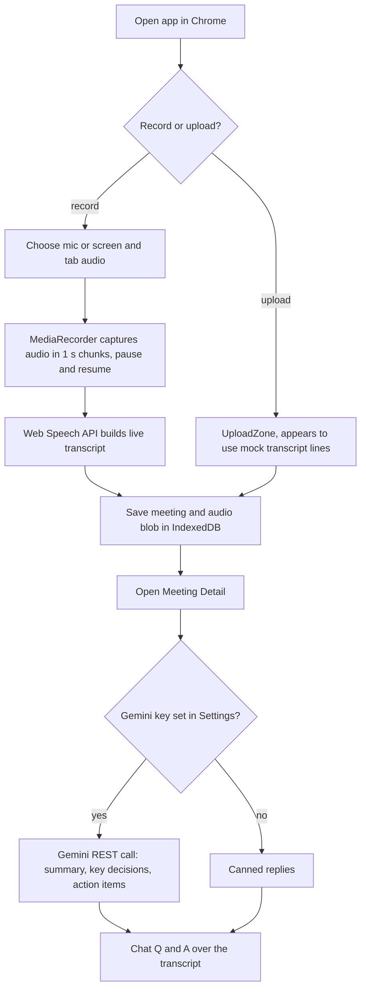

# Transcript: In-Browser Meeting Recorder with Gemini Notes

> A React and Vite prototype that records or uploads meeting audio in the browser, shows a live transcript, and uses Gemini to produce a summary, key decisions, action items and a chat Q&A over the transcript, all stored locally.

| | |
|---|---|
| **Category** | Lead generation, outreach and data pipelines (personal tooling, grouped here by the KB) |
| **Status** | Personal tool, as of 9 Oct 2026 (working prototype dated 8 Jul 2026, `dist/` built, no backend) |
| **Type** | Web app (React 19, Vite, browser-only) |
| **Runner and schedule** | Manual. Run locally with `npm install && npm run dev`. |
| **Client / owner** | Personal tool of the owner |
| **Stack** | React 19, Vite, MediaRecorder API, Web Speech API, IndexedDB, Gemini REST API |
| **Source** | Main KB Part 4 section 15; Portfolio KB: no matching entry (its "transcript" mentions refer to Fathom call transcripts, a different project) |

## 1. Description

### What it does
Records a meeting from the microphone or from screen or tab audio, or accepts an uploaded audio file, and builds a transcript. A meeting detail page then calls Gemini to produce a summary, key decisions and action items, and to answer questions about the transcript in a chat. Meetings and audio are kept in the browser's IndexedDB; there is no server.

### Inputs and outputs
- **Inputs:** Microphone audio, or screen or tab audio captured with `getDisplayMedia`, or an uploaded audio file. A Gemini API key typed into Settings.
- **Outputs:** A live transcript, an audio recording, a summary, key decisions, action items and chat answers, all stored in the browser.

### Key components
| Component | Role |
|---|---|
| `Recorder.jsx` | `MediaRecorder` for audio, browser Web Speech API for the live transcript, chunked every 1 s, with pause and resume |
| `UploadZone.jsx` | Upload path; appears to use sample or mock transcript lines (inferred) |
| `MeetingDetail.jsx` | Calls Gemini (`gemini-1.5-flash:generateContent`) for summary, decisions, actions and chat; falls back to canned replies when no key is set |
| `utils/db.js` | IndexedDB storage for meetings and audio blobs |
| Settings | Stores the Gemini key in `localStorage` under `gemini_api_key` |

### Where it lives
`...\Automation & Data\Transcript` (the KB abbreviates the prefix; section 12 gives the full prefix as `D:\Project\Personal Tools & Labs (<owner>)`). The build output is in `dist/`.

## 2. Flow chart

**Reading the chart**
1. The app runs in the browser; Chrome is the practical target because the Web Speech API is Chrome-centric and needs microphone permission.
2. The user chooses to record (microphone, or screen or tab audio) or upload.
3. While recording, `MediaRecorder` captures audio in 1-second chunks and the Web Speech API builds the live transcript. Pause and resume are supported.
4. The upload path appears to use sample or mock transcript lines rather than real transcription (inferred in the KB).
5. Meetings and audio blobs are saved in IndexedDB.
6. On the detail page, Gemini produces the summary, decisions and action items and powers the chat. Without a key the app returns canned replies.

## 3. Case study

### The challenge
Meeting notes need a transcript, a summary and a record of decisions and actions. The KB does not state the original motivation; the build is a browser-only prototype for that purpose.

### The solution
A browser-only React app that combines three browser capabilities (recording, speech recognition, local storage) with a single Gemini REST call per task. Everything stays on the machine except the text sent to Gemini.

### Design decisions and rules learned
- Local-first: IndexedDB for meetings and audio, no backend.
- The Gemini key is typed into Settings, stored in `localStorage` (`gemini_api_key`) and sent as a URL query parameter. The KB says this is acceptable only for a personal local tool.
- Canned replies when no key is set, so the interface still works in a demo.
- Web Speech API is Chrome-centric and needs microphone permission.
- The Gemini model id in the code (`gemini-1.5-flash`) is old and should be updated before relying on it.

### Outcome
Working prototype dated 8 Jul 2026 with a built `dist/` folder. No usage, meeting counts or accuracy measurements are recorded.

### Lessons learned
- Browser speech recognition is easy to start with but limited to certain browsers and live audio; the upload path needs a real transcription service to be useful (the KB suggests it uses mock lines, inferred).
- Keeping the API key in the browser is only acceptable for a personal tool; a shared version would need a server-side proxy.
- Pin and update model ids, since they go stale.

## 4. Operating notes
- **Run / pause / debug:** `npm install && npm run dev`. Use Chrome and allow microphone access. Enter the Gemini key in Settings.
- **Known issues and open items:** Upload path uses mock transcript lines (inferred). Old Gemini model id. No backend, so data lives only in one browser profile.
- **Risks:**
  - The API key is held in `localStorage` and passed in a URL query string, which can appear in logs and history; use a personal key only.
  - Meeting transcript text is sent to Google's Gemini API; do not use it for confidential client meetings without that being acceptable.
  - Meeting audio sits in the browser's IndexedDB with no encryption described in the KB; clearing site data deletes it.
  - Recording other people needs their consent under applicable recording laws.

## 5. Related
- [Job Agent resume tailoring](./job-agent-resume-tailoring.md), another prototype from the same `Automation & Data` area
- **Sources:** Main KB Part 4 section 15
