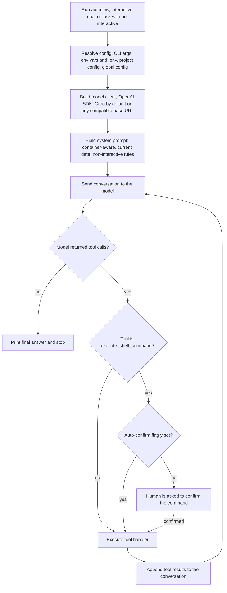

# AutoClaw (third-party headless agent, evaluated)

> An open-source TypeScript command-line AI agent, kept in the Workflows & Automation folder, that runs a tool-calling loop non-interactively in Docker or CI; it is third-party software that was built locally, not a product the team wrote.

| | |
|---|---|
| **Category** | Excel operations and workflow-automation tools (agent runtime) |
| **Status** | Reference, as of 9 Oct 2026. Third-party code, built locally and run at least once. No evidence of production use. |
| **Type** | Node.js / TypeScript CLI agent (LLM tool-calling loop), with a Docker image |
| **Runner and schedule** | Manual command line (`autoclaw`), or `docker compose run --rm autoclaw`. No schedule. |
| **Client / owner** | Upstream open source (`github.com/tsingliuwin/autoclaw`, MIT, package `autoclaw` v1.1.0); evaluation copy held in the internal Workflows & Automation folder |
| **Stack** | TypeScript, Node 20, Commander, OpenAI SDK (default endpoint Groq, model `llama-3.3-70b-versatile`), Playwright, jsdom with Readability, nodemailer, Docker |
| **Source** | Main KB Part 5 section 7 (and sections 13 and 14); Portfolio KB section 26 |

## 1. Description

### What it does
AutoClaw is a "headless agent framework": a CLI that takes a natural-language task, lets a language model choose and call tools (shell commands, file read and write, web search, email, notifications, screenshots, image generation), feeds the results back, and repeats until the model stops calling tools. It is designed to run without a human at the keyboard, in Docker or CI. The KB treats it as an evaluation of a headless agent runtime (inferred); no session transcript exists for this folder.

### Inputs and outputs
- **Inputs:** a task string (interactive chat or `autoclaw "task" --no-interactive`); configuration with priority CLI args, then environment variables and `.env`, then project config (`./.autoclaw/setting.json`), then global config (`~/.autoclaw/setting.json`).
- **Outputs:** console output, files the agent writes, emails and notifications it sends, screenshots and generated images. `error.log` holds one line: "Tavily API key and Feishu Webhook URL are not configured."

### Key components
| Component | Role |
|---|---|
| `src\index.ts` | Commander entry point: resolves config and builds the model client (OpenAI SDK, any OpenAI-compatible base URL such as Groq, DeepSeek or a local LLM). |
| `src\agent.ts` | Builds the system prompt (container-aware, current date, rules such as always pass non-interactive flags) and streams the loop: tool calls, `executeToolHandler`, results appended, repeat until no tool calls. |
| `src\tools\index.ts` | Tool registry: `execute_shell_command`, `read_file`, `write_file`, `get_current_datetime`, `optimize_prompt`, `send_email` (SMTP), `web_search` (Tavily), `free_web_search`, `send_notification` (Feishu, DingTalk, WeCom), `read_website`, `take_screenshot` (Playwright), `generate_image`. |
| CLI flags | `-y/--yes` auto-confirms every tool execution; `-m <model>`; `autoclaw setup [-p]` wizard for global or project settings. |
| Docker | `Dockerfile` (node:20-slim multi-stage with Playwright dependencies and CJK/emoji fonts) and `docker-compose.yml` (mounts `./.autoclaw:/root/.autoclaw`, `env_file` `.env`, tty and stdin open). |
| `website\` | Landing page (`index.html`, `style.css`, hero image); unclear whether upstream or local (inferred upstream). |
| `GEMINI.md` | Project-context summary file (inferred: written for the Gemini CLI), not a Gemini integration. |

### Where it lives
- `D:\Project\Client & Agency (Pivot)\Workflows & Automation\autoclaw\`: `README.md`, `GEMINI.md`, `package.json`, `Dockerfile`, `docker-compose.yml`, `.env.example`, `src\index.ts`, `src\agent.ts`, `src\tools\*.ts`, `website\`, `dist\` and `node_modules\` (built).
- Environment variable names: `GROQ_API_KEY`, `GROQ_BASE_URL`, `GROQ_MODEL`, `OPENAI_API_KEY`, `OPENAI_BASE_URL`, `OPENAI_MODEL`, `SMTP_HOST`, `SMTP_PORT`, `SMTP_USER`, `SMTP_PASS`, `TAVILY_API_KEY`, `FEISHU_WEBHOOK`, `FEISHU_KEYWORD`, `DINGTALK_WEBHOOK`, `DINGTALK_KEYWORD`, `WECOM_WEBHOOK`, `WECOM_KEYWORD`. JSON config keys: `apiKey`, `baseUrl`, `model`, `imageApiKey`, `imageBaseUrl`, `imageModel`, `smtp*`, `tavilyApiKey`, `*Webhook`.
- The project-level `.autoclaw` folder is empty, so no project settings were ever saved.

## 2. Flow chart

**Reading the chart**
1. The operator starts the CLI interactively or with a task and `--no-interactive`.
2. Configuration is merged with the stated priority; the model client defaults to Groq through the OpenAI SDK.
3. `agent.ts` builds the system prompt, including container awareness and the current date.
4. The model is called; if it returns no tool calls the loop ends with the final answer.
5. Tool calls are executed through `executeToolHandler`. Shell commands need a human confirmation unless `-y` is set; other tools run directly.
6. Results are appended and the model is called again, until it stops calling tools.
7. Docker use is the same loop inside the container: `docker compose run --rm autoclaw ["task" --no-interactive]`.

## 3. Case study

### The challenge
Evaluate a ready-made agent runtime that can be driven non-interactively (Docker, CI) with a broad tool set, rather than building one. The KB gives no stated business goal and no client, so the purpose is inferred as an evaluation of a headless agent runtime. The portfolio KB lists `autoclaw` only as a folder name whose function was not confirmed.

### The solution
The upstream project sits in the Workflows & Automation folder and was built locally (`dist\` and `node_modules\` exist; install scripts `install.bat` and `install.sh` are present). It was run at least once without the optional integrations, which produced the single `error.log` line. No local modifications, workflows or results are documented.

### Design decisions and rules learned
- `-y` auto-approves every shell command: use it only in a sandbox or container.
- The default stack depends on Groq model availability; any OpenAI-compatible base URL can replace it (DeepSeek, a local LLM).
- The notification tools target Chinese IM platforms (Feishu, DingTalk, WeCom), each with a security keyword; there is no Slack or WhatsApp integration.
- Bug seen in `src\index.ts` (around line 410): the guard checks `process.env.SMTP_User` (wrong case) before assigning `process.env.SMTP_USER`, so the `SMTP_USER` env var is never applied. Workaround: set `smtpUser` in the JSON config.
- `GEMINI.md` is stale: it lists a `tools.ts` that no longer exists (tools are now split under `src\tools\`) and says all shell commands need confirmation, which is true only without `-y`.

### Outcome
No measured outcome recorded. Documented: built locally; run at least once without Tavily and Feishu configuration; no evidence of production use; no transcript exists for the folder.

### Lessons learned
- A third-party agent with shell access should only be run with auto-confirm inside a container.
- Check the upstream code and docs for drift before relying on them (the SMTP env-var bug and the stale `GEMINI.md`).
- Record the purpose of an evaluation next to the folder; here it has to be inferred.

## 4. Operating notes
- **Run / pause / debug:** `cd` into the folder; `npm install && npm run build` (or `install.bat` / `install.sh`); `npm start`, or `npm link` then `autoclaw`. Docker: `docker compose run --rm autoclaw` with an optional task. A smoke test without keys is limited to the shell and file tools. In the KB audit `npm install` was prohibited and nothing was run, so these steps come from the README and package files.
- **Known issues and open items:** the `SMTP_User` case bug; stale `GEMINI.md`; purpose and any production use not recorded.
- **Risks:** auto-confirm (`-y`) lets the model run any shell command. Security and credential-hygiene findings for this project are tracked privately and are not published here. The default model path depends on Groq availability, and the notification tools cover only Feishu, DingTalk and WeCom.

## 5. Related
- [n8n hosting templates](n8n-hosting-templates.md): another workflow-automation tool in the same Workflows & Automation folder. The KB documents no link between the two.
- **Sources:** Main KB Part 5 section 7 (lines 3257-3293), section 14 (gaps); Portfolio KB section 26 (lines 806-814).
